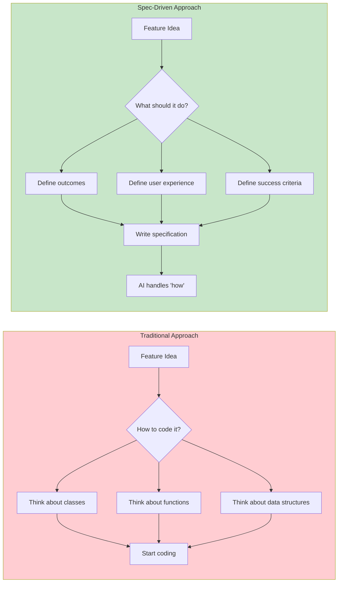
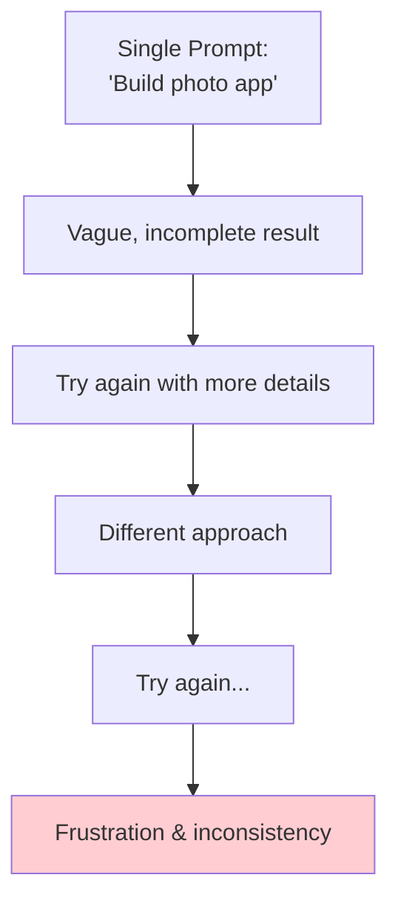
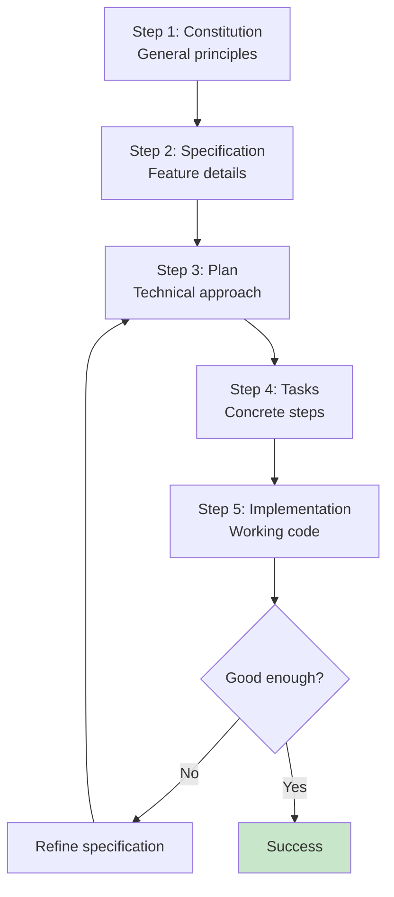
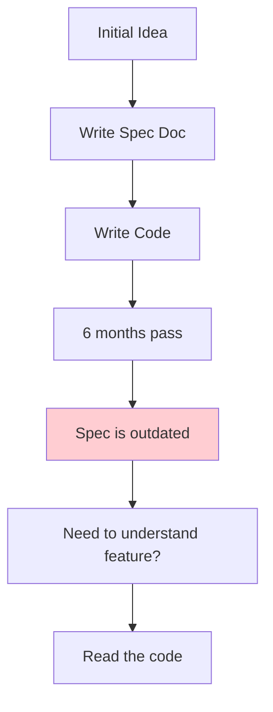
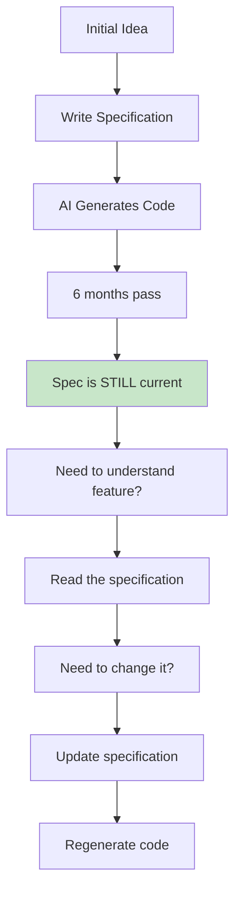
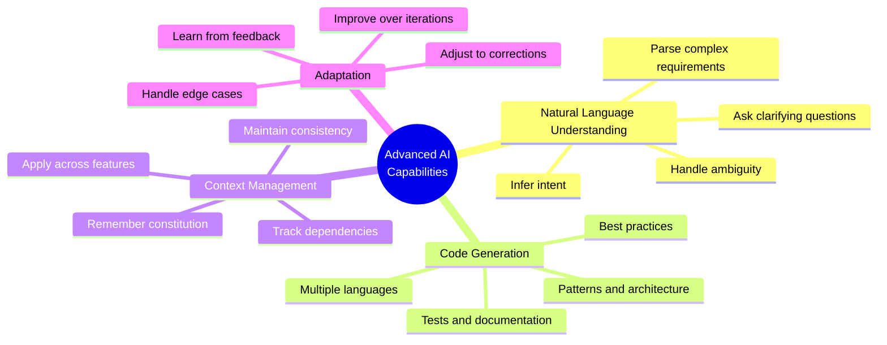
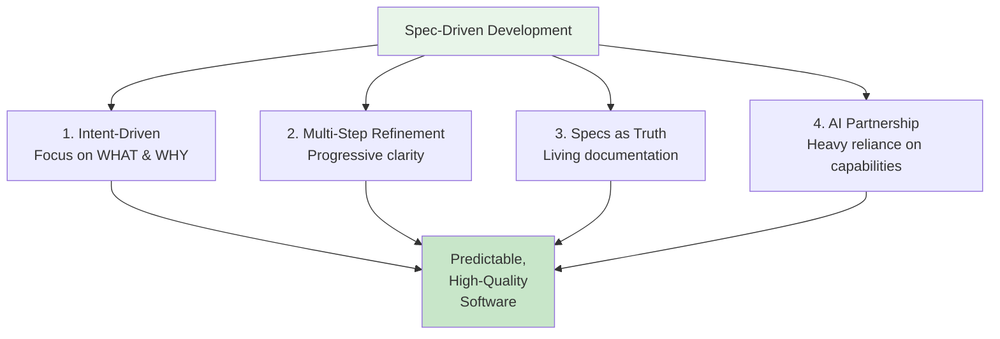

# Lesson 3: Core Philosophy & Mental Models

**Module:** 1 - Foundations  
**Lesson:** 3 of 25  
**Date:** November 29, 2025

---

## 📖 Concept: The Mental Shift

To succeed with Spec-Driven Development, you need to adopt new mental models. This isn't just learning a new tool—it's changing **how you think about building software**.

---

## 🎯 Core Principle 1: Intent-Driven Development

### Traditional Mindset: "How do I code this?"

When you think about building a feature, traditional development asks:
- What functions do I need to write?
- What variables should I declare?
- How do I structure the classes?
- Which design patterns apply?

You're thinking in **implementation details** from the start.

### Spec-Driven Mindset: "What am I trying to achieve?"

Spec-Driven Development asks different questions:
- What problem am I solving?
- What should the user experience be?
- What are the success criteria?
- Why does this feature matter?

You're thinking in **outcomes and intent**.



---

## 🧠 Real-World Analogy: The Restaurant

### Traditional Development = Being a Chef
You need to know:
- How to cut vegetables
- How to operate the stove
- Specific cooking techniques
- Exact ingredient measurements

You're **doing the work**.

### Spec-Driven Development = Being a Food Critic/Customer
You need to know:
- What flavors you want
- What presentation you expect
- What dietary requirements matter
- What quality standards to uphold

The chef (AI) **does the work**, you focus on **outcomes**.

**Important:** You still need to know *enough* about cooking to evaluate quality, but you're not chopping onions!

---

## 🎯 Core Principle 2: Multi-Step Refinement

### The Problem with One-Shot Prompting



**Why it fails:**
- AI has to guess your intent
- No structure to guide decisions
- Each attempt is independent
- Impossible to iterate precisely

### The Power of Progressive Refinement



**Why it works:**
- Each step adds clarity
- AI has context from previous steps
- Easy to iterate (just update the spec)
- Consistent, predictable results

---

## 🎓 Analogy: Building a House

### One-Shot Prompting = Telling a construction crew: "Build me a house"

They'll ask a million questions or just build something random. Every crew might build something completely different.

### Multi-Step Refinement = Professional construction:

1. **Constitution**: Building codes and standards
2. **Specification**: "3-bedroom, 2-bath, modern style, open floor plan"
3. **Plan**: Architectural blueprints with materials and methods
4. **Tasks**: Work orders (foundation → framing → plumbing → electrical...)
5. **Implementation**: Actual construction
6. **Validation**: Inspections and walkthroughs

Each step builds on the previous, creating clarity and consistency.

---

## 🎯 Core Principle 3: Specifications as Source of Truth

### Traditional: Code is Truth



**Problems:**
- Specs diverge from reality
- Code becomes hard to understand
- New developers struggle
- Knowledge lives only in code

### Spec-Driven: Specifications are Truth



**Benefits:**
- Specs never go out of date
- Human-readable documentation
- Easy onboarding
- Knowledge preserved

---

## 💡 Mental Model: The AI Partnership

### You are NOT being replaced

```mermaid
graph TB
    subgraph Human["👤 Human Zone<br/>(Strategy & Creativity)"]
        H1[Problem identification]
        H2[User empathy]
        H3[Business value]
        H4[Creative solutions]
        H5[Quality judgment]
        H6[Ethical decisions]
    end
    
    subgraph Collaboration["🤝 Collaborative Zone<br/>(Partnership)"]
        C1[Architecture design]
        C2[Tech stack selection]
        C3[API design]
        C4[Testing strategy]
        C5[Code review]
    end
    
    subgraph AI["🤖 AI Zone<br/>(Execution & Consistency)"]
        A1[Code generation]
        A2[Boilerplate creation]
        A3[Syntax correctness]
        A4[Pattern application]
        A5[Consistency checking]
        A6[Documentation generation]
    end
    
    Human --> Collaboration
    Collaboration --> AI
    AI -.Feedback.-> Collaboration
    Collaboration -.Validation.-> Human
    
    style Human fill:#e3f2fd
    style Collaboration fill:#fff9c4
    style AI fill:#fff3e0
```



### Think of AI as Your Expert Colleague

**AI is like a senior developer who:**
- Never gets tired
- Knows every language and framework
- Maintains perfect consistency
- Never makes typos
- BUT needs clear direction

**You are like the tech lead who:**
- Understands the business
- Knows the users
- Makes strategic decisions
- Judges quality
- Provides vision and direction

---

## 🎯 Core Principle 4: Heavy Reliance on AI Capabilities

### This ONLY Works with Advanced AI

Spec-Driven Development requires AI that can:



**5 years ago:** AI couldn't do this reliably  
**Today:** GPT-4, Claude, Gemini can  
**Tomorrow:** Will get even better

---

## 🎓 The Four Pillars (Summary)



---

## 🤔 Socratic Questions

### Question 1
**In traditional development, you think "How do I code this?" In spec-driven development, what do you think instead?**

<details>
<summary>Think about focus...</summary>

"What am I trying to achieve?" or "What should this do and why?" You focus on outcomes, user experience, and intent rather than implementation details.
</details>

### Question 2
**Why is multi-step refinement better than one-shot prompting?**

<details>
<summary>Consider structure and iteration...</summary>

Multi-step refinement provides progressive clarity at each stage, allows precise iteration by updating specifications, and produces consistent results. One-shot prompting forces the AI to guess your intent without structure or context.
</details>

### Question 3
**If specifications are the source of truth, where do you make changes when you want to modify a feature?**

<details>
<summary>Think about the workflow...</summary>

You update the specification, then regenerate the code from the updated spec. The specification drives the implementation, not the other way around.
</details>

---

## 💡 Exercise: Identify the Mindset

For each statement, identify if it represents **Traditional** or **Spec-Driven** thinking:

1. "I need to refactor this function to use the Strategy pattern."
2. "Users should be able to sort their photos by date or location."
3. "Let me update the specification to include error handling requirements."
4. "I'll add a try-catch block here to handle exceptions."
5. "The success criteria is that users can complete checkout in under 3 clicks."
6. "I need to optimize this SQL query for better performance."

**Your answers:**
```
1. 
2. 
3. 
4. 
5. 
6. 
```

<details>
<summary>Check your answers</summary>

1. **Traditional** - Thinking about implementation (how)
2. **Spec-Driven** - Thinking about user outcomes (what)
3. **Spec-Driven** - Updating source of truth
4. **Traditional** - Thinking about code details (how)
5. **Spec-Driven** - Defining success criteria (what)
6. **Traditional** - Thinking about implementation (how)

**Note:** Some are hybrid! In real work, you'll do both. Spec-Driven doesn't mean you never think about implementation—it means you start with intent.
</details>

---

## 🎯 Reflection: Your Current Mindset

Answer honestly:

1. **When starting a new feature, what's your first thought?**
   - [ ] "How should I structure the code?"
   - [ ] "What libraries do I need?"
   - [ ] "What problem am I solving?"
   - [ ] "What should the user experience be?"

2. **When you need to understand existing code, you:**
   - [ ] Read the code directly
   - [ ] Look for comments
   - [ ] Find design documentation (if it exists)
   - [ ] Ask someone who worked on it

3. **When requirements change, you:**
   - [ ] Modify the code directly
   - [ ] Update documentation after changing code
   - [ ] Update documentation first, then code
   - [ ] Rarely have written documentation

**Reflection:**
```
What did you notice about your current approach?


What mindset shifts will be most challenging for you?


```

---

## ✅ Module 1 Complete! Time for Review

You've completed all 3 lessons in **Module 1: Foundations**!

Before moving to Module 2, let's consolidate your learning with a mini-review:

**You should now understand:**
- [ ] The paradigm shift from code-first to spec-first
- [ ] What Spec Kit is and how it enables Spec-Driven Development
- [ ] The four core principles (Intent, Multi-step, Specs as Truth, AI Partnership)
- [ ] How to think differently about software development

---

## 📊 Module 1 Review Quiz

Answer these questions to test your understanding:

### 1. What is the fundamental difference between traditional and spec-driven development?

<details>
<summary>Show answer</summary>

In traditional development, code is the source of truth and specifications are discarded after development. In spec-driven development, specifications are executable and remain the source of truth, with code being generated from them.
</details>

### 2. Name three problems that Spec Kit solves.

<details>
<summary>Show answer</summary>

1. Vibe coding (inconsistent, unstructured AI prompting)
2. Lost context (forgotten rationale and decisions)
3. Inconsistent quality (varying standards across features)
</details>

### 3. What are the four core principles of Spec-Driven Development?

<details>
<summary>Show answer</summary>

1. Intent-Driven Development (focus on WHAT & WHY)
2. Multi-Step Refinement (progressive clarity)
3. Specifications as Source of Truth (living documentation)
4. Heavy Reliance on AI Capabilities (partnership model)
</details>

### 4. In the AI partnership model, what is the human responsible for?

<details>
<summary>Show answer</summary>

Strategy, creativity, problem identification, user empathy, business value, quality judgment, and ethical decisions. Humans define WHAT to build and WHY, while AI handles HOW to implement it.
</details>

### 5. Why is multi-step refinement better than one-shot prompting?

<details>
<summary>Show answer</summary>

Multi-step refinement provides structure, progressive clarity at each stage, consistent results, and easy iteration. One-shot prompting lacks context, produces inconsistent results, and makes precise iteration difficult.
</details>

---

## 🎉 Ready for Module 2?

**Module 2: Getting Started** will cover:
- Prerequisites and installation
- Project initialization with Spec Kit
- Understanding the complete workflow

**Are you ready to move forward?**

Reply with:
- ✅ "Module 2" or "Continue" to proceed
- 🤔 "Review" if you want to revisit any Module 1 concepts
- 📝 Share your reflections or quiz answers for feedback

---

*Previous: [Lesson 2: Introduction to Spec Kit](./Lesson-02-Introduction-to-Spec-Kit.md)*  
*Next: [Module 2, Lesson 4: Prerequisites & Installation](../Module-02-Getting-Started/Lesson-04-Prerequisites-and-Installation.md)*
