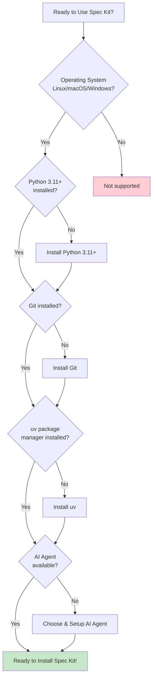
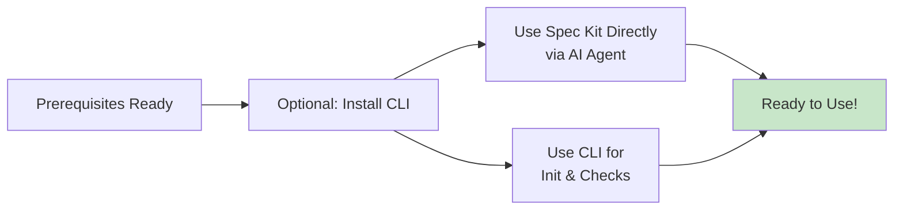

# Lesson 4: Prerequisites & Installation

**Module:** 2 - Getting Started  
**Lesson:** 4 of 25  
**Date:** November 29, 2025

---

## 📖 Concept: Setting Up Your Environment

Before you can use Spec Kit, you need to ensure your development environment has all the required tools. Think of this as **gathering your toolkit** before starting construction.

---

## 🔧 Required Prerequisites



---

## 1️⃣ Operating System

**Spec Kit supports:**
- ✅ **Linux** (Ubuntu, Debian, Fedora, etc.)
- ✅ **macOS** (Intel and Apple Silicon)
- ✅ **Windows** (Windows 10/11 with PowerShell)

**Check your system:** Verify which OS you're using

No additional setup needed for OS compatibility on supported systems!

---

## 2️⃣ Python 3.11 or Higher

### Why Python?
Spec Kit's CLI tool is built with Python. You need Python 3.11+ to run it.

### Check if Python is Installed

```powershell
python --version
```

**Expected output:** `Python 3.11.x` or higher

### If Not Installed

**Option 1: Official Python (Recommended)**
1. Visit [python.org/downloads](https://www.python.org/downloads/)
2. Download Python 3.11 or 3.12
3. Run installer
4. ✅ Check "Add Python to PATH"
5. Verify: `python --version`

**Option 2: Windows Store**
1. Open Microsoft Store
2. Search "Python 3.11" or "Python 3.12"
3. Install
4. Verify: `python --version`

**Option 3: winget (Windows Package Manager)**
```powershell
winget install Python.Python.3.12
```

---

## 3️⃣ Git Version Control

### Why Git?
Spec Kit uses Git for:
- Feature branch management
- Version control of specifications
- Tracking iterations

### Check if Git is Installed

```powershell
git --version
```

**Expected output:** `git version 2.x.x`

### If Not Installed

**Option 1: Git for Windows (Recommended)**
1. Visit [git-scm.com/download/win](https://git-scm.com/download/win)
2. Download and run installer
3. Use default settings (or customize if experienced)
4. Verify: `git --version`

**Option 2: winget**
```powershell
winget install Git.Git
```

### Configure Git (First Time Only)

```powershell
# Set your name and email
git config --global user.name "Your Name"
git config --global user.email "your.email@example.com"

# Verify
git config --global --list
```

---

## 4️⃣ uv Package Manager

### What is uv?
**uv** is a fast, modern Python package manager created by Astral. Spec Kit uses it for installation and management.

Think of uv as a **turbo-charged pip** that's much faster and more reliable.

### Check if uv is Installed

```powershell
uv --version
```

**Expected output:** `uv 0.x.x`

### Installing uv

**For Windows (PowerShell):**

```powershell
# Official installation command
powershell -c "irm https://astral.sh/uv/install.ps1 | iex"
```

**Alternative - winget:**
```powershell
winget install --id=astral-sh.uv -e
```

### Verify Installation

```powershell
uv --version
```

**Troubleshooting:** If command not found, restart your terminal or add to PATH.

---

## 5️⃣ AI Coding Agent

### Why an AI Agent?
Spec Kit's slash commands work **through** your AI coding agent. The agent interprets the commands and executes the workflow.

### Supported Agents

If you're using **VS Code**, recommended options:

```mermaid
graph TD
    Choice{Choose AI Agent}
    
    Choice --> Copilot[GitHub Copilot<br/>✅ Best VS Code integration]
    Choice --> Claude[Claude Code<br/>✅ Powerful reasoning]
    Choice --> Cursor[Cursor<br/>✅ AI-native editor]
    Choice --> Windsurf[Windsurf<br/>✅ Specialized for AI dev]
    
    Copilot --> Setup1[Install Copilot extension<br/>in VS Code]
    Claude --> Setup2[Install Claude Code CLI]
    Cursor --> Setup3[Download Cursor editor]
    Windsurf --> Setup4[Download Windsurf editor]
    
    style Copilot fill:#c8e6c9
```



### Option 1: GitHub Copilot (Recommended for VS Code)

**Prerequisites:**
- GitHub account
- Copilot subscription (or free trial)

**Installation:**
1. Open VS Code
2. Go to Extensions (Ctrl+Shift+X)
3. Search "GitHub Copilot"
4. Install "GitHub Copilot" extension
5. Sign in with your GitHub account
6. Install "GitHub Copilot Chat" extension too

**Verify:**
- Look for Copilot icon in status bar
- Open Copilot Chat (Ctrl+Alt+I or click chat icon)

### Option 2: Claude Code

**Prerequisites:**
- Anthropic API key

**Installation:**
```powershell
# Install Claude Code CLI
npm install -g @anthropic-ai/claude-code

# Configure
claude-code config
```

### Option 3: Cursor

**Installation:**
1. Visit [cursor.sh](https://cursor.sh)
2. Download for Windows
3. Install and launch
4. Import VS Code settings (optional)

### Option 4: Windsurf

**Installation:**
1. Visit [codeium.com/windsurf](https://codeium.com/windsurf)
2. Download for Windows
3. Install and launch

---

## 📦 Installing Spec Kit (Optional)

**You don't need to install specify-cli to use Spec Kit!** The core workflow runs entirely through slash commands in your AI agent.

However, the CLI provides helpful utilities for project initialization and prerequisite checking.



### Direct Usage (No CLI Installation)

You can start using Spec Kit immediately by using slash commands in your AI agent:

- `/speckit.specify` - Create specifications
- `/speckit.plan` - Create technical plans  
- `/speckit.tasks` - Break down work
- `/speckit.implement` - Generate code

**Skip to Lesson 5 if you prefer this approach!**

### CLI Installation (Recommended for Full Experience)

If you want the CLI utilities:

```powershell
# Install Spec Kit CLI globally
uv tool install specify-cli --from git+https://github.com/github/spec-kit.git
```

**What the CLI provides:**
- ✅ `specify init` - Initialize new projects
- ✅ `specify check` - Verify prerequisites
- ✅ `specify --help` - Command documentation

### Verify Installation (If CLI Installed)

```powershell
# Check if specify command works
specify --help

# Check for required tools
specify check
```

**Expected output from `specify check`:**
```
✓ git found
✓ python found
✓ uv found
✓ [your-ai-agent] found
```

```
✓ git found
✓ python found
✓ uv found
✓ [your-ai-agent] found
## 📥 Manual Installation: Add Spec Kit to Your Repo (No CLI)

If you want to add Spec Kit's starter files or templates to your project **without using the CLI**, you can do so manually:

### 1. Download the Latest Spec Kit Release
- Go to the [Spec Kit GitHub Releases page](https://github.com/github/spec-kit/releases)
- Find the latest release and download the `.zip` file (usually named `spec-kit-main.zip` or similar)

### 2. Extract the Files
- Unzip the downloaded file to a temporary folder on your computer.

### 3. Copy Starter Files to Your Project
- Inside the unzipped folder, locate the core Spec Kit files (such as `/.speckit/`, `spec-templates/`, or any starter specs provided).
- Copy these folders/files into the root of your project repository.

### 4. Commit to Your Repo
```powershell
```

---


You can now use all Spec Kit slash commands in your AI agent, and your repo will have the recommended structure!

**Tip:** Check the [Spec Kit README](https://github.com/github/spec-kit) for any updates on manual setup or file structure.
## 🔄 Upgrading Spec Kit

To upgrade to the latest version:

```powershell
# Force reinstall latest version
uv tool install specify-cli --force --from git+https://github.com/github/spec-kit.git
```

---

## ✅ Installation Checklist

Before moving to the next lesson, verify:

- [ ] **OS:** Windows, macOS, or Linux ✅
- [ ] **Python:** Version 3.11+ installed and in PATH (optional, for CLI)
- [ ] **Git:** Installed and configured with name/email (recommended)
- [ ] **uv:** Package manager installed (optional, for CLI)
- [ ] **AI Agent:** Chosen and set up (Copilot, Claude, Cursor, etc.) ✅
- [ ] **Spec Kit CLI:** `specify` command works (optional)
- [ ] **Verification:** `specify check` passes (if CLI installed)

---

## 🤔 Socratic Questions

### Question 1
**Why does Spec Kit require Git even though it's not a Git extension?**

<details>
<summary>Think about workflow and tracking...</summary>

Spec Kit uses Git for feature branch management and version control of specifications. Each feature lives in its own branch with its constitution, spec, plan, and tasks tracked by Git. This enables iteration and collaboration.
</details>

### Question 2
**What's the advantage of using uv instead of pip for installing Spec Kit?**

<details>
<summary>Consider speed and reliability...</summary>

uv is significantly faster than pip, more reliable at resolving dependencies, and better at managing tool installations. It's specifically designed for modern Python tooling and provides better isolation.
</details>

### Question 3
**Why do you need an AI agent to use Spec Kit? Can't you just use the CLI?**

<details>
<summary>Think about the workflow...</summary>

The CLI is optional and only provides utilities for project initialization (`specify init`) and checking prerequisites (`specify check`). The core Spec-Driven Development workflow (constitution, specify, plan, tasks, implement) is executed through slash commands in your AI agent, which interprets your specifications and generates code. You can use Spec Kit without ever installing the CLI!
</details>

---

## 💡 Exercise: Environment Setup

**Complete these steps and document your results (CLI installation is optional):**

### Step 1: Check Python (Optional)
```powershell
python --version
```
**Your result:** _______________ (Skip if not installing CLI)

### Step 2: Check Git (Recommended)
```powershell
git --version
```
**Your result:** _______________ (Needed for version control)

### Step 3: Check uv (Optional)
```powershell
uv --version
```
**Your result:** _______________ (Skip if not installing CLI)

### Step 4: Install Spec Kit CLI (Optional)
```powershell
uv tool install specify-cli --from git+https://github.com/github/spec-kit.git
```
**Success?** [ ] Yes [ ] No [ ] Skipped

### Step 5: Verify (If CLI Installed)
```powershell
specify check
```
**What's missing (if anything)?** _______________ (Skip if not installing CLI)

---

## 🐛 Troubleshooting Common Issues

### Issue 1: "python: command not found"

**Solution:**
- Python not in PATH
- Reinstall Python and check "Add to PATH"
- Or manually add Python to PATH

### Issue 2: "uv: command not found"

**Solution:**
- Restart terminal after installation
- Check PATH includes uv
- Reinstall using official script

### Issue 3: "specify check" fails for AI agent

**Solution:**
- This is OK! You can still use Spec Kit
- Spec Kit looks for Claude, Copilot, etc. in PATH
- As long as your AI agent works in your editor, you're fine
- Use `--ignore-agent-tools` flag when running `specify init`

### Issue 4: Permission errors on Windows

**Solution:**
- Run PowerShell as Administrator
- Or use `--user` flag with installations
- Check antivirus isn't blocking

---

## 🎯 Real-World Scenario

**Scenario:** You're on a new Windows laptop, starting fresh. What's the fastest way to get ready for Spec Kit?

**Option 1: Direct Usage (Fastest - No CLI)**
```powershell
# Just install Git for version control
winget install Git.Git

# Configure Git
git config --global user.name "Your Name"
git config --global user.email "your@email.com"

# Set up AI agent in VS Code (install Copilot extension)
# Ready to use /speckit commands!
```

**Option 2: Full Setup (With CLI)**
```powershell
# 1. Install Python (if needed)
winget install Python.Python.3.12

# 2. Install Git (if needed)
winget install Git.Git

# 3. Configure Git
git config --global user.name "Your Name"
git config --global user.email "your@email.com"

# 4. Install uv
powershell -c "irm https://astral.sh/uv/install.ps1 | iex"

# 5. Restart terminal (close and reopen)

# 6. Install Spec Kit
uv tool install specify-cli --from git+https://github.com/github/spec-kit.git

# 7. Verify
specify check

# 8. Set up AI agent in VS Code (install extension)
```

**Time estimate:** 5 minutes (direct) or 15-20 minutes (with CLI)

---

## ✅ Ready to Continue?

Before moving to Lesson 5, make sure:

- [ ] All prerequisites are installed (CLI tools optional)
- [ ] `specify check` passes (if CLI installed, otherwise skip)
- [ ] You have an AI agent set up (Copilot, Claude, etc.) ✅
- [ ] You understand how to use Spec Kit slash commands

**Ready for Lesson 5: Project Initialization?**

Reply with:
- ✅ "Ready" or "Lesson 5" to continue
- 🐛 "Help with [specific issue]" if you're stuck
- 📝 Share your `specify check` output for validation (if CLI installed)

---

*Previous: [Lesson 3: Core Philosophy & Mental Models](../Module-01-Foundations/Lesson-03-Core-Philosophy-and-Mental-Models.md)*  
*Next: [Lesson 5: Project Initialization](./Lesson-05-Project-Initialization.md)*
