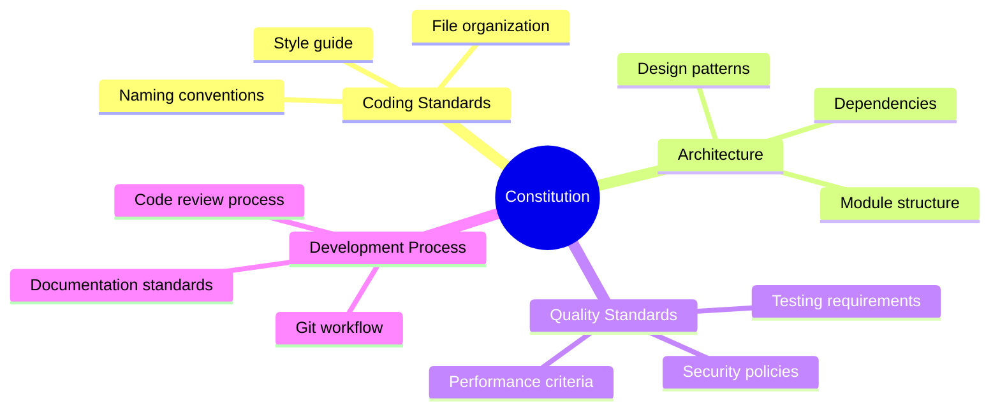
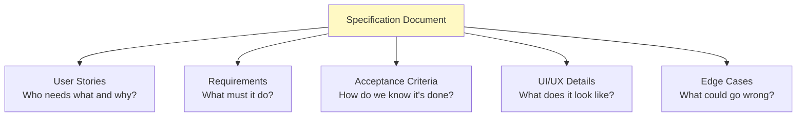
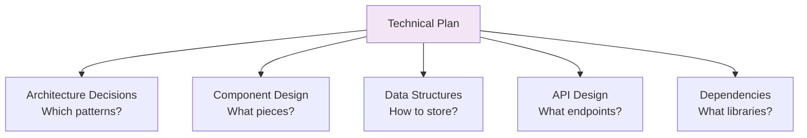
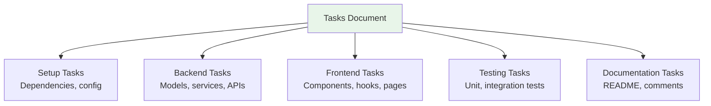
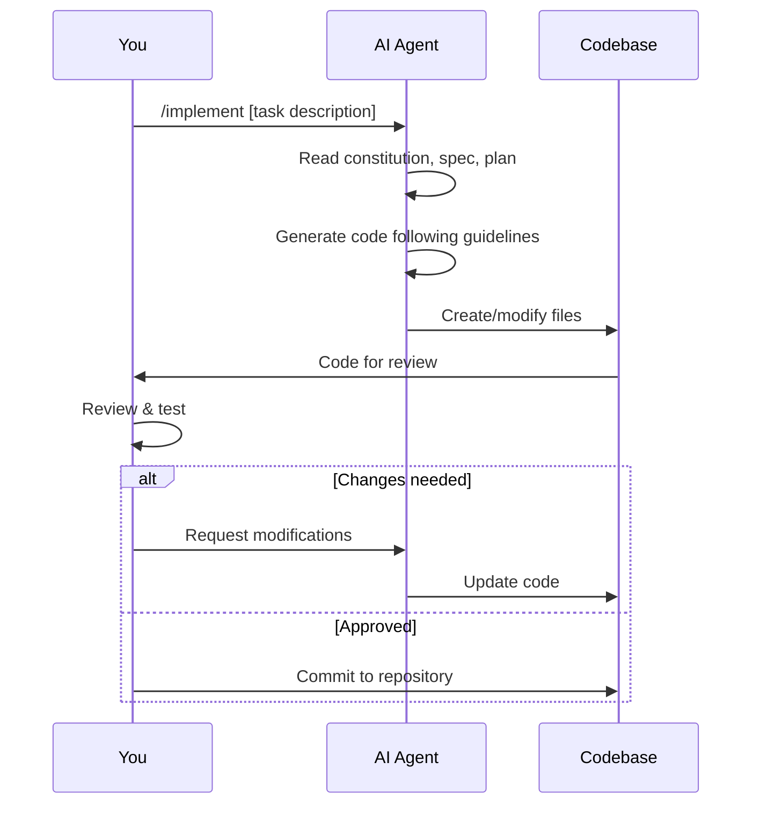
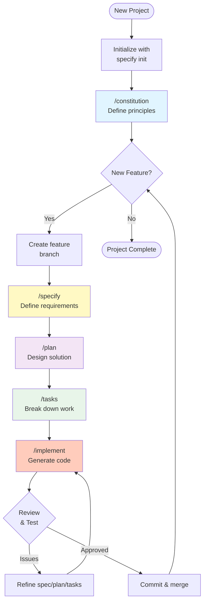

# Lesson 6: Understanding the Workflow

**Module:** 2 - Getting Started  
**Lesson:** 6 of 25  
**Date:** November 29, 2025

---

## 📖 Concept: The Spec Kit Workflow

Spec Kit provides a **structured, repeatable workflow** for building software features. Think of it like a **recipe with distinct steps** – each step has a clear purpose, inputs, and outputs.

Unlike traditional development where you might jump straight to coding, Spec Kit enforces a deliberate progression:

**Think → Specify → Plan → Build**

This isn't bureaucracy – it's **intentional design** that prevents common mistakes and keeps documentation in sync with code.

---

## 🎯 The Five Core Phases

```mermaid
graph LR
    A[1. Constitution<br/>📜 Principles] --> B[2. Specify<br/>📋 Requirements]
    B --> C[3. Plan<br/>🗺️ Technical Design]
    C --> D[4. Tasks<br/>✅ Work Breakdown]
    D --> E[5. Implement<br/>💻 Code Generation]
    
    E -.Iterate.-> B
    
    style A fill:#e1f5ff
    style B fill:#fff9c4
    style C fill:#f3e5f5
    style D fill:#e8f5e9
    style E fill:#ffccbc
```



### Phase Overview

| Phase | Purpose | Output | Analogy |
|-------|---------|--------|---------|
| **Constitution** | Define project principles | `constitution.md` | Constitution of a country |
| **Specify** | Describe what to build | `spec.md` | Architectural blueprint |
| **Plan** | Design how to build it | `plan.md` | Construction plan |
| **Tasks** | Break down the work | `tasks.md` | Contractor's checklist |
| **Implement** | Generate the code | Working code | Building the house |

---

## 📜 Phase 1: Constitution

### What is it?
The **constitution** establishes the principles and standards for your entire project. It's written **once** at the beginning and applies to **all features**.

### Why Start Here?
Imagine building a house without deciding:
- What architectural style? (Modern, Victorian, Minimalist?)
- What building codes to follow?
- What materials are allowed?
- What quality standards must be met?

**The constitution answers these questions for your codebase.**

### What Goes in a Constitution?



### Example Constitution Excerpt

```markdown
# Project Constitution

## Coding Standards
- **Language:** TypeScript with strict mode
- **Style:** Airbnb style guide
- **Formatting:** Prettier with 2-space indentation

## Architecture
- **Pattern:** Hexagonal architecture (ports & adapters)
- **State Management:** Zustand for React state
- **API Communication:** RESTful with Axios

## Quality Standards
- **Testing:** Minimum 80% code coverage
- **Performance:** Page load < 2 seconds
- **Accessibility:** WCAG 2.1 AA compliance
```

---

## 📋 Phase 2: Specify

### What is it?
The **specification** describes **what** you're building for a specific feature. This is your requirements document.

### The Shift in Thinking
Traditional: "I'll figure it out as I code"  
Spec-Driven: "I'll think through everything first"

### What Goes in a Spec?



### Example Spec Excerpt

```markdown
# Feature: User Authentication

## User Story
As a new user, I want to create an account so that I can access personalized features.

## Requirements
1. User can register with email and password
2. Password must meet security requirements (8+ chars, uppercase, number)
3. Email verification required before full access
4. Duplicate emails rejected with clear error message

## Acceptance Criteria
- [ ] Registration form accepts valid inputs
- [ ] Weak passwords are rejected with helpful feedback
- [ ] Verification email sent within 5 seconds
- [ ] User redirected to dashboard after verification
```

---

## 🗺️ Phase 3: Plan

### What is it?
The **plan** describes **how** you'll implement the specification. This is your technical design document.

### Developer's Blueprint
If the spec is "what the customer wants," the plan is "how the builder will construct it."

### What Goes in a Plan?



### Example Plan Excerpt

```markdown
# Implementation Plan: User Authentication

## Architecture
- **Pattern:** Repository pattern for data access
- **Validation:** Zod schemas for type-safe validation
- **Authentication:** JWT tokens with httpOnly cookies

## Components
1. `RegistrationForm.tsx` - UI component
2. `authService.ts` - Business logic
3. `userRepository.ts` - Database operations
4. `authMiddleware.ts` - Route protection

## Data Model
```typescript
interface User {
  id: string;
  email: string;
  passwordHash: string;
  emailVerified: boolean;
  createdAt: Date;
}
```

## API Endpoints
- `POST /api/auth/register` - Create account
- `POST /api/auth/verify` - Verify email
- `POST /api/auth/login` - Authenticate


---

## ✅ Phase 4: Tasks

### What is it?
The **tasks** file breaks the plan into **discrete, actionable items**. These are your implementation steps.

### Bite-Sized Work
Large features are overwhelming. Tasks make them manageable.

**Bad:** "Implement authentication"  
**Good:** 
1. Create User model and schema
2. Create registration endpoint
3. Implement password hashing
4. Add email verification service
5. Build registration form UI

### What Goes in Tasks?



### Example Tasks Excerpt

```markdown
# Implementation Tasks: User Authentication

## Phase 1: Setup
- [ ] Install dependencies (zod, bcrypt, jsonwebtoken)
- [ ] Configure environment variables
- [ ] Set up database migrations

## Phase 2: Backend
- [ ] Create User model with validation
- [ ] Implement password hashing utility
- [ ] Create user repository
- [ ] Build registration endpoint
- [ ] Add email verification service

## Phase 3: Frontend
- [ ] Create RegistrationForm component
- [ ] Add form validation
- [ ] Implement error handling
- [ ] Create success/verification pages
```

---

## 💻 Phase 5: Implement

### What is it?
The **implementation** phase is where you use your AI agent to **generate code** from the tasks.

### The AI Does the Heavy Lifting
You provide tasks and context. The AI generates code that follows your constitution, implements your spec, and adheres to your plan.

### How It Works



### Example Implementation Flow

```markdown
You: /implement Create User model with Zod validation

AI: I'll create the User model following the constitution's
    TypeScript standards and the plan's Zod schema approach.

[AI generates:]
- src/models/User.ts
- src/schemas/userSchema.ts
- src/types/User.types.ts

You: Review the code, run tests, approve or iterate
```

---

## 🔄 The Complete Workflow

### Visual Journey



---

## 🎯 Why This Structure Works

### 1. **Separation of Concerns**
Each phase has a distinct purpose. You don't mix "what" with "how" or "why" with "implementation details."

### 2. **Incremental Refinement**
Start broad (constitution), get specific (spec), add technical details (plan), break into steps (tasks), execute (implement).

### 3. **Living Documentation**
All documents stay current because they're the source of truth. Code is generated from them, not the other way around.

### 4. **Iteration-Friendly**
Need to change something? Update the spec, regenerate. The workflow supports evolution.

### 5. **AI-Optimized**
Each document is structured for AI comprehension. Clear, explicit, parseable.

---

## 🎓 Mental Models

### The Construction Analogy

```mermaid
graph LR
    A[Constitution<br/>🏛️ Building Codes] --> B[Specify<br/>📐 Architect Plans]
    B --> C[Plan<br/>🔧 Engineering Plans]
    C --> D[Tasks<br/>📋 Contractor Schedule]
    D --> E[Implement<br/>🔨 Build the Building]
```



- **Constitution** = Building codes and regulations
- **Specify** = Architectural drawings (what it looks like)
- **Plan** = Engineering plans (how it's constructed)
- **Tasks** = Contractor's punch list
- **Implement** = Physical construction

### The Recipe Analogy

- **Constitution** = Kitchen standards (hygiene, equipment)
- **Specify** = Menu description (what diners want)
- **Plan** = Recipe (ingredients, techniques)
- **Tasks** = Cooking steps
- **Implement** = Actual cooking

---

## 🤔 Socratic Questions

### Question 1
**Why is the Constitution written only once for the entire project, but Specifications are written for each feature?**

<details>
<summary>Think about the scope of each...</summary>

The Constitution defines project-wide principles that apply to all features (coding standards, architecture patterns, quality requirements). Specifications describe individual features' requirements. Just like a country's constitution applies to all laws, your project's constitution applies to all features.
</details>

### Question 2
**What's the risk of skipping directly to the Implementation phase without Specify and Plan?**

<details>
<summary>Consider what guides the AI...</summary>

Without a Specification, the AI doesn't know what requirements to meet. Without a Plan, it doesn't know which architecture patterns to follow. You'd get code that might work but doesn't align with your needs or standards. It's like telling a builder "build something" without blueprints – you'll get a structure, but probably not what you wanted.
</details>

### Question 3
**When would you go back and iterate on earlier phases instead of pushing forward?**

<details>
<summary>Think about dependencies between phases...</summary>

If during Implementation you discover the Plan is technically infeasible, go back to Plan. If during Planning you realize the Spec is incomplete or contradictory, go back to Specify. Each phase depends on the previous ones being correct. It's cheaper to fix issues early than to regenerate incorrect code.
</details>

---

## 💡 Exercise: Map Your Current Project

Think of a feature you're working on (or would like to build). Map it to the Spec Kit workflow:

### Feature Name: 
_______________________________

### Constitution Elements:
```
What standards should it follow?
- 
- 
- 
```

### Specification Summary:
```
What does it need to do?
- 
- 
- 
```

### Plan Approach:
```
How would you technically implement it?
- 
- 
- 
```

### Task Breakdown:
```
What are the concrete steps?
1. 
2. 
3. 
4. 
5. 
```

---

## ✅ Workflow Checklist

Before moving to the next lesson, ensure you understand:

- [ ] The five phases of Spec Kit workflow
- [ ] The purpose of each phase
- [ ] Why the order matters
- [ ] How phases depend on each other
- [ ] When to iterate vs. push forward
- [ ] The difference between "what" (Specify) and "how" (Plan)
- [ ] Why Constitution is written once, but Specs are per-feature

---

## 🎯 Quick Reference

### Command Cheat Sheet

```markdown
# One-time setup
specify init                    # Initialize project
/constitution                   # Define project principles

# Per-feature workflow
git checkout -b feature/name    # Create feature branch
/specify                        # Define what to build
/plan                          # Design how to build
/tasks                         # Break down work
/implement [task]              # Generate code
```

### File Structure

```
my-project/
├── .specrc/
│   └── constitution.md        # Project-wide principles
└── .features/
    └── feature-name/
        ├── spec.md            # Feature requirements
        ├── plan.md            # Technical design
        └── tasks.md           # Implementation steps
```

---

## 🚀 What's Next?

Now that you understand the workflow conceptually, the next lessons will dive deep into each phase:

- **Lesson 7:** Constitution - Setting Project Principles
- **Lesson 8:** Specify - Defining Requirements
- **Lesson 9:** Plan - Technical Implementation
- **Lesson 10:** Tasks - Breaking Down Work
- **Lesson 11:** Implement - Building the Feature
- **Lesson 12:** End-to-End Workflow Practice

You'll learn exactly what to write, how to structure it, and see real examples.

---

## ✅ Ready to Continue?

Reply with:
- ✅ "Ready" or "Lesson 7" to move to Constitution
- 🤔 "Question about [phase]" if you need clarification
- 📝 Share your exercise for feedback

---

*Previous: [Lesson 5: Project Initialization](./Lesson-05-Project-Initialization.md)*  
*Next: [Lesson 7: Constitution - Setting Project Principles](../Module-03-Core-Workflow/Lesson-07-Constitution-Setting-Project-Principles.md)*
