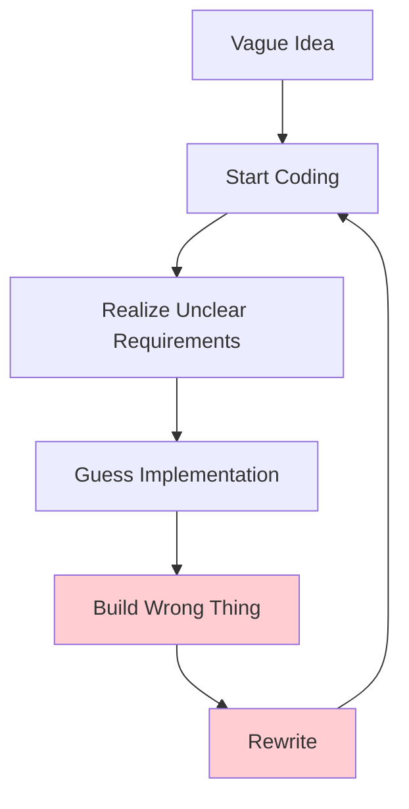
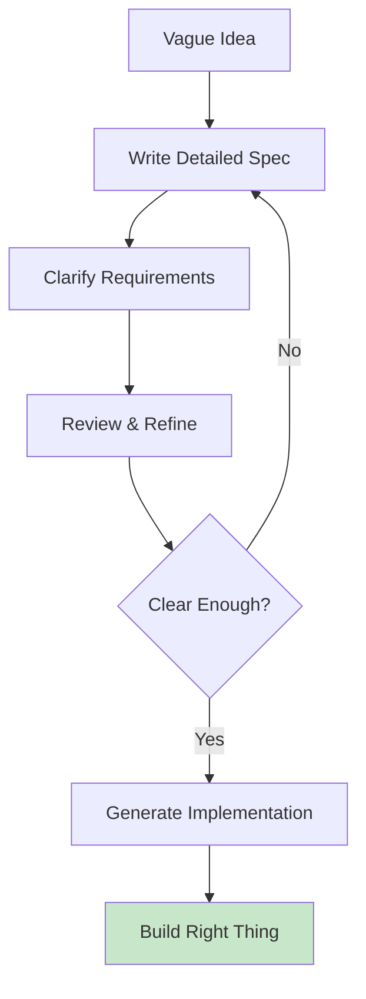
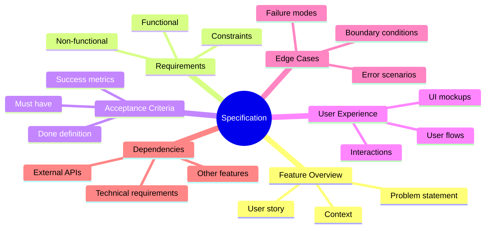
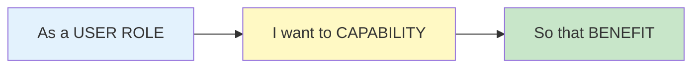
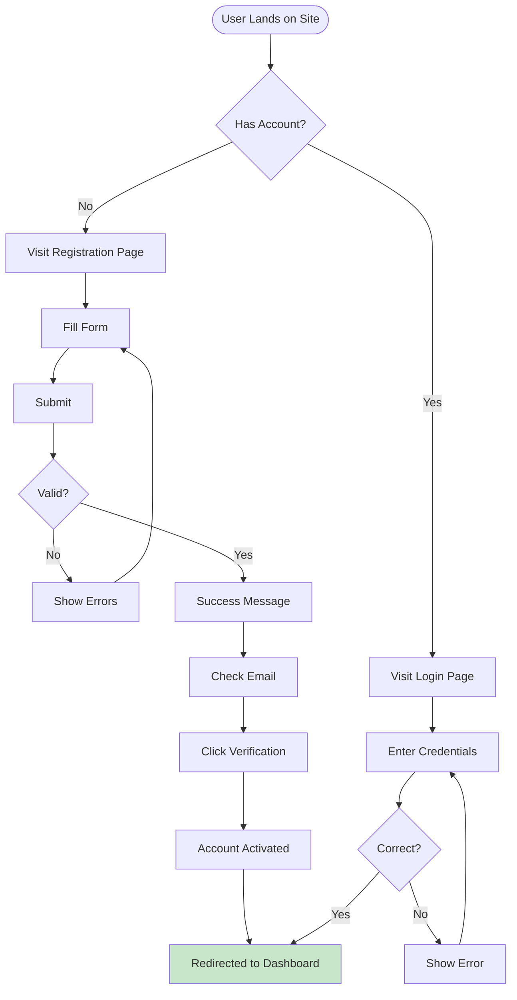
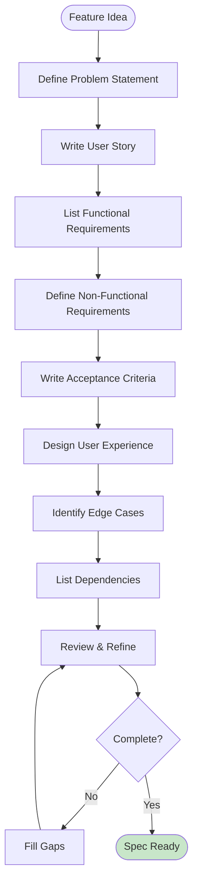
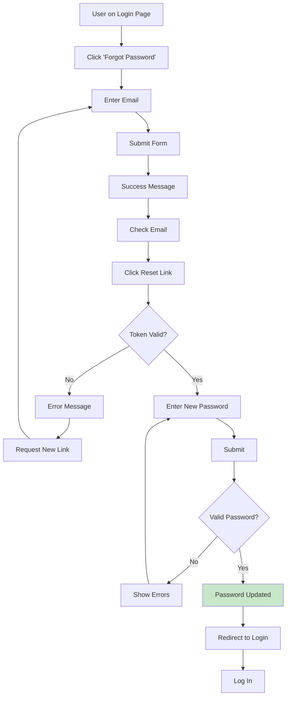

# Lesson 8: Specify - Defining Requirements

**Module:** 3 - Core Workflow  
**Lesson:** 8 of 25  
**Date:** November 29, 2025

---

## 📖 Concept: The Art of Specification

A **specification** (or "spec") defines **what** you're building for a specific feature. Unlike the Constitution which governs the entire project, each spec is **feature-specific** and describes:

- What problem you're solving
- Who needs it and why
- What it should do (requirements)
- How you'll know it's done (acceptance criteria)
- What could go wrong (edge cases)

Think of it as a **contract between intent and implementation**. The spec captures your vision; the AI brings it to life.

---

## 🎯 Why Specifications Matter

### The Traditional Problem



### The Spec-Driven Solution



**Key Insight:** Time spent clarifying requirements **prevents** time wasted on wrong implementations.

---

## 📋 Anatomy of a Great Spec

### The Essential Components



---

## 1️⃣ Feature Overview

### Purpose
Provide context and motivation. Answer "Why are we building this?"

### What to Include

```markdown
# Feature: User Authentication

## Problem Statement
New users cannot access personalized features because there's no way to create an account or prove identity. This limits engagement and prevents us from offering customized experiences.

## User Story
**As a** new visitor to the platform  
**I want to** create an account with email and password  
**So that** I can access personalized features and save my preferences

## Context
- This is MVP authentication (will add OAuth later)
- We have ~1000 beta users waiting for accounts
- Must comply with GDPR for EU users
- Security is critical due to sensitive user data
```

### The User Story Format



**Examples:**
- **As a** teacher, **I want to** create quizzes, **so that** I can assess student learning
- **As a** customer, **I want to** track my order, **so that** I know when it will arrive
- **As a** admin, **I want to** view analytics, **so that** I can make data-driven decisions

---

## 2️⃣ Requirements

### Functional Requirements
What the feature **must do**.

```markdown
## Functional Requirements

### Core Functionality
1. **User Registration**
   - User can provide email and password
   - System validates email format
   - System checks password strength
   - System creates new user account
   - System sends verification email

2. **Email Verification**
   - User receives email with verification link
   - Link expires after 24 hours
   - Clicking link activates account
   - User redirected to dashboard after verification

3. **User Login**
   - User can log in with email/password
   - System validates credentials
   - Successful login creates session
   - Failed login shows error message

4. **Password Requirements**
   - Minimum 8 characters
   - At least one uppercase letter
   - At least one number
   - At least one special character
   - Common passwords rejected (top 10k list)

### Data Management
- User emails stored in lowercase
- Passwords hashed with bcrypt (cost factor 12)
- Email verification tokens expire after 24h
- Sessions expire after 7 days of inactivity
```

### Non-Functional Requirements
How the feature should **perform or behave**.

```markdown
## Non-Functional Requirements

### Performance
- Registration completes in < 500ms
- Login completes in < 200ms
- Verification email sent within 5 seconds
- Page load time < 1.5s

### Security
- All connections over HTTPS
- Passwords never logged or exposed
- Rate limiting: 5 failed login attempts = 15min lockout
- CSRF protection on all forms
- XSS prevention on all inputs

### Scalability
- Support 10,000 concurrent users
- Handle 100 registrations per minute
- Database indexed on email field

### Usability
- Clear error messages
- Password strength indicator
- Forgot password link visible
- Mobile-responsive forms

### Compliance
- GDPR compliant data handling
- User can delete account
- Privacy policy acceptance required
- Age verification (13+ years)
```

---

## 3️⃣ Acceptance Criteria

### Purpose
Define **when the feature is complete**. These are testable conditions.

### Format: Given-When-Then

```markdown
## Acceptance Criteria

### Registration Flow
**Given** I am a new user on the registration page  
**When** I submit a valid email and strong password  
**Then** I receive a success message and verification email

**Given** I am a new user on the registration page  
**When** I submit a weak password (e.g., "password123")  
**Then** I see an error: "Password must contain uppercase, number, and special character"

**Given** I am a new user on the registration page  
**When** I submit an email that already exists  
**Then** I see an error: "This email is already registered"

### Email Verification
**Given** I received a verification email  
**When** I click the verification link within 24 hours  
**Then** My account is activated and I'm redirected to dashboard

**Given** I received a verification email  
**When** I click the verification link after 24 hours  
**Then** I see an error: "Verification link expired" with option to resend

### Login Flow
**Given** I am a registered user with verified email  
**When** I log in with correct email and password  
**Then** I am redirected to my dashboard with an active session

**Given** I am a registered user  
**When** I log in with incorrect password  
**Then** I see an error: "Invalid email or password" (no hint which is wrong)

**Given** I am a user who failed login 5 times  
**When** I attempt a 6th login  
**Then** I see an error: "Too many attempts. Try again in 15 minutes"
```

### Alternative Format: Checklist

```markdown
## Acceptance Criteria

### User Can Register
- [ ] Registration form accepts email and password
- [ ] Weak passwords are rejected with helpful error
- [ ] Duplicate emails are rejected with clear message
- [ ] Successful registration shows success message
- [ ] Verification email sent within 5 seconds
- [ ] User record created in database

### User Can Verify Email
- [ ] Verification email contains clickable link
- [ ] Link activates account when clicked
- [ ] Expired links show error with resend option
- [ ] Activated users redirected to dashboard

### User Can Login
- [ ] Login form accepts email and password
- [ ] Valid credentials grant access
- [ ] Invalid credentials show generic error
- [ ] Rate limiting prevents brute force
- [ ] Session persists across page refreshes
```

---

## 4️⃣ User Experience (UI/UX)

### Purpose
Describe the **visual and interactive** aspects.

### What to Include

```markdown
## User Experience

### Registration Form
**Layout:**
- Centered card on page
- Logo at top
- Email field (type="email")
- Password field (type="password") with visibility toggle
- Password strength indicator (weak/medium/strong)
- "Create Account" button (primary color)
- Link to login page for existing users

**Validation:**
- Real-time password strength feedback
- Inline error messages below fields
- Submit button disabled until form valid

**States:**
- Loading state while processing
- Success state with animation
- Error state with clear messaging

### Mockup (ASCII or describe)
```
┌────────────────────────────────┐
│         [Logo]                 │
│                                │
│    Create Your Account         │
│                                │
│  Email                         │
│  ┌──────────────────────────┐ │
│  │ you@example.com          │ │
│  └──────────────────────────┘ │
│                                │
│  Password                      │
│  ┌──────────────────────────┐ │
│  │ ••••••••            [👁]  │ │
│  └──────────────────────────┘ │
│  Strength: ▓▓▓░░ Medium        │
│                                │
│  ┌──────────────────────────┐ │
│  │   Create Account         │ │
│  └──────────────────────────┘ │
│                                │
│  Already have an account?      │
│  Log in                        │
└────────────────────────────────┘
```

### User Flows

```

---

## 5️⃣ Edge Cases & Error Handling

### Purpose
Anticipate **what could go wrong** and define behavior.

```markdown
## Edge Cases & Error Handling

### Registration Errors
| Scenario | System Behavior |
|----------|----------------|
| Email already registered | "This email is already registered. [Login]?" |
| Invalid email format | "Please enter a valid email address" |
| Weak password | "Password must be at least 8 characters with uppercase, number, and special character" |
| Network timeout | "Connection lost. Please check your internet and try again" |
| Email service down | "Account created but verification email delayed. We'll resend it shortly" |

### Verification Errors
| Scenario | System Behavior |
|----------|----------------|
| Token expired | "This link has expired. [Resend verification email]" |
| Token invalid/tampered | "Invalid verification link. Please use the link from your email" |
| Already verified | "This account is already verified. [Login]" |
| Token used twice | "This link has already been used. [Resend] or [Login]" |

### Login Errors
| Scenario | System Behavior |
|----------|----------------|
| Wrong password | "Invalid email or password" (don't hint which) |
| Email doesn't exist | "Invalid email or password" (same message) |
| Account not verified | "Please verify your email first. [Resend verification]" |
| Rate limit exceeded | "Too many failed attempts. Please try again in 15 minutes" |
| Session expired | Redirect to login with message: "Your session expired. Please log in again" |

### Boundary Conditions
- **Empty inputs:** "Email is required" / "Password is required"
- **Very long inputs:** Truncate at 255 characters for email
- **Special characters in email:** Support all RFC 5322 valid emails
- **Unicode passwords:** Support all UTF-8 characters
- **Concurrent registrations:** Handle race condition with unique constraint on email
```

---

## 6️⃣ Dependencies & Constraints

### Purpose
Identify external factors that affect implementation.

```markdown
## Dependencies

### External Services
- **Email Provider:** SendGrid API
  - API key required
  - 100 emails/day on free tier
  - Fallback: Console logging in development

### Database
- **Schema:** Users table must exist with columns:
  - id (UUID)
  - email (string, unique)
  - password_hash (string)
  - email_verified (boolean)
  - created_at (timestamp)

### Existing Features
- **Session Management:** Depends on session middleware (already implemented)
- **CSRF Protection:** Depends on CSRF token middleware (already implemented)

## Constraints

### Technical
- Must use bcrypt for password hashing (not SHA or MD5)
- Must support PostgreSQL database
- Frontend must work on IE11+ (business requirement)

### Business
- Cannot require phone number (excluded from MVP)
- Cannot use third-party OAuth yet (phase 2 feature)
- Must launch by December 15, 2025

### Legal
- Must comply with GDPR (data retention, right to deletion)
- Must include privacy policy acceptance
- Must verify age (13+) per COPPA

### Resource
- Cannot exceed 100 SendGrid emails/day on free tier
- Cannot add more than 2 database tables for this feature
```

---

## ✍️ Writing a Complete Spec

### Step-by-Step Process



### Using the `/specify` Command

```
You: /specify

AI: I'll help you create a detailed specification. Let's start:

1. What feature are you building?
2. Who is the primary user?
3. What problem does this solve?
4. What are the must-have requirements?
5. Are there any constraints or dependencies?

[Answer these questions, and the AI will generate a comprehensive spec]

You: I want to build user authentication with email and password

AI: Great! Let me create a detailed spec for user authentication...

[AI generates complete specification with all sections]
```

---

## 💡 Spec Quality Checklist

### Is Your Spec Complete?

Use this checklist to validate:

```markdown
## Completeness Check

### Context & Motivation
- [ ] Problem statement is clear
- [ ] User story follows "As a / I want / So that" format
- [ ] Business context provided

### Requirements
- [ ] All functional requirements listed
- [ ] Non-functional requirements specified (performance, security, etc.)
- [ ] Requirements are specific and measurable
- [ ] No ambiguous terms ("fast", "good", "easy")

### Acceptance Criteria
- [ ] Clear success conditions defined
- [ ] Written in testable format (Given/When/Then or checklist)
- [ ] Covers happy path and error scenarios
- [ ] Defines "done"

### User Experience
- [ ] UI/UX described or mocked up
- [ ] User flows documented
- [ ] Interaction patterns specified
- [ ] States (loading, success, error) defined

### Edge Cases
- [ ] Error scenarios identified
- [ ] Boundary conditions handled
- [ ] Failure modes addressed
- [ ] System behavior defined for each case

### Dependencies
- [ ] External services listed
- [ ] Required data/schema specified
- [ ] Dependent features identified
- [ ] Constraints documented

### Clarity
- [ ] No ambiguous language
- [ ] Technical terms defined
- [ ] Specific numbers provided (timeouts, limits, etc.)
- [ ] AI can understand and implement from this alone
```

---

## 🚫 Common Spec Anti-Patterns

### Anti-Pattern 1: Vague Requirements

**Bad:**
```markdown
- System should be fast
- Errors should be handled gracefully
- UI should be user-friendly
```

**Good:**
```markdown
- API response time < 200ms for 95th percentile
- All errors show user-friendly message + error code for support
- UI follows WCAG 2.1 AA accessibility standards
```

### Anti-Pattern 2: Implementation Details in Spec

**Bad:**
```markdown
- Use Redux for state management
- Create UserService class with register() method
- Store password hash in users.password_hash column
```

**Good:**
```markdown
- System must maintain user session across page refreshes
- System must securely store passwords (cannot be reversed)
- Failed login attempts must be rate-limited to prevent brute force
```

**Why?** The spec defines **what**, not **how**. Implementation details belong in the **Plan** (next lesson).

### Anti-Pattern 3: Missing Edge Cases

**Bad:**
```markdown
User can log in with email and password.
```

**Good:**
```markdown
User can log in with email and password.

Edge cases:
- Wrong password: Show generic error
- Email doesn't exist: Show same generic error
- Account not verified: Prompt to verify
- Too many attempts: Lock account for 15 minutes
- Session expired: Redirect to login
```

### Anti-Pattern 4: No Acceptance Criteria

**Bad:**
```markdown
Build a login feature.
```

**Good:**
```markdown
Acceptance Criteria:
- [ ] User can log in with valid credentials
- [ ] Invalid credentials show error
- [ ] Rate limiting prevents brute force
- [ ] Session persists across browser tabs
- [ ] Logout clears session
```

---

## 🎓 Real-World Example

<details>
<summary>Click to see a complete specification example</summary>

```markdown
# Feature Specification: Password Reset

**Version:** 1.0  
**Date:** November 29, 2025  
**Status:** Approved for Implementation

---

## 1. Feature Overview

### Problem Statement
Users who forget their passwords are permanently locked out of their accounts. There's no mechanism to securely reset passwords, leading to support tickets and frustrated users.

### User Story
**As a** registered user who forgot my password  
**I want to** reset my password via email  
**So that** I can regain access to my account without contacting support

### Context
- ~15% of support tickets are password reset requests
- Costs approximately $5 per support interaction
- Automated reset can save ~$1,500/month
- Must be secure (no account takeover vulnerability)

---

## 2. Functional Requirements

### Forgot Password Flow
1. User clicks "Forgot Password" on login page
2. User enters email address
3. System validates email exists in database
4. System generates secure reset token
5. System sends reset email with link
6. Link expires after 1 hour

### Reset Password Flow
1. User clicks link in email
2. System validates token (not expired, not used)
3. User enters new password (twice for confirmation)
4. System validates password strength
5. System updates password hash
6. System invalidates reset token
7. User redirected to login with success message

### Security Requirements
- Reset token is cryptographically random (32 bytes)
- Token stored hashed in database
- Token single-use (invalidated after reset)
- Token expires after 1 hour
- Old password cannot be reused (check against previous hash)
- Rate limiting: Max 3 reset requests per email per hour

---

## 3. Non-Functional Requirements

### Performance
- Reset email sent within 5 seconds
- Token validation < 50ms
- Password update < 200ms

### Security
- All connections over HTTPS
- Reset links contain token, not user ID
- Generic response whether email exists or not (prevent enumeration)
- Invalidate all sessions after password change
- Log all password reset attempts for audit

### Usability
- Clear instructions in email
- Password requirements shown on reset page
- Password strength indicator
- Confirmation when passwords don't match
- Mobile-responsive reset page

---

## 4. Acceptance Criteria

### Request Reset
**Given** I am on the login page  
**When** I click "Forgot Password"  
**Then** I see a form asking for my email

**Given** I enter a registered email  
**When** I submit the form  
**Then** I see: "If that email exists, we sent a reset link"

**Given** I enter an unregistered email  
**When** I submit the form  
**Then** I see the same message (no hint email doesn't exist)

### Receive Reset Email
**Given** I requested a password reset  
**When** The email is sent  
**Then** I receive it within 5 seconds with a clickable link

**Given** I click the reset link  
**When** The token is valid and not expired  
**Then** I see the password reset form

### Reset Password
**Given** I am on the password reset form  
**When** I enter a strong password (matches requirements)  
**Then** My password is updated and I'm redirected to login

**Given** I am on the password reset form  
**When** I enter a weak password  
**Then** I see an error listing requirements

**Given** I am on the password reset form  
**When** Password and confirmation don't match  
**Then** I see an error: "Passwords must match"

### Token Expiration
**Given** I received a reset link 2 hours ago  
**When** I click it  
**Then** I see: "This link has expired. [Request new link]"

**Given** I used a reset link to change my password  
**When** I click the same link again  
**Then** I see: "This link has already been used"

---

## 5. User Experience

### Forgot Password Page
```
┌────────────────────────────────┐
│    Reset Your Password         │
│                                │
│  Enter your email address and  │
│  we'll send reset instructions │
│                                │
│  Email                         │
│  ┌──────────────────────────┐ │
│  │ you@example.com          │ │
│  └──────────────────────────┘ │
│                                │
│  ┌──────────────────────────┐ │
│  │   Send Reset Link        │ │
│  └──────────────────────────┘ │
│                                │
│  ← Back to Login               │
└────────────────────────────────┘
```

### Reset Password Page
```
┌────────────────────────────────┐
│    Create New Password         │
│                                │
│  New Password                  │
│  ┌──────────────────────────┐ │
│  │ ••••••••            [👁]  │ │
│  └──────────────────────────┘ │
│  Strength: ▓▓▓░░ Medium        │
│                                │
│  Requirements:                 │
│  ✓ At least 8 characters       │
│  ✓ Uppercase letter            │
│  ✗ Number                      │
│  ✗ Special character           │
│                                │
│  Confirm Password              │
│  ┌──────────────────────────┐ │
│  │ ••••••••            [👁]  │ │
│  └──────────────────────────┘ │
│                                │
│  ┌──────────────────────────┐ │
│  │   Reset Password         │ │
│  └──────────────────────────┘ │
└────────────────────────────────┘
```

### User Flow


### Email Template
```
Subject: Reset Your Password

Hi [Name],

You requested to reset your password for your [AppName] account.

Click the link below to create a new password:
[Reset Password Button]

This link expires in 1 hour.

If you didn't request this, ignore this email. Your password won't change.

Need help? Contact support@example.com

Best,
The [AppName] Team
```

---

## 6. Edge Cases & Error Handling

| Scenario | System Behavior |
|----------|----------------|
| Email doesn't exist | Show generic message (same as success) |
| Multiple reset requests | Only the latest token works; previous invalidated |
| Token expired | Show error with link to request new token |
| Token already used | Show error: "Link already used" |
| Token tampered | Show error: "Invalid link" |
| New password same as old | Show error: "Choose a different password" |
| Network error sending email | Show error: "Failed to send email. Try again" |
| User logs in before resetting | Token still valid until expiration |
| User changes password while token active | Token remains valid (they might want to change again) |

---

## 7. Dependencies

### Required
- **Email Service:** SendGrid API (already configured)
- **Database:** `password_reset_tokens` table must be created
- **Session Management:** Must invalidate all sessions after reset

### Schema Changes
```sql
CREATE TABLE password_reset_tokens (
  id UUID PRIMARY KEY,
  user_id UUID NOT NULL REFERENCES users(id),
  token_hash VARCHAR(255) NOT NULL,
  created_at TIMESTAMP NOT NULL,
  expires_at TIMESTAMP NOT NULL,
  used_at TIMESTAMP NULL
);

CREATE INDEX idx_tokens_hash ON password_reset_tokens(token_hash);
CREATE INDEX idx_tokens_expires ON password_reset_tokens(expires_at);
```

---

## 8. Constraints

### Technical
- Use crypto-random tokens (Node's `crypto.randomBytes`)
- Store hashed tokens in database (bcrypt)
- Clean up expired tokens daily (scheduled job)

### Business
- Maximum 3 reset requests per email per hour
- Token lifetime: 1 hour
- Email delivery within 5 seconds

### Compliance
- Log all password reset attempts for security audit
- Include IP address in logs
- GDPR: User can request deletion of reset logs

---

## 9. Success Metrics

After implementation, we'll measure:
- **Reduction in support tickets:** Target 80% decrease
- **Password reset completion rate:** Target 75%+
- **Time to reset:** Average < 5 minutes from request to completion
- **Security incidents:** Zero account takeovers via reset

---

## 10. Out of Scope

The following are explicitly NOT part of this feature:
- ❌ Two-factor authentication (future feature)
- ❌ Password reset via SMS (future feature)
- ❌ Security questions (not implementing)
- ❌ Account recovery for unverified emails (support only)

---

**Approved by:**
- Product Manager: ✅
- Technical Lead: ✅
- Security Team: ✅
```

</details>

---

## 🤔 Socratic Questions

### Question 1
**Why should the specification avoid mentioning specific implementation details like "use Redux" or "create a UserService class"?**

<details>
<summary>Think about separation of concerns...</summary>

The specification defines **what** to build (requirements, behavior, outcomes), not **how** to build it (technical approach, architecture, code structure). Implementation details belong in the **Plan** phase. This separation allows:
1. Multiple valid implementation approaches
2. Technology changes without rewriting specs
3. Clear focus: Spec = user needs, Plan = technical solution
4. AI flexibility to choose best implementation based on constitution

It's like architectural blueprints (what rooms, sizes, features) vs. construction plans (which materials, techniques, sequencing).
</details>

### Question 2
**Why do we show the same error message whether an email exists or doesn't exist during password reset?**

<details>
<summary>Consider security implications...</summary>

This prevents **user enumeration attacks**. If the error message differed:
- "Email not found" → Attacker knows this email isn't registered
- "Reset link sent" → Attacker knows this email IS registered

Attackers could test thousands of emails to build a list of valid accounts to target. By showing the same generic message regardless, we protect user privacy and prevent reconnaissance attacks.

Security principle: **Don't leak information about system state to unauthenticated users.**
</details>

### Question 3
**Why write acceptance criteria in "Given/When/Then" format instead of just a simple list?**

<details>
<summary>Think about testability and clarity...</summary>

The "Given/When/Then" format:
1. **Given** = Preconditions (system state before action)
2. **When** = Action (what the user does)
3. **Then** = Expected outcome (what should happen)

This format:
- Makes criteria **testable** (clear inputs and expected outputs)
- Removes **ambiguity** (everyone interprets the same way)
- Maps directly to **automated tests** (BDD/TDD)
- Helps AI **generate correct code** (clear behavior specification)
- Catches **missing scenarios** during spec writing

It's the difference between "login should work" (vague) and "Given valid credentials, When I submit login form, Then I'm redirected to dashboard" (precise and testable).
</details>

---

## 💡 Exercise: Write Your Own Spec

Choose a feature and write a complete specification.

### Feature Ideas
- Shopping cart checkout flow
- Real-time chat messaging
- File upload with preview
- Search with filters and sorting
- User profile editing

### Your Spec

```markdown
# Feature Specification: [Your Feature Name]

## 1. Feature Overview

### Problem Statement
[What problem are you solving?]

### User Story
**As a** [user role]  
**I want to** [capability]  
**So that** [benefit]

### Context
[Why now? What's the business context?]

---

## 2. Functional Requirements

[What must the feature do? List 5-10 requirements]

1. 
2. 
3. 

---

## 3. Non-Functional Requirements

### Performance
[Speed, scalability requirements]

### Security
[Auth, validation, protection requirements]

### Usability
[UX, accessibility requirements]

---

## 4. Acceptance Criteria

[Write 5-10 Given/When/Then scenarios]

**Given** [precondition]  
**When** [action]  
**Then** [expected result]

---

## 5. User Experience

[Describe or sketch the UI]

---

## 6. Edge Cases

[What could go wrong? List 5-10 scenarios]

| Scenario | System Behavior |
|----------|----------------|
| [Edge case] | [How system responds] |

---

## 7. Dependencies

[External services, data requirements, etc.]

---

## 8. Constraints

[Technical, business, legal constraints]
```

**Tip:** Don't try to be perfect. Write something, then refine it. The act of writing reveals gaps in your thinking.

---

## ✅ Specification Checklist

Before moving to the next lesson, ensure:

- [ ] I understand what goes in a specification
- [ ] I know how to write user stories (As a/I want/So that)
- [ ] I can write acceptance criteria in Given/When/Then format
- [ ] I understand why specs avoid implementation details
- [ ] I know how to identify and document edge cases
- [ ] I can distinguish between functional and non-functional requirements
- [ ] I've practiced writing a spec (exercise above)

---

## 🎯 Key Takeaways

1. **Spec = What to Build** – Requirements, not implementation
2. **Be Specific** – Avoid "fast", "good", "easy"; use numbers
3. **Be Complete** – Cover happy path, errors, edge cases
4. **Be Testable** – Use Given/When/Then for acceptance criteria
5. **Think Like a User** – Focus on needs and outcomes
6. **Anticipate Failure** – What could go wrong?

---

## 🚀 What's Next?

You've defined **what** to build (Specification). The next lesson covers **how** to build it (Plan).

**Lesson 9: Plan - Technical Implementation**

You'll learn:
- How to translate specs into technical designs
- Choosing architecture patterns and data structures
- API design and component structure
- Real examples of effective plans

---

## ✅ Ready to Continue?

Reply with:
- ✅ "Ready" or "Lesson 9" to move to Planning
- 📝 Share your exercise spec for feedback
- 🤔 "Question about [topic]" for clarification

---

*Previous: [Lesson 7: Constitution - Setting Project Principles](./Lesson-07-Constitution-Setting-Project-Principles.md)*  
*Next: [Lesson 9: Plan - Technical Implementation](./Lesson-09-Plan-Technical-Implementation.md)*
