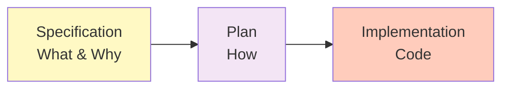
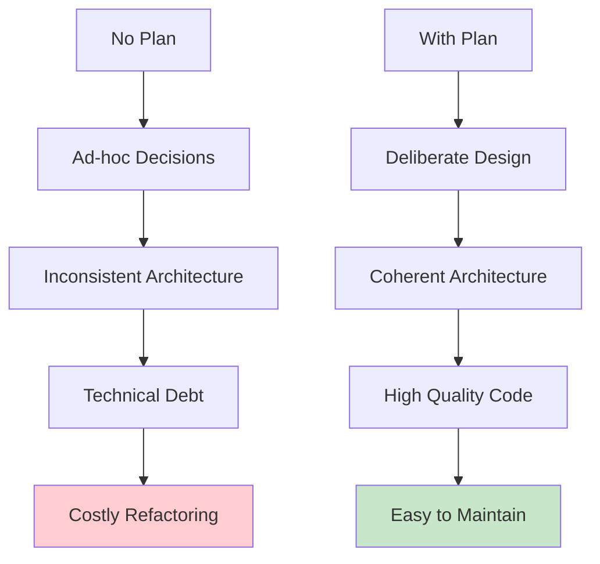
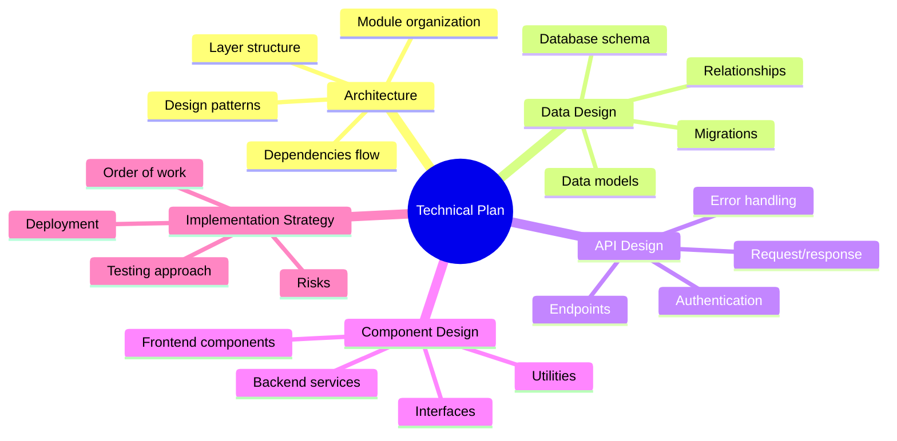
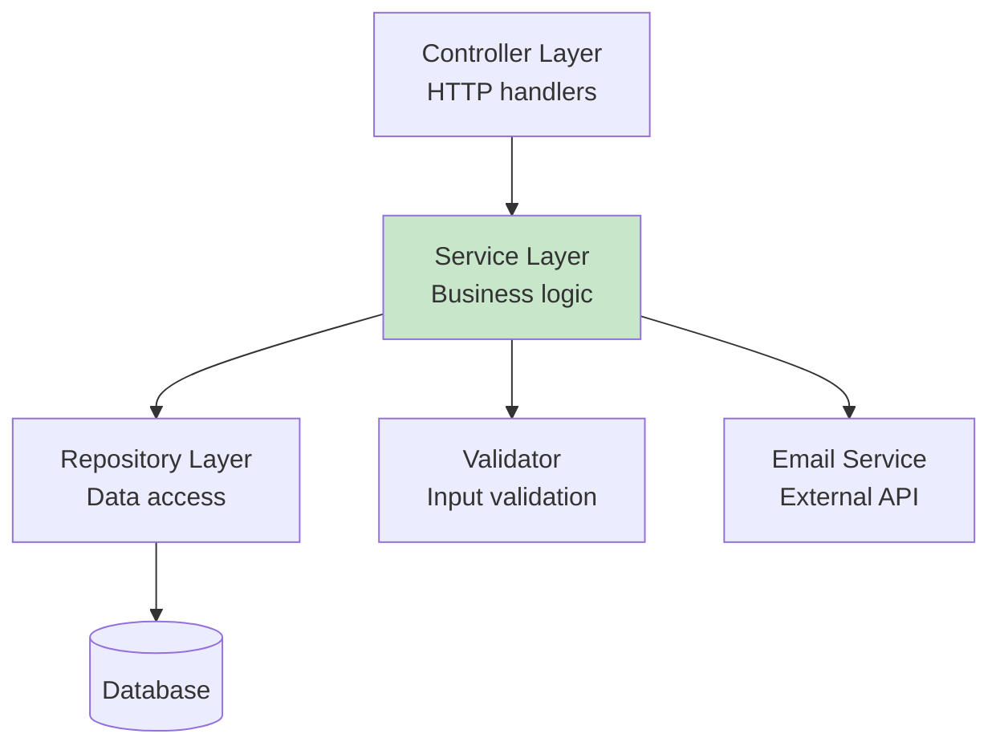
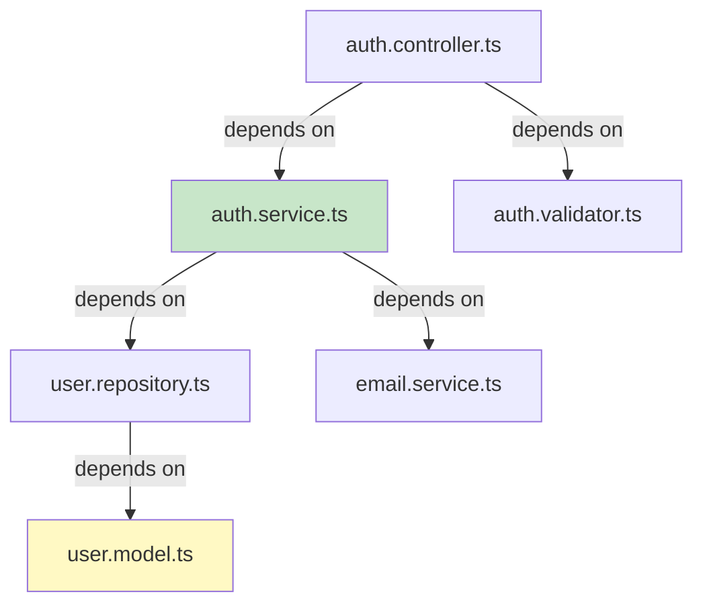
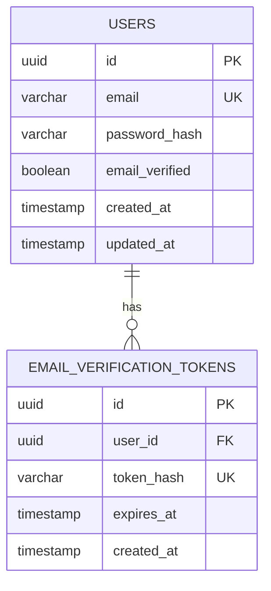
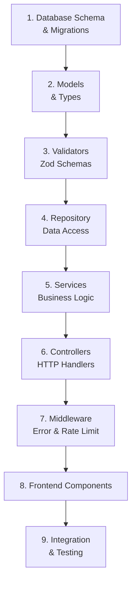

# Lesson 9: Plan - Technical Implementation

**Module:** 3 - Core Workflow  
**Lesson:** 9 of 25  
**Date:** November 29, 2025

---

## 📖 Concept: From "What" to "How"

The **plan** is where you translate user requirements (from the spec) into **technical design decisions**. If the specification says **what** to build, the plan says **how** to build it.

Think of it as the bridge between business needs and code:



---

## 🎯 The Purpose of a Plan

### Why Not Jump Straight to Code?

Without a plan, you might:
- Choose the wrong architecture pattern
- Miss performance optimizations
- Create tight coupling between components
- Make security mistakes
- Build technical debt from day one



### What Makes a Good Plan?

A good plan is:
- **Specific** – Not vague ("we'll use a service layer")
- **Justified** – Explains why decisions were made
- **Complete** – Covers architecture, data, APIs, components
- **Aligned** – Follows the Constitution's patterns
- **Implementable** – AI agent can generate code from it

---

## 📋 Anatomy of a Technical Plan



---

## 1️⃣ Architecture Design

### Purpose
Define the **high-level structure** and **design patterns**.

### What to Include

```markdown
## Architecture

### Overall Pattern
**Repository Pattern with Service Layer**

**Rationale:** Separates business logic (services) from data access (repositories). Makes testing easier and allows swapping data sources without changing business logic.

### Layer Structure


**Layers:**
1. **Controller:** Handle HTTP requests/responses
2. **Service:** Business logic and orchestration
3. **Repository:** Database operations
4. **Validator:** Input validation with Zod
5. **External Services:** Email, payment, etc.

### Design Patterns

**Dependency Injection**
- Use `tsyringe` for IoC container
- Services injected into controllers
- Repositories injected into services
- Makes testing easier (mock dependencies)

**Factory Pattern**
- For creating complex User objects
- Handles password hashing during creation
- Ensures all required validations run

**Strategy Pattern**
- For email provider (SendGrid, AWS SES, console logging)
- Can swap providers without changing service code

### Module Organization
```
src/
├── controllers/
│   └── auth.controller.ts        # HTTP handlers
├── services/
│   ├── auth.service.ts            # Business logic
│   └── email.service.ts           # Email sending
├── repositories/
│   └── user.repository.ts         # Database operations
├── models/
│   └── user.model.ts              # Domain models
├── validators/
│   └── auth.validator.ts          # Zod schemas
├── middleware/
│   ├── error-handler.ts           # Global error handling
│   └── rate-limiter.ts            # Rate limiting
└── types/
    └── auth.types.ts              # TypeScript types
```

### Dependency Flow


**Rule:** Dependencies point inward (outer layers depend on inner layers, never the reverse)
```

---

## 2️⃣ Data Design

### Purpose
Define **how data is structured and stored**.

### What to Include

```markdown
## Data Design

### Database Schema

**Users Table**
```sql
CREATE TABLE users (
  id UUID PRIMARY KEY DEFAULT gen_random_uuid(),
  email VARCHAR(255) UNIQUE NOT NULL,
  password_hash VARCHAR(255) NOT NULL,
  email_verified BOOLEAN DEFAULT FALSE,
  created_at TIMESTAMP DEFAULT NOW(),
  updated_at TIMESTAMP DEFAULT NOW()
);

CREATE INDEX idx_users_email ON users(email);
```

**Email Verification Tokens Table**
```sql
CREATE TABLE email_verification_tokens (
  id UUID PRIMARY KEY DEFAULT gen_random_uuid(),
  user_id UUID NOT NULL REFERENCES users(id) ON DELETE CASCADE,
  token_hash VARCHAR(255) UNIQUE NOT NULL,
  expires_at TIMESTAMP NOT NULL,
  created_at TIMESTAMP DEFAULT NOW()
);

CREATE INDEX idx_tokens_user ON email_verification_tokens(user_id);
CREATE INDEX idx_tokens_expires ON email_verification_tokens(expires_at);
```

### Data Models

**User Model**
```typescript
// src/models/user.model.ts
export interface User {
  id: string;
  email: string;
  passwordHash: string;
  emailVerified: boolean;
  createdAt: Date;
  updatedAt: Date;
}

// DTO for responses (never expose password hash)
export interface UserDTO {
  id: string;
  email: string;
  emailVerified: boolean;
  createdAt: Date;
}
```

**Verification Token Model**
```typescript
// src/models/token.model.ts
export interface VerificationToken {
  id: string;
  userId: string;
  tokenHash: string;
  expiresAt: Date;
  createdAt: Date;
}
```

### Relationships


### Data Validation

**Zod Schemas**
```typescript
// src/validators/auth.validator.ts
import { z } from 'zod';

export const registerSchema = z.object({
  email: z.string().email('Invalid email format'),
  password: z.string()
    .min(8, 'Password must be at least 8 characters')
    .regex(/[A-Z]/, 'Password must contain uppercase letter')
    .regex(/[0-9]/, 'Password must contain number')
    .regex(/[^A-Za-z0-9]/, 'Password must contain special character')
});

export const loginSchema = z.object({
  email: z.string().email('Invalid email format'),
  password: z.string().min(1, 'Password is required')
});
```
```

---

## 3️⃣ API Design

### Purpose
Define **HTTP endpoints, requests, and responses**.

### What to Include

```markdown
## API Design

### Endpoints

#### Register User
```http
POST /api/v1/auth/register
Content-Type: application/json

Request:
{
  "email": "user@example.com",
  "password": "SecureP@ss123"
}

Response (201 Created):
{
  "success": true,
  "message": "Registration successful. Please check your email to verify your account.",
  "data": {
    "userId": "uuid-here",
    "email": "user@example.com"
  }
}

Response (400 Bad Request):
{
  "success": false,
  "error": {
    "code": "VALIDATION_ERROR",
    "message": "Password must contain uppercase letter",
    "field": "password"
  }
}

Response (409 Conflict):
{
  "success": false,
  "error": {
    "code": "EMAIL_EXISTS",
    "message": "This email is already registered"
  }
}
```

#### Verify Email
```http
GET /api/v1/auth/verify?token=abc123

Response (200 OK):
{
  "success": true,
  "message": "Email verified successfully. You can now log in."
}

Response (400 Bad Request):
{
  "success": false,
  "error": {
    "code": "INVALID_TOKEN",
    "message": "Verification token is invalid or expired"
  }
}
```

#### Login
```http
POST /api/v1/auth/login
Content-Type: application/json

Request:
{
  "email": "user@example.com",
  "password": "SecureP@ss123"
}

Response (200 OK):
{
  "success": true,
  "message": "Login successful",
  "data": {
    "user": {
      "id": "uuid-here",
      "email": "user@example.com",
      "emailVerified": true
    },
    "token": "jwt-token-here"
  }
}

Set-Cookie: refreshToken=...; HttpOnly; Secure; SameSite=Strict

Response (401 Unauthorized):
{
  "success": false,
  "error": {
    "code": "INVALID_CREDENTIALS",
    "message": "Invalid email or password"
  }
}
```

### Authentication

**JWT Strategy**
- Access token in response body (15min expiry)
- Refresh token in httpOnly cookie (7 days)
- Token payload: `{ userId, email, iat, exp }`

**Protected Endpoints**
```http
Authorization: Bearer <access-token>
```

Middleware validates token and attaches user to request:
```typescript
req.user = { id: string, email: string }
```

### Error Handling

**Standard Error Response**
```typescript
interface ErrorResponse {
  success: false;
  error: {
    code: string;          // Machine-readable error code
    message: string;       // Human-readable message
    field?: string;        // Field that caused error (validation)
    details?: unknown;     // Additional context (dev mode only)
  }
}
```

**Error Codes**
- `VALIDATION_ERROR` – Invalid input
- `EMAIL_EXISTS` – Duplicate email
- `INVALID_CREDENTIALS` – Wrong email/password
- `INVALID_TOKEN` – Bad verification/auth token
- `RATE_LIMIT_EXCEEDED` – Too many requests
- `INTERNAL_ERROR` – Server error

### Rate Limiting
- **Registration:** 5 requests per hour per IP
- **Login:** 10 requests per 15 minutes per IP
- **Verification:** 3 requests per hour per token

```

---

## 4️⃣ Component Design

### Purpose
Define **individual components, services, and their responsibilities**.

### What to Include

```markdown
## Component Design

### Backend Components

#### AuthController
**Responsibility:** Handle HTTP requests for authentication

```typescript
// src/controllers/auth.controller.ts
class AuthController {
  constructor(
    private authService: AuthService,
    private authValidator: AuthValidator
  ) {}

  // POST /api/v1/auth/register
  async register(req: Request, res: Response): Promise<void> {
    // 1. Validate request body
    // 2. Call authService.register()
    // 3. Send response
  }

  // POST /api/v1/auth/login
  async login(req: Request, res: Response): Promise<void> {
    // 1. Validate request body
    // 2. Call authService.login()
    // 3. Set refresh token cookie
    // 4. Send response with access token
  }

  // GET /api/v1/auth/verify
  async verifyEmail(req: Request, res: Response): Promise<void> {
    // 1. Extract token from query
    // 2. Call authService.verifyEmail()
    // 3. Send response
  }
}
```

#### AuthService
**Responsibility:** Business logic for authentication

```typescript
// src/services/auth.service.ts
class AuthService {
  constructor(
    private userRepository: UserRepository,
    private emailService: EmailService,
    private tokenService: TokenService
  ) {}

  async register(email: string, password: string): Promise<UserDTO> {
    // 1. Check if email exists
    // 2. Hash password with bcrypt
    // 3. Create user in database
    // 4. Generate verification token
    // 5. Send verification email
    // 6. Return user DTO
  }

  async login(email: string, password: string): Promise<{ user: UserDTO, accessToken: string, refreshToken: string }> {
    // 1. Find user by email
    // 2. Compare password with hash
    // 3. Check if email verified
    // 4. Generate JWT tokens
    // 5. Return user and tokens
  }

  async verifyEmail(token: string): Promise<void> {
    // 1. Find token in database
    // 2. Check if expired
    // 3. Get associated user
    // 4. Update user.emailVerified = true
    // 5. Delete used token
  }
}
```

#### UserRepository
**Responsibility:** Database operations for users

```typescript
// src/repositories/user.repository.ts
class UserRepository {
  constructor(private db: PrismaClient) {}

  async create(data: CreateUserDTO): Promise<User> {
    // Insert user into database
  }

  async findByEmail(email: string): Promise<User | null> {
    // Query user by email
  }

  async findById(id: string): Promise<User | null> {
    // Query user by ID
  }

  async updateEmailVerified(userId: string, verified: boolean): Promise<void> {
    // Update email verification status
  }
}
```

#### EmailService
**Responsibility:** Send emails via external provider

```typescript
// src/services/email.service.ts
class EmailService {
  constructor(private emailProvider: IEmailProvider) {}

  async sendVerificationEmail(email: string, token: string): Promise<void> {
    // 1. Generate verification link
    // 2. Create email HTML
    // 3. Send via provider (SendGrid, etc.)
  }
}

// Strategy pattern for different providers
interface IEmailProvider {
  send(to: string, subject: string, html: string): Promise<void>;
}

class SendGridProvider implements IEmailProvider {
  async send(to: string, subject: string, html: string): Promise<void> {
    // SendGrid API call
  }
}

class ConsoleProvider implements IEmailProvider {
  async send(to: string, subject: string, html: string): Promise<void> {
    // Log to console (dev mode)
  }
}
```

### Frontend Components

#### RegistrationForm
```typescript
// src/components/auth/RegistrationForm.tsx
export const RegistrationForm: React.FC = () => {
  // State: email, password, loading, errors
  // Validation: Real-time with Zod
  // Submit: Call /api/v1/auth/register
  // Success: Show success message
  // Error: Display validation errors
};
```

#### LoginForm
```typescript
// src/components/auth/LoginForm.tsx
export const LoginForm: React.FC = () => {
  // State: email, password, loading, errors
  // Submit: Call /api/v1/auth/login
  // Success: Store token, redirect to dashboard
  // Error: Display error message
};
```

#### PasswordStrengthIndicator
```typescript
// src/components/auth/PasswordStrengthIndicator.tsx
export const PasswordStrengthIndicator: React.FC<{ password: string }> = ({ password }) => {
  // Calculate strength (weak/medium/strong)
  // Display colored bar
  // Show requirements checklist
};
```

### Utilities

#### Password Hashing
```typescript
// src/utils/password.util.ts
export class PasswordUtil {
  private static COST_FACTOR = 12;

  static async hash(password: string): Promise<string> {
    // Use bcrypt to hash with cost factor 12
  }

  static async compare(password: string, hash: string): Promise<boolean> {
    // Compare password with hash
  }
}
```

#### JWT Token Generation
```typescript
// src/utils/jwt.util.ts
export class JwtUtil {
  private static ACCESS_TOKEN_EXPIRY = '15m';
  private static REFRESH_TOKEN_EXPIRY = '7d';

  static generateAccessToken(userId: string, email: string): string {
    // Generate JWT with short expiry
  }

  static generateRefreshToken(userId: string): string {
    // Generate JWT with long expiry
  }

  static verify(token: string): { userId: string, email: string } {
    // Verify and decode JWT
  }
}
```

```

---

## 5️⃣ Implementation Strategy

### Purpose
Define **order of implementation, risks, and testing approach**.

### What to Include

```markdown
## Implementation Strategy

### Order of Implementation


**Rationale:** Build from foundation up. Database → Data layer → Business logic → HTTP layer → UI

### Phase 1: Backend Foundation
1. Create database tables and migrations
2. Set up Prisma models
3. Create TypeScript types and interfaces
4. Implement Zod validation schemas

### Phase 2: Core Services
5. Implement UserRepository
6. Implement PasswordUtil and JwtUtil
7. Implement EmailService with strategy pattern
8. Implement AuthService

### Phase 3: HTTP Layer
9. Implement AuthController
10. Create error handling middleware
11. Add rate limiting middleware
12. Set up routes

### Phase 4: Frontend
13. Create RegistrationForm component
14. Create LoginForm component
15. Create PasswordStrengthIndicator
16. Wire up API calls

### Phase 5: Testing & Polish
17. Write unit tests for services
18. Write integration tests for APIs
19. Write E2E tests for user flows
20. Security audit and testing

### Risks & Mitigation

| Risk | Impact | Probability | Mitigation |
|------|--------|-------------|------------|
| Email service failure | High | Medium | Use fallback console logging in dev, queue system in prod |
| Password hash timing attacks | High | Low | Use constant-time comparison for password hashing |
| Token generation collision | Medium | Very Low | Use crypto-random 32 bytes |
| Rate limiting bypass | Medium | Medium | Implement at multiple layers (app + nginx) |
| Database migration failure | High | Low | Test migrations on staging first |

### Testing Strategy

**Unit Tests (Jest)**
- All service methods
- All utility functions
- Password hashing and comparison
- Token generation and validation
- Target: 90% coverage

**Integration Tests (Supertest)**
- All API endpoints
- Request validation
- Error responses
- Authentication flow
- Target: 100% endpoint coverage

**E2E Tests (Playwright)**
- Complete registration flow
- Email verification flow
- Login flow
- Error handling scenarios
- Target: All critical paths

### Deployment Considerations

**Environment Variables**
```bash
DATABASE_URL=postgresql://...
JWT_SECRET=...
JWT_REFRESH_SECRET=...
SENDGRID_API_KEY=...
FRONTEND_URL=https://app.example.com
NODE_ENV=production
```

**Database Migrations**
- Run migrations before deployment
- Have rollback plan ready
- Test on staging first

**Monitoring**
- Log all authentication attempts
- Monitor failed login rates
- Alert on rate limit violations
- Track registration conversion rate

```

---

## 🎯 Complete Plan Example

<details>
<summary>Click to see a full technical plan</summary>

```markdown
# Technical Plan: User Authentication

**Feature:** User Authentication with Email/Password  
**Version:** 1.0  
**Date:** November 29, 2025

---

## 1. Architecture

### Overall Pattern
**Layered Architecture with Dependency Injection**

```
┌─────────────────────────────────┐
│   Controller Layer (HTTP)       │
├─────────────────────────────────┤
│   Service Layer (Business)      │
├─────────────────────────────────┤
│   Repository Layer (Data)       │
├─────────────────────────────────┤
│   Database (PostgreSQL)         │
└─────────────────────────────────┘
```

**Benefits:**
- Clear separation of concerns
- Easy to test (mock dependencies)
- Flexible (swap implementations)
- Follows project constitution

### Design Patterns
1. **Repository Pattern** – Abstract database operations
2. **Dependency Injection** – Invert control, enable testing
3. **Factory Pattern** – Create User objects with validation
4. **Strategy Pattern** – Swap email providers

### Technologies
- **Backend Framework:** Express.js
- **ORM:** Prisma
- **Validation:** Zod
- **Password Hashing:** bcrypt
- **JWT:** jsonwebtoken
- **Email:** SendGrid
- **Testing:** Jest + Supertest

---

## 2. Data Design

### Database Schema
```sql
-- Users table
CREATE TABLE users (
  id UUID PRIMARY KEY DEFAULT gen_random_uuid(),
  email VARCHAR(255) UNIQUE NOT NULL,
  password_hash VARCHAR(255) NOT NULL,
  email_verified BOOLEAN DEFAULT FALSE,
  created_at TIMESTAMP DEFAULT NOW(),
  updated_at TIMESTAMP DEFAULT NOW()
);

CREATE INDEX idx_users_email ON users(email);

-- Verification tokens
CREATE TABLE email_verification_tokens (
  id UUID PRIMARY KEY DEFAULT gen_random_uuid(),
  user_id UUID NOT NULL REFERENCES users(id) ON DELETE CASCADE,
  token_hash VARCHAR(255) UNIQUE NOT NULL,
  expires_at TIMESTAMP NOT NULL,
  created_at TIMESTAMP DEFAULT NOW()
);

CREATE INDEX idx_tokens_user ON email_verification_tokens(user_id);
CREATE INDEX idx_tokens_hash ON email_verification_tokens(token_hash);
```

### TypeScript Models
```typescript
interface User {
  id: string;
  email: string;
  passwordHash: string;
  emailVerified: boolean;
  createdAt: Date;
  updatedAt: Date;
}

interface UserDTO {
  id: string;
  email: string;
  emailVerified: boolean;
  createdAt: Date;
}

interface VerificationToken {
  id: string;
  userId: string;
  tokenHash: string;
  expiresAt: Date;
  createdAt: Date;
}
```

---

## 3. API Design

### Endpoints

**POST /api/v1/auth/register**
- Input: `{ email, password }`
- Output: `{ success, message, data: { userId, email } }`
- Creates user, sends verification email

**GET /api/v1/auth/verify?token=xxx**
- Input: Query parameter `token`
- Output: `{ success, message }`
- Verifies email, activates account

**POST /api/v1/auth/login**
- Input: `{ email, password }`
- Output: `{ success, data: { user, token } }`
- Sets httpOnly cookie with refresh token
- Returns access token

### Authentication
- Access token: JWT, 15min expiry, in response body
- Refresh token: JWT, 7days expiry, httpOnly cookie
- Protected routes: `Authorization: Bearer <token>`

---

## 4. Component Design

### Backend Components

**AuthController** (`src/controllers/auth.controller.ts`)
- Handles HTTP requests
- Validates input with Zod
- Calls AuthService methods
- Returns responses

**AuthService** (`src/services/auth.service.ts`)
- Core business logic
- Uses UserRepository for data
- Uses EmailService for emails
- Generates tokens

**UserRepository** (`src/repositories/user.repository.ts`)
- Database operations
- CRUD for users
- Query methods

**EmailService** (`src/services/email.service.ts`)
- Sends verification emails
- Uses strategy pattern for providers
- Falls back to console in dev

**PasswordUtil** (`src/utils/password.util.ts`)
- Hash passwords with bcrypt (cost 12)
- Compare passwords securely

**JwtUtil** (`src/utils/jwt.util.ts`)
- Generate access & refresh tokens
- Verify and decode tokens

### Frontend Components

**RegistrationForm** (`src/components/auth/RegistrationForm.tsx`)
- Email and password inputs
- Real-time validation
- Password strength indicator
- Calls register API

**LoginForm** (`src/components/auth/LoginForm.tsx`)
- Email and password inputs
- Calls login API
- Handles errors
- Redirects on success

**PasswordStrengthIndicator** (`src/components/auth/PasswordStrengthIndicator.tsx`)
- Shows password strength (weak/medium/strong)
- Lists requirements
- Updates in real-time

---

## 5. Implementation Strategy

### Build Order
1. Database migrations
2. Prisma models & TypeScript types
3. Zod validation schemas
4. UserRepository
5. Utilities (PasswordUtil, JwtUtil)
6. EmailService
7. AuthService
8. AuthController
9. Middleware (error handling, rate limiting)
10. Routes setup
11. Frontend components
12. Tests

### Testing Approach
- **Unit Tests:** Services, utilities (90% coverage)
- **Integration Tests:** API endpoints (100% coverage)
- **E2E Tests:** User flows (critical paths)

### Deployment Steps
1. Run database migrations
2. Set environment variables
3. Deploy backend
4. Deploy frontend
5. Run smoke tests
6. Monitor logs

---

## 6. Security Considerations

- Passwords hashed with bcrypt (cost 12)
- No plain passwords in logs
- Rate limiting on all endpoints
- HTTPS only in production
- httpOnly cookies for refresh tokens
- CSRF protection
- Input validation with Zod
- SQL injection prevention (Prisma)

---

## 7. Performance Optimizations

- Database indexes on email fields
- Connection pooling for database
- Redis caching for rate limits
- CDN for static assets
- Gzip compression

---

**Approved for Implementation:** ✅
```

</details>

---

## 🤔 Socratic Questions

### Question 1
**Why separate business logic (AuthService) from database operations (UserRepository) instead of putting everything in one place?**

<details>
<summary>Think about testing and flexibility...</summary>

**Separation benefits:**

1. **Testing** – Can test business logic without a real database (mock repository)
2. **Flexibility** – Can swap databases (PostgreSQL → MongoDB) without changing business logic
3. **Single Responsibility** – Each class has one job
4. **Reusability** – Repository can be used by multiple services
5. **Clarity** – Clear boundaries make code easier to understand

Example: To test AuthService.register(), you mock UserRepository. No need for test database!

This is the **Repository Pattern** – one of the most valuable design patterns for maintainable code.
</details>

### Question 2
**Why use dependency injection (tsyringe) instead of directly importing dependencies?**

<details>
<summary>Consider testing and coupling...</summary>

**Without DI (tight coupling):**
```typescript
import { UserRepository } from './user.repository';
class AuthService {
  private repo = new UserRepository(); // Hard to test!
}
```

**With DI (loose coupling):**
```typescript
class AuthService {
  constructor(private repo: UserRepository) {} // Easy to mock!
}
```

**Benefits:**
1. **Testing** – Pass mock repository in tests
2. **Flexibility** – Can pass different implementations
3. **Inversion of Control** – Service doesn't control its dependencies
4. **Configuration** – Container manages object creation

In tests:
```typescript
const mockRepo = new MockUserRepository();
const service = new AuthService(mockRepo);
```

DI makes code testable and flexible!
</details>

### Question 3
**When planning, how do you decide what level of detail to include vs. what to leave for implementation?**

<details>
<summary>Think about the AI agent's needs...</summary>

**Include in Plan:**
- **Architecture patterns** (Repository, DI, Strategy)
- **Component structure** (which classes, their responsibilities)
- **Data models** (fields, types, relationships)
- **API contracts** (endpoints, request/response shapes)
- **Key algorithms** (password hashing approach, token generation)

**Leave for Implementation:**
- **Exact code syntax** (the AI will generate this)
- **Variable names** (unless critical to understanding)
- **Error messages** (unless business-specific)
- **Minor helpers** (the AI will create as needed)

**Rule of Thumb:** Include enough that the AI knows **what decisions were made** and **why**, but not so much that you're writing pseudo-code.

The plan is a **blueprint**, not **instructions**. Think "architectural drawings" not "assembly manual."
</details>

---

## 💡 Exercise: Create a Technical Plan

Take the spec you wrote in Lesson 8 (or choose a new feature) and create a technical plan.

### Template

```markdown
# Technical Plan: [Feature Name]

## 1. Architecture

### Overall Pattern
[What pattern are you using and why?]

### Layer Structure
[Diagram or description of layers]

### Design Patterns
1. [Pattern]: [When/why]
2. [Pattern]: [When/why]

### Technologies
- [Technology]: [Purpose]

---

## 2. Data Design

### Database Schema
```sql
[Your table definitions]
```

### TypeScript Models
```typescript
[Your interfaces]
```

### Relationships
[Diagram or description]

---

## 3. API Design

### Endpoints

**[METHOD] /api/v1/[path]**
- Input: `{ ... }`
- Output: `{ ... }`
- Purpose: [What it does]

[Repeat for each endpoint]

---

## 4. Component Design

### Backend Components

**[ComponentName]**
- Responsibility: [What it does]
- Dependencies: [What it depends on]
- Methods: [Key methods]

[Repeat for each component]

### Frontend Components

**[ComponentName]**
- Purpose: [What it renders]
- State: [What state it manages]
- Props: [What props it accepts]

---

## 5. Implementation Strategy

### Build Order
1. [Step 1]
2. [Step 2]
...

### Testing Approach
[How you'll test]

### Deployment
[How you'll deploy]

---

## 6. Risks & Mitigation

| Risk | Mitigation |
|------|------------|
| [Risk] | [How to handle] |
```

---

## ✅ Planning Checklist

Before moving to the next lesson, ensure:

- [ ] I understand the purpose of a technical plan
- [ ] I can identify appropriate architecture patterns
- [ ] I know how to design database schemas
- [ ] I can define API contracts (endpoints, requests, responses)
- [ ] I understand component responsibilities and dependencies
- [ ] I can create an implementation strategy
- [ ] I see how the plan bridges spec and code
- [ ] I've practiced writing a plan (exercise above)

---

## 🎯 Key Takeaways

1. **Plan = How to Build** – Technical decisions, not requirements
2. **Think Architecture First** – Patterns, layers, dependencies
3. **Be Specific About Data** – Schema, models, relationships
4. **Design APIs Carefully** – Clear contracts prevent bugs
5. **Organize Components** – Single responsibility, loose coupling
6. **Plan Implementation Order** – Foundation first
7. **Consider Risks** – Anticipate and mitigate

---

## 🚀 What's Next?

You've defined **what** to build (Specification) and **how** to build it (Plan). The next lesson covers breaking the plan into **actionable tasks**.

**Lesson 10: Tasks - Breaking Down Work**

You'll learn:
- How to decompose a plan into tasks
- Writing clear, atomic tasks
- Ordering tasks effectively
- Tracking progress

---

## ✅ Ready to Continue?

Reply with:
- ✅ "Ready" or "Lesson 10" to move to Tasks
- 📝 Share your plan for feedback
- 🤔 "Question about [topic]" for clarification

---

*Previous: [Lesson 8: Specify - Defining Requirements](./Lesson-08-Specify-Defining-Requirements.md)*  
*Next: [Lesson 10: Tasks - Breaking Down Work](./Lesson-10-Tasks-Breaking-Down-Work.md)*
