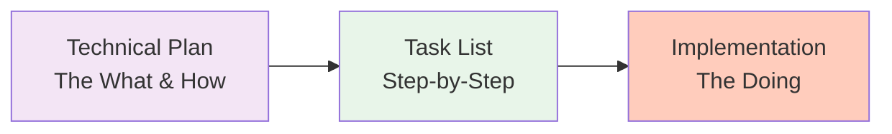
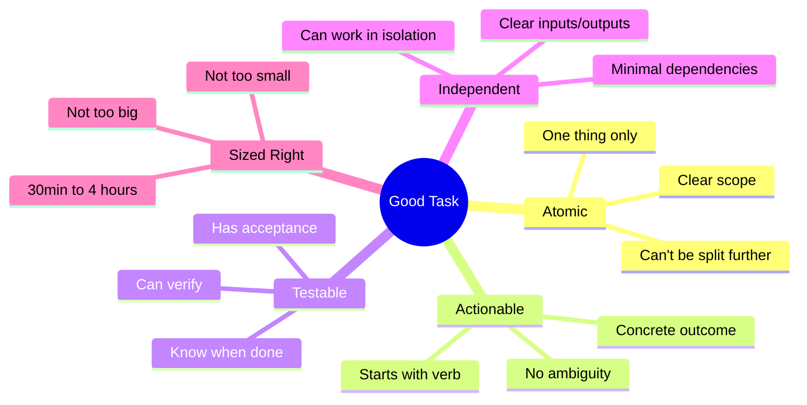
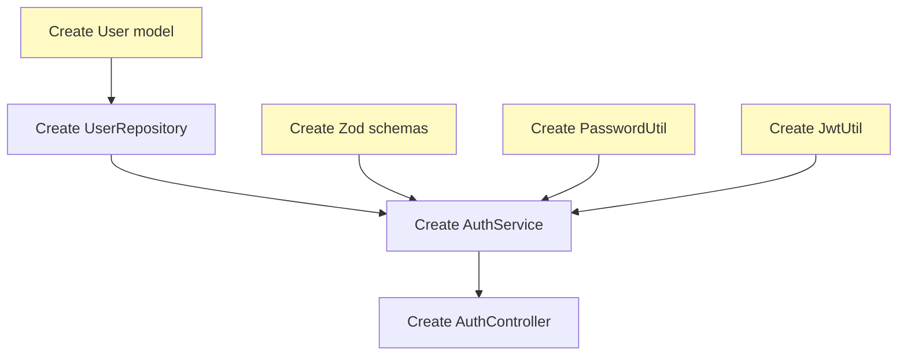
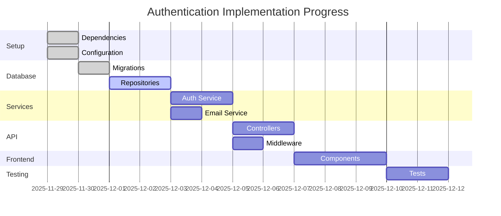

# Lesson 10: Tasks - Breaking Down Work

**Module:** 3 - Core Workflow  
**Lesson:** 10 of 25  
**Date:** November 29, 2025

---

## 📖 Concept: The Power of Atomic Tasks

A **task list** transforms your technical plan into **bite-sized, actionable work items**. Think of it as the **assembly instructions** that come with furniture – each step is small, clear, and can be completed independently.



---

## 🎯 Why Break Down Into Tasks?

### The Problem with "Just Build It"

Imagine your AI agent receives:
> "Implement user authentication"

**Too vague!** The AI needs to know:
- Where to start?
- What to build first?
- What depends on what?
- How to verify each step?

### The Power of Task Decomposition

```mermaid
graph TD
    Big[Large Feature<br/>Overwhelming] --> Break[Break Into Tasks]
    Break --> T1[Task 1: Small<br/>✓ Achievable]
    Break --> T2[Task 2: Small<br/>✓ Clear]
    Break --> T3[Task 3: Small<br/>✓ Testable]
    Break --> T4[Task 4: Small<br/>✓ Independent]
    
    T1 --> Done1[✓ Complete]
    T2 --> Done2[✓ Complete]
    T3 --> Done3[✓ Complete]
    T4 --> Done4[✓ Complete]
    
    Done1 & Done2 & Done3 & Done4 --> Feature[Feature Complete!]
    
    style Feature fill:#c8e6c9
```



**Benefits:**
- **Progress is visible** – Check off completed tasks
- **Parallelization** – Some tasks can be done concurrently
- **Testing is easier** – Test each small piece
- **Context switching** – Pick up where you left off
- **AI-friendly** – Clear instructions for code generation

---

## ✅ Anatomy of a Good Task

### Characteristics of Atomic Tasks



### Good vs. Bad Tasks

| Bad Task | Why Bad | Good Task |
|----------|---------|-----------|
| "Set up backend" | Too vague | "Create Express app with TypeScript config" |
| "Handle errors" | No specifics | "Add global error middleware that catches and formats errors" |
| "Make it secure" | Not actionable | "Add bcrypt password hashing with cost factor 12" |
| "Fix database stuff" | Unclear | "Create users table migration with email unique constraint" |
| "Do the UI" | Way too big | "Create RegistrationForm component with email and password fields" |

### Task Format

```markdown
**Task:** [Action Verb] [What] [Context/Details]

Example:
**Task:** Create User model interface with id, email, passwordHash, and emailVerified fields

Example:
**Task:** Implement AuthService.register() method that hashes password and creates user

Example:
**Task:** Add rate limiting middleware to auth routes (5 attempts per hour)
```

---

## 📋 Task Organization

### Grouping by Phase

```markdown
# Implementation Tasks: User Authentication

## Phase 1: Setup & Foundation
- [ ] Initialize project with TypeScript and Express
- [ ] Install dependencies (bcrypt, jsonwebtoken, zod, prisma)
- [ ] Configure environment variables (.env template)
- [ ] Set up Prisma with PostgreSQL connection

## Phase 2: Database Layer
- [ ] Create users table migration
- [ ] Create email_verification_tokens table migration
- [ ] Run migrations and verify schema
- [ ] Create Prisma models for User and VerificationToken

## Phase 3: Validation & Types
- [ ] Create TypeScript interfaces for User and UserDTO
- [ ] Create Zod schema for registration input validation
- [ ] Create Zod schema for login input validation
- [ ] Export validation functions from validators module

## Phase 4: Utilities
- [ ] Create PasswordUtil with hash() method using bcrypt
- [ ] Create PasswordUtil with compare() method
- [ ] Create JwtUtil with generateAccessToken() method
- [ ] Create JwtUtil with generateRefreshToken() method
- [ ] Create JwtUtil with verify() method

## Phase 5: Repository Layer
- [ ] Create UserRepository.create() method
- [ ] Create UserRepository.findByEmail() method
- [ ] Create UserRepository.findById() method
- [ ] Create UserRepository.updateEmailVerified() method
- [ ] Create VerificationTokenRepository with CRUD methods

## Phase 6: Service Layer
- [ ] Create EmailService with sendVerificationEmail() method
- [ ] Implement strategy pattern for email providers (SendGrid, Console)
- [ ] Create AuthService.register() method
- [ ] Create AuthService.login() method
- [ ] Create AuthService.verifyEmail() method

## Phase 7: Controller Layer
- [ ] Create AuthController.register() handler
- [ ] Create AuthController.login() handler
- [ ] Create AuthController.verifyEmail() handler
- [ ] Add input validation to all controller methods

## Phase 8: Middleware
- [ ] Create global error handling middleware
- [ ] Create rate limiting middleware for auth routes
- [ ] Create JWT authentication middleware for protected routes
- [ ] Add request logging middleware

## Phase 9: Routes
- [ ] Set up Express router for /api/v1/auth
- [ ] Add POST /api/v1/auth/register route
- [ ] Add POST /api/v1/auth/login route
- [ ] Add GET /api/v1/auth/verify route

## Phase 10: Frontend Components
- [ ] Create RegistrationForm component structure
- [ ] Add form state management with React Hook Form
- [ ] Add real-time validation to registration form
- [ ] Create PasswordStrengthIndicator component
- [ ] Integrate PasswordStrengthIndicator with RegistrationForm
- [ ] Create LoginForm component
- [ ] Add API client functions for auth endpoints

## Phase 11: Testing
- [ ] Write unit tests for PasswordUtil
- [ ] Write unit tests for JwtUtil
- [ ] Write unit tests for AuthService.register()
- [ ] Write unit tests for AuthService.login()
- [ ] Write integration tests for POST /api/v1/auth/register
- [ ] Write integration tests for POST /api/v1/auth/login
- [ ] Write integration tests for GET /api/v1/auth/verify
- [ ] Write E2E test for complete registration flow
- [ ] Write E2E test for complete login flow

## Phase 12: Polish & Deploy
- [ ] Add error messages to all error cases
- [ ] Add logging for authentication events
- [ ] Set up environment variables for production
- [ ] Create deployment documentation
- [ ] Run final security audit
- [ ] Deploy to staging and test
```

---

## 🔄 Task Dependencies

### Understanding Dependencies

Some tasks **must** happen before others:



**Parallel Tasks** (can be done simultaneously):
- Create User model
- Create Zod schemas
- Create PasswordUtil
- Create JwtUtil

**Sequential Tasks** (must follow order):
1. Create User model
2. Create UserRepository (depends on model)
3. Create AuthService (depends on repository)
4. Create AuthController (depends on service)

### Marking Dependencies

```markdown
## Phase 2: Repository Layer

- [ ] Create UserRepository.create() method
      Dependencies: User model must exist

- [ ] Create UserRepository.findByEmail() method
      Dependencies: Users table migration, User model

## Phase 3: Service Layer

- [ ] Create AuthService.register() method
      Dependencies: UserRepository, PasswordUtil, EmailService
```

---

## 🎯 Task Size Guidelines

### The Goldilocks Zone

```mermaid
graph LR
    TooSmall[Too Small<br/>❌ Overhead] --- Right[Just Right<br/>✓ 30min-4hr]
    Right --- TooBig[Too Big<br/>❌ Overwhelming]
    
    style Right fill:#c8e6c9
    style TooSmall fill:#ffcdd2
    style TooBig fill:#ffcdd2
```



### Examples by Size

**Too Small (< 30 minutes):**
```markdown
- [ ] Import bcrypt library
- [ ] Add console.log for debugging
- [ ] Rename variable
```

**Just Right (30 min - 4 hours):**
```markdown
- [ ] Create AuthService.register() method with password hashing and user creation
- [ ] Implement rate limiting middleware for auth routes
- [ ] Write integration tests for registration endpoint
```

**Too Big (> 4 hours):**
```markdown
- [ ] Build entire authentication system
- [ ] Complete all backend services
- [ ] Finish frontend
```

### How to Split Large Tasks

**Large Task:**
> "Build authentication system"

**Split Into:**
1. Create database schema
2. Create models and types
3. Implement password hashing utility
4. Implement user repository
5. Implement auth service
6. Create API endpoints
7. Build frontend forms
8. Write tests

---

## 💡 Using the `/tasks` Command

### In Your AI Agent

```
You: /tasks

AI: I'll create a comprehensive task list based on your specification and plan.

[AI reads constitution.md, spec.md, and plan.md]

[AI generates:]

# Implementation Tasks: User Authentication

## Phase 1: Setup
- [ ] Install dependencies (express, prisma, bcrypt, etc.)
- [ ] Configure TypeScript
- [ ] Set up database connection

[... complete task list ...]

You: Can you add more detail to the database tasks?

AI: Sure! I'll break down Phase 2:

## Phase 2: Database Layer
- [ ] Create migration file for users table
      - Include: id (UUID), email (unique), password_hash, email_verified
      - Add index on email field
- [ ] Create migration file for verification_tokens table
      - Include: id, user_id (FK), token_hash, expires_at
      - Add index on user_id and token_hash
- [ ] Run migrations with `npx prisma migrate dev`
- [ ] Verify tables created with `psql` or database GUI
```

---

## 📊 Tracking Progress

### The Satisfaction of Checking Boxes

```markdown
## Phase 5: Repository Layer
- [x] Create UserRepository.create() method           ✓ Done
- [x] Create UserRepository.findByEmail() method      ✓ Done
- [ ] Create UserRepository.findById() method         ← Working on this
- [ ] Create UserRepository.updateEmailVerified()     
- [ ] Create VerificationTokenRepository
```

### Progress Visualization



---

## 🛠️ Task Writing Best Practices

### 1. Start with Action Verbs

**Good:**
- ✅ Create
- ✅ Implement
- ✅ Add
- ✅ Write
- ✅ Configure
- ✅ Integrate

**Avoid:**
- ❌ Need to...
- ❌ Should...
- ❌ Maybe...

### 2. Be Specific

**Vague:**
```markdown
- [ ] Make authentication secure
```

**Specific:**
```markdown
- [ ] Add bcrypt password hashing with cost factor 12
- [ ] Implement JWT token signing with HS256 algorithm
- [ ] Add rate limiting: 5 failed attempts = 15min lockout
```

### 3. Include Acceptance Criteria

```markdown
- [ ] Create AuthService.register() method
      Acceptance:
      - Takes email and password as parameters
      - Returns UserDTO (id, email, emailVerified)
      - Throws error if email exists
      - Hashes password before storing
      - Sends verification email
      - Creates user in database
```

### 4. Reference Files/Locations

```markdown
- [ ] Create User model interface in src/models/user.model.ts
- [ ] Add validation schema to src/validators/auth.validator.ts
- [ ] Implement register() in src/services/auth.service.ts
```

### 5. Note Any Gotchas

```markdown
- [ ] Implement password comparison in AuthService.login()
      Note: Use bcrypt.compare(), NOT string comparison (timing attack!)

- [ ] Add email validation
      Note: Use Zod's .email() validator, not regex (RFC 5322 compliant)
```

---

## 🔍 Task Quality Checklist

For each task, ask:

```markdown
## Task Quality Check

- [ ] **Atomic?** Can it be completed in one sitting?
- [ ] **Actionable?** Does it start with a clear verb?
- [ ] **Specific?** Is it clear exactly what to do?
- [ ] **Testable?** Can you verify when it's done?
- [ ] **Independent?** Minimal dependencies on other tasks?
- [ ] **Sized Right?** 30 minutes to 4 hours?
- [ ] **Located?** File/location specified?
- [ ] **Dependencies Clear?** Any prerequisites noted?
```

---

## 🚫 Task Anti-Patterns

### Anti-Pattern 1: Vague Tasks

**Bad:**
```markdown
- [ ] Fix bugs
- [ ] Improve performance
- [ ] Make it better
```

**Good:**
```markdown
- [ ] Fix: Registration fails when email contains uppercase letters (normalize to lowercase)
- [ ] Optimize: Add database index on users.email to speed up login queries
- [ ] Refactor: Extract password validation logic into reusable function
```

### Anti-Pattern 2: Scope Creep Tasks

**Bad:**
```markdown
- [ ] Build authentication and also add OAuth and two-factor and password reset and...
```

**Good:**
```markdown
Phase 1: Core Authentication
- [ ] Implement email/password registration
- [ ] Implement login with JWT
- [ ] Implement email verification

Phase 2: Enhanced Security (Future)
- [ ] Add OAuth (Google, GitHub)
- [ ] Add two-factor authentication
- [ ] Add password reset flow
```

### Anti-Pattern 3: Technical Jargon Without Context

**Bad:**
```markdown
- [ ] Implement the thing with the hash and salt it properly
```

**Good:**
```markdown
- [ ] Implement password hashing using bcrypt with cost factor 12
      Details: bcrypt.hash(password, 12) in PasswordUtil.hash()
```

---

## 🎓 Complete Task List Example

<details>
<summary>Click to see a comprehensive task list</summary>

```markdown
# Implementation Tasks: User Authentication Feature

**Feature:** User Registration, Email Verification, and Login  
**Sprint:** November 29 - December 13, 2025  
**Estimated Time:** 40-50 hours

---

## Phase 1: Project Setup (Estimated: 2-3 hours)

- [ ] **Install backend dependencies**
      ```bash
      npm install express prisma bcrypt jsonwebtoken zod
      npm install -D @types/express @types/bcrypt @types/jsonwebtoken typescript
      ```
      Acceptance: package.json contains all dependencies

- [ ] **Configure TypeScript**
      File: tsconfig.json
      Include: strict mode, ES2022 target, commonjs module
      Acceptance: `tsc --noEmit` runs without errors

- [ ] **Set up Prisma**
      File: prisma/schema.prisma
      Configure PostgreSQL datasource
      Acceptance: `npx prisma generate` succeeds

- [ ] **Create .env template**
      File: .env.example
      Include: DATABASE_URL, JWT_SECRET, JWT_REFRESH_SECRET, SENDGRID_API_KEY
      Acceptance: Template contains all required variables

---

## Phase 2: Database Layer (Estimated: 4-5 hours)

- [ ] **Create users table migration**
      File: prisma/migrations/XXX_create_users.sql
      Columns:
      - id (UUID, PK)
      - email (VARCHAR 255, UNIQUE)
      - password_hash (VARCHAR 255)
      - email_verified (BOOLEAN, default false)
      - created_at (TIMESTAMP)
      - updated_at (TIMESTAMP)
      Index: email
      Acceptance: Migration creates table successfully

- [ ] **Create verification tokens table migration**
      File: prisma/migrations/XXX_create_verification_tokens.sql
      Columns:
      - id (UUID, PK)
      - user_id (UUID, FK to users)
      - token_hash (VARCHAR 255, UNIQUE)
      - expires_at (TIMESTAMP)
      - created_at (TIMESTAMP)
      Indexes: user_id, token_hash
      Acceptance: Migration creates table with foreign key

- [ ] **Run migrations**
      Command: `npx prisma migrate dev`
      Acceptance: Both tables exist in database

- [ ] **Update Prisma schema models**
      File: prisma/schema.prisma
      Add: User model, EmailVerificationToken model
      Acceptance: `npx prisma generate` creates types

---

## Phase 3: Types & Validation (Estimated: 3-4 hours)

- [ ] **Create User TypeScript interfaces**
      File: src/types/user.types.ts
      Interfaces: User, UserDTO, CreateUserDTO
      Acceptance: No type errors, exports work

- [ ] **Create auth Zod schemas**
      File: src/validators/auth.validator.ts
      Schemas: registerSchema, loginSchema
      Validation rules:
      - Email: valid format
      - Password: min 8 chars, uppercase, number, special char
      Acceptance: Valid inputs pass, invalid inputs fail with messages

- [ ] **Create validation middleware**
      File: src/middleware/validate.middleware.ts
      Function: validate(schema: ZodSchema)
      Returns Express middleware that validates req.body
      Acceptance: Invalid requests return 400 with error details

---

## Phase 4: Utilities (Estimated: 3-4 hours)

- [ ] **Create PasswordUtil.hash() method**
      File: src/utils/password.util.ts
      Method: static async hash(password: string): Promise<string>
      Implementation: Use bcrypt.hash with cost factor 12
      Acceptance: Hashes are different each call, verify works

- [ ] **Create PasswordUtil.compare() method**
      File: src/utils/password.util.ts
      Method: static async compare(password: string, hash: string): Promise<boolean>
      Implementation: Use bcrypt.compare (constant-time)
      Acceptance: Correct passwords return true, wrong return false

- [ ] **Create JwtUtil.generateAccessToken() method**
      File: src/utils/jwt.util.ts
      Method: static generateAccessToken(userId: string, email: string): string
      Payload: { userId, email, type: 'access' }
      Expiry: 15 minutes
      Acceptance: Token can be decoded and verified

- [ ] **Create JwtUtil.generateRefreshToken() method**
      File: src/utils/jwt.util.ts
      Method: static generateRefreshToken(userId: string): string
      Payload: { userId, type: 'refresh' }
      Expiry: 7 days
      Acceptance: Token has longer expiry than access token

- [ ] **Create JwtUtil.verify() method**
      File: src/utils/jwt.util.ts
      Method: static verify(token: string): { userId: string, email?: string }
      Throws: Error if invalid or expired
      Acceptance: Valid tokens decode, invalid/expired throw errors

---

## Phase 5: Repository Layer (Estimated: 4-5 hours)

- [ ] **Create UserRepository.create() method**
      File: src/repositories/user.repository.ts
      Method: async create(data: CreateUserDTO): Promise<User>
      Uses: Prisma client
      Acceptance: Creates user, returns user object

- [ ] **Create UserRepository.findByEmail() method**
      File: src/repositories/user.repository.ts
      Method: async findByEmail(email: string): Promise<User | null>
      Uses: Prisma client, case-insensitive search
      Acceptance: Finds existing users, returns null for non-existent

- [ ] **Create UserRepository.findById() method**
      File: src/repositories/user.repository.ts
      Method: async findById(id: string): Promise<User | null>
      Acceptance: Finds by UUID, returns null if not found

- [ ] **Create UserRepository.updateEmailVerified() method**
      File: src/repositories/user.repository.ts
      Method: async updateEmailVerified(userId: string, verified: boolean): Promise<void>
      Acceptance: Updates field in database

- [ ] **Create TokenRepository with CRUD methods**
      File: src/repositories/token.repository.ts
      Methods: create(), findByToken(), deleteByUserId()
      Acceptance: Can manage verification tokens

---

## Phase 6: Service Layer (Estimated: 6-8 hours)

- [ ] **Create EmailService interface**
      File: src/services/email/email.interface.ts
      Interface: IEmailProvider with send() method
      Acceptance: Interface defines contract

- [ ] **Create SendGridEmailProvider**
      File: src/services/email/sendgrid.provider.ts
      Implements: IEmailProvider
      Uses: @sendgrid/mail library
      Acceptance: Sends emails via SendGrid API

- [ ] **Create ConsoleEmailProvider**
      File: src/services/email/console.provider.ts
      Implements: IEmailProvider
      Logs to console instead of sending
      Acceptance: Logs email details to console

- [ ] **Create EmailService**
      File: src/services/email.service.ts
      Constructor: accepts IEmailProvider (dependency injection)
      Method: sendVerificationEmail(email, token)
      Acceptance: Constructs and sends verification email

- [ ] **Create AuthService.register() method**
      File: src/services/auth.service.ts
      Method: async register(email: string, password: string): Promise<UserDTO>
      Steps:
      1. Check if email exists (throw if yes)
      2. Hash password
      3. Create user via repository
      4. Generate verification token
      5. Send verification email
      6. Return UserDTO
      Acceptance: Creates user, sends email, returns DTO

- [ ] **Create AuthService.login() method**
      File: src/services/auth.service.ts
      Method: async login(email, password): Promise<{ user: UserDTO, accessToken, refreshToken }>
      Steps:
      1. Find user by email
      2. Compare password
      3. Check email verified
      4. Generate tokens
      5. Return user and tokens
      Acceptance: Valid credentials return tokens, invalid throw error

- [ ] **Create AuthService.verifyEmail() method**
      File: src/services/auth.service.ts
      Method: async verifyEmail(token: string): Promise<void>
      Steps:
      1. Find token in database
      2. Check expiration
      3. Update user.emailVerified = true
      4. Delete token
      Acceptance: Activates account, removes token

---

## Phase 7: Controller Layer (Estimated: 3-4 hours)

- [ ] **Create AuthController.register() handler**
      File: src/controllers/auth.controller.ts
      Route: POST /api/v1/auth/register
      Steps:
      1. Validate input (middleware)
      2. Call authService.register()
      3. Return 201 with success message
      4. Catch errors, return appropriate status
      Acceptance: Valid requests create user, invalid return 400

- [ ] **Create AuthController.login() handler**
      File: src/controllers/auth.controller.ts
      Route: POST /api/v1/auth/login
      Steps:
      1. Validate input
      2. Call authService.login()
      3. Set refresh token in httpOnly cookie
      4. Return access token in response body
      Acceptance: Sets cookie, returns token

- [ ] **Create AuthController.verifyEmail() handler**
      File: src/controllers/auth.controller.ts
      Route: GET /api/v1/auth/verify?token=xxx
      Steps:
      1. Extract token from query
      2. Call authService.verifyEmail()
      3. Return success message
      Acceptance: Valid tokens activate account

---

## Phase 8: Middleware (Estimated: 3-4 hours)

- [ ] **Create error handling middleware**
      File: src/middleware/error-handler.middleware.ts
      Catches all errors, formats response
      Returns: { success: false, error: { code, message } }
      Acceptance: All errors formatted consistently

- [ ] **Create rate limiting middleware**
      File: src/middleware/rate-limiter.middleware.ts
      Limits: 5 requests per hour for registration, 10 per 15min for login
      Uses: express-rate-limit or custom Redis-based
      Acceptance: Exceeding limit returns 429

- [ ] **Create authentication middleware**
      File: src/middleware/auth.middleware.ts
      Validates JWT from Authorization header
      Attaches req.user = { id, email }
      Acceptance: Valid tokens pass, invalid return 401

- [ ] **Create logging middleware**
      File: src/middleware/logger.middleware.ts
      Logs: method, path, status, duration
      Uses: winston logger
      Acceptance: All requests logged

---

## Phase 9: Routes (Estimated: 1-2 hours)

- [ ] **Create auth routes file**
      File: src/routes/auth.routes.ts
      Set up Express Router
      Acceptance: Router exports correctly

- [ ] **Add POST /api/v1/auth/register route**
      Apply: validation middleware, rate limiter
      Handler: authController.register
      Acceptance: Route registered, middleware applied

- [ ] **Add POST /api/v1/auth/login route**
      Apply: validation middleware, rate limiter
      Handler: authController.login
      Acceptance: Route registered

- [ ] **Add GET /api/v1/auth/verify route**
      Handler: authController.verifyEmail
      Acceptance: Route registered

- [ ] **Mount routes in main app**
      File: src/app.ts or src/index.ts
      Mount: app.use('/api/v1/auth', authRoutes)
      Acceptance: All routes accessible

---

## Phase 10: Frontend (Estimated: 8-10 hours)

- [ ] **Create RegistrationForm component structure**
      File: src/components/auth/RegistrationForm.tsx
      State: email, password, loading, errors
      Render: Form with email/password inputs, submit button
      Acceptance: Component renders

- [ ] **Add React Hook Form to RegistrationForm**
      Use: useForm hook
      Validation: Zod schema integration
      Acceptance: Form validates on submit

- [ ] **Add real-time password validation**
      Show: Requirements checklist (8+ chars, uppercase, number, special)
      Update: As user types
      Acceptance: Visual feedback works

- [ ] **Create PasswordStrengthIndicator component**
      File: src/components/auth/PasswordStrengthIndicator.tsx
      Props: password (string)
      Display: Colored bar (weak/medium/strong)
      Acceptance: Strength calculation works

- [ ] **Integrate PasswordStrengthIndicator in RegistrationForm**
      Acceptance: Shows strength as user types

- [ ] **Add registration form submission**
      Call: POST /api/v1/auth/register
      Success: Show message "Check your email"
      Error: Display validation errors
      Acceptance: Creates account, shows feedback

- [ ] **Create LoginForm component**
      File: src/components/auth/LoginForm.tsx
      Similar to RegistrationForm but simpler
      Acceptance: Renders, validates, submits

- [ ] **Add login form submission**
      Call: POST /api/v1/auth/login
      Success: Store token, redirect to dashboard
      Error: Show error message
      Acceptance: Logs in, redirects

- [ ] **Create API client helper**
      File: src/api/auth.api.ts
      Functions: register(), login(), verifyEmail()
      Uses: Axios with base URL and interceptors
      Acceptance: DRY API calls

---

## Phase 11: Testing (Estimated: 10-12 hours)

- [ ] **Write unit tests for PasswordUtil**
      File: src/utils/__tests__/password.util.test.ts
      Test: hash() creates different hashes, compare() validates
      Coverage: 100%
      Acceptance: All tests pass

- [ ] **Write unit tests for JwtUtil**
      File: src/utils/__tests__/jwt.util.test.ts
      Test: Token generation, verification, expiry
      Coverage: 100%
      Acceptance: All tests pass

- [ ] **Write unit tests for AuthService.register()**
      File: src/services/__tests__/auth.service.test.ts
      Mock: UserRepository, EmailService
      Test: Success case, duplicate email, validation
      Acceptance: All tests pass

- [ ] **Write unit tests for AuthService.login()**
      Test: Valid credentials, invalid password, unverified email
      Acceptance: All tests pass

- [ ] **Write integration test for POST /api/v1/auth/register**
      File: src/__tests__/integration/auth.test.ts
      Use: Supertest
      Test: Valid registration, duplicate email, validation errors
      Acceptance: Tests hit actual endpoints

- [ ] **Write integration test for POST /api/v1/auth/login**
      Test: Successful login, wrong password, rate limiting
      Acceptance: Tests pass

- [ ] **Write integration test for GET /api/v1/auth/verify**
      Test: Valid token, expired token, invalid token
      Acceptance: Tests pass

- [ ] **Write E2E test for registration flow**
      File: tests/e2e/auth.spec.ts
      Use: Playwright
      Test: Fill form → Submit → Check email → Click link → Verify
      Acceptance: Complete flow works in browser

- [ ] **Write E2E test for login flow**
      Test: Fill form → Submit → Redirected to dashboard
      Acceptance: Flow works

- [ ] **Generate coverage report**
      Command: `npm run test:coverage`
      Target: 80%+ overall, 90%+ for services
      Acceptance: Coverage meets targets

---

## Phase 12: Deployment & Documentation (Estimated: 3-4 hours)

- [ ] **Create deployment checklist**
      File: DEPLOYMENT.md
      Include: Environment variables, migration steps, verification
      Acceptance: Checklist is complete

- [ ] **Set up production environment variables**
      Platform: Heroku/Vercel/AWS
      Set: DATABASE_URL, JWT secrets, SendGrid key
      Acceptance: All variables configured

- [ ] **Run database migrations on production**
      Command: `npx prisma migrate deploy`
      Acceptance: Tables created

- [ ] **Deploy backend to production**
      Acceptance: API endpoints accessible

- [ ] **Deploy frontend to production**
      Acceptance: UI loads and works

- [ ] **Run smoke tests on production**
      Test: Registration, login, email verification
      Acceptance: All critical flows work

- [ ] **Update project documentation**
      File: README.md
      Add: Setup instructions, API docs, architecture overview
      Acceptance: Documentation is clear

- [ ] **Create video demo (optional)**
      Record: Registration and login flow
      Acceptance: 2-3 minute walkthrough

---

## Summary

**Total Tasks:** 70+  
**Estimated Time:** 40-50 hours  
**Completion Target:** December 13, 2025

**Progress Tracking:**
- Phase 1: [ ] 0/4 tasks
- Phase 2: [ ] 0/4 tasks
- Phase 3: [ ] 0/3 tasks
- Phase 4: [ ] 0/5 tasks
- Phase 5: [ ] 0/5 tasks
- Phase 6: [ ] 0/7 tasks
- Phase 7: [ ] 0/3 tasks
- Phase 8: [ ] 0/4 tasks
- Phase 9: [ ] 0/5 tasks
- Phase 10: [ ] 0/9 tasks
- Phase 11: [ ] 0/10 tasks
- Phase 12: [ ] 0/7 tasks

**Overall Progress:** 0% complete
```

</details>

---

## 🤔 Socratic Questions

### Question 1
**Why break tasks into phases instead of just listing everything randomly?**

<details>
<summary>Think about dependencies and psychology...</summary>

**Reasons for phasing:**

1. **Dependencies** – Later phases depend on earlier ones (can't write services before repositories)
2. **Logical Flow** – Mirrors natural build order (foundation → logic → UI)
3. **Parallelization** – Tasks in same phase can often be done concurrently
4. **Milestones** – Completing a phase feels like progress
5. **Context Switching** – Easier to focus on one layer at a time
6. **Review Points** – Can review/test after each phase

It's like building a house: Foundation → Framing → Plumbing/Electrical → Drywall → Finishing. You don't randomly jump between phases.
</details>

### Question 2
**When you're implementing, should you strictly follow the task list order, or can you be flexible?**

<details>
<summary>Consider dependencies vs. creativity...</summary>

**Be flexible, but respect dependencies:**

✅ **OK to adjust:**
- Reorder tasks within a phase (if no dependencies)
- Split a task that's bigger than expected
- Add tasks you discover mid-implementation
- Skip non-essential tasks temporarily

❌ **Don't skip:**
- Tasks that others depend on
- Setup/foundation tasks
- Testing tasks (these catch issues early)

**Example:**
You can implement PasswordUtil and JwtUtil in either order (independent). But you MUST implement UserRepository before AuthService (dependent).

**Rule of Thumb:** If moving a task won't block other work and makes sense contextually, go for it!
</details>

### Question 3
**How do you know if a task is small enough to be "atomic"?**

<details>
<summary>Think about completion and testing...</summary>

**Ask yourself:**

1. **Can I complete this in one sitting?** (30min - 4hr)
2. **Can I test it in isolation?** (Unit test, manual check)
3. **Does it have ONE clear outcome?** (Not "do X and also Y and Z")
4. **Can I describe it in one sentence?**

**Test:**
- If you need "and" or "also" in the description → probably too big
- If it takes multiple days → definitely too big
- If you can't tell when it's done → too vague

**Example:**

Too big: "Build authentication service"
Just right: "Implement AuthService.register() method that hashes password and creates user"

The second is specific, completable, and testable!
</details>

---

## 💡 Exercise: Create a Task List

Take the plan you created in Lesson 9 and break it into a complete task list.

### Template

```markdown
# Implementation Tasks: [Feature Name]

## Phase 1: [Phase Name] (Estimated: X hours)

- [ ] **[Task Name]**
      File: [Location]
      Description: [What to do]
      Acceptance: [How to verify]

- [ ] **[Task Name]**
      File: [Location]
      Dependencies: [What must be done first]
      Acceptance: [How to verify]

[Repeat for each phase]

---

## Summary

**Total Tasks:** X
**Estimated Time:** Y hours
**Target Completion:** [Date]

**Progress:**
- Phase 1: [ ] 0/X
- Phase 2: [ ] 0/X
...
```

**Tips:**
- Start broad (phases), then get specific (tasks)
- Include file locations
- Add acceptance criteria
- Note dependencies
- Estimate time (even if rough)

---

## ✅ Tasks Checklist

Before moving to the next lesson, ensure:

- [ ] I understand why tasks should be atomic
- [ ] I can identify good vs. bad tasks
- [ ] I know how to organize tasks into phases
- [ ] I understand task dependencies
- [ ] I can estimate appropriate task size (30min-4hr)
- [ ] I know how to write clear acceptance criteria
- [ ] I've practiced creating a task list (exercise above)

---

## 🎯 Key Takeaways

1. **Atomic Tasks** – Small, independent, completable units
2. **Be Specific** – Clear action verbs, file locations, details
3. **Phase Organization** – Group by logical layers/dependencies
4. **Track Progress** – Check off completed tasks
5. **Flexible but Disciplined** – Adjust order, but respect dependencies
6. **Acceptance Criteria** – Know when done
7. **Size Matters** – 30min to 4 hours is the sweet spot

---

## 🚀 What's Next?

You've defined **what** (Spec), **how** (Plan), and **the steps** (Tasks). Now it's time to actually **build it**.

**Lesson 11: Implement - Building the Feature**

You'll learn:
- Using `/implement` command
- Iterating with AI agent
- Code review and validation
- Handling errors and edge cases

---

## ✅ Ready to Continue?

Reply with:
- ✅ "Ready" or "Lesson 11" to move to Implementation
- 📝 Share your task list for feedback
- 🤔 "Question about [topic]" for clarification

---

*Previous: [Lesson 9: Plan - Technical Implementation](./Lesson-09-Plan-Technical-Implementation.md)*  
*Next: [Lesson 11: Implement - Building the Feature](./Lesson-11-Implement-Building-the-Feature.md)*
