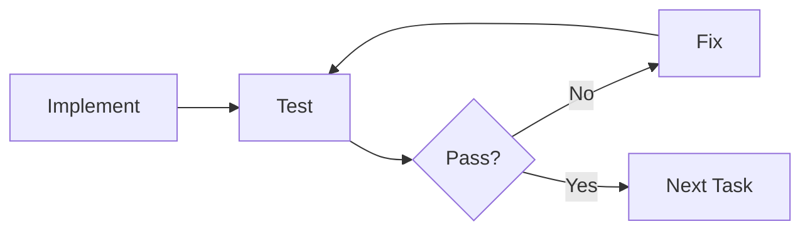

# Module 3 Review Quiz

**Module:** 3 - Core Workflow  
**Quiz:** Module 3 Assessment  
**Date:** November 29, 2025  
**Time:** 30-45 minutes  
**Passing Score:** 80% (24/30 questions)

---

## 📋 Instructions

This quiz tests your understanding of the Spec Kit core workflow:
- Constitution, Specify, Plan, Tasks, Implement
- When to use each phase
- How to write effective specs, plans, and tasks
- AI-assisted implementation

**Answer all questions honestly** – this helps identify areas for review.

---

## Section 1: Constitution (5 questions)

### Question 1
**What is the primary purpose of a project constitution?**

- [ ] A. To document completed features
- [ ] B. To define project-wide standards and principles that apply to all features
- [ ] C. To specify individual feature requirements
- [ ] D. To track bugs and issues

<details>
<summary>Answer</summary>

**B. To define project-wide standards and principles that apply to all features**

The constitution is like a country's constitution – it sets the foundational rules that everything else follows. It's written once and applies to the entire project.
</details>

---

### Question 2
**Which of the following should NOT be in a constitution?**

- [ ] A. Coding style guidelines (e.g., 2-space indentation)
- [ ] B. Architecture patterns (e.g., Repository pattern)
- [ ] C. Specific feature requirements (e.g., "Login must support email and password")
- [ ] D. Testing requirements (e.g., minimum 80% coverage)

<details>
<summary>Answer</summary>

**C. Specific feature requirements**

Specific feature requirements belong in the **Specification**, not the Constitution. The constitution defines HOW you build (standards, patterns), not WHAT you build (features).
</details>

---

### Question 3
**How often should you update the project constitution?**

- [ ] A. Daily, as you learn new things
- [ ] B. After every feature implementation
- [ ] C. Rarely – only when project-wide standards need to change
- [ ] D. Never – it should be immutable

<details>
<summary>Answer</summary>

**C. Rarely – only when project-wide standards need to change**

The constitution should be stable. Frequent changes create instability and confusion. Update it only when genuinely necessary (e.g., adopting new technology, major architecture shift).
</details>

---

### Question 4
**Which statement about constitutions is FALSE?**

- [ ] A. The constitution applies to all features in the project
- [ ] B. AI agents use the constitution to generate consistent code
- [ ] C. Each feature should have its own constitution
- [ ] D. The constitution should specify coding standards and patterns

<details>
<summary>Answer</summary>

**C. Each feature should have its own constitution**

FALSE! There is ONE constitution per project. Features have specifications (what to build), not constitutions.
</details>

---

### Question 5
**You're a solo developer. Do you still need a constitution?**

- [ ] A. No, constitutions are only for teams
- [ ] B. Yes, it helps maintain consistency and guides AI agents
- [ ] C. Only if the project is large
- [ ] D. Only if you plan to collaborate later

<details>
<summary>Answer</summary>

**B. Yes, it helps maintain consistency and guides AI agents**

Even solo developers benefit from constitutions because:
1. Your future self needs guidelines
2. AI agents need explicit standards to generate consistent code
3. It forces upfront thinking about standards
4. It serves as project documentation
</details>

---

## Section 2: Specification (6 questions)

### Question 6
**What does a specification define?**

- [ ] A. How to implement a feature technically
- [ ] B. What a feature should do and why it's needed
- [ ] C. The step-by-step implementation tasks
- [ ] D. The coding standards for the project

<details>
<summary>Answer</summary>

**B. What a feature should do and why it's needed**

The specification answers "WHAT" and "WHY" – requirements, user stories, acceptance criteria. It does NOT answer "HOW" (that's the Plan).
</details>

---

### Question 7
**Which is the correct format for a user story?**

- [ ] A. "Users need a login feature"
- [ ] B. "Implement authentication with JWT"
- [ ] C. "As a user, I want to log in, so that I can access my account"
- [ ] D. "Create login endpoint at POST /api/auth/login"

<details>
<summary>Answer</summary>

**C. "As a user, I want to log in, so that I can access my account"**

Correct format: **As a [role], I want to [capability], so that [benefit]**

A is too vague, B is implementation (belongs in Plan), D is technical detail (also Plan).
</details>

---

### Question 8
**Why should specifications avoid mentioning specific technologies (like "use Redux")?**

- [ ] A. Technology choices don't matter
- [ ] B. Specifications define WHAT to build, not HOW; technology is an implementation detail
- [ ] C. To keep specs short
- [ ] D. AI agents can't understand technology names

<details>
<summary>Answer</summary>

**B. Specifications define WHAT to build, not HOW; technology is an implementation detail**

Specs describe user needs and feature behavior. Technology choices belong in the **Plan**. This separation allows flexibility in implementation approaches.
</details>

---

### Question 9
**What format is recommended for acceptance criteria?**

- [ ] A. Bullet points
- [ ] B. Paragraphs of prose
- [ ] C. Given/When/Then scenarios
- [ ] D. Code examples

<details>
<summary>Answer</summary>

**C. Given/When/Then scenarios**

Given/When/Then format is:
- **Testable** (clear inputs and expected outputs)
- **Unambiguous** (everyone interprets the same way)
- **Comprehensive** (covers various scenarios)

Example: "Given I am logged in, When I click logout, Then I am redirected to the home page"
</details>

---

### Question 10
**During password reset, why show the same message whether an email exists or not?**

- [ ] A. To simplify implementation
- [ ] B. To prevent user enumeration attacks
- [ ] C. Because it's good UX
- [ ] D. It's faster

<details>
<summary>Answer</summary>

**B. To prevent user enumeration attacks**

If messages differed ("email not found" vs "reset sent"), attackers could test emails to build a list of valid accounts. Generic messages protect user privacy and security.
</details>

---

### Question 11
**Which should be included in a specification?**

- [ ] A. User stories and acceptance criteria
- [ ] B. Database schema and API endpoints
- [ ] C. Specific class names and method signatures
- [ ] D. All of the above

<details>
<summary>Answer</summary>

**A. User stories and acceptance criteria**

Specifications include:
- User stories (who, what, why)
- Requirements (functional and non-functional)
- Acceptance criteria (testable conditions)
- Edge cases and error scenarios

B and C are technical implementation details that belong in the **Plan**.
</details>

---

## Section 3: Plan (6 questions)

### Question 12
**What does a technical plan define?**

- [ ] A. What features users need
- [ ] B. How to implement features technically (architecture, components, APIs)
- [ ] C. Step-by-step implementation instructions
- [ ] D. Project-wide coding standards

<details>
<summary>Answer</summary>

**B. How to implement features technically (architecture, components, APIs)**

The plan translates requirements (from spec) into technical design:
- Architecture patterns
- Component structure
- Data models
- API design

A is Specification, C is Tasks, D is Constitution.
</details>

---

### Question 13
**Why separate business logic (AuthService) from database operations (UserRepository)?**

- [ ] A. To make the codebase larger
- [ ] B. To enable testing, flexibility, and single responsibility
- [ ] C. Because it's a best practice without real benefits
- [ ] D. To confuse junior developers

<details>
<summary>Answer</summary>

**B. To enable testing, flexibility, and single responsibility**

Separation provides:
1. **Testing** – Mock repository, test business logic without database
2. **Flexibility** – Swap databases without changing business logic
3. **Single Responsibility** – Each class has one clear job
4. **Reusability** – Repository can be used by multiple services

This is the **Repository Pattern**.
</details>

---

### Question 14
**What is dependency injection, and why use it?**

- [ ] A. Injecting SQL into database queries
- [ ] B. Passing dependencies to a class instead of creating them internally, enabling testing and flexibility
- [ ] C. A security vulnerability
- [ ] D. A way to avoid using imports

<details>
<summary>Answer</summary>

**B. Passing dependencies to a class instead of creating them internally**

**Without DI (bad):**
```typescript
class AuthService {
  private repo = new UserRepository(); // Hard-coded dependency
}
```

**With DI (good):**
```typescript
class AuthService {
  constructor(private repo: UserRepository) {} // Injected dependency
}
```

Benefits: Easy to test (pass mock), flexible (pass different implementations), loose coupling.
</details>

---

### Question 15
**Which belongs in a technical plan?**

- [ ] A. User story: "As a user, I want to log in"
- [ ] B. Architecture: "Use Repository pattern for data access"
- [ ] C. Task: "Create UserRepository.findByEmail() method"
- [ ] D. Standard: "Use 2-space indentation"

<details>
<summary>Answer</summary>

**B. Architecture: "Use Repository pattern for data access"**

Plans contain technical decisions:
- Architecture patterns
- Component design
- Data models
- API endpoints

A is Specification, C is Tasks, D is Constitution.
</details>

---

### Question 16
**When planning API endpoints, what should you specify?**

- [ ] A. Only the URL path
- [ ] B. Method, path, request body, response body, and error codes
- [ ] C. Just "create an API"
- [ ] D. The exact code implementation

<details>
<summary>Answer</summary>

**B. Method, path, request body, response body, and error codes**

Complete API specification:
```
POST /api/v1/auth/register
Request: { email, password }
Response 201: { success, data: { userId, email } }
Response 400: { success: false, error: { code, message } }
```

This gives AI agent clear contract to implement.
</details>

---

### Question 17
**You're halfway through implementation and realize the planned architecture won't work. What should you do?**

- [ ] A. Continue with original plan to save time
- [ ] B. Change implementation without updating plan
- [ ] C. Pause, update the plan, get review, then continue
- [ ] D. Start over from scratch

<details>
<summary>Answer</summary>

**C. Pause, update the plan, get review, then continue**

The plan is a **living document**. When you learn something new:
1. Pause implementation
2. Update plan (and spec if needed)
3. Get review/approval
4. Continue with updated approach

**Never** let implementation diverge from documentation!
</details>

---

## Section 4: Tasks (6 questions)

### Question 18
**What makes a task "atomic"?**

- [ ] A. It uses atomic operations
- [ ] B. It's small, independent, and completable in one sitting (30min-4hr)
- [ ] C. It involves atoms
- [ ] D. It can't be split further into subatomic particles

<details>
<summary>Answer</summary>

**B. It's small, independent, and completable in one sitting (30min-4hr)**

Atomic tasks are:
- **Small** – 30 minutes to 4 hours
- **Independent** – Minimal dependencies
- **Clear** – Specific outcome
- **Testable** – Know when done

Too small: "Import library" (5 min)
Too big: "Build authentication" (days)
Just right: "Implement AuthService.register() method" (2 hr)
</details>

---

### Question 19
**Which is a well-written task?**

- [ ] A. "Fix bugs"
- [ ] B. "Make it work"
- [ ] C. "Create UserRepository.findByEmail() method that queries database case-insensitively"
- [ ] D. "Do the backend"

<details>
<summary>Answer</summary>

**C. "Create UserRepository.findByEmail() method that queries database case-insensitively"**

Good task:
- **Action verb** (Create)
- **Specific** (which method, which class)
- **Context** (case-insensitive detail)
- **Sized right** (single method)

A, B, D are vague and too large.
</details>

---

### Question 20
**Why organize tasks into phases?**

- [ ] A. To make the list look organized
- [ ] B. To respect dependencies, group related work, and enable parallelization
- [ ] C. Because Spec Kit requires it
- [ ] D. To confuse team members

<details>
<summary>Answer</summary>

**B. To respect dependencies, group related work, and enable parallelization**

Phases help:
- **Dependencies** – Later phases depend on earlier ones
- **Context** – Focus on one layer at a time
- **Parallel work** – Tasks in same phase can run concurrently
- **Milestones** – Completing phase = visible progress

Example: Can't do Phase 3 (Services) before Phase 2 (Repositories).
</details>

---

### Question 21
**What should you include with each task?**

- [ ] A. Only the task description
- [ ] B. Description, file location, dependencies, and acceptance criteria
- [ ] C. Just a checkbox
- [ ] D. Complete implementation code

<details>
<summary>Answer</summary>

**B. Description, file location, dependencies, and acceptance criteria**

Complete task:
```markdown
- [ ] Create UserRepository.findByEmail() method
      File: src/repositories/user.repository.ts
      Dependencies: User model, Prisma client
      Acceptance: Finds users case-insensitively, returns null if not found
```

This gives implementer complete context.
</details>

---

### Question 22
**You're blocked on a task because a dependency isn't ready. What should you do?**

- [ ] A. Wait idle until dependency is ready
- [ ] B. Skip the task and hope it works out
- [ ] C. Work on an independent task or create a mock for testing
- [ ] D. Delete the task

<details>
<summary>Answer</summary>

**C. Work on an independent task or create a mock for testing**

Options when blocked:
1. **Switch tasks** – Work on independent task in different phase
2. **Create mock** – Mock the dependency for testing purposes
3. **Communicate** – Ask about dependency timeline

**Don't** sit idle or skip important work!
</details>

---

### Question 23
**How do you know when a task is complete?**

- [ ] A. When you feel like it's done
- [ ] B. When the acceptance criteria are met and tests pass
- [ ] C. When you run out of time
- [ ] D. When your manager tells you

<details>
<summary>Answer</summary>

**B. When the acceptance criteria are met and tests pass**

**Definition of Done:**
- ✓ Acceptance criteria met
- ✓ Tests written and passing
- ✓ Code reviewed
- ✓ No console errors
- ✓ Follows standards (constitution)

Then you can check off the task!
</details>

---

## Section 5: Implementation (7 questions)

### Question 24
**What does the `/implement` command do?**

- [ ] A. Automatically deploys your code
- [ ] B. Directs AI agent to generate code based on constitution, plan, spec, and task
- [ ] C. Fixes all bugs
- [ ] D. Writes documentation

<details>
<summary>Answer</summary>

**B. Directs AI agent to generate code based on constitution, plan, spec, and task**

The `/implement` command:
1. Reads context (constitution, spec, plan)
2. Understands the task requirements
3. Generates code following standards
4. Explains what it created

You then review, test, and iterate if needed.
</details>

---

### Question 25
**When reviewing AI-generated code, what should you check for?**

- [ ] A. Only syntax errors
- [ ] B. Correctness, quality, security, edge cases, and alignment with plan
- [ ] C. Nothing – AI is always perfect
- [ ] D. Just run it and hope for the best

<details>
<summary>Answer</summary>

**B. Correctness, quality, security, edge cases, and alignment with plan**

**Review checklist:**
- ✓ Implements requirement fully
- ✓ Follows constitution standards
- ✓ Matches plan architecture
- ✓ Handles edge cases
- ✓ No security vulnerabilities
- ✓ Proper error handling
- ✓ Tests included/mentioned

AI is powerful but not infallible – human review is essential!
</details>

---

### Question 26
**The AI generated working code, but it doesn't follow the repository pattern specified in your plan. What should you do?**

- [ ] A. Accept it because it works
- [ ] B. Update the plan to match the code
- [ ] C. Ask the AI to refactor following the planned pattern
- [ ] D. Ignore it

<details>
<summary>Answer</summary>

**C. Ask the AI to refactor following the planned pattern**

Example:
```
You: This works, but it doesn't use the Repository pattern from our plan.
     Can you refactor to separate data access into UserRepository?

AI: You're right! Let me refactor...
```

**Don't settle for "it works"** – maintain architectural consistency!
</details>

---

### Question 27
**What's the recommended implementation order?**

- [ ] A. Random – doesn't matter
- [ ] B. Top-down: UI → Controllers → Services → Database
- [ ] C. Bottom-up: Database → Repositories → Services → Controllers → UI
- [ ] D. All at once

<details>
<summary>Answer</summary>

**C. Bottom-up: Database → Repositories → Services → Controllers → UI**

**Why?** Each layer depends on the one below:
- Controllers need Services
- Services need Repositories
- Repositories need Models/Database

By building bottom-up, you can test each layer independently before adding the next.

(Top-down is also valid if you stub lower layers, but bottom-up is more common.)
</details>

---

### Question 28
**How often should you test during implementation?**

- [ ] A. Only at the very end
- [ ] B. After each task or small group of related tasks
- [ ] C. Never – testing is optional
- [ ] D. Once a month

<details>
<summary>Answer</summary>

**B. After each task or small group of related tasks**

**Test as you go:**


Benefits:
- Catch bugs early (cheaper to fix)
- Verify each piece works
- Build confidence
- Don't accumulate untested code

**Don't wait until the end!**
</details>

---

### Question 29
**Which is the best prompt for `/implement`?**

- [ ] A. "Build authentication"
- [ ] B. "Do the thing"
- [ ] C. "Create AuthService.register() method that validates email uniqueness, hashes password with bcrypt, creates user, sends verification email"
- [ ] D. "Make it work"

<details>
<summary>Answer</summary>

**C. Detailed, specific prompt with context**

Good prompts:
- **Specific** – Which file, method, component
- **Context** – Reference plan, spec
- **Requirements** – What it must do
- **Details** – Important implementation notes

A is too vague, B and D are useless.
</details>

---

### Question 30
**After implementing and testing a task, what should you do?**

- [ ] A. Immediately start the next task
- [ ] B. Commit the changes with a clear message, then update the task list
- [ ] C. Delete the task from the list
- [ ] D. Post on social media

<details>
<summary>Answer</summary>

**B. Commit the changes with a clear message, then update the task list**

**Process:**
1. ✓ Task implemented
2. ✓ Tests passing
3. → Commit code: `git commit -m "feat(auth): implement user registration"`
4. → Update tasks: `- [x] Create AuthService.register() method ✓`
5. → Proceed to next task

Good commit messages help future you understand what was done and why.
</details>

---

## 🎯 Quiz Complete!

### Scoring

**Count your correct answers:**

- **27-30 (90-100%):** 🌟 **Excellent!** You have mastery of the Spec Kit workflow
- **24-26 (80-89%):** ✅ **Pass!** You understand the core concepts
- **20-23 (67-79%):** ⚠️ **Review Needed** – Revisit lessons, especially weak areas
- **< 20 (< 67%):** 📚 **More Study Needed** – Re-read Module 3 lessons

### Your Score: ____ / 30 (____%)

---

## 📊 Section Breakdown

Review sections where you scored < 80%:

- **Section 1 (Constitution):** ____ / 5
- **Section 2 (Specification):** ____ / 6
- **Section 3 (Plan):** ____ / 6
- **Section 4 (Tasks):** ____ / 6
- **Section 5 (Implementation):** ____ / 7

---

## 🎓 Areas for Review

Based on your answers, consider reviewing:

**If weak in Section 1:** Re-read [Lesson 7: Constitution](./Lesson-07-Constitution-Setting-Project-Principles.md)

**If weak in Section 2:** Re-read [Lesson 8: Specify](./Lesson-08-Specify-Defining-Requirements.md)

**If weak in Section 3:** Re-read [Lesson 9: Plan](./Lesson-09-Plan-Technical-Implementation.md)

**If weak in Section 4:** Re-read [Lesson 10: Tasks](./Lesson-10-Tasks-Breaking-Down-Work.md)

**If weak in Section 5:** Re-read [Lesson 11: Implement](./Lesson-11-Implement-Building-the-Feature.md)

---

## ✅ What's Next?

**If you passed (≥ 80%):**
🎉 Congratulations! You've completed Module 3.

Ready to move to **Module 4: Advanced Topics**?

**If you need review (< 80%):**
📚 Revisit the lessons for your weak sections, then retake the quiz.

---

## 💡 Reflection Questions

**Before moving on, reflect:**

1. Which phase (Constitution/Specify/Plan/Tasks/Implement) do you find most challenging?
2. What aspect of the workflow are you most excited to practice?
3. Do you have a real feature you want to implement using this workflow?

**Write your thoughts:**
```
1. Most challenging: 

2. Most excited about: 

3. Feature to implement: 

```

---

## 🏆 Certificate of Completion

If you scored ≥ 80%, you can generate a certificate:

```markdown
# Certificate of Completion

This certifies that **[Your Name]** has successfully completed
**Module 3: Core Workflow** of the Spec Kit Course.

Topics Mastered:
✓ Constitution - Project Principles
✓ Specification - Requirements Definition
✓ Plan - Technical Implementation Design
✓ Tasks - Work Breakdown
✓ Implement - AI-Assisted Development

Score: ____/30 (___%)
Date: November 29, 2025

Ready for Module 4: Advanced Topics
```

---

**Congratulations on completing Module 3! 🎉**

*Back to: [Module 3 Overview](./Lesson-06-Understanding-the-Workflow.md)*  
*Next: Module 4 - Advanced Topics (Coming Soon)*
