# Lesson 16: Advanced Workflow Integration

**Module:** 4 - Advanced Techniques  
**Lesson:** 16 of 25  
**Date:** November 29, 2025

---

## 📖 Concept: Orchestrating Advanced Commands

You've learned individual advanced commands: `/clarify`, `/analyze`, and `/checklist`. Now let's integrate them into a seamless, professional workflow that ensures quality at every step.


---

## 🎯 The Integrated Workflow

### Phase 1: Specification (with Quality Gates)

```mermaid
sequenceDiagram
    participant Dev as Developer
    participant AI as AI Agent
    participant Spec as Specification
    participant Check as Checklist
    
    Dev->>AI: /specify "Add user profile editing"
    AI->>Spec: Generate initial spec
    AI-->>Dev: Draft created
    
    Dev->>AI: /checklist specification
    AI->>Check: Run spec quality checklist
    Check-->>Dev: ⚠ Missing error scenarios
    
    Dev->>AI: /clarify error scenarios
    AI->>Spec: Update with error handling
    AI-->>Dev: Updated spec
    
    Dev->>AI: /checklist specification
    AI->>Check: Re-run checklist
    Check-->>Dev: ✓ All checks pass
    
    Dev->>AI: Continue to planning
```



**Timeline: 2-3 hours**

### Phase 2: Planning (with Validation)

```mermaid
sequenceDiagram
    participant Dev as Developer
    participant AI as AI Agent
    participant Plan as Plan
    participant Spec as Specification
    
    Dev->>AI: /plan
    AI->>Spec: Read requirements
    AI->>Plan: Generate technical design
    AI-->>Dev: Plan created
    
    Dev->>AI: /analyze spec vs plan
    AI-->>Dev: ⚠ Spec requires caching, plan doesn't mention it
    
    Dev->>AI: /clarify caching strategy
    AI->>Plan: Update with Redis caching
    AI-->>Dev: Plan updated
    
    Dev->>AI: /checklist plan
    AI-->>Dev: ✓ All architectural decisions documented
    
    Dev->>AI: Continue to tasks
```



**Timeline: 2-3 hours**

### Phase 3: Implementation (with Continuous Validation)

```mermaid
sequenceDiagram
    participant Dev as Developer
    participant AI as AI Agent
    participant Code as Code
    participant Tests as Tests
    
    loop Each Task
        Dev->>AI: /implement task
        AI->>Code: Generate code
        AI->>Tests: Generate tests
        AI-->>Dev: Implementation complete
        
        Dev->>AI: /checklist implementation
        AI-->>Dev: ⚠ Missing error handling in saveProfile()
        
        Dev->>AI: Add try-catch to saveProfile()
        AI->>Code: Update code
        AI-->>Dev: Fixed
        
        Dev->>AI: /analyze implementation vs plan
        AI-->>Dev: ✓ Architecture matches plan
    end
```



**Timeline: 4-8 hours (depends on feature complexity)**

### Phase 4: Review (with Final Validation)


**Timeline: 1-2 hours**

---

## 🎓 Real-World Example: Complete Feature

Let's implement "Password Change" feature with full integration.

### Step 1: Initial Specification

```
You: /specify

I want users to be able to change their password from their profile page.

AI: I'll create a detailed specification...
```

**Generated:** `.features/password-change/spec.md`

### Step 2: Quality Check Specification

```
You: /checklist specification

AI: Running specification quality checklist...

[Completeness: 6/8]
✓ Problem statement
✓ User stories
✓ Functional requirements
✓ Acceptance criteria
✓ Success metrics
✗ Error scenarios missing
✗ Security requirements not detailed
✓ Non-functional requirements

[Issues found:]
1. Missing: What happens if old password is wrong?
2. Missing: Rate limiting on password change attempts?
3. Missing: Notification when password is changed?
4. Unclear: Password validation rules (reference to another doc?)

Recommendation: Use /clarify to address these issues
```

### Step 3: Clarify Missing Details

```
You: /clarify

Address the issues found in the checklist:
1. Error handling for wrong old password
2. Rate limiting strategy
3. Notification system
4. Password validation rules

AI: I'll update the specification with these clarifications...

## Error Handling (Added)
- Wrong old password: "Current password is incorrect" (401)
- Rate limiting: Max 5 attempts per hour per user
- On successful change: Send email to registered address
- On rate limit: "Too many attempts. Try again in {minutes}"

## Security Requirements (Expanded)
Password must meet criteria:
- Minimum 8 characters
- At least one uppercase letter
- At least one lowercase letter
- At least one digit
- At least one special character (!@#$%^&*)
- Cannot be same as current password
- Cannot be one of last 5 passwords

## Notifications
- Email sent to registered address immediately
- Email includes: timestamp, device info, location (if available)
- Email has "I didn't do this" link for account security

Updated specification saved.
```

### Step 4: Verify Specification

```
You: /checklist specification

AI: Re-running checklist...

[Completeness: 8/8] ✓
[Clarity: 4/4] ✓
[Testability: 8/8] ✓
[Security: 6/6] ✓

✓ Specification ready for planning
```

### Step 5: Generate Plan

```
You: /plan

AI: Creating technical plan based on specification...
```

**Generated:** `.features/password-change/plan.md`

### Step 6: Validate Plan Against Spec

```
You: /analyze specification vs plan

AI: Analyzing alignment...

✓ All functional requirements addressed
✓ Error scenarios have implementation strategy
✓ Security requirements incorporated
✓ Rate limiting strategy defined (Redis-based)
✓ Email notification service integration specified

No conflicts found. Plan aligns with specification.
```

### Step 7: Plan Quality Check

```
You: /checklist plan

AI: Running plan quality checklist...

[Architecture: 5/5] ✓
[Data Design: 4/4] ✓
[API Design: 5/5] ✓
[Security: 6/6] ✓
[Risk Assessment: 3/4] ⚠

Issue: No fallback strategy if email service is down

Would you like to address this?
```

### Step 8: Clarify Email Fallback

```
You: /clarify

What should happen if email service is unavailable?

AI: Recommendation: Queue-based approach with retry

## Email Service Fallback (Added to Plan)

**Normal flow:**
1. Password changed successfully
2. Push to email queue (RabbitMQ)
3. Email worker sends notification

**If email service down:**
1. Password change still succeeds (critical path)
2. Email queued with retry metadata
3. Worker retries with exponential backoff (1min, 5min, 15min)
4. After 3 failures, log error and alert ops team
5. User sees success (password was changed)
6. Email sent when service recovers

Principle: Don't block user action because of notification failure

Updated plan saved.
```

### Step 9: Generate Tasks

```
You: /tasks

AI: Creating implementation tasks from plan...
```

**Generated:** `.features/password-change/tasks.md` (18 tasks across 5 phases)

### Step 10: Implement with Continuous Checking

```
You: /implement "Create PasswordService.changePassword() method"

AI: Implementing...
```

**After each task:**

```
You: /checklist implementation

AI: 
✓ Follows constitution patterns
✓ Error handling present
✓ Unit tests included
⚠ Integration test needed

Continue to next task or address warning?
```

### Step 11: Comprehensive Analysis

```
You: /analyze complete feature

AI: Analyzing password-change feature...

[Vertical Consistency]
✓ Spec → Plan: All requirements planned
✓ Plan → Tasks: All components have tasks
✓ Tasks → Code: 17/18 tasks completed (1 in progress)

[Horizontal Consistency]
✓ Similar patterns to authentication feature
✓ Uses same PasswordHashingService
✓ Follows Repository pattern like other features

[Constitution Compliance]
✓ Coding standards met
✓ Security requirements satisfied
⚠ Test coverage: 78% (target: 80%)
✓ Error handling comprehensive

[Quality]
✓ Edge cases handled
✓ Rate limiting implemented
✓ Notifications working
⚠ Load testing not performed

Overall: Feature is 95% complete, minor items remaining
```

### Step 12: Final Review Checklist

```
You: /checklist review

AI: Running comprehensive review checklist...

[Code Quality: 12/12] ✓
[Testing: 7/8] ⚠ - Integration test for rate limiting needed
[Documentation: 6/6] ✓
[Security: 8/8] ✓
[Performance: 4/5] ⚠ - Load test recommended

Score: 37/39 (95%)

Ready for code review with minor recommendations
```

### Step 13: Address Final Items

```
You: /implement integration test for rate limiting

AI: Creating test...

You: /checklist review

AI: Re-running...

[All Checks: 39/39] ✓ 

✓ Ready for production deployment
```

---

## 💡 Integration Patterns

### Pattern 1: Quality Gates

**Concept:** Don't proceed to next phase until current phase passes quality checks


**Benefits:**
- Catch issues early (cheaper to fix)
- Ensure quality at each phase
- Reduce rework later
- Build confidence incrementally

### Pattern 2: Continuous Validation

**Concept:** Validate after every significant change

```typescript
// Workflow with validation
async function developFeature() {
  await specify();
  await validate(); // ← Check 1
  
  await plan();
  await validate(); // ← Check 2
  
  for (const task of tasks) {
    await implement(task);
    await validate(); // ← Check after each task
  }
  
  await finalReview();
  await validate(); // ← Final check
}
```

### Pattern 3: Iterative Refinement

**Concept:** Use analysis results to improve artifacts


**Example:**
```
Iteration 1: Spec → Analyze → Issues found → Clarify → Updated spec
Iteration 2: Spec → Analyze → No issues → Proceed to Plan
```

### Pattern 4: Cross-Cutting Concerns

**Concept:** Handle concerns that affect multiple artifacts

```markdown
## Security Concern Identified

During /analyze:
- Authentication spec lacks rate limiting
- Profile spec lacks input validation
- Payment spec missing fraud detection

Action:
1. Add to Constitution (project-wide security standards)
2. Update all affected specs
3. Regenerate affected plans
4. Add to all relevant checklists
```

---

## 🤔 Socratic Questions

### Question 1
**You're in the middle of implementation when `/analyze` finds a spec-plan conflict. Should you:**
- A) Ignore it and continue (you're almost done)
- B) Stop, fix the conflict, then resume
- C) Note it down, finish feature, fix later

<details>
<summary>Think about technical debt...</summary>

**Answer: B) Stop, fix the conflict, then resume**

**Why:**

1. **Conflicts compound:**
   - Code now doesn't match plan OR spec
   - Future changes become confusing
   - Documentation becomes untrustworthy

2. **Easier now than later:**
   - Context is fresh in your mind
   - Haven't built on top of inconsistency
   - Limited blast radius

3. **Quality mindset:**
   - "Almost done" is when bugs hide
   - Taking shortcut now = technical debt
   - Professional development means doing it right

**Process:**
```
1. Stop implementation (commit current work)
2. Analyze conflict (spec says X, plan says Y, code does Z)
3. Determine correct approach (clarify with stakeholders if needed)
4. Update all affected artifacts (spec, plan, tasks)
5. Resume implementation with aligned understanding
```

**Analogy:**
> You're building a house and realize the blueprint shows a door where you're building a window. Do you finish the window and fix it later? No! Stop, clarify the design, then continue correctly.

**Only exception:** Conflict is in completely unrelated part of feature (rare)
</details>

---

### Question 2
**Your checklist keeps failing on "test coverage > 80%" but you feel your tests are comprehensive. What should you do?**

<details>
<summary>Consider measurement vs intention...</summary>

**Options:**

**A) Lower the threshold** (80% → 70%)
- When: Threshold is unrealistic for your project type
- Example: Heavy UI code that's hard to unit test
- Make sure constitution reflects new reality

**B) Improve test coverage**
- When: Gap is in testable business logic
- Add tests for uncovered branches
- Focus on high-value areas first

**C) Exclude certain files**
- When: Coverage includes generated code, config files, etc.
- Update coverage config: `exclude: ['*.config.ts', 'generated/**']`

**D) Challenge the metric**
- When: Tests are comprehensive but metric says otherwise
- Maybe need integration tests, not just unit tests
- Coverage percentage doesn't measure test quality

**Best practice:**

1. **Analyze what's not covered:**
   ```
   You: Why is coverage only 75%?
   
   AI: Running coverage analysis...
   
   Uncovered lines:
   - UserService.ts: Lines 45-67 (error handling edge cases)
   - PaymentService.ts: Lines 120-135 (retry logic)
   - ConfigLoader.ts: Lines 10-50 (generated code)
   ```

2. **Decide strategy:**
   ```markdown
   - UserService errors: Add tests (these matter!)
   - PaymentService retry: Add tests (critical!)
   - ConfigLoader: Exclude from coverage (generated code)
   ```

3. **Update both code and standards:**
   ```markdown
   ## Constitution Update
   
   Test Coverage: 80% minimum
   
   Excluded from coverage:
   - *.config.ts
   - generated/**
   - **/*.d.ts
   
   Priority: Cover all business logic and error paths
   ```

**Remember:** Coverage percentage is a proxy for quality, not quality itself. Good tests matter more than hitting a number.
</details>

---

### Question 3
**Using `/clarify`, `/analyze`, and `/checklist` adds significant time. Is it worth it for small bug fixes?**

<details>
<summary>Think about appropriate rigor...</summary>

**Answer: Scale your process to the change.**

### Workflow Scaling


**Typo fix / Obvious bug (5 min change):**
```
1. Fix the issue
2. Quick manual test
3. Commit
4. Done

No spec, plan, or checklist needed
```

**Small bug fix (30 min - 2 hours):**
```
1. Understand bug (maybe /analyze to find cause)
2. Fix the issue
3. Add test to prevent regression
4. Quick /checklist implementation
5. Commit
```

**Feature enhancement (4-8 hours):**
```
1. Update spec with new requirements
2. /clarify any ambiguities
3. Update plan if architecture changes
4. Implement with /checklist after each major task
5. /analyze before review
```

**New feature (days/weeks):**
```
Full workflow:
- Spec → Checklist → Clarify
- Plan → Checklist → Analyze
- Tasks → Implement → Checklist → Analyze
- Review → Checklist
```

### Decision Matrix

| Change Type | Spec? | Plan? | Clarify? | Analyze? | Checklist? |
|-------------|-------|-------|----------|----------|------------|
| Typo | No | No | No | No | No |
| Small Bug | Maybe | No | If needed | If complex | Basic |
| Enhancement | Update | Update | Yes | Yes | Yes |
| New Feature | Yes | Yes | Yes | Yes | Yes |

### Key Principle

**Use the minimum viable process that maintains quality.**

**Too little process:** Bugs, inconsistency, technical debt
**Too much process:** Slow, bureaucratic, diminishing returns
**Right process:** Fast with high quality

**How to decide:**
```
Ask yourself:
1. Could this break something else? (If yes → more rigor)
2. Is there ambiguity in requirements? (If yes → clarify)
3. Does it affect architecture? (If yes → analyze)
4. Is it user-facing? (If yes → checklist)
5. Is it security-critical? (If yes → full process)
```

**Don't treat all work the same!** A typo fix doesn't need the same rigor as payment processing.
</details>

---

## ✅ Integration Workflow Checklist

**Pre-Development:**
- [ ] Constitution exists and is current
- [ ] Team understands advanced commands
- [ ] Checklists are defined and accessible
- [ ] Quality standards are agreed upon

**Per Feature:**
- [ ] Specification validated with `/checklist`
- [ ] Ambiguities resolved with `/clarify`
- [ ] Plan validated and aligned with spec
- [ ] Tasks generated and verified
- [ ] Implementation uses continuous validation
- [ ] Cross-artifact analysis performed
- [ ] Final review checklist completed

**Post-Development:**
- [ ] Lessons learned captured
- [ ] Checklists updated if needed
- [ ] Common patterns promoted to constitution
- [ ] Metrics reviewed (time, quality, issues)

---

## 🎯 Summary

**Advanced workflow integration means:**
- Using quality gates between phases
- Continuous validation during development
- Iterative refinement based on analysis
- Appropriate process for change size
- Systematic rather than ad-hoc quality assurance

**Key commands:**
- `/clarify` → Resolve ambiguities
- `/analyze` → Validate consistency
- `/checklist` → Verify quality

**Best practices:**
- Don't skip quality gates under pressure
- Scale process to change size
- Fix conflicts immediately
- Update artifacts when you learn
- Balance thoroughness with pragmatism

---

## 📚 What's Next?

You've completed Module 4! You now understand advanced techniques for maintaining quality throughout the development lifecycle.

**Next:** [Module 4 Review Quiz](./Module-04-Review-Quiz.md)

Then we move to **Module 5: Development Phases** covering different types of development scenarios.

---

*Previous: [Lesson 15: Checklist - Quality Assurance](./Lesson-15-Checklist-Quality-Assurance.md)*  
*Next: [Module 4 Review Quiz](./Module-04-Review-Quiz.md)*
