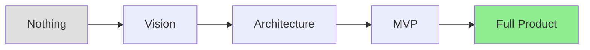
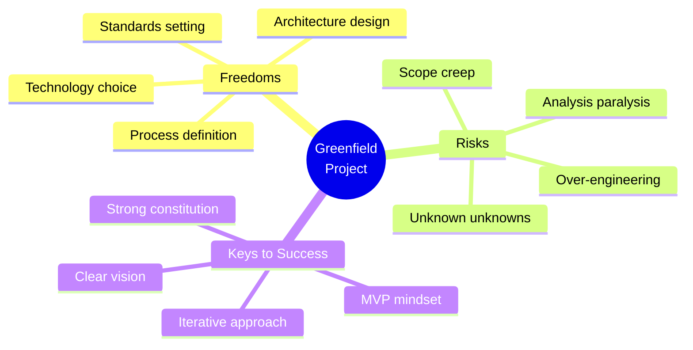
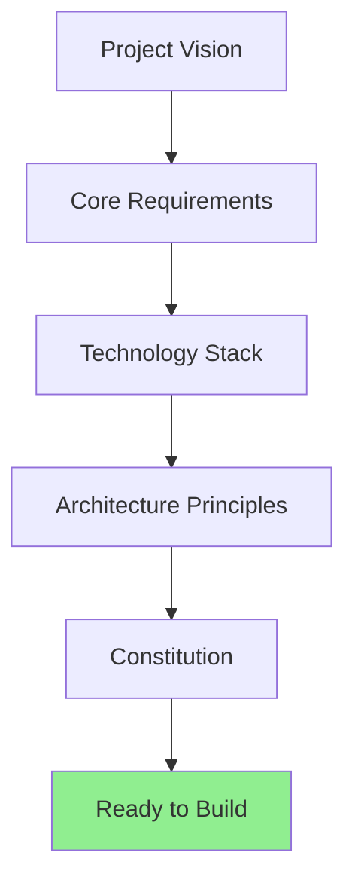
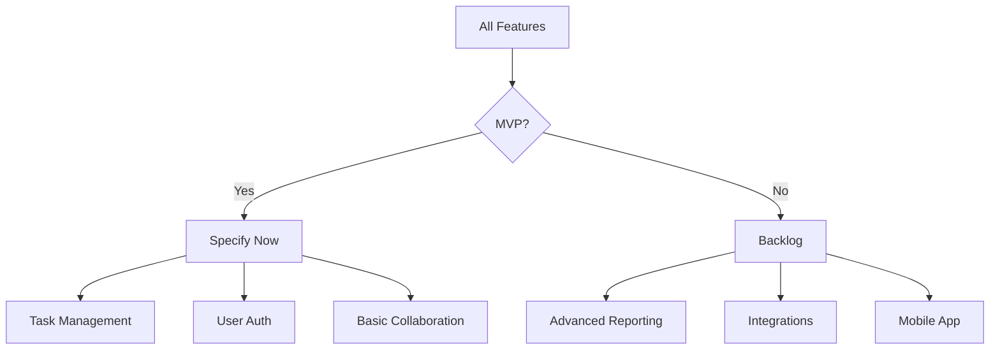
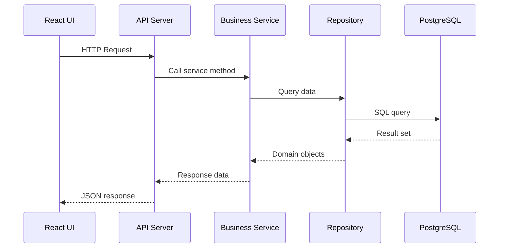
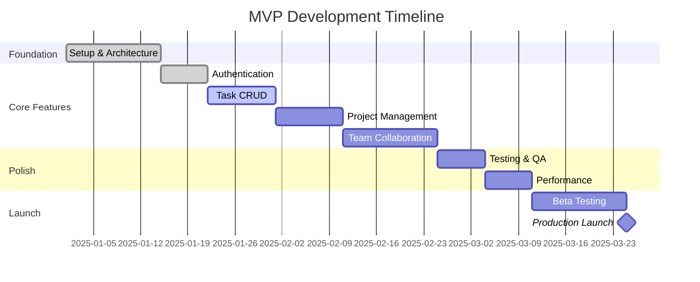

# Lesson 17: 0-to-1 Development (Greenfield)

**Module:** 5 - Development Phases  
**Lesson:** 17 of 25  
**Date:** November 29, 2025

---

## 📖 Concept: Building from Scratch

**0-to-1 development** (greenfield) means creating something entirely new – no existing codebase, no legacy constraints, just pure creation. This is both liberating and daunting.



---

## 🎯 Greenfield Characteristics

### The Blank Canvas

**Advantages:**
- ✅ No legacy constraints
- ✅ Choose modern technologies
- ✅ Design architecture optimally
- ✅ Establish best practices from day one
- ✅ No technical debt

**Challenges:**
- ⚠️ Everything must be decided
- ⚠️ No existing patterns to follow
- ⚠️ Higher initial uncertainty
- ⚠️ Many unknowns
- ⚠️ Easy to over-engineer



---

## 💡 Real-World Analogy

**Greenfield development** is like:
> **Building a city from scratch** on empty land (like Dubai or Brasília). You can plan the perfect street layout, modern infrastructure, and ideal zoning. But you must make countless decisions, and mistakes are expensive to fix later.

**Brownfield** would be:
> **Renovating an existing city** (like London or Rome). You work within existing constraints, but have proven patterns to follow.

---

## 🏗️ Greenfield Workflow with Spec Kit

### Phase 1: Vision & Constitution (Week 1)

**Goal:** Establish project foundation



**Activities:**

**1. Define Vision**
```markdown
# Project Vision: TaskMaster Pro

## Problem
Teams struggle with task management across projects, leading to 
missed deadlines and poor coordination.

## Solution
Unified task management platform with real-time collaboration, 
intelligent prioritization, and seamless integrations.

## Success Metrics
- 10,000 active users in 6 months
- 80% weekly retention
- < 2 second load times
- 99.9% uptime
```

**2. Create Constitution**
```
You: /constitution

AI: Let's establish your project standards...

Technology Stack:
- Frontend: React + TypeScript + TailwindCSS
- Backend: Node.js + Express + PostgreSQL
- Testing: Jest + Playwright
- Deployment: Docker + AWS

Architecture:
- Clean Architecture (domain-driven)
- Repository pattern for data access
- RESTful API design
- JWT authentication

Standards:
- TypeScript strict mode
- 80%+ test coverage
- ESLint + Prettier
- Conventional commits

[Generated: .specrc/constitution.md]
```

### Phase 2: Core Features Specification (Week 1-2)

**Start with MVP features**



**Example: Specify Auth First**

```
You: /specify

Feature: User Authentication

Users need to register, login, and manage their accounts securely.

AI: I'll create a comprehensive authentication specification...

[Generated: .features/authentication/spec.md]
- Email/password registration
- Email verification
- Login with JWT
- Password reset
- Account security
```

### Phase 3: System Architecture (Week 2)

**Design high-level system before individual features**

```
You: /plan system-architecture

Create overall system architecture before implementing individual features.

AI: I'll design the complete system architecture...
```

**Generated Architecture:**

```markdown
# System Architecture

## Layers

### Presentation Layer (React)
- Pages (routes)
- Components (UI)
- State Management (Redux Toolkit)

### API Layer (Express)
- Controllers (request handling)
- Middleware (auth, validation, errors)
- Routes (endpoint definitions)

### Business Logic Layer
- Services (business rules)
- Domain Models (entities)
- Use Cases (operations)

### Data Access Layer
- Repositories (data operations)
- Migrations (schema changes)
- Seeders (initial data)

## Data Flow



## Folder Structure

```
taskmaster-pro/
├── frontend/
│   ├── src/
│   │   ├── pages/
│   │   ├── components/
│   │   ├── services/
│   │   ├── store/
│   │   └── utils/
│   └── tests/
├── backend/
│   ├── src/
│   │   ├── controllers/
│   │   ├── services/
│   │   ├── repositories/
│   │   ├── models/
│   │   ├── middleware/
│   │   └── utils/
│   └── tests/
└── .specrc/
    └── constitution.md
```

### Phase 4: Feature-by-Feature Implementation (Week 3-12)

**Build one complete feature at a time**



**For each feature:**

1. `/specify` → Define requirements
2. `/plan` → Design implementation  
3. `/tasks` → Break down work
4. `/implement` → Build it
5. `/analyze` → Validate consistency
6. `/checklist` → Verify quality
7. **Test & review** → Ensure it works
8. **Deploy to staging** → Validate in environment
9. **Next feature** → Repeat

---

## 🎓 Greenfield Best Practices

### 1. Start with Strong Constitution

**Why:** Decisions made early become defaults forever

```markdown
## Constitution Quality Checklist

- [ ] Technology stack justified (not just "latest hype")
- [ ] Architecture pattern chosen (not ad-hoc)
- [ ] Code style defined (not "whatever")
- [ ] Testing strategy specified (not "test later")
- [ ] Security standards documented
- [ ] Performance targets set
- [ ] Deployment strategy outlined
```

### 2. Build Vertically (Full Slices)

**Bad approach (horizontal layers):**
```
Week 1: Build all database models
Week 2: Build all repositories
Week 3: Build all services
Week 4: Build all controllers
Week 5: Build all UI components
Week 6: Integrate everything (PAIN!)
```

**Good approach (vertical slices):**
```
Week 1: Authentication (DB → API → UI) ✓ Working!
Week 2: Tasks (DB → API → UI) ✓ Working!
Week 3: Projects (DB → API → UI) ✓ Working!
...
```

**Benefits:**
- See progress early
- Test integration continuously
- Adjust architecture as you learn
- Deliver value incrementally

### 3. Embrace MVP Mindset

**MVP is not:**
- ❌ Half-baked everything
- ❌ Buggy implementation
- ❌ Ugly UI

**MVP is:**
- ✅ **Minimum:** Smallest feature set that delivers value
- ✅ **Viable:** Works reliably for core use cases
- ✅ **Product:** Real users can use it

**Example: Task Management MVP**

```markdown
## IN SCOPE (MVP)
✓ Create/edit/delete tasks
✓ Assign tasks to users
✓ Mark tasks complete
✓ Basic task list view
✓ User authentication

## OUT OF SCOPE (Post-MVP)
✗ Subtasks
✗ Task templates
✗ Advanced filtering
✗ Calendar view
✗ Email notifications
✗ Mobile app
✗ Integrations (Slack, Jira, etc.)
✗ Reporting/analytics
```

### 4. Make Decisions, Document Rationale

**Decision Log Example:**

```markdown
# Architecture Decision Record (ADR)

## ADR-001: Use PostgreSQL as Primary Database

**Date:** 2025-01-05
**Status:** Accepted

**Context:**
Need to choose database for task management system.
Requirements: ACID transactions, complex queries, relationships.

**Options Considered:**
1. PostgreSQL (relational)
2. MongoDB (document)
3. MySQL (relational)

**Decision:** PostgreSQL

**Rationale:**
- Need strong relational support (users, projects, tasks)
- JSONB for flexible metadata
- Excellent full-text search
- Team has PostgreSQL expertise
- Better for analytics (planned feature)

**Consequences:**
+ Strong consistency guarantees
+ Rich query capabilities
- Harder to scale horizontally (if needed later)
- More rigid schema (but good for our domain)
```

### 5. Iterate Within MVP Scope

**Don't gold-plate MVP features**

```
Iteration 1: Basic task list (2 days)
  ✓ Display tasks
  ✓ Create new task
  
Iteration 2: Core functionality (3 days)
  ✓ Edit tasks
  ✓ Delete tasks
  ✓ Mark complete
  
Iteration 3: Polish (2 days)
  ✓ Loading states
  ✓ Error handling
  ✓ Keyboard shortcuts
  
✗ DON'T add: Drag-and-drop, bulk actions, advanced sorting
   (Those are post-MVP)
```

---

## 💡 Exercise: Plan a Greenfield Project

**Scenario:** You're building "FitTrack" – a fitness tracking app

**Your MVP Plan:**

```markdown
## 1. Project Vision

Problem:


Solution:


Success Metrics:


## 2. Core Requirements (MVP Only)

Feature 1:

Feature 2:

Feature 3:


## 3. Technology Stack

Frontend:

Backend:

Database:

Why these choices:


## 4. Architecture Pattern

Pattern:

Why:


## 5. Development Timeline

Week 1-2:

Week 3-4:

Week 5-6:

Week 7-8:


## 6. Out of Scope (Post-MVP)

-
-
-
```

<details>
<summary>Sample Answer</summary>

```markdown
## 1. Project Vision

**Problem:** People struggle to consistently track workouts and see progress over time.

**Solution:** Simple, fast workout logging with progress visualization and habit building.

**Success Metrics:**
- 1,000 active users in 3 months
- 60%+ weekly retention
- Average 3 workouts logged per user per week

## 2. Core Requirements (MVP Only)

**Feature 1:** Workout Logging
- Log exercises (name, sets, reps, weight)
- Timestamp each workout
- Basic exercise library

**Feature 2:** Progress Tracking
- View workout history
- Simple charts (weight progression over time)
- Personal records (PRs)

**Feature 3:** User Accounts
- Registration/login
- Profile (name, goals)
- Secure data storage

## 3. Technology Stack

**Frontend:** React Native (iOS + Android with one codebase)
**Backend:** Node.js + Express (fast development)
**Database:** PostgreSQL (relational workout data)

**Why:**
- React Native = MVP covers both platforms
- Node.js = Fast to build, huge ecosystem
- PostgreSQL = Strong data relationships, good for time-series

## 4. Architecture Pattern

**Pattern:** Clean Architecture with Repository pattern

**Why:**
- Separate business logic from UI (easier to test)
- Repository pattern = can swap data sources later
- Clear separation = easier for team to work in parallel

## 5. Development Timeline

**Week 1-2: Foundation**
- Setup project structure
- Authentication (register/login)
- Basic database schema

**Week 3-4: Core Logging**
- Exercise library
- Workout logging form
- Workout history view

**Week 5-6: Progress Tracking**
- Progress charts
- Personal records
- Basic stats

**Week 7-8: Polish & Launch**
- Error handling
- Loading states
- Performance optimization
- Beta testing
- MVP launch

## 6. Out of Scope (Post-MVP)

- Social features (following friends)
- Workout programs/plans
- Nutrition tracking
- Wearable device integration
- Video demonstrations
- Community features
- Advanced analytics
```

</details>

---

## 🤔 Socratic Questions

### Question 1
**In greenfield development, should you build the perfect architecture from day one?**

<details>
<summary>Consider the cost of perfection...</summary>

**Answer: No. Build a solid, extensible architecture, but don't over-engineer.**

**Why not "perfect":**
1. **You don't know everything yet** – Requirements will evolve
2. **YAGNI principle** – You Ain't Gonna Need It (many planned features never happen)
3. **Time to market matters** – Perfect is the enemy of done
4. **Learning happens through building** – Best insights come from real usage

**What "solid" means:**
- ✓ Follow proven patterns (don't invent new architecture)
- ✓ Separate concerns (layers, modules)
- ✓ Make it testable
- ✓ Document key decisions
- ✓ But keep it simple

**Example:**

```
❌ Over-engineered (Day 1):
- Microservices architecture
- Event sourcing
- CQRS pattern
- Kubernetes deployment
- Multi-region replication

✅ Solid (Day 1):
- Monolithic app with clear layers
- Simple CRUD with repositories
- JWT authentication
- Docker container
- Single server deployment

✅ Path to perfection (Over time):
- Start simple
- Monitor actual usage
- Identify bottlenecks
- Extract services as needed
- Scale what actually needs scaling
```

**Principle:** "Make it work, make it right, make it fast" – in that order.
</details>

---

### Question 2
**How do you decide what's in MVP vs what's "later"?**

<details>
<summary>Think about value and necessity...</summary>

**Answer: Use the MoSCoW method + Value/Effort matrix**

### MoSCoW Method

**Must Have (MVP):**
- Core value proposition
- Without these, product has no purpose
- Users can't achieve primary goal

**Should Have (Post-MVP):**
- Important but not critical
- Users can work around their absence
- Significantly improve experience

**Could Have (Backlog):**
- Nice to have
- Minor improvements
- Low impact if missing

**Won't Have (Never or much later):**
- Out of scope
- Different product
- Future vision only

### Value/Effort Matrix

```
High Value │ ✅ DO NOW     │ 📅 DO SOON
           │ (MVP)        │ (Post-MVP)
           ├──────────────┼──────────────
Low Value  │ 📝 LATER     │ ❌ DON'T DO
           │ (Backlog)   │ (Never)
           
           Low Effort     High Effort
```

**Example: Task Management App**

```markdown
## MVP (Must Have + High Value + Low Effort)
✓ Create/edit tasks (core functionality)
✓ Mark complete (core workflow)
✓ Assign to users (basic collaboration)

## Post-MVP (Should Have or High Value + High Effort)
📅 Subtasks (valuable but complex)
📅 Comments/discussions (good for collaboration)
📅 File attachments (useful but significant work)

## Backlog (Could Have)
📝 Task templates (convenience feature)
📝 Custom fields (power user feature)
📝 Bulk operations (optimization)

## Won't Have
❌ Time tracking (different product)
❌ Invoicing (different product)
❌ CRM features (way out of scope)
```

**Decision Framework:**

Ask for each feature:
1. **Can user achieve primary goal without it?** (If yes → not MVP)
2. **How much effort?** (High effort → probably not MVP)
3. **Can we add it later without major rework?** (If yes → not MVP)

**Rule of thumb:** When in doubt, leave it out (of MVP).
</details>

---

### Question 3
**You're 6 weeks into development and realize your architecture choice was wrong. What do you do?**

<details>
<summary>Consider sunk cost and future cost...</summary>

**Answer: Evaluate the cost of changing vs continuing, then decide boldly.**

### Analysis Framework

**Option 1: Continue with wrong architecture**
- Immediate cost: Low (no change)
- Long-term cost: HIGH (technical debt grows)
- Risk: Project becomes unmaintainable

**Option 2: Refactor to better architecture**
- Immediate cost: Medium-High (refactoring time)
- Long-term cost: Low (clean foundation)
- Risk: Temporary delay

**Option 3: Rewrite affected parts**
- Immediate cost: High (rebuild)
- Long-term cost: Low
- Risk: Scope creep if not careful

### Decision Factors

**Change architecture if:**
- ✓ Causes significant pain daily
- ✓ Blocks important features
- ✓ Will get worse over time
- ✓ Team agrees it's a real problem
- ✓ You know what the right solution is

**Don't change if:**
- ✗ Just chasing "perfection"
- ✗ Latest hype driven
- ✗ Problem is manageable
- ✗ Close to launch (maybe after)
- ✗ Unclear what "right" architecture is

### Real Example

**Scenario:** Built task app with REST API, now struggling with real-time updates

**Wrong choice:** Stick with REST, use polling (inefficient, poor UX)

**Right choice:** 
1. Acknowledge mistake early (week 6, not week 26)
2. Add WebSocket layer for real-time features
3. Keep REST for CRUD operations
4. Document why (ADR)
5. Refactor over 2 weeks
6. Resume feature development

**Key insight:** 
> **Sunk cost fallacy:** "We've already invested 6 weeks" is NOT a reason to continue on wrong path.
> 
> **Better:** We have months/years ahead. 2 weeks to fix now prevents years of pain.

### Greenfield Advantage

You're in greenfield! This is the BEST time to change:
- Small codebase (easier to refactor)
- No users affected yet
- Team is learning
- Expected to iterate

**Don't waste the greenfield opportunity** by being stubborn about early decisions.
</details>

---

## ✅ Greenfield Success Checklist

**Before Starting:**
- [ ] Clear project vision documented
- [ ] Constitution established (tech stack, architecture, standards)
- [ ] MVP scope defined (what's in, what's out)
- [ ] Team aligned on approach

**During Development:**
- [ ] Building vertical slices (not horizontal layers)
- [ ] One working feature before starting next
- [ ] Regular architecture validation
- [ ] Decisions documented with rationale
- [ ] MVP scope discipline (no feature creep)

**Before Launch:**
- [ ] All MVP features complete and tested
- [ ] Performance acceptable for MVP scale
- [ ] Security basics covered
- [ ] Deployment process validated
- [ ] Monitoring and error tracking set up

---

## 🎯 Summary

**0-to-1 (greenfield) development means:**
- Building from scratch with no legacy constraints
- Freedom to choose technologies and architecture
- Responsibility to make foundational decisions wisely

**Success keys:**
- Strong constitution from day one
- Clear MVP scope with discipline
- Build vertical slices (full features)
- Iterate within MVP scope
- Document decisions and rationale
- Don't over-engineer early

**Remember:**
> Greenfield is your chance to build it right, but "right" doesn't mean "perfect." Build solid, simple, extensible – then improve based on real usage.

---

## 📚 What's Next?

Greenfield is for building new products. But sometimes you need to explore and discover what to build. That's where **Creative Exploration** comes in.

**Next:** [Lesson 18: Creative Exploration](./Lesson-18-Creative-Exploration.md)

---

*Previous: [Module 4 Review Quiz](../Module-04-Advanced-Techniques/Module-04-Review-Quiz.md)*  
*Next: [Lesson 18: Creative Exploration](./Lesson-18-Creative-Exploration.md)*
