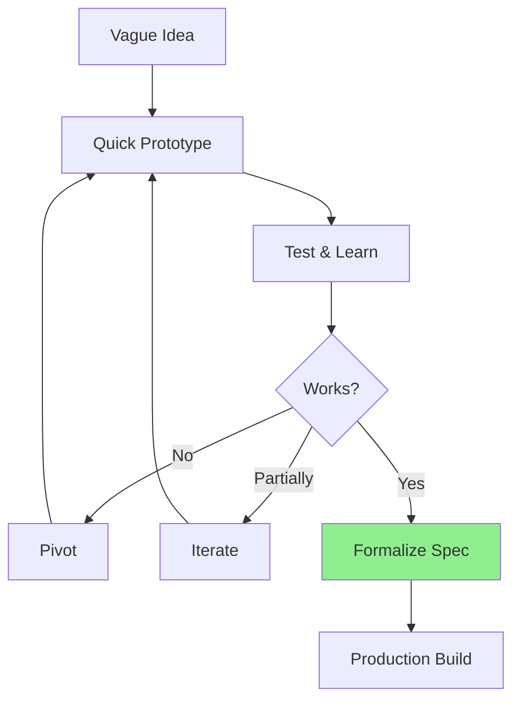
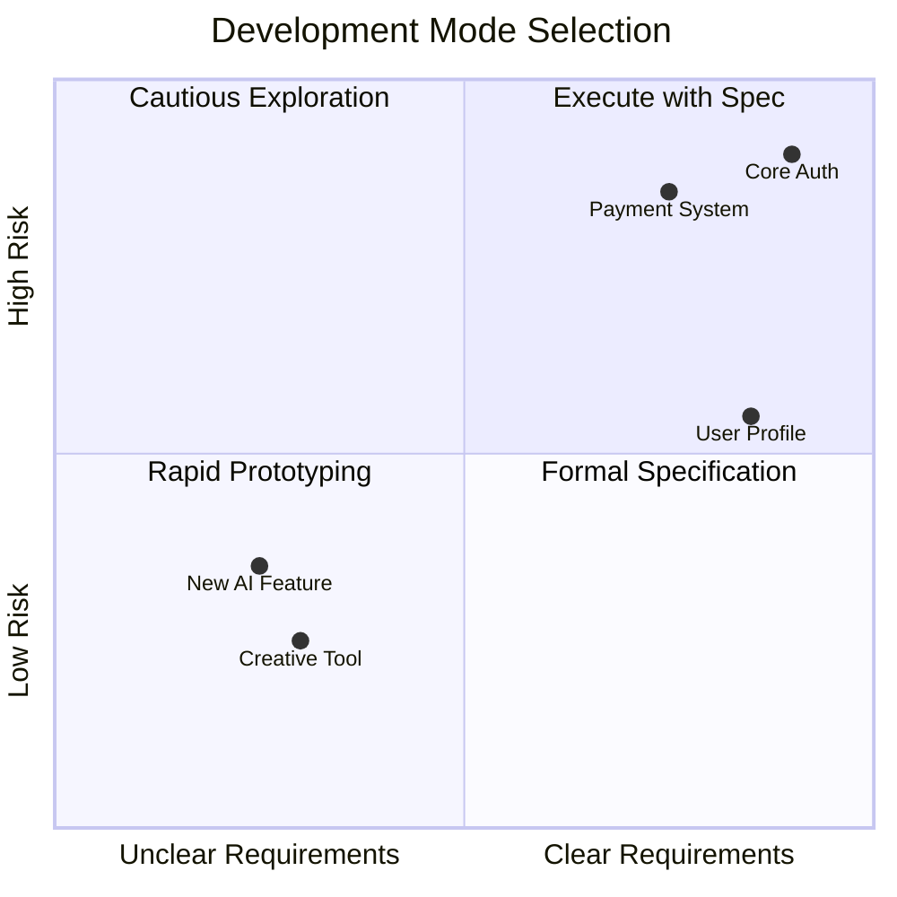
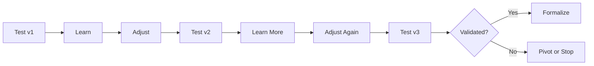

# Lesson 18: Creative Exploration

**Module:** 5 - Development Phases  
**Lesson:** 18 of 25  
**Date:** November 29, 2025

---

## 📖 Concept: Discovery Through Building

**Creative Exploration** is when you don't know exactly what you're building yet. You're experimenting, prototyping, and discovering what works. This requires a different approach than traditional spec-driven development.



---

## 🎯 When to Use Creative Exploration

### Exploration vs Execution



**Use creative exploration when:**
- ✓ Requirements are genuinely unclear
- ✓ Innovation/novelty is the goal
- ✓ User needs must be discovered
- ✓ Technology capabilities are uncertain
- ✓ Multiple approaches need testing

**Use formal specification when:**
- ✓ Requirements are clear
- ✓ Proven patterns exist
- ✓ Compliance is critical
- ✓ Team collaboration is key
- ✓ Long-term maintenance matters

---

## 💡 Real-World Analogy

**Creative exploration** is like:
> **Jazz improvisation.** Musicians have a general structure (key, tempo) but discover the melody as they play. They respond to what works, pivot when it doesn't, and eventually land on something beautiful.

**Formal specification** is like:
> **Orchestra playing from a score.** Every note is written. Precision and coordination matter. The conductor ensures everyone plays the same piece.

Both are valid! Choose based on context.

---

## 🔬 Creative Exploration Workflow

### Phase 1: Define the Exploration

Even exploration needs direction.

```markdown
# Exploration Brief: AI Writing Assistant

## Goal
Discover what AI writing help users actually want

## Hypotheses
1. Users want grammar correction
2. Users want style suggestions  
3. Users want content generation
4. Users want tone adjustment

## Success Criteria
- Users engage with at least one feature
- Feature is used in 50%+ of sessions
- Users rate helpfulness 4+ / 5

## Constraints
- 2 weeks exploration time
- Web-based only (no mobile yet)
- Use GPT-4 API

## Out of Scope (for now)
- Perfect UI design
- Full error handling
- Performance optimization
- Multi-language support
```

### Phase 2: Rapid Prototyping

Build quick, throwaway prototypes to test ideas.

```
You: /explore

I want to build an AI writing assistant but don't know what 
features users will value most. Help me create quick prototypes 
to test different approaches.

AI: I'll create a flexible prototype structure that lets you 
quickly add/remove features...

Approach:
- Feature flags (enable/disable features easily)
- Minimal UI (focus on functionality)
- Instrumentation (track what users try)
- Fast iteration (change daily if needed)
```

**Generated Prototype Structure:**

```typescript
// features/ai-assistant/prototype.ts

interface Feature {
  id: string;
  name: string;
  enabled: boolean;
  component: React.ComponentType;
  track: (action: string) => void;
}

const EXPERIMENTAL_FEATURES: Feature[] = [
  {
    id: 'grammar',
    name: 'Grammar Check',
    enabled: true, // ← Toggle to test
    component: GrammarChecker,
    track: (action) => analytics.track('grammar', action)
  },
  {
    id: 'tone',
    name: 'Tone Adjustment',
    enabled: true, // ← Toggle to test
    component: ToneAdjuster,
    track: (action) => analytics.track('tone', action)
  },
  {
    id: 'generate',
    name: 'Content Generation',
    enabled: false, // ← Disabled for now
    component: ContentGenerator,
    track: (action) => analytics.track('generate', action)
  }
];

// Easy to add new features, disable failing ones
```

### Phase 3: Test with Real Users

Get feedback early and often.

```markdown
## Week 1: Test Grammar & Tone

**Method:** Beta test with 10 users

**Observations:**
- Grammar: 9/10 users tried it, 7 used repeatedly ✓
- Tone: 5/10 users tried it, 2 used repeatedly ⚠

**Insights:**
- Grammar is clear value (immediate, objective)
- Tone is confusing ("What does 'professional' mean?")
- Users want examples before using tone adjustment

**Decision:** 
- ✓ Keep grammar (high engagement)
- ⚠ Iterate tone (add examples, clearer UI)
- ⚠ Test content generation next week
```

### Phase 4: Iterate Based on Learning



**Iteration Example:**

```markdown
## Tone Adjuster Evolution

### Version 1 (Day 1)
- Dropdown: "Professional", "Casual", "Friendly"
- Just rewrites text
- Result: Confusing, low adoption

### Version 2 (Day 3)
- Show before/after preview
- Explain what will change
- Result: Better, but users don't understand options

### Version 3 (Day 7)
- Show examples for each tone
- Side-by-side comparison
- One-click apply or revert
- Result: 80% of users who try it, use it again ✓

### Lesson Learned
Users need to understand features through examples, not descriptions.
```

### Phase 5: Formalize What Works

Once you've validated an approach, create proper specifications.

```
You: /specify

Based on our exploration, formalize the Grammar Checker feature.

We learned:
- Users want instant, inline suggestions
- Corrections should be one-click apply
- Explanations are valued (why is this wrong?)
- Must work in real-time (as they type)

AI: I'll create a formal specification based on your findings...

[Generated: .features/grammar-checker/spec.md]
- Requirements grounded in real user behavior
- Design informed by prototype testing
- Edge cases identified during exploration
- Performance targets from actual usage
```

---

## 🎓 Exploration Best Practices

### 1. Time-Box Exploration

**Set a deadline, stick to it**

```markdown
## Exploration Timeline: 2 Weeks

**Week 1:**
- Days 1-2: Build initial prototypes
- Days 3-5: Test with users
- Weekend: Analyze data

**Week 2:**
- Days 1-3: Iterate based on learning
- Days 4-5: Test refined versions
- Weekend: Document findings

**End of Week 2: Decision Gate**
- ✓ Validated → Formalize spec, build production version
- ⚠ Partially validated → 1 more week, focused exploration
- ✗ Not validated → Pivot or abandon
```

### 2. Instrument Everything

**Track what users actually do**

```typescript
// Prototype with heavy instrumentation

function useFeatureTracking(featureId: string) {
  const track = (action: string, metadata?: any) => {
    analytics.track(`prototype:${featureId}:${action}`, {
      timestamp: Date.now(),
      userId: user.id,
      sessionId: session.id,
      ...metadata
    });
  };
  
  return {
    trackView: () => track('viewed'),
    trackInteraction: (type: string) => track('interacted', { type }),
    trackSuccess: () => track('success'),
    trackAbandonment: () => track('abandoned')
  };
}

// Usage
const { trackView, trackInteraction, trackSuccess } = useFeatureTracking('grammar-check');

useEffect(() => {
  trackView();
}, []);
```

### 3. Build to Throw Away

**Don't over-engineer prototypes**

```markdown
## Prototype Code Quality Standards

❌ NOT Required:
- Perfect architecture
- Full test coverage
- Comprehensive error handling
- Production-grade performance
- Beautiful UI
- Extensive documentation

✓ Required:
- Works enough to test hypothesis
- Tracks user behavior
- Easy to modify quickly
- Clear enough to learn from

Remember: This code will likely be discarded!
```

### 4. Multiple Parallel Experiments

**Test competing ideas simultaneously**

```markdown
## A/B/C Test: Tone Adjustment UI

**Version A: Dropdown**
- Traditional select menu
- 10 users tested
- Result: 30% engagement

**Version B: Visual Examples**
- Show tone samples
- 10 users tested
- Result: 70% engagement ✓

**Version C: Slider**
- Formal ←→ Casual slider
- 10 users tested
- Result: 50% engagement

**Winner: Version B** (visual examples)
Move forward with this approach
```

### 5. Know When to Stop

**Exploration isn't endless**

```markdown
## Decision Criteria

After 2 weeks, ask:

1. **Have we learned what we needed?**
   - Yes: Formalize and build
   - No: 1 more week or pivot

2. **Is there product-market fit signal?**
   - Users engage repeatedly: Yes → Build it
   - Users try once and leave: No → Pivot or kill

3. **Can we build this properly?**
   - Technical feasibility confirmed: Yes → Proceed
   - Still uncertain: Explore tech more or change approach

4. **Is this worth building?**
   - High engagement + clear value: Yes
   - Low engagement or unclear value: No

Be honest! Killing a prototype is success (you learned fast, didn't waste months building wrong thing).
```

---

## 💡 Exercise: Plan an Exploration

**Scenario:** Exploring a "Smart Email Assistant" that helps users write better emails.

```markdown
## Exploration Brief

### Goal


### Hypotheses to Test
1.
2.
3.

### Success Criteria


### Time Box


### Prototypes to Build
1.
2.
3.

### Metrics to Track


### Decision Criteria
After exploration, we'll proceed if:

```

<details>
<summary>Sample Answer</summary>

```markdown
## Exploration Brief: Smart Email Assistant

### Goal
Discover which email writing help features provide the most value to users

### Hypotheses to Test
1. Users want AI to draft replies (save time)
2. Users want tone checking (sound professional)
3. Users want brevity suggestions (concise emails)
4. Users want auto-scheduling (coordinate meetings)

### Success Criteria
- At least one feature used in 60%+ of email sessions
- Users rate feature as "very helpful" (4-5/5)
- Users return to feature multiple times per week

### Time Box
**2 weeks total**
- Week 1: Test drafting + tone
- Week 2: Test brevity + scheduling

### Prototypes to Build

**Prototype 1: AI Reply Drafter** (Week 1)
- Button in email UI: "Draft Reply"
- Generates 3 reply options
- One-click insert
- Track: # generations, # actually sent

**Prototype 2: Tone Checker** (Week 1)
- Real-time tone analysis
- Show: "This sounds defensive" or "Great tone!"
- Suggest alternatives
- Track: # checks, # adjustments made

**Prototype 3: Brevity Coach** (Week 2)
- Flag wordy sentences
- Suggest concise alternatives
- Show word count reduction
- Track: # suggestions, # accepted

**Prototype 4: Meeting Scheduler** (Week 2)
- Parse "let's meet next week"
- Suggest specific times
- Generate calendar invite
- Track: # detections, # invites sent

### Metrics to Track

**Engagement:**
- Feature view rate
- Feature usage rate
- Repeat usage

**Value:**
- User satisfaction rating
- Time saved (estimated)
- Adoption after initial try

**Behavior:**
- Which features used together
- User journey (what first, what next)
- Abandonment points

### Decision Criteria

**Proceed if:**
- ≥1 feature has 60%+ repeat usage
- Users rate 4+/5 on helpfulness
- Technical feasibility confirmed
- Clear differentiation from competitors

**Pivot if:**
- Low engagement (<30%) on all features
- Users prefer different approaches than we tested
- Technical challenges too big

**Kill if:**
- No product-market fit signal after 2 weeks
- Users don't see value in any approach
- Too competitive / can't differentiate
```

</details>

---

## 🤔 Socratic Questions

### Question 1
**Should you write comprehensive specs during creative exploration?**

<details>
<summary>Think about the purpose of specs vs prototypes...</summary>

**Answer: No. Write lightweight exploration briefs, not comprehensive specs.**

**Why NOT comprehensive specs:**
1. **You're testing, not building** – Don't know what will work yet
2. **Requirements will change** – Specs would be immediately outdated
3. **Speed matters** – Comprehensive specs slow you down
4. **Learning > Documentation** – Goal is discovery, not specification

**What you SHOULD document:**

**Exploration Brief (1-2 pages):**
```markdown
# Exploration: Feature X

## Goal: What we're trying to learn

## Hypotheses: What we think might work

## Success Criteria: How we'll know it worked

## Time box: When we'll decide

## Constraints: What's in/out of scope
```

**Learning Log (updated daily):**
```markdown
# Day 3 - AI Reply Drafter

Tested with 5 users today

Observations:
- Users love the convenience
- But: Generated replies too formal
- And: Doesn't capture user's voice

Tomorrow: Try analyzing user's past emails to match tone
```

**Final Report (after exploration):**
```markdown
# Exploration Results

What we learned:


What worked:


What didn't:


Recommendation: Build / Pivot / Kill


If building, key requirements:

```

**THEN write comprehensive spec** if you're moving to production.

**Timeline:**
```
Exploration (2 weeks): Lightweight docs, heavy learning
↓
Decision: Validated?
↓
Production Build (6+ weeks): Comprehensive specs, formal process
```
</details>

---

### Question 2
**Your prototype shows promise but code is a mess. Should you refactor it or rewrite for production?**

<details>
<summary>Consider the purpose of prototype code...</summary>

**Answer: Usually rewrite, but salvage the learning.**

### Rewrite vs Refactor

**Rewrite when:**
- ✓ Prototype code is "quick and dirty"
- ✓ Architecture is ad-hoc
- ✓ Missing error handling, tests, security
- ✓ Not following constitution standards
- ✓ Would take longer to refactor than rewrite

**Refactor when:**
- ✓ Core logic is sound
- ✓ Architecture is decent
- ✓ Mostly needs polish
- ✓ Significant code can be salvaged

### Rewrite Process

**Step 1: Extract Learnings**
```markdown
# From Prototype to Production

## What We Learned
- Users prefer visual examples over text descriptions
- Real-time feedback is critical
- One-click actions increase engagement

## Design Decisions Validated
- Use sidebar for AI suggestions
- Show 3 options, not 1
- Allow undo/redo

## What Worked in Code
- API integration approach
- Response parsing logic
- Caching strategy

## What Needs Rework
- Error handling (none currently!)
- State management (too ad-hoc)
- Component structure (everything in one file)
- Tests (don't exist)
```

**Step 2: Write Formal Spec**
```
You: /specify

Based on our AI reply drafter prototype, create production specification.

Validated requirements:
- Feature must generate 3 reply options
- Must match user's writing tone
- One-click insertion into email
- Real-time generation (< 2 seconds)

[AI generates comprehensive spec]
```

**Step 3: Production Build**
```
You: /plan

[AI generates proper architecture]

You: /tasks

[AI breaks down implementation]

You: /implement

[Build it right this time]
```

**What to Salvage:**
```
From Prototype:
✓ Core algorithm (if sound)
✓ API integration code (if clean)
✓ Test data / examples
✓ UI mockups (as design reference)

Discard:
✗ Ad-hoc architecture
✗ Missing error handling
✗ Hardcoded values
✗ Prototype-quality UI
✗ Anything not meeting constitution standards
```

**Key Insight:**
> **Prototypes are for learning, not for shipping.** Their value is in what you discover, not the code itself. Rewrite with that knowledge for production quality.

**Analogy:**
> An architect makes a physical model to explore a building design. When it's time to build the real building, they don't try to enlarge the cardboard model – they use what they learned to create proper blueprints and build from scratch.
</details>

---

### Question 3
**After 2 weeks of exploration, results are mixed. One feature works great, two are mediocre. What do you do?**

<details>
<summary>Consider the goal of exploration...</summary>

**Answer: Build the winner, iterate or kill the rest. Don't build mediocrity.**

### Decision Framework

```markdown
## Exploration Results: AI Email Assistant

### Feature 1: AI Reply Drafter
**Engagement:** 85% of users, avg 5 times/day
**Rating:** 4.7/5 
**Decision:** ✅ BUILD (clear winner)

### Feature 2: Tone Checker
**Engagement:** 40% of users, avg 1 time/day
**Rating:** 3.2/5
**Feedback:** "Useful but suggestions not great"
**Decision:** 🔄 ITERATE (1 more week) or ⏸️ DEFER (post-MVP)

### Feature 3: Brevity Coach
**Engagement:** 15% of users, avg 0.3 times/day
**Rating:** 2.8/5
**Feedback:** "Annoying, feels like it's nagging"
**Decision:** ❌ KILL (low value, negative sentiment)
```

### What to Do

**Option 1: Build the winner only** (Recommended)
```markdown
Timeline:
- Week 3-8: Build AI Reply Drafter properly
- Launch MVP with one strong feature
- Gather more data from larger audience
- Revisit other features later if needed
```

**Benefits:**
- Focus resources on proven value
- Faster to market
- Better quality (focused effort)
- Learn from real usage at scale

**Option 2: Iterate mixed results** (Risky)
```markdown
Timeline:
- Week 3-4: Iterate tone checker
- Week 5: Test again
- If still mediocre, kill it

Risk: Sunk cost fallacy ("we invested time, must ship it")
```

**Option 3: Build everything** (Wrong!)
```markdown
Timeline:
- Build all three features
- Ship mediocre experience
- Users confused by mixed quality

Result: Users disappointed, feature bloat, maintenance burden
```

### Key Principles

**1. MVP = Best Feature(s), not All Features**
> Ship one amazing thing, not three mediocre things

**2. Kill Your Darlings**
> Just because you built it doesn't mean you should ship it

**3. Defer ≠ Kill**
> Maybe tone checker needs different approach – revisit post-launch

**4. Learn from Failures**
> Brevity Coach failed – learned users don't want "nagging" features

### Decision Template

```markdown
For each feature, ask:

1. **Is it a HELL YES?**
   - Yes → Build it
   - No → Don't build it (yet)

2. **Would users miss it if gone?**
   - Yes → Build it
   - No → Don't build it

3. **Does it move the needle?**
   - Yes → Build it
   - No → Don't build it

If not 3/3 "yes" → Don't ship it in MVP
```

**Remember:**
> Exploration's goal is to find what works, not to justify building everything you explored. Be ruthless. Only build winners.
</details>

---

## ✅ Creative Exploration Checklist

**Before Exploring:**
- [ ] Exploration brief written (goal, hypotheses, success criteria)
- [ ] Time box set (usually 1-3 weeks)
- [ ] Metrics defined (what we'll track)
- [ ] Decision criteria clear (how we'll choose)

**During Exploration:**
- [ ] Building prototypes, not production code
- [ ] Testing with real users frequently
- [ ] Tracking all interactions
- [ ] Documenting learnings daily
- [ ] Iterating based on feedback

**After Exploration:**
- [ ] Results analyzed objectively
- [ ] Clear recommendation (build/pivot/kill)
- [ ] Learnings documented
- [ ] Winners get formal specs
- [ ] Losers get killed (no sentimentality)

---

## 🎯 Summary

**Creative exploration is:**
- A discovery process when requirements are unclear
- Time-boxed prototyping and user testing
- Iterative learning, not perfect building
- Focused on validation, not specification

**Use exploration when:**
- Requirements are genuinely unknown
- Innovation requires experimentation
- User needs must be discovered
- Multiple approaches need testing

**Best practices:**
- Time-box exploration (1-3 weeks)
- Build throwaway prototypes
- Test with real users early
- Instrument everything
- Formalize only what's validated
- Be ruthless about killing losers

---

## 📚 What's Next?

You've learned greenfield (building new) and exploration (discovering what to build). Now learn how to enhance existing systems.

**Next:** [Lesson 19: Iterative Enhancement (Brownfield)](./Lesson-19-Iterative-Enhancement-Brownfield.md)

---

*Previous: [Lesson 17: 0-to-1 Development (Greenfield)](./Lesson-17-0-to-1-Development-Greenfield.md)*  
*Next: [Lesson 19: Iterative Enhancement (Brownfield)](./Lesson-19-Iterative-Enhancement-Brownfield.md)*
