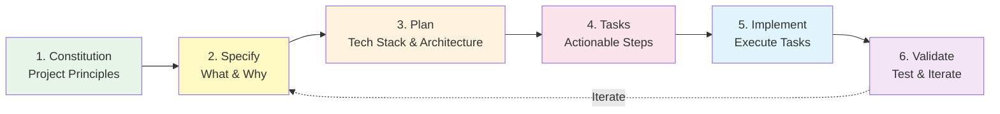
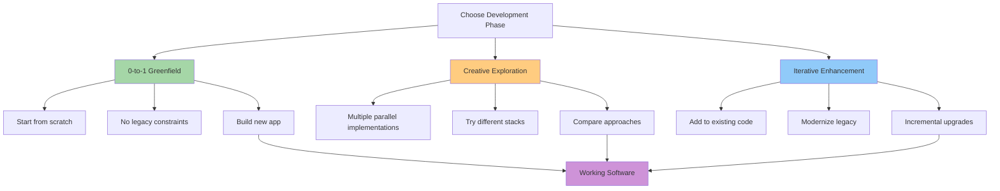
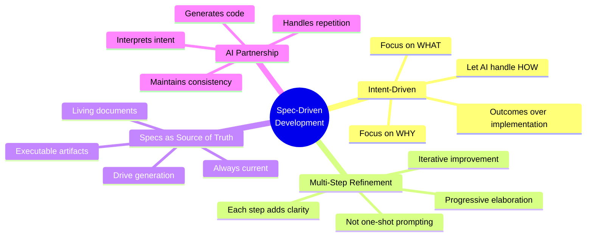

# 📚 Quick Reference Guide - Spec Kit

This is your quick reference for Spec Kit commands and concepts as you progress through the course.

---

## 🎯 Core Workflow (The 6 Steps)

```
1. Constitution → 2. Specify → 3. Plan → 4. Tasks → 5. Implement → 6. Validate
```



### 1. `/speckit.constitution`
**Purpose:** Establish project principles  
**When:** At project start  
**Creates:** Governing principles, development guidelines

### 2. `/speckit.specify`
**Purpose:** Define what to build  
**When:** For each feature  
**Focus:** What and Why (not How)

### 3. `/speckit.plan`
**Purpose:** Create technical implementation plan  
**When:** After specifications are clear  
**Includes:** Tech stack, architecture decisions

### 4. `/speckit.tasks`
**Purpose:** Generate actionable task list  
**When:** After plan is complete  
**Output:** Broken-down, executable tasks

### 5. `/speckit.implement`
**Purpose:** Execute all tasks  
**When:** After tasks are defined  
**Result:** Working implementation

### 6. **Validate & Iterate**
**Purpose:** Test and refine  
**When:** After implementation  
**Action:** Test, get feedback, iterate

---

## 🔧 Optional Commands (Quality Enhancement)

```mermaid
graph TD
    Start[Start Feature] --> Constitution[Constitution]
    Constitution --> Specify[Specify]
    Specify --> Clarify{Need Clarification?}
    Clarify -->|Yes| ClarifyCmd[/speckit.clarify]
    Clarify -->|No| Plan[Plan]
    ClarifyCmd --> Plan
    Plan --> Tasks[Tasks]
    Tasks --> Analyze{Run Analysis?}
    Analyze -->|Yes| AnalyzeCmd[/speckit.analyze]
    Analyze -->|No| Implement[Implement]
    AnalyzeCmd --> Implement
    Implement --> Checklist{Quality Check?}
    Checklist -->|Yes| ChecklistCmd[/speckit.checklist]
    Checklist -->|No| Done[Done]
    ChecklistCmd --> Done
    
    style ClarifyCmd fill:#ffe082
    style AnalyzeCmd fill:#81c784
    style ChecklistCmd fill:#64b5f6
```

### `/speckit.clarify`
- **Use:** Before planning, to refine underspecified areas
- **Benefit:** Socratic questioning improves spec quality
- **Formerly:** `/quizme`

### `/speckit.analyze`
- **Use:** After tasks, before implementation
- **Benefit:** Cross-artifact consistency check
- **Validates:** Coverage and consistency

### `/speckit.checklist`
- **Use:** Anytime for quality assurance
- **Benefit:** "Unit tests for English"
- **Validates:** Requirements completeness

---

## 📋 CLI Commands

### Initialize Project
```powershell
# Recommended: Persistent installation
uv tool install specify-cli --from git+https://github.com/github/spec-kit.git

# Initialize new project
specify init my-project --ai copilot

# Initialize in current directory
specify init . --ai copilot
# or
specify init --here --ai copilot

# With PowerShell scripts (Windows)
specify init my-project --ai copilot --script ps
```

### Check Prerequisites
```powershell
specify check
```

---

## 🤖 Supported AI Agents

✅ **Full Support:**
- GitHub Copilot
- Claude Code
- Cursor
- Windsurf
- Gemini CLI
- Amp
- Jules
- Kilo Code
- opencode
- Qwen Code
- Roo Code
- SHAI (OVHcloud)
- IBM Bob
- Auggie CLI
- CodeBuddy CLI
- Codex CLI

⚠️ **Limited Support:**
- Amazon Q Developer CLI (no custom arguments for slash commands)

---

## 🎯 Development Phases



### 1. **0-to-1 Development (Greenfield)**
- Start from scratch
- Generate new applications
- No existing code constraints

### 2. **Creative Exploration**
- Multiple parallel implementations
- Try different tech stacks
- Experiment with approaches

### 3. **Iterative Enhancement (Brownfield)**
- Add to existing systems
- Modernize legacy code
- Incremental improvements

---

## 📐 Core Principles



### Intent-Driven Development
- Focus on WHAT you want, not HOW to build it
- Let AI handle implementation details
- Specify outcomes and requirements

### Multi-Step Refinement
- Not one-shot prompting
- Iterative improvement through workflow
- Each step adds clarity and structure

### Specifications as Source of Truth
- Living, executable documents
- Always up-to-date
- Drive code generation

---

## 🛠️ Prerequisites

**Required:**
- Linux/macOS/Windows
- [uv](https://docs.astral.sh/uv/) for package management
- [Python 3.11+](https://www.python.org/downloads/)
- [Git](https://git-scm.com/downloads)
- Supported AI coding agent

---

## 🌍 Environment Variables

### `SPECIFY_FEATURE`
Override feature detection for non-Git repositories.

```powershell
# Example
$env:SPECIFY_FEATURE = "001-photo-albums"
```

**Use when:**
- Not using Git branches
- Need to work on specific feature
- Set before `/speckit.plan` or follow-up commands

---

## 📖 Key Concepts

### Constitution
Project-level principles that guide all development. Think of it as your project's "values and standards" document.

### Specification
Detailed description of WHAT you want to build and WHY. Focus on requirements, user stories, outcomes—not technical implementation.

### Implementation Plan
Technical HOW: tech stack, architecture, libraries, design decisions.

### Tasks
Actionable, granular steps to implement the plan. These are what get executed.

---

## 🎓 Remember

1. **Specs are executable** - They directly generate code
2. **Focus on intent** - WHAT and WHY, not HOW
3. **Iterate and refine** - Use the workflow steps to build clarity
4. **AI is your partner** - It interprets specs and generates implementation
5. **Maintain specifications** - They're your source of truth

---

## 🔗 Important Links

- [Spec Kit GitHub](https://github.com/github/spec-kit)
- [Complete Methodology](https://github.com/github/spec-kit/blob/main/spec-driven.md)
- [Video Overview](https://www.youtube.com/watch?v=a9eR1xsfvHg)
- [Issues & Support](https://github.com/github/spec-kit/issues)

---

*Keep this handy as you progress through the course!*
