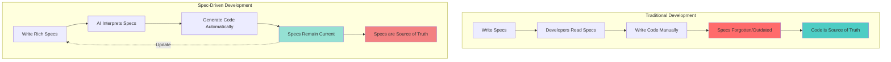
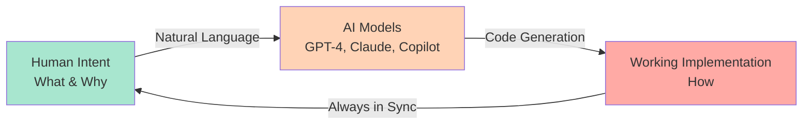

# Lesson 1: What is Spec-Driven Development?

**Module:** 1 - Foundations  
**Lesson:** 1 of 25  
**Date:** November 28, 2025

---

## 📖 Concept: The Paradigm Shift

### Traditional Development: Code is King

For decades, software development has followed this pattern:

1. **Write specifications** (often incomplete or informal)
2. **Specifications guide developers**
3. **Developers write code**
4. **Specifications are discarded or forgotten**
5. **Code becomes the source of truth**

Think of traditional specs like **architectural blueprints that get thrown away after the house is built**. Sure, they helped during construction, but once the house stands, nobody looks at them again. Want to add a room? You look at the house itself, not the blueprints.

### Spec-Driven Development: Specifications are Executable

Spec-Driven Development flips this model:

1. **Write rich, detailed specifications**
2. **Specifications ARE executable artifacts**
3. **Code is GENERATED directly from specifications**
4. **Specifications remain the source of truth**
5. **Want to change something? Update the spec, regenerate**

Now imagine if your architectural blueprints were **alive**. Change the blueprint, and the house automatically restructures itself. The blueprint isn't just a guide—it's the DNA of the building.

---

## 🔍 Key Differences

| Aspect | Traditional Development | Spec-Driven Development |
|--------|------------------------|------------------------|
| **Source of Truth** | Code | Specifications |
| **Spec Lifecycle** | Created, then discarded | Living, executable artifacts |
| **Change Process** | Modify code directly | Update spec, regenerate |
| **Documentation** | Often outdated | Always current (it IS the code) |
| **Focus** | "How" to implement | "What" and "Why" to build |

### Visual Comparison



---

## 🎯 Why This Matters Now

### The AI Revolution

With advanced AI models (like GitHub Copilot, Claude, GPT-4, etc.), we can now:

- **Interpret complex specifications** with human-level understanding
- **Generate production-quality code** from detailed requirements
- **Maintain consistency** across large codebases
- **Adapt to changes** by regenerating from updated specs

This wasn't possible 5 years ago! The technology has finally caught up to make spec-driven development practical.



---

## 🌟 Real-World Analogy

Think of **traditional development** like:
> **Writing a novel by hand.** Every word, every sentence, you craft manually. Want to change a character's name throughout? Find-and-replace, hope you don't miss anything.

Think of **spec-driven development** like:
> **Directing a movie with AI actors.** You write the script (specifications), describe the scenes, the emotions, the outcomes. The AI generates the performances. Want to reshoot a scene? Revise the script, regenerate that part. The script is always the authority.

---

## 💡 The Core Insight

**In Spec-Driven Development:**
- Specifications define the WHAT (requirements, user stories, outcomes)
- AI interprets and generates the HOW (code, implementation, architecture)
- Humans focus on intent, creativity, and business logic
- AI handles the tedious, repetitive implementation work

### The Division of Labor

```mermaid
graph TD
    subgraph Human["👤 Human Responsibilities"]
        H1[Define WHAT to build]
        H2[Explain WHY it matters]
        H3[Set quality standards]
        H4[Make creative decisions]
        H5[Review & validate]
    end
    
    subgraph AI["🤖 AI Responsibilities"]
        A1[Interpret specifications]
        A2[Choose HOW to implement]
        A3[Generate code]
        A4[Maintain consistency]
        A5[Handle repetitive tasks]
    end
    
    Human -->|Specifications| AI
    AI -->|Implementation| Human
    
    style Human fill:#e3f2fd
    style AI fill:#fff3e0
```



---

## 🎓 Summary

**Spec-Driven Development is:**
- A process where specifications are executable and generate implementations
- Enabled by advanced AI that can interpret complex requirements
- Focused on intent ("what" and "why") rather than mechanics ("how")
- A paradigm where specs remain living, authoritative artifacts

**It's NOT:**
- Just better documentation
- One-shot prompting ("build me an app")
- A replacement for human creativity and judgment
- Technology-specific (works across languages/frameworks)

---

## 🤔 Socratic Questions

Let me check your understanding:

### Question 1
**In traditional development, what typically happens to specifications after the code is written?**

<details>
<summary>Think about it before expanding...</summary>

They're often forgotten, become outdated, or are discarded entirely. The code becomes the only source of truth.
</details>

### Question 2
**What technology advancement has made spec-driven development practical now?**

<details>
<summary>Consider recent changes in the industry...</summary>

Advanced AI models that can understand complex human specifications and generate high-quality code. This includes models like GPT-4, Claude, Copilot, etc.
</details>

### Question 3
**If you want to change a feature in spec-driven development, where do you make the change?**

<details>
<summary>Think about the "source of truth"...</summary>

In the specification itself. You update the spec, and then regenerate the implementation from the updated specification.
</details>

---

## 💡 Exercise: Thought Experiment

**Scenario:** You're building a photo album application. In traditional development, you'd write code for organizing photos by date. Six months later, the client wants to add sorting by location too.

**Questions:**
1. In **traditional development**, what would you need to do?
2. In **spec-driven development**, what would you do differently?
3. Which approach do you think would be easier to maintain over 2-3 years?

**Write your thoughts below (or in your own notes):**

```
Your answer:

Traditional approach:


Spec-driven approach:


Which is easier long-term and why:


```

---

## ✅ Ready to Continue?

Before moving to Lesson 2, make sure you can answer:

- [ ] What is the fundamental difference between traditional and spec-driven development?
- [ ] Why has spec-driven development become practical recently?
- [ ] What is the "source of truth" in spec-driven development?
- [ ] What does it mean for specifications to be "executable"?

**Are you ready to move on to Lesson 2: Introduction to Spec Kit?**

Reply with:
- ✅ "Yes" or "Ready" if you understand and want to continue
- 🤔 "Clarify" or "Question" if you need more explanation
- 📝 "Exercise" if you want to discuss your thought experiment

---

## 📚 Additional Resources

- [Spec Kit README](https://github.com/github/spec-kit/blob/main/README.md)
- [Complete Spec-Driven Development Methodology](https://github.com/github/spec-kit/blob/main/spec-driven.md)

---

*Next Lesson: [Lesson 2: Introduction to Spec Kit](./Lesson-02-Introduction-to-Spec-Kit.md)*
