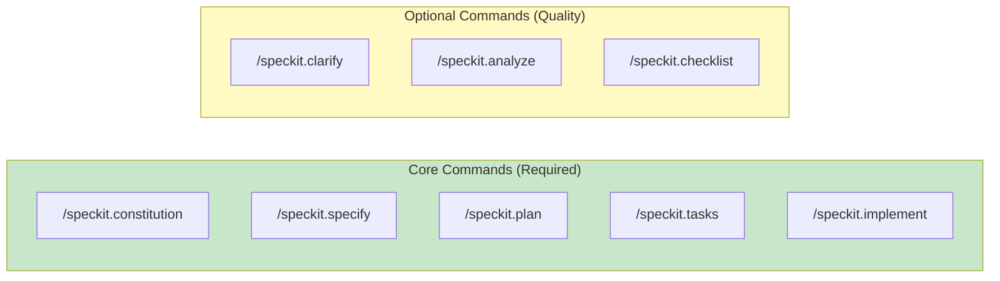
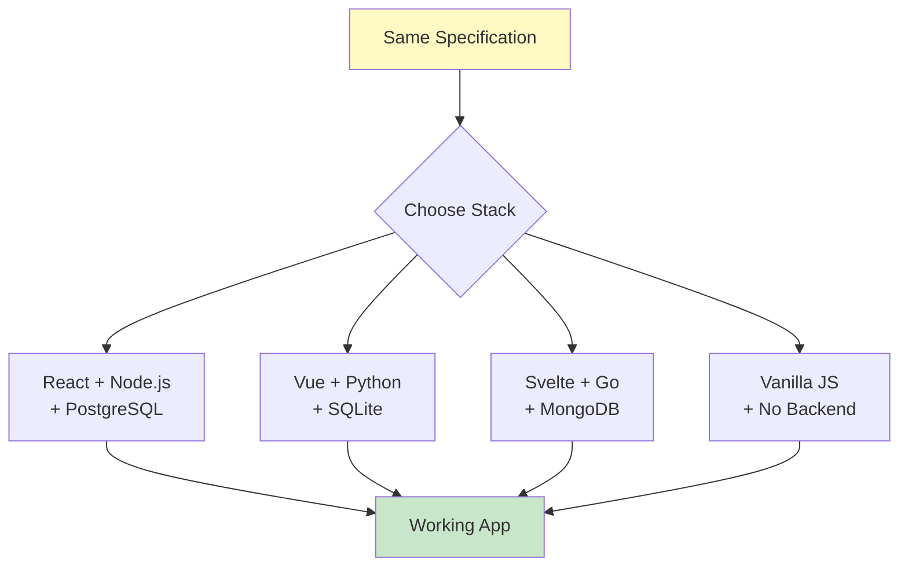
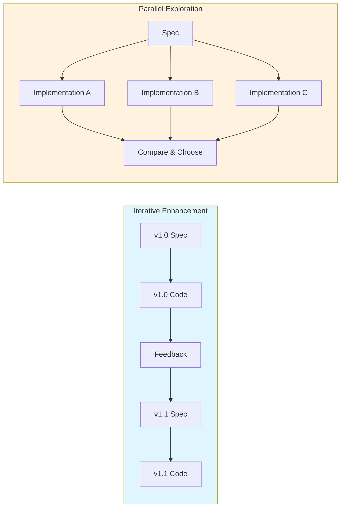

# Lesson 2: Introduction to Spec Kit

**Module:** 1 - Foundations  
**Lesson:** 2 of 25  
**Date:** November 29, 2025

---

## 📖 Concept: What is Spec Kit?

### The Tool That Makes Spec-Driven Development Practical

**Spec Kit** is an open-source toolkit created by GitHub that implements the Spec-Driven Development methodology. Think of it as the **bridge between your intentions and working code**.

If Spec-Driven Development is the philosophy, **Spec Kit is the implementation**.

---

## 🎯 What Problems Does Spec Kit Solve?

### Problem 1: **Vibe Coding** 🎲

**Without Spec Kit:**
> "Hey AI, build me a photo album app!"  
> *AI generates random code*  
> "No, not like that... try again?"  
> *Repeat 10 times, get 10 different approaches*

This is "vibe coding" - throwing prompts at AI and hoping something sticks.

**With Spec Kit:**
> Follow structured steps → consistent, predictable results  
> Each step builds on the previous → progressive refinement  
> Specifications guide everything → reproducible outcomes

---

### Problem 2: **Lost Context** 🧩

**Without Spec Kit:**
```
Day 1: "Build login feature"
Day 30: "Why did we build it this way?"
Day 60: "What was supposed to happen here?"
```

**With Spec Kit:**
- Constitution defines project principles (permanent reference)
- Specifications document every "what" and "why"
- Plans explain every technical decision
- Everything is written down and queryable

---

### Problem 3: **Inconsistent Quality** ⚖️

**Without Spec Kit:**
- Feature A is well-tested
- Feature B has no tests
- Feature C uses different patterns
- No unified standards

**With Spec Kit:**
- Constitution sets quality standards for ALL features
- Every feature follows the same workflow
- Optional quality commands (`clarify`, `analyze`, `checklist`)
- Consistent output across the project

---

## 🏗️ Spec Kit's Architecture

```mermaid
graph TB
    subgraph SpecKit["🌱 Spec Kit Toolkit"]
        CLI[Specify CLI<br/>Command-line tool]
        Templates[Project Templates<br/>Structured scaffolding]
        SlashCommands[Slash Commands<br/>AI agent integration]
        Workflow[Workflow Definitions<br/>Step-by-step process]
    end
    
    subgraph YourProject["Your Project"]
        Constitution[📜 Constitution]
        Features[📁 Features]
        Specs[📄 Specifications]
        Plans[🗺️ Plans]
        Tasks[✅ Tasks]
        Code[💻 Code]
    end
    
    subgraph AIAgents["🤖 AI Agents"]
        Copilot[GitHub Copilot]
        Claude[Claude Code]
        Cursor[Cursor]
        Others[Windsurf, Gemini, etc.]
    end
    
    CLI -->|Initializes| YourProject
    Templates -->|Scaffolds| YourProject
    SlashCommands -->|Integrates with| AIAgents
    AIAgents -->|Executes| Workflow
    Workflow -->|Creates| Constitution
    Workflow -->|Creates| Features
    Features -->|Contains| Specs
    Features -->|Contains| Plans
    Features -->|Contains| Tasks
    Tasks -->|Generates| Code
    
    style SpecKit fill:#e8f5e9
    style YourProject fill:#fff9c4
    style AIAgents fill:#e1f5fe
```



---

## 🔧 Core Components

### 1. **Specify CLI** 📦

The command-line tool you install with:
```powershell
uv tool install specify-cli --from git+https://github.com/github/spec-kit.git
```

**What it does:**
- `specify init` - Sets up a new project with proper structure
- `specify check` - Validates your environment (Git, AI tools, etc.)
- Handles project scaffolding and configuration

---

### 2. **Slash Commands** ⚡

Special commands available in your AI coding assistant:



These commands tell your AI agent exactly what to do at each step.

---

### 3. **Project Structure** 📁

Spec Kit creates a standardized structure:

```
my-project/
├── .speckit/
│   ├── constitution.md          # Project principles
│   └── features/
│       └── 001-photo-albums/
│           ├── spec.md          # What to build
│           ├── plan.md          # How to build it
│           ├── tasks.md         # Step-by-step tasks
│           └── analysis.md      # Quality checks (optional)
├── src/                         # Your generated code
└── README.md
```

**Key insight:** Specifications live alongside your code, always accessible!

---

### 4. **AI Agent Integration** 🤖

Spec Kit works with multiple AI assistants:

| Agent | Status | Notes |
|-------|--------|-------|
| **GitHub Copilot** | ✅ Full Support | Best integration with VS Code |
| **Claude Code** | ✅ Full Support | Excellent for complex specs |
| **Cursor** | ✅ Full Support | Built-in AI editor |
| **Windsurf** | ✅ Full Support | Specialized AI IDE |
| **Gemini CLI** | ✅ Full Support | Google's AI |
| +15 more | ✅ See docs | Growing ecosystem |

**You're not locked in!** Use whichever AI agent you prefer.

---

## 🌟 Key Features

### Feature 1: **Technology Independence**

Spec Kit doesn't force you into a specific tech stack:



The process works for **any** language, framework, or platform!

---

### Feature 2: **Enterprise-Ready**

Spec Kit handles real-world constraints:

- ✅ **Compliance requirements** (GDPR, HIPAA, etc.)
- ✅ **Organizational standards** (design systems, coding guidelines)
- ✅ **Cloud provider restrictions** (AWS-only, Azure-only, etc.)
- ✅ **Security policies** (authentication, authorization patterns)

All defined in your Constitution and enforced throughout.

---

### Feature 3: **Iterative & Parallel Development**



**Iterative:** Improve features over time  
**Parallel:** Explore different approaches simultaneously

---

## 🎯 Real-World Analogy

Think of Spec Kit like a **construction management system** for software:

| Construction | Spec Kit |
|-------------|----------|
| **Architectural blueprints** | Specifications |
| **Building codes & standards** | Constitution |
| **Construction plan** | Implementation Plan |
| **Work orders** | Task List |
| **Construction crew** | AI Agent |
| **Project manager** | You (the developer) |

The project manager (you) defines **what** to build and **why**, sets quality standards (constitution), and the crew (AI) follows the plans to build it. The blueprints (specs) remain the authoritative reference.

---

## 💡 How Spec Kit Differs from Other Tools

### vs. **Traditional IDEs** (VS Code, IntelliJ)
- **IDEs:** Help you write code
- **Spec Kit:** Helps you define what code should do, then generates it

### vs. **AI Coding Assistants** (Copilot alone)
- **AI Assistants:** Suggest code as you type
- **Spec Kit:** Provides structure and workflow for AI to follow

### vs. **Code Generators** (Yeoman, Create React App)
- **Generators:** Create initial boilerplate, then you're on your own
- **Spec Kit:** Ongoing process for the entire development lifecycle

**Spec Kit is complementary** - it works *with* your IDE and AI assistant, not against them!

---

## 🎓 Summary

**Spec Kit is:**
- ✅ An open-source toolkit by GitHub
- ✅ The implementation of Spec-Driven Development methodology
- ✅ A CLI tool + slash commands + workflow
- ✅ Technology and language agnostic
- ✅ Enterprise-ready with real-world constraints
- ✅ Compatible with multiple AI agents

**Spec Kit provides:**
- 📦 Project initialization and structure
- ⚡ Slash commands for your AI agent
- 📁 Standardized file organization
- 🔄 Repeatable, consistent workflow
- 🎯 Focus on specifications as source of truth

**Spec Kit is NOT:**
- ❌ A specific programming language or framework
- ❌ A replacement for your IDE
- ❌ Just another code generator
- ❌ Limited to one AI assistant

---

## 🤔 Socratic Questions

### Question 1
**What is the main difference between "vibe coding" with AI and using Spec Kit?**

<details>
<summary>Think about structure vs. randomness...</summary>

Vibe coding is unstructured prompting with inconsistent results. Spec Kit provides a structured, step-by-step workflow that produces consistent, predictable outcomes through progressive refinement.
</details>

### Question 2
**Why does Spec Kit use slash commands instead of just regular prompts?**

<details>
<summary>Consider consistency and clarity...</summary>

Slash commands provide clear, unambiguous instructions to the AI about which step of the workflow to execute. They ensure the AI understands the context and follows the methodology correctly, rather than interpreting free-form prompts.
</details>

### Question 3
**Can you use Spec Kit with React? With Python? With Go?**

<details>
<summary>Think about technology independence...</summary>

Yes, yes, and yes! Spec Kit is technology-agnostic. The same process works for any language, framework, or platform. You choose your tech stack in the Plan step.
</details>

---

## 💡 Exercise: Mapping the Components

**Scenario:** You want to build a task management app using Spec Kit.

Match each Spec Kit component to what it would do in your project:

| Component | What it creates/does |
|-----------|---------------------|
| A. Specify CLI | 1. Defines that all tasks must have due dates |
| B. `/speckit.constitution` | 2. Breaks work into: "Create DB schema", "Build UI", etc. |
| C. `/speckit.specify` | 3. Sets up project folders and Git repository |
| D. `/speckit.plan` | 4. Describes user stories: "As a user, I want to..." |
| E. `/speckit.tasks` | 5. Chooses React + Node.js + PostgreSQL |

**Write your answers:**

```
A → 
B → 
C → 
D → 
E → 
```

<details>
<summary>Check your answers</summary>

A → 3 (CLI initializes project structure)  
B → 1 (Constitution sets project-wide rules)  
C → 4 (Specify defines requirements and user stories)  
D → 5 (Plan chooses technical implementation)  
E → 2 (Tasks breaks down work into steps)
</details>

---

## 🎯 Reflection Questions

Before moving on, think about:

1. **How could Spec Kit help with a project you're currently working on or planning?**
2. **What problem do you face most: lost context, inconsistent quality, or unclear requirements?**
3. **Which AI agent do you currently use or would like to use with Spec Kit?**

Write your thoughts:
```
Your reflections:


```

---

## ✅ Ready to Continue?

Before moving to Lesson 3, make sure you can answer:

- [ ] What is Spec Kit and what problem does it solve?
- [ ] What are the core components of Spec Kit?
- [ ] How does Spec Kit differ from traditional code generators?
- [ ] What does "technology independence" mean?
- [ ] What are slash commands and why are they useful?

**Are you ready to move on to Lesson 3: Core Philosophy & Mental Models?**

Reply with:
- ✅ "Yes" or "Ready" if you understand and want to continue
- 🤔 "Clarify [topic]" if you need more explanation on something specific
- 📝 "Exercise" if you want to discuss your answers

---

## 📚 Additional Resources

- [Spec Kit GitHub Repository](https://github.com/github/spec-kit)
- [Supported AI Agents List](https://github.com/github/spec-kit#-supported-ai-agents)
- [Video Overview](https://www.youtube.com/watch?v=a9eR1xsfvHg)

---

*Previous: [Lesson 1: What is Spec-Driven Development?](./Lesson-01-What-is-Spec-Driven-Development.md)*  
*Next: [Lesson 3: Core Philosophy & Mental Models](./Lesson-03-Core-Philosophy-and-Mental-Models.md)*
