# Lesson 5: Project Initialization

**Module:** 2 - Getting Started  
**Lesson:** 5 of 25  
**Date:** November 29, 2025

---

## 📖 Concept: Creating Your First Spec-Driven Project

Now that your environment is set up, it's time to initialize your first Spec Kit project! This lesson covers the `specify init` command and understanding the project structure it creates.

---

## 🚀 The `specify init` Command


### Basic Syntax

```powershell
specify init <project-name>
```

### With Options

```powershell
specify init my-project --ai copilot --script ps
```

---

## 🎯 Command Options Explained

### Essential Options

| Option | Purpose | Example |
|--------|---------|---------|
| `<project-name>` | Name of your project directory | `photo-album-app` |
| `--ai` | Which AI agent you're using | `copilot`, `claude`, `cursor` |
| `--script` | Script type for your OS | `ps` (PowerShell), `sh` (Bash/Zsh) |

### Advanced Options

| Option | Purpose | When to Use |
|--------|---------|-------------|
| `--here` | Initialize in current directory | Already have a folder |
| `--force` | Skip confirmation prompts | Automation scripts |
| `--no-git` | Don't create Git repository | Git not available |
| `--ignore-agent-tools` | Skip AI agent detection | Agent not in PATH |
| `--debug` | Show detailed output | Troubleshooting |

---

## 📋 Step-by-Step: Create Your First Project

### Example 1: New Project with GitHub Copilot

```powershell
# Navigate to where you want the project
cd C:\Users\mateh\OneDrive\Documents

# Create new project
specify init my-first-spec-project --ai copilot --script ps
```

**What happens:**

```mermaid
sequenceDiagram
    participant You
    participant CLI as Specify CLI
    participant Git
    participant FS as File System
    
    You->>CLI: specify init my-first-spec-project
    CLI->>FS: Create directory
    CLI->>FS: Create .speckit folder
    CLI->>FS: Create slash command scripts
    CLI->>Git: Initialize repository
    Git->>Git: Create main branch
    CLI->>FS: Create README.md
    CLI->>You: ✓ Project ready!
```


### Example 2: Initialize in Existing Directory

```powershell
# You already have a folder
cd C:\Users\mateh\OneDrive\Documents\existing-project

# Initialize Spec Kit here
specify init . --ai copilot --script ps

# Or use --here flag
specify init --here --ai copilot --script ps
```

**When to use this:**
- You already created a directory
- You have some existing files
- You want to add Spec Kit to current location

---

## 📁 Project Structure Deep Dive

After running `specify init`, here's what you get:

```
my-first-spec-project/
├── .speckit/
│   ├── constitution.md           # Project principles (empty, you'll fill)
│   ├── features/                 # Feature specifications
│   └── templates/                # Optional templates
├── .git/
│   └── [Git internals]           # Version control
├── .vscode/                      # VS Code settings (optional)
│   └── settings.json
├── README.md                     # Project overview
├── speckit-constitution.sh/.ps1  # Constitution slash command
├── speckit-specify.sh/.ps1       # Specify slash command
├── speckit-plan.sh/.ps1          # Plan slash command
├── speckit-tasks.sh/.ps1         # Tasks slash command
├── speckit-implement.sh/.ps1     # Implement slash command
├── speckit-clarify.sh/.ps1       # Clarify slash command (optional)
├── speckit-analyze.sh/.ps1       # Analyze slash command (optional)
└── speckit-checklist.sh/.ps1     # Checklist slash command (optional)
```

---

## 🔍 Understanding Key Components

### 1. The `.speckit` Directory


**Purpose:** Central location for all specifications and plans. This is your **source of truth**.

---

### 2. Slash Command Scripts

**For Windows (PowerShell):**
- `speckit-constitution.ps1`
- `speckit-specify.ps1`
- `speckit-plan.ps1`
- `speckit-tasks.ps1`
- `speckit-implement.ps1`
- Plus optional: `clarify`, `analyze`, `checklist`

**What they do:**
These scripts are called by your AI agent when you use slash commands like `/speckit.specify`. They provide the structure and instructions for each workflow step.

**You don't edit these!** They're templates that guide your AI agent.

---

### 3. Git Repository

```powershell
# Check Git status
cd my-first-spec-project
git status

# You'll see:
# On branch main
# nothing to commit, working tree clean
```

**Important:** Each feature will live in its own branch:
- `main` - Stable, completed features
- `feature/001-photo-albums` - Work in progress
- `feature/002-user-auth` - Another feature

---

### 4. README.md

The generated README includes:
- Project description
- How to use Spec Kit commands
- Link to documentation
- Quick start guide

**You should customize this** with your project-specific information!

---

## 🎯 Practical Examples

### Scenario 1: Web Application

```powershell
specify init e-commerce-app --ai copilot --script ps
cd e-commerce-app

# Check what was created
ls
```

**Next steps:**
1. Open in VS Code: `code .`
2. Create a feature branch: `git checkout -b feature/001-product-catalog`
3. Use `/speckit.constitution` to set principles
4. Use `/speckit.specify` to define first feature

---

### Scenario 2: Python Data Science Project

```powershell
specify init ml-analysis --ai claude --script ps
cd ml-analysis

# Add your own folders
mkdir src data notebooks

# Check structure
tree /F
```

**Spec Kit structure + your own structure = perfect combination!**

---

### Scenario 3: Adding Spec Kit to Existing Project

```powershell
# You have: my-legacy-app/
cd my-legacy-app

# Add Spec Kit
specify init --here --ai copilot --script ps --force

# Now you have both!
# - Your existing code
# - Spec Kit structure for new features
```

---

## 🔧 Customizing Your Setup

### Choosing the Right AI Agent

```mermaid
graph TD
    Question{Which AI agent?}
    
    Question --> VsCode{Using VS Code?}
    VsCode -->|Yes| Copilot[--ai copilot<br/>✅ Recommended]
    VsCode -->|No| Editor
    
    Question --> Editor{Which editor?}
    Editor --> Cursor2[Cursor]
    Editor --> Windsurf2[Windsurf]
    Editor --> Other[Other]
    
    Cursor2 --> CursorFlag[--ai cursor-agent]
    Windsurf2 --> WindsurfFlag[--ai windsurf]
    Other --> ClaudeFlag[--ai claude<br/>or --ai gemini]
    
    style Copilot fill:#c8e6c9
```



**Common choices:**
- `--ai copilot` - GitHub Copilot (VS Code)
- `--ai claude` - Claude Code (CLI)
- `--ai cursor-agent` - Cursor editor
- `--ai windsurf` - Windsurf IDE
- `--ai gemini` - Google Gemini CLI

---

### Script Type Selection

**For Windows:**
```powershell
specify init my-project --ai copilot --script ps
```
Uses `.ps1` PowerShell scripts ✅

**For Linux/macOS:**
```bash
specify init my-project --ai copilot --script sh
```
Uses `.sh` Bash/Zsh scripts

---

## 🎓 Best Practices

### 1. **Use Descriptive Project Names**

✅ Good:
- `customer-portal-app`
- `inventory-management-system`
- `ml-recommendation-engine`

❌ Avoid:
- `project1`
- `test`
- `new-app`

### 2. **Initialize with Git from Start**

```powershell
# Don't use --no-git unless you have a good reason
specify init my-project --ai copilot --script ps
# Git is initialized automatically ✅
```

### 3. **Choose One AI Agent Consistently**

Don't mix agents in the same project. Pick one and stick with it:
- Same command style
- Consistent behavior
- Easier troubleshooting

### 4. **Open in Your Editor Immediately**

```powershell
specify init my-project --ai copilot --script ps
cd my-project
code .  # Open in VS Code
```

Get familiar with the structure right away!

---

## 🤔 Socratic Questions

### Question 1
**What's the difference between `specify init my-project` and `specify init --here`?**

<details>
<summary>Think about directories...</summary>

`specify init my-project` creates a NEW directory called "my-project" and initializes Spec Kit inside it. `specify init --here` initializes Spec Kit in your CURRENT directory without creating a new one.
</details>

### Question 2
**Why does Spec Kit create separate script files for each slash command instead of one big script?**

<details>
<summary>Consider modularity and clarity...</summary>

Each slash command has a specific purpose and context. Separate scripts make it easier to:
- Understand what each command does
- Customize individual commands if needed
- Maintain and update
- Debug issues with specific steps
</details>

### Question 3
**Can you use Spec Kit without Git? When would you want to?**

<details>
<summary>Think about use cases...</summary>

Yes, use `--no-git` flag. You might want this for:
- Quick prototypes or experiments
- Environments where Git isn't available
- Learning/teaching scenarios
However, Git is highly recommended for real projects to track specifications and iterations.
</details>

---

## 💡 Exercise: Initialize Three Different Projects

Practice by creating three different project types:

### Project 1: Web App
```powershell
cd C:\Users\mateh\OneDrive\Documents
specify init practice-web-app --ai copilot --script ps
cd practice-web-app
tree /F .speckit
```

### Project 2: In Existing Folder
```powershell
cd C:\Users\mateh\OneDrive\Documents
mkdir practice-existing
cd practice-existing
echo "# My Project" > README.md
specify init --here --ai copilot --script ps
ls
```

### Project 3: Without Git (Experiment)
```powershell
cd C:\Users\mateh\OneDrive\Documents
specify init practice-no-git --ai copilot --script ps --no-git
cd practice-no-git
git status  # Should show: not a git repository
```

**Questions to answer:**
1. What files are in each `.speckit` directory?
2. Which project has a `.git` folder?
3. How many `.ps1` files were created?

---

## ✅ Initialization Checklist

After initializing your project, verify:

- [ ] **Project directory** created (or initialized in current)
- [ ] **`.speckit/` folder** exists with `constitution.md` and `features/`
- [ ] **Slash command scripts** (`.ps1` or `.sh`) present
- [ ] **Git repository** initialized (unless `--no-git` used)
- [ ] **README.md** generated with instructions
- [ ] **Can open in editor** successfully

---

## 🎯 What's Next?

You now have a Spec Kit project structure! But it's empty—just scaffolding.

**Next lesson:** Understanding the complete workflow and how to actually USE these slash commands to build features.

---

## ✅ Ready to Continue?

Before moving to Lesson 6, make sure:

- [ ] You can run `specify init` successfully
- [ ] You understand the project structure
- [ ] You know which `--ai` and `--script` options to use
- [ ] You've explored a newly created project

**Ready for Lesson 6: Understanding the Workflow?**

Reply with:
- ✅ "Ready" or "Lesson 6" to continue
- 🔍 "Show me [project structure/scripts/etc.]" for more detail
- 📝 Share your initialized project structure for feedback

---

*Previous: [Lesson 4: Prerequisites & Installation](./Lesson-04-Prerequisites-and-Installation.md)*  
*Next: [Lesson 6: Understanding the Workflow](./Lesson-06-Understanding-the-Workflow.md)*
