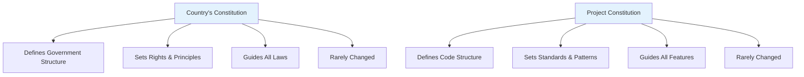
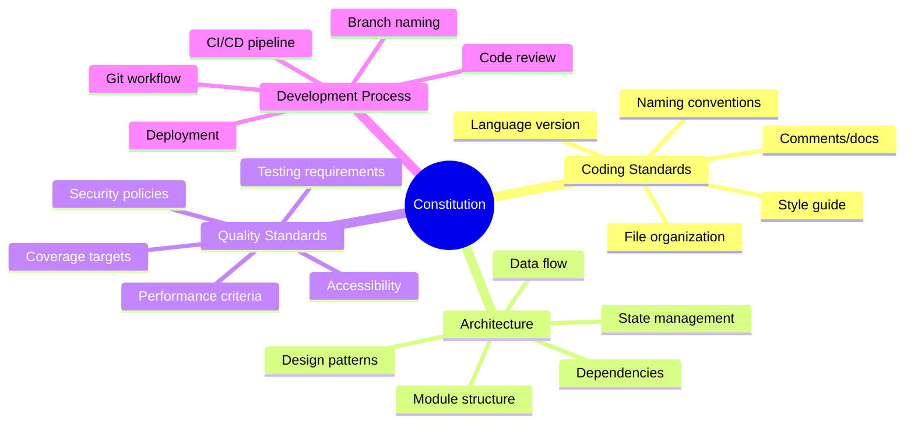
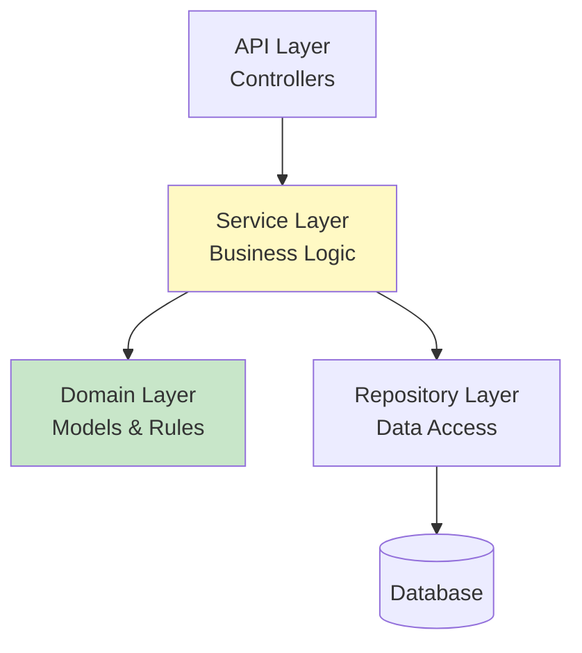
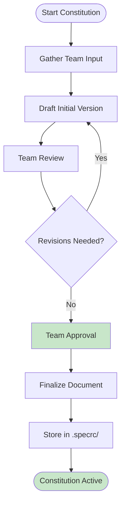

# Lesson 7: Constitution - Setting Project Principles

**Module:** 3 - Core Workflow  
**Lesson:** 7 of 25  
**Date:** November 29, 2025

---

## 📖 Concept: The Project Constitution

The **constitution** is your project's foundational document – the rulebook that governs **all** development decisions. Just like a country's constitution defines how laws are made and interpreted, your project constitution defines how code is written and structured.

### Why "Constitution"?

The term isn't arbitrary:



Both are:
- **Foundational** – Everything else builds on them
- **Authoritative** – They're the ultimate reference
- **Stable** – Changed only when absolutely necessary
- **Prescriptive** – They tell you what's allowed and what's not

---

## 🎯 What Goes in a Constitution?

### The Four Pillars



---

## 1️⃣ Coding Standards

### Purpose
Define **how** code should be written at the syntactic level.

### What to Include

## Coding Standards

### Language & Version
- **Primary Language:** TypeScript 5.3+
- **Runtime:** Node.js 20 LTS
- **Type Safety:** Strict mode enabled (`"strict": true`)

### Style Guide
- **Base:** Airbnb TypeScript Style Guide
- **Formatter:** Prettier with the following config:
  - 2-space indentation
  - Single quotes
  - Trailing commas
  - Print width: 100 characters

### Naming Conventions
- **Files:** kebab-case (e.g., `user-service.ts`)
- **Classes:** PascalCase (e.g., `UserService`)
- **Functions:** camelCase (e.g., `getUserById`)
- **Constants:** UPPER_SNAKE_CASE (e.g., `MAX_RETRY_COUNT`)
- **Interfaces:** PascalCase with 'I' prefix (e.g., `IUserRepository`)

### File Organization
```
src/
├── models/        # Data models
├── services/      # Business logic
├── repositories/  # Data access
├── controllers/   # API handlers
├── middleware/    # Express middleware
├── utils/         # Helper functions
└── types/         # TypeScript type definitions
```

### Documentation
- **Public APIs:** JSDoc comments required
- **Complex Logic:** Inline comments explaining "why"
- **Functions:** Document parameters, return types, and throws


---

## 2️⃣ Architecture Patterns

### Purpose
Define **how** components interact and are structured.

### What to Include

## Architecture

### Overall Pattern
**Hexagonal Architecture (Ports & Adapters)**
- Core business logic isolated from external concerns
- Dependencies point inward
- Adapters handle external integrations

### Layer Structure


### Design Patterns
- **Dependency Injection:** Using `tsyringe` for IoC
- **Repository Pattern:** Abstract data access
- **Factory Pattern:** For complex object creation
- **Strategy Pattern:** For interchangeable algorithms

### State Management
- **Frontend:** Zustand for React state
- **Backend:** Stateless services
- **Caching:** Redis for session and computed data

### API Design
- **Style:** RESTful with resource-oriented URLs
- **Versioning:** URL-based (`/api/v1/...`)
- **Authentication:** JWT tokens in httpOnly cookies
- **Error Format:** RFC 7807 Problem Details


---

## 3️⃣ Quality Standards

### Purpose
Define **what level** of quality is acceptable.

### What to Include

## Quality Standards

### Testing Requirements
- **Unit Tests:** Required for all service and repository methods
- **Integration Tests:** Required for all API endpoints
- **E2E Tests:** Required for critical user flows
- **Coverage Target:** Minimum 80% code coverage
- **Test Framework:** Jest + Supertest

### Performance Criteria
- **API Response Time:** P95 < 200ms for reads, < 500ms for writes
- **Database Queries:** Must use indexes, no N+1 queries
- **Frontend Load Time:** First Contentful Paint < 1.5s
- **Bundle Size:** Main bundle < 200KB gzipped

### Security Requirements
- **Input Validation:** All user inputs validated with Zod
- **SQL Injection:** Use parameterized queries only
- **XSS Protection:** Sanitize all HTML output
- **CSRF Protection:** Token-based for state-changing operations
- **Authentication:** bcrypt for passwords (cost factor 12)
- **Authorization:** Role-based access control (RBAC)

### Accessibility
- **Standard:** WCAG 2.1 Level AA compliance
- **Testing:** Automated tests with axe-core
- **Keyboard Navigation:** All interactive elements accessible
- **Screen Readers:** Proper ARIA labels and semantics

### Code Quality
- **Linting:** ESLint with Airbnb config, no errors allowed
- **Type Safety:** No `any` types without explicit justification
- **Complexity:** Cyclomatic complexity < 10 per function
- **Dependencies:** Security audit monthly, no high/critical vulnerabilities


---

## 4️⃣ Development Process

### Purpose
Define **how** the team works together.

### What to Include

## Development Process

### Git Workflow
- **Main Branch:** `main` – production-ready code only
- **Development Branch:** `develop` – integration branch
- **Feature Branches:** `feature/descriptive-name`
- **Bug Fixes:** `bugfix/descriptive-name`
- **Hotfixes:** `hotfix/descriptive-name`

### Branch Naming Convention
- Use lowercase with hyphens
- Start with type prefix
- Be descriptive but concise
- Examples:
  - `feature/user-authentication`
  - `bugfix/login-error-handling`
  - `hotfix/security-patch-jwt`

### Commit Messages
Format: `type(scope): description`

**Types:**
- `feat`: New feature
- `fix`: Bug fix
- `docs`: Documentation
- `style`: Formatting changes
- `refactor`: Code restructuring
- `test`: Adding tests
- `chore`: Maintenance

**Examples:**
```
feat(auth): add password reset functionality
fix(api): handle null values in user profile
docs(readme): update installation instructions
```

### Code Review Process
1. Create pull request with description and linked issue
2. Request review from at least 2 team members
3. All comments must be resolved
4. CI/CD pipeline must pass (tests, lint, build)
5. Squash commits before merging

### CI/CD Pipeline
**On Pull Request:**
- Run linter
- Run type checker
- Run unit tests
- Run integration tests
- Build application
- Security scan

**On Merge to Main:**
- All PR checks
- Deploy to staging
- Run E2E tests
- Deploy to production (if staging passes)


---

## 📝 Real Constitution Example

Here's a complete example for a TypeScript web application:

<details>
<summary>Click to expand full constitution example</summary>

# Project Constitution

## Project: TaskFlow - Team Collaboration Platform
**Version:** 1.0  
**Last Updated:** November 29, 2025  
**Status:** Active

---

## 1. Coding Standards

### Language & Runtime
- **Frontend:** TypeScript 5.3+, React 18+
- **Backend:** TypeScript 5.3+, Node.js 20 LTS
- **Type Safety:** Strict mode enabled in all tsconfig.json files

### Style & Formatting
- **Base Style:** Airbnb TypeScript Style Guide
- **Formatter:** Prettier
  - 2-space indentation
  - Single quotes for strings
  - Trailing commas in objects/arrays
  - Print width: 100 characters
  - Semicolons: Yes
- **Linter:** ESLint with `@typescript-eslint` and Airbnb config

### Naming Conventions
| Element | Convention | Example |
|---------|------------|---------|
| Files | kebab-case | `user-service.ts` |
| Components | PascalCase | `UserProfile.tsx` |
| Classes | PascalCase | `UserService` |
| Functions | camelCase | `getUserById()` |
| Constants | UPPER_SNAKE_CASE | `MAX_RETRIES` |
| Interfaces | PascalCase | `User` (no I prefix) |
| Types | PascalCase | `UserRole` |
| Enums | PascalCase | `UserStatus` |

### File Organization
```
frontend/
├── src/
│   ├── components/      # React components
│   ├── hooks/           # Custom React hooks
│   ├── pages/           # Page components
│   ├── services/        # API clients
│   ├── stores/          # Zustand stores
│   ├── types/           # TypeScript types
│   └── utils/           # Helper functions

backend/
├── src/
│   ├── controllers/     # HTTP handlers
│   ├── services/        # Business logic
│   ├── repositories/    # Data access
│   ├── models/          # Data models
│   ├── middleware/      # Express middleware
│   ├── types/           # TypeScript types
│   └── utils/           # Helper functions
```

### Documentation Standards
- **Public APIs:** JSDoc comments with parameter and return type descriptions
- **Complex Logic:** Inline comments explaining "why", not "what"
- **README:** Required in each major directory
- **Interfaces:** Document each property with JSDoc

---

## 2. Architecture

### Pattern
**Hexagonal Architecture (Ports & Adapters)**
- Business logic in core (services/domain)
- External concerns in adapters (controllers, repositories)
- Dependencies point inward toward core

### Design Patterns
- **Repository Pattern:** All data access through repository interfaces
- **Dependency Injection:** Use `tsyringe` for IoC container
- **Factory Pattern:** For complex object creation
- **Observer Pattern:** For event-driven features
- **Strategy Pattern:** For payment processing, notifications

### Frontend Architecture
- **Framework:** React 18 with TypeScript
- **State Management:** Zustand for global state
- **Routing:** React Router v6
- **Styling:** TailwindCSS with CSS modules for component-specific styles
- **Forms:** React Hook Form + Zod validation
- **API Client:** Axios with interceptors for auth

### Backend Architecture
- **Framework:** Express.js
- **ORM:** Prisma
- **Validation:** Zod schemas
- **Authentication:** JWT with refresh tokens
- **Authorization:** Role-based access control (RBAC)
- **Caching:** Redis for sessions and frequently accessed data

### API Design
- **Style:** RESTful, resource-oriented
- **Versioning:** URL-based (`/api/v1/...`)
- **Format:** JSON for request/response bodies
- **Errors:** RFC 7807 Problem Details format
- **Pagination:** Cursor-based for lists
- **Rate Limiting:** 100 requests per minute per user

### Database
- **Primary:** PostgreSQL 15+
- **Migrations:** Prisma Migrate
- **Naming:** snake_case for tables and columns
- **Indexes:** Required on foreign keys and frequently queried fields
- **Constraints:** Use database constraints for data integrity

---

## 3. Quality Standards

### Testing Requirements
- **Unit Tests:** Required for all services, repositories, utilities
- **Integration Tests:** Required for all API endpoints
- **E2E Tests:** Required for critical user flows (auth, payment, core features)
- **Coverage:** Minimum 80% overall, 90% for critical paths
- **Framework:** Jest for unit/integration, Playwright for E2E

### Performance Criteria
| Metric | Target |
|--------|--------|
| API Read Latency (P95) | < 200ms |
| API Write Latency (P95) | < 500ms |
| Frontend FCP | < 1.5s |
| Frontend LCP | < 2.5s |
| Frontend TTI | < 3.5s |
| Bundle Size (main) | < 200KB gzipped |
| Database Query Time | < 50ms for simple, < 200ms for complex |

### Security Requirements
- **Input Validation:** All inputs validated with Zod schemas
- **SQL Injection:** Parameterized queries only (via Prisma)
- **XSS:** Sanitize all user-generated content
- **CSRF:** Token-based protection for state changes
- **Passwords:** bcrypt with cost factor 12
- **Tokens:** JWT with 15min access, 7day refresh
- **HTTPS:** Required in production
- **CSP:** Content Security Policy headers configured
- **Dependencies:** Monthly security audits

### Accessibility
- **Standard:** WCAG 2.1 Level AA
- **Testing:** Automated with axe-core, manual testing quarterly
- **Keyboard:** All functionality accessible via keyboard
- **Screen Readers:** Proper ARIA labels and landmarks
- **Color Contrast:** Minimum 4.5:1 for text

### Code Quality
- **Linting:** ESLint must pass with 0 errors
- **Type Errors:** 0 TypeScript errors allowed
- **Complexity:** Max cyclomatic complexity of 10
- **File Length:** Max 300 lines per file (exceptions documented)
- **Function Length:** Max 50 lines per function

---

## 4. Development Process

### Git Workflow
- **Main Branch:** `main` – production code only
- **Development:** `develop` – integration branch
- **Features:** `feature/description` – branched from develop
- **Bugs:** `bugfix/description` – branched from develop
- **Hotfixes:** `hotfix/description` – branched from main

### Commit Conventions
Format: `type(scope): description`

**Types:** feat, fix, docs, style, refactor, test, chore, perf, ci

**Examples:**
```
feat(auth): implement password reset flow
fix(api): handle null user preferences
docs(readme): add deployment instructions
test(auth): add unit tests for login service
```

### Pull Request Process
1. Create feature branch from develop
2. Implement changes with tests
3. Create PR with:
   - Clear title following commit convention
   - Description of changes
   - Link to related issue/ticket
4. Request review from 2+ team members
5. Address all review comments
6. Ensure CI passes (tests, lint, build)
7. Squash commits and merge

### Code Review Checklist
- [ ] Code follows style guide
- [ ] Tests added for new functionality
- [ ] Documentation updated
- [ ] No security vulnerabilities
- [ ] Performance considerations addressed
- [ ] Error handling implemented
- [ ] Accessibility requirements met

### CI/CD Pipeline
**On Pull Request:**
- Lint code
- Type check
- Run unit tests
- Run integration tests
- Build frontend and backend
- Security scan (Snyk)

**On Merge to Develop:**
- All PR checks
- Deploy to staging
- Run E2E tests

**On Merge to Main:**
- All develop checks
- Deploy to production
- Smoke tests
- Notify team

### Release Process
1. Create release branch from develop
2. Update version numbers and changelog
3. Create PR to main
4. After approval, merge and tag release
5. Deploy to production
6. Merge back to develop

---

## 5. Dependencies

### Approved Libraries
**Frontend:**
- React, React Router, React Hook Form
- Zustand, Axios, Zod
- TailwindCSS, Headless UI
- date-fns, lodash-es

**Backend:**
- Express, Prisma, Zod
- bcrypt, jsonwebtoken
- Redis, Nodemailer
- Winston (logging)

**Testing:**
- Jest, Supertest, Playwright
- Testing Library, MSW

### Adding New Dependencies
1. Evaluate alternatives
2. Check license compatibility
3. Verify maintenance status
4. Assess bundle size impact
5. Document decision in PR

---

## 6. Monitoring & Observability

### Logging
- **Framework:** Winston
- **Levels:** error, warn, info, debug
- **Format:** JSON in production, pretty in development
- **Sensitive Data:** Never log passwords, tokens, or PII

### Metrics
- **Tool:** Prometheus + Grafana
- **Metrics:** Request rate, latency, error rate, DB performance

### Error Tracking
- **Tool:** Sentry
- **Scope:** Frontend and backend errors
- **Alerts:** Critical errors notify team immediately

---

## 7. Amendments

This constitution may be amended when:
- Technology evolves (major version upgrades)
- Team consensus reached on changes
- Performance/security requirements change

**Amendment Process:**
1. Propose change with rationale
2. Team discussion and vote
3. Update constitution
4. Communicate to all team members
5. Update related documentation

---

**Signatures:**
- Technical Lead: _________________
- Team Approval Date: November 29, 2025
```

</details>

---

## 🛠️ Creating Your Constitution

### Step-by-Step Process



### Using the `/constitution` Command

In your AI agent (GitHub Copilot, Claude, etc.):

```
You: /constitution

AI: I'll help you create a project constitution. Let me ask some questions:

1. What's your primary programming language and version?
2. What frameworks are you using?
3. What's your target deployment environment?
4. Do you have existing style guides or standards?
5. What are your testing requirements?
6. What's your git workflow?

[Answer these questions, and the AI will generate a comprehensive constitution]
```

---

## 💡 Constitution Tips

### DO ✅

- **Be Specific:** "Use Prettier with 2-space indentation" not "format code nicely"
- **Be Consistent:** If you use camelCase for functions, use it everywhere
- **Be Realistic:** Don't set 100% coverage if it's not achievable
- **Be Comprehensive:** Cover all aspects that affect code quality
- **Version It:** Track changes over time
- **Get Buy-In:** Entire team should agree

### DON'T ❌

- **Be Vague:** "Write good code" isn't helpful
- **Be Contradictory:** Don't say "no any types" then "use any for complex cases"
- **Be Unrealistic:** "100ms latency for all requests" might be impossible
- **Be Incomplete:** Skipping sections creates ambiguity
- **Set and Forget:** Review periodically
- **Ignore It:** If you can't follow it, update it

---

## 🎯 Constitution Anti-Patterns

### Anti-Pattern 1: Too Generic

**Bad:**
```markdown
## Coding Standards
- Write clean code
- Use best practices
- Follow conventions
```

**Good:**
```markdown
## Coding Standards
- Language: TypeScript 5.3+ with strict mode
- Style: Airbnb TypeScript Style Guide
- Formatter: Prettier (2-space indent, single quotes)
- Naming: camelCase functions, PascalCase classes
```

### Anti-Pattern 2: Copy-Paste Without Customization

Don't just copy someone else's constitution. Adapt to your:
- Team size and experience
- Project requirements
- Performance needs
- Security context

### Anti-Pattern 3: Tool-Specific Instead of Principle-Based

**Bad:**
```markdown
Architecture: Use Express 4.18.2 with these exact middleware
```

**Good:**
```markdown
Architecture: RESTful API design with:
- Input validation on all endpoints
- Centralized error handling
- Request logging middleware
- Authentication via JWT
```

---

## 🤔 Socratic Questions

### Question 1
**Why should a Constitution be "rarely changed" if we want to be agile and adapt to new requirements?**

<details>
<summary>Think about what changes vs. what stays stable...</summary>

The Constitution defines **how you build**, not **what you build**. Your coding standards, architecture patterns, and quality requirements should be stable over time. Individual feature requirements change frequently, but your foundational principles remain consistent. Frequent constitution changes create instability and confusion. Features are agile; foundations are stable.
</details>

### Question 2
**If you're a solo developer, do you still need a Constitution? Why or why not?**

<details>
<summary>Consider your future self and AI agents...</summary>

Yes! Even solo developers benefit because:
1. Your future self needs consistent guidelines (memory fades)
2. AI agents need explicit standards to generate consistent code
3. You might onboard collaborators later
4. It forces you to think through decisions upfront
5. It serves as project documentation

Think of it as communicating with your future self and your AI pair programmer.
</details>

### Question 3
**What happens if you start implementing features before creating a Constitution?**

<details>
<summary>Think about consistency and AI guidance...</summary>

Without a Constitution:
- AI generates code in inconsistent styles (mixing patterns, conventions)
- No shared quality standards (some features have tests, others don't)
- Harder to onboard new developers
- Technical debt accumulates from contradictory approaches
- Refactoring becomes necessary to align code

It's like building a house without building codes – you'll get a structure, but it might not be safe, consistent, or maintainable.
</details>

---

## 💡 Exercise: Draft Your Constitution

Create a constitution for a project you're working on (or a hypothetical one).

### Template to Fill Out:

```markdown
# Project Constitution

## Project: [Your Project Name]
**Date:** November 29, 2025

---

## 1. Coding Standards

### Language & Version
- Primary Language: ______________
- Runtime/Framework: ______________
- Type Safety: ______________

### Style Guide
- Base Style: ______________
- Formatter: ______________
- Indentation: ______________

### Naming Conventions
- Files: ______________
- Functions: ______________
- Classes: ______________
- Constants: ______________

### File Organization
```
[Your directory structure]
```

---

## 2. Architecture

### Pattern
[Your architecture pattern and why]

### Design Patterns
- [Pattern 1]: [When to use]
- [Pattern 2]: [When to use]

### State Management
[Your approach]

### API Design
[Your approach]

---

## 3. Quality Standards

### Testing
- Unit Tests: [Requirements]
- Coverage: [Target]
- Framework: [Tool]

### Performance
- [Metric 1]: [Target]
- [Metric 2]: [Target]

### Security
- [Requirement 1]
- [Requirement 2]

---

## 4. Development Process

### Git Workflow
- Main branch: ______________
- Feature branches: ______________
- Commit format: ______________

### Code Review
[Your process]

### CI/CD
[Your pipeline]
```

**Save this and refine it as you learn more in the upcoming lessons!**

---

## ✅ Constitution Checklist

Before moving to the next lesson, ensure your understanding:

- [ ] I know why it's called a "Constitution"
- [ ] I understand the four pillars (Coding, Architecture, Quality, Process)
- [ ] I can identify what should vs. shouldn't be in a Constitution
- [ ] I know how to use the `/constitution` command
- [ ] I understand when to update vs. keep stable
- [ ] I've drafted a basic constitution (or know how to)

---

## 🎯 Key Takeaways

1. **Constitution = Project DNA** – It defines how everything is built
2. **Write Once, Use Forever** – Rarely changed, always referenced
3. **Be Specific** – Vague guidelines don't help AI or humans
4. **Team Agreement** – Everyone must buy in
5. **Living Document** – Review periodically, but keep stable
6. **AI Dependency** – AI agents use this to generate consistent code

---

## 🚀 What's Next?

Now that you understand **project-wide principles** (Constitution), the next lesson covers **feature-specific requirements** (Specification).

**Lesson 8: Specify - Defining Requirements**

You'll learn:
- What makes a good specification
- How to write user stories and acceptance criteria
- How to handle edge cases and constraints
- Real examples of effective specs

---

## ✅ Ready to Continue?

Reply with:
- ✅ "Ready" or "Lesson 8" to move to Specifications
- 📝 Share your draft constitution for feedback
- 🤔 "Question about [topic]" for clarification

---

*Previous: [Lesson 6: Understanding the Workflow](../Module-02-Getting-Started/Lesson-06-Understanding-the-Workflow.md)*  
*Next: [Lesson 8: Specify - Defining Requirements](./Lesson-08-Specify-Defining-Requirements.md)*
