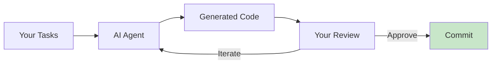
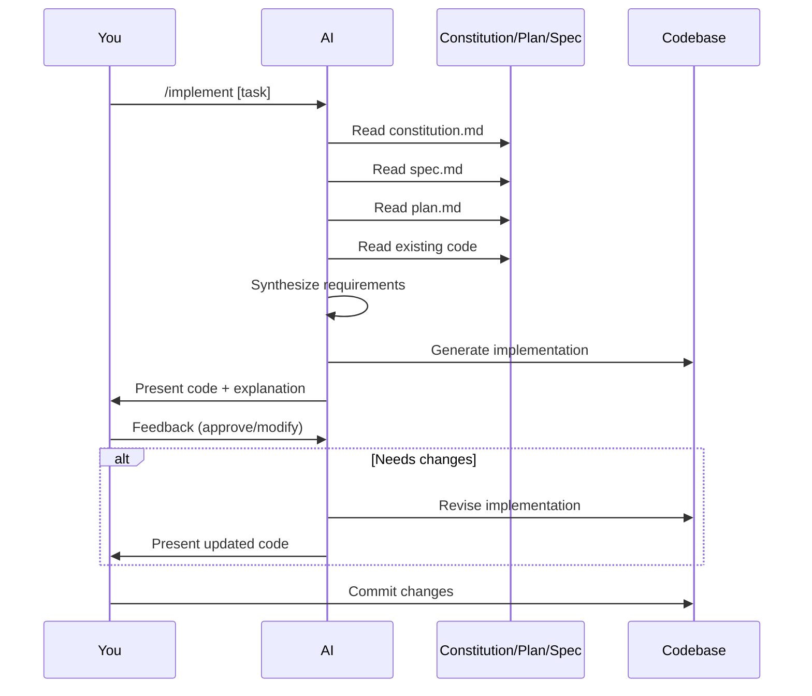
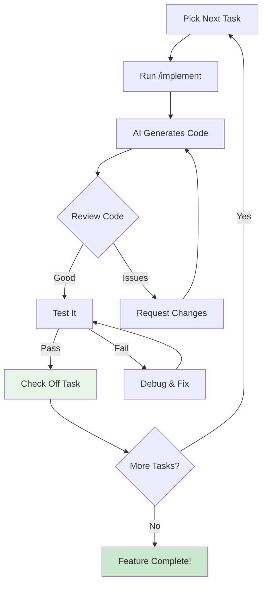
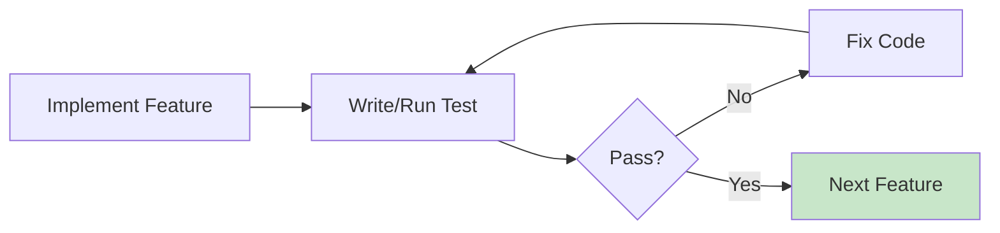
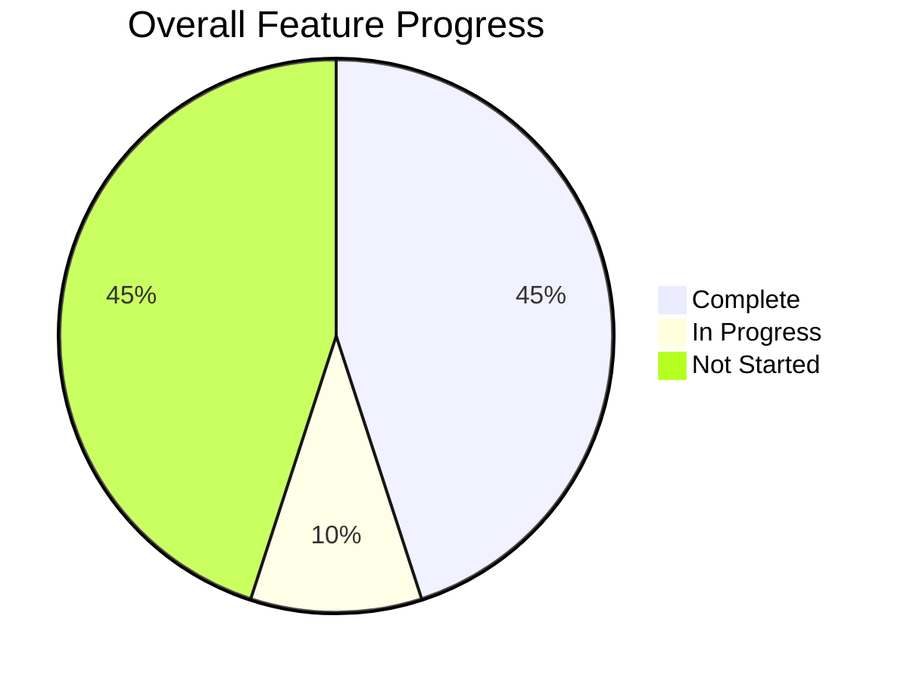
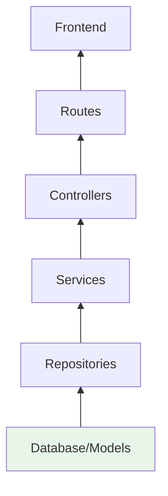
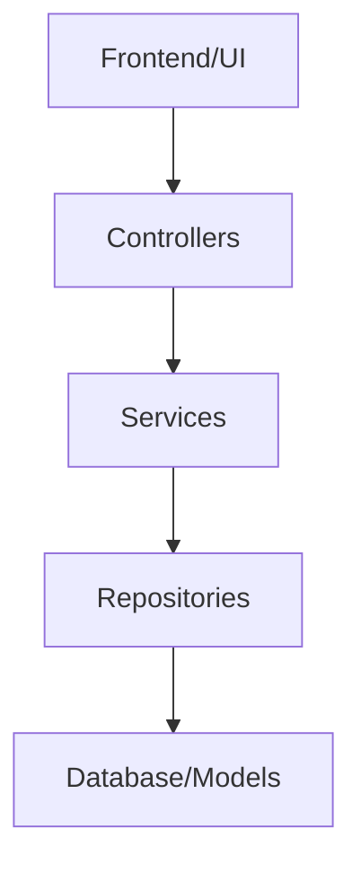

# Lesson 11: Implement - Building the Feature

**Module:** 3 - Core Workflow  
**Lesson:** 11 of 25  
**Date:** November 29, 2025

---

## 📖 Concept: AI-Assisted Implementation

The **implementation** phase is where your carefully crafted spec, plan, and tasks transform into **working code**. With Spec Kit, you're not coding manually – you're **directing an AI agent** to generate code that follows your specifications.



Think of yourself as a **conductor** and the AI as your **orchestra**. You provide the score (tasks), set the tempo (priorities), and guide the performance (review and iterate).

---

## 🎯 The `/implement` Command

### How It Works

```
You: /implement Create UserRepository.findByEmail() method

AI: I'll implement the UserRepository.findByEmail() method based on:
    - Constitution: TypeScript standards, Prisma ORM
    - Plan: Repository pattern, case-insensitive search
    - Task details: Return User | null

[AI reads context from .specrc/constitution.md and .features/auth/plan.md]

[AI generates code:]

// src/repositories/user.repository.ts
import { PrismaClient, User } from '@prisma/client';

export class UserRepository {
  constructor(private prisma: PrismaClient) {}

  async findByEmail(email: string): Promise<User | null> {
    return this.prisma.user.findUnique({
      where: { email: email.toLowerCase() }
    });
  }
}

[AI explains:]
- Normalizes email to lowercase for case-insensitive search
- Returns null if user doesn't exist
- Uses Prisma's findUnique (optimized for unique fields)
```

### The AI's Process



---

## 🛠️ Implementation Workflow

### Step-by-Step Process



### Phase 1: Pick a Task

Review your task list:

```markdown
## Phase 5: Repository Layer

- [x] Create UserRepository.create() method           ✓ Done
- [ ] Create UserRepository.findByEmail() method      ← Next
- [ ] Create UserRepository.findById() method
- [ ] Create UserRepository.updateEmailVerified()
```

**Choose the next unblocked task** (all dependencies completed).

### Phase 2: Invoke `/implement`

```
You: /implement Create UserRepository.findByEmail() method

Include context if helpful:
- File location: src/repositories/user.repository.ts
- Should be case-insensitive
- Use Prisma's findUnique
- Return User | null
```

### Phase 3: AI Generates Code

The AI will:
1. **Read your constitution** – Follows coding standards, patterns
2. **Read your plan** – Understands architecture, dependencies
3. **Read existing code** – Maintains consistency with what's already there
4. **Generate implementation** – Creates the method

### Phase 4: Review Generated Code

**What to check:**

```markdown
## Code Review Checklist

### Correctness
- [ ] Implements the requirement fully
- [ ] Handles edge cases
- [ ] Returns correct type
- [ ] No logic errors

### Quality
- [ ] Follows constitution's coding standards
- [ ] Matches plan's architecture
- [ ] Consistent with existing code
- [ ] DRY (Don't Repeat Yourself)

### Safety
- [ ] Input validation where needed
- [ ] Error handling in place
- [ ] No security vulnerabilities
- [ ] No performance issues

### Completeness
- [ ] All parameters documented
- [ ] Return types specified
- [ ] Tests mentioned or included
- [ ] No TODOs or placeholders
```

### Phase 5: Test the Code

**Manual Testing:**
```typescript
// Quick test in Node REPL or test file
const repo = new UserRepository(prismaClient);
const user = await repo.findByEmail('test@example.com');
console.log(user); // Should find user or return null
```

**Automated Testing:**
```typescript
// Write or run unit tests
describe('UserRepository.findByEmail', () => {
  it('should find user by email (case-insensitive)', async () => {
    const user = await repo.findByEmail('TEST@EXAMPLE.COM');
    expect(user).toBeDefined();
    expect(user.email).toBe('test@example.com');
  });

  it('should return null for non-existent email', async () => {
    const user = await repo.findByEmail('nonexistent@example.com');
    expect(user).toBeNull();
  });
});
```

### Phase 6: Iterate if Needed

```
You: The method works, but I notice it doesn't handle null emails. 
     Can you add validation?

AI: Good catch! I'll add input validation:

async findByEmail(email: string): Promise<User | null> {
  if (!email || typeof email !== 'string') {
    throw new Error('Email must be a non-empty string');
  }
  
  return this.prisma.user.findUnique({
    where: { email: email.toLowerCase().trim() }
  });
}

I also added .trim() to handle leading/trailing whitespace.
```

### Phase 7: Commit and Move On

```bash
git add src/repositories/user.repository.ts
git commit -m "feat(repo): implement UserRepository.findByEmail()"
```

Mark task as complete:
```markdown
- [x] Create UserRepository.findByEmail() method      ✓ Done
```

---

## 💬 Effective Prompting

### Good Prompts

✅ **Specific with context:**
```
/implement Create AuthService.register() method

Requirements:
- Takes email and password parameters
- Validates email doesn't already exist
- Hashes password with PasswordUtil
- Creates user via UserRepository
- Generates verification token
- Sends verification email via EmailService
- Returns UserDTO (never expose password hash)
- Throws error if email exists
```

✅ **References documentation:**
```
/implement Add rate limiting middleware

Following the plan's specification:
- 5 requests per hour for registration endpoints
- 10 requests per 15 minutes for login
- Use express-rate-limit library
- Store in Redis for production, memory for dev
- Return 429 with clear error message when exceeded
```

### Bad Prompts

❌ **Too vague:**
```
/implement Make authentication work
```

❌ **Mixing multiple tasks:**
```
/implement Create all repositories and services and controllers
```

❌ **Ignoring existing context:**
```
/implement Build a user repository (doesn't mention plan, constitution, or existing code)
```

### Pro Tips

**1. Reference Existing Code:**
```
/implement Create LoginForm component

Similar to RegistrationForm (src/components/auth/RegistrationForm.tsx) but:
- Only email and password fields (no password strength indicator)
- No "Already have account?" link
- Redirect to /dashboard on success
```

**2. Specify Error Handling:**
```
/implement Implement login endpoint

Error handling:
- 401 for invalid credentials (generic message, don't reveal if email or password wrong)
- 403 for unverified email (prompt to check email)
- 429 for rate limit exceeded
- 500 for server errors (log details, return generic message to user)
```

**3. Include Examples:**
```
/implement Add password validation

Requirements:
- Minimum 8 characters
- At least 1 uppercase: /[A-Z]/
- At least 1 number: /[0-9]/
- At least 1 special char: /[^A-Za-z0-9]/
- Reject common passwords (use list from https://github.com/danielmiessler/SecLists)

Example valid: "SecureP@ss123"
Example invalid: "password" (no uppercase, number, special)
```

---

## 🔍 Code Review Principles

### What AI Does Well

✅ **Strengths:**
- Follows patterns consistently
- Generates boilerplate quickly
- Implements algorithms correctly
- Maintains style consistency
- Handles common edge cases

### What You Must Check

⚠️ **Human verification needed:**

**1. Business Logic:**
```typescript
// AI might generate:
if (user.age >= 18) {
  allowAccess();
}

// But your business rule might be:
if (user.age >= 21 && user.country === 'US') {
  allowAccess();
} else if (user.age >= 18 && user.country !== 'US') {
  allowAccess();
}
```

**2. Security:**
```typescript
// AI might generate:
const userId = req.query.userId;
const user = await userRepo.findById(userId);

// But you need to verify authorization:
const userId = req.query.userId;
if (userId !== req.user.id && !req.user.isAdmin) {
  throw new ForbiddenError();
}
const user = await userRepo.findById(userId);
```

**3. Performance:**
```typescript
// AI might generate (N+1 query):
const users = await userRepo.findAll();
for (const user of users) {
  user.posts = await postRepo.findByUserId(user.id);
}

// Optimize to:
const users = await userRepo.findAllWithPosts();
// Using a join or eager loading
```

**4. Edge Cases:**
```typescript
// AI might generate:
const averageAge = users.reduce((sum, u) => sum + u.age, 0) / users.length;

// But what if users array is empty?
const averageAge = users.length > 0 
  ? users.reduce((sum, u) => sum + u.age, 0) / users.length 
  : 0;
```

---

## 🐛 Common Implementation Issues

### Issue 1: AI Misunderstands Requirements

**Symptom:** Generated code doesn't match specification

**Solution:**
```
You: This implementation is close, but the spec says emails should be case-insensitive.
     The current code is case-sensitive.

AI: You're right! I'll update it to normalize emails to lowercase:

// Before
where: { email: email }

// After
where: { email: email.toLowerCase() }
```

### Issue 2: Inconsistent with Existing Code

**Symptom:** New code uses different patterns than existing code

**Solution:**
```
You: I notice the existing repositories use dependency injection via constructor,
     but this new code creates Prisma client directly. Can you match the existing pattern?

AI: Good catch! I'll use constructor injection:

export class PostRepository {
  constructor(private prisma: PrismaClient) {}
  // ...
}
```

### Issue 3: Missing Error Handling

**Symptom:** Code doesn't handle errors gracefully

**Solution:**
```
You: What happens if the email service fails? Should we still create the user?

AI: Great question! According to the spec, email verification is critical.
    I'll wrap the email sending in a try-catch and handle it appropriately:

try {
  await this.emailService.sendVerificationEmail(user.email, token);
} catch (error) {
  // Log error but don't fail registration
  logger.error('Failed to send verification email', { userId: user.id, error });
  // User can request resend later
}
```

### Issue 4: Performance Problems

**Symptom:** Code works but is slow

**Solution:**
```
You: This queries the database for each user in a loop. Can we optimize?

AI: Yes! We can use a single query with a WHERE IN clause:

// Before (N queries)
for (const id of userIds) {
  const user = await repo.findById(id);
  users.push(user);
}

// After (1 query)
const users = await repo.findByIds(userIds);
```

---

## 🧪 Testing During Implementation

### Test As You Go

**Don't wait until the end!**



### Unit Tests

**After implementing a method:**

```
You: /implement Write unit test for UserRepository.findByEmail()

AI: I'll create a test file:

// src/repositories/__tests__/user.repository.test.ts
import { UserRepository } from '../user.repository';
import { PrismaClient } from '@prisma/client';

const prisma = new PrismaClient();
const repo = new UserRepository(prisma);

describe('UserRepository.findByEmail', () => {
  beforeAll(async () => {
    // Set up test database
    await prisma.user.create({
      data: { email: 'test@example.com', passwordHash: 'hash' }
    });
  });

  afterAll(async () => {
    // Clean up
    await prisma.user.deleteMany({});
    await prisma.$disconnect();
  });

  it('should find user by email (case-insensitive)', async () => {
    const user = await repo.findByEmail('TEST@EXAMPLE.COM');
    expect(user).toBeDefined();
    expect(user!.email).toBe('test@example.com');
  });

  it('should return null for non-existent email', async () => {
    const user = await repo.findByEmail('nonexistent@example.com');
    expect(user).toBeNull();
  });
});
```

### Integration Tests

**After implementing an endpoint:**

```
You: /implement Write integration test for POST /api/v1/auth/register

AI: I'll create an integration test using Supertest:

// src/__tests__/integration/auth.test.ts
import request from 'supertest';
import { app } from '../../app';

describe('POST /api/v1/auth/register', () => {
  it('should register a new user', async () => {
    const response = await request(app)
      .post('/api/v1/auth/register')
      .send({
        email: 'newuser@example.com',
        password: 'SecureP@ss123'
      })
      .expect(201);

    expect(response.body.success).toBe(true);
    expect(response.body.data.email).toBe('newuser@example.com');
  });

  it('should reject weak passwords', async () => {
    const response = await request(app)
      .post('/api/v1/auth/register')
      .send({
        email: 'newuser@example.com',
        password: 'weak'
      })
      .expect(400);

    expect(response.body.success).toBe(false);
    expect(response.body.error.code).toBe('VALIDATION_ERROR');
  });
});
```

---

## 📊 Progress Tracking

### Update Your Task List

```markdown
## Phase 5: Repository Layer (Estimated: 4-5 hours)

- [x] Create UserRepository.create() method           ✓ Done (45min)
- [x] Create UserRepository.findByEmail() method      ✓ Done (30min)
- [x] Create UserRepository.findById() method         ✓ Done (20min)
- [ ] Create UserRepository.updateEmailVerified()     ← Working on this
- [ ] Create VerificationTokenRepository

**Phase Progress:** 3/5 tasks (60%)
**Time Spent:** 1hr 35min / 4-5hr estimated
```

### Visual Progress



---

## 🎯 Implementation Strategy

### Order of Implementation

**Bottom-Up Approach (Recommended):**



**Why?** Each layer depends on the one below. You can test each layer independently.

**Top-Down Approach (Alternative):**



**Why?** Start with user-facing features, stub lower layers, then fill in.

**Hybrid Approach (Best for Learning):**

1. **Core foundation first** – Database, models, utilities
2. **One vertical slice** – Complete one feature end-to-end
3. **Expand horizontally** – Add more features using the pattern

### Dealing with Blockers

**Blocked on external dependency?**

```
Task: Implement email verification
Blocker: SendGrid API key not available yet

Solution:
/implement Create ConsoleEmailProvider that logs emails instead of sending

[Continue with rest of implementation using console provider]
[Swap to SendGrid later when key is available]
```

**Blocked on another task?**

```
Task: Implement AuthService.register()
Blocker: UserRepository.create() not done yet

Solution:
- Finish UserRepository first (dependency)
- OR: Create a mock UserRepository for testing
- OR: Move to independent task (like PasswordUtil)
```

---

## 💡 Real Implementation Session

<details>
<summary>Click to see a realistic implementation session</summary>

```markdown
# Implementation Session: AuthService.register()

## Task
Create AuthService.register() method that:
- Validates email doesn't exist
- Hashes password
- Creates user
- Generates verification token
- Sends verification email
- Returns UserDTO

---

## Step 1: Initial Implementation

**You:** /implement Create AuthService.register() method

Follow the plan in .features/auth/plan.md:
- Use UserRepository to check/create user
- Use PasswordUtil to hash password
- Use EmailService to send verification
- Throw error if email already exists

**AI generates:**
```typescript
// src/services/auth.service.ts
import { UserRepository } from '../repositories/user.repository';
import { EmailService } from './email.service';
import { PasswordUtil } from '../utils/password.util';
import { UserDTO } from '../types/user.types';

export class AuthService {
  constructor(
    private userRepository: UserRepository,
    private emailService: EmailService
  ) {}

  async register(email: string, password: string): Promise<UserDTO> {
    // Check if user exists
    const existingUser = await this.userRepository.findByEmail(email);
    if (existingUser) {
      throw new Error('Email already registered');
    }

    // Hash password
    const passwordHash = await PasswordUtil.hash(password);

    // Create user
    const user = await this.userRepository.create({
      email: email.toLowerCase(),
      passwordHash,
      emailVerified: false
    });

    // Generate verification token
    const token = crypto.randomBytes(32).toString('hex');
    
    // Send verification email
    await this.emailService.sendVerificationEmail(user.email, token);

    // Return DTO (no password hash)
    return {
      id: user.id,
      email: user.email,
      emailVerified: user.emailVerified,
      createdAt: user.createdAt
    };
  }
}
```

---

## Step 2: Review & Iterate

**You:** Good start! A few issues:

1. Error should be more specific (custom error class)
2. Verification token should be stored in database
3. What if email service fails?

**AI refines:**
```typescript
import { EmailAlreadyExistsError } from '../errors';
import { TokenRepository } from '../repositories/token.repository';

export class AuthService {
  constructor(
    private userRepository: UserRepository,
    private tokenRepository: TokenRepository,
    private emailService: EmailService
  ) {}

  async register(email: string, password: string): Promise<UserDTO> {
    // Check if user exists
    const existingUser = await this.userRepository.findByEmail(email);
    if (existingUser) {
      throw new EmailAlreadyExistsError('This email is already registered');
    }

    // Hash password
    const passwordHash = await PasswordUtil.hash(password);

    // Create user
    const user = await this.userRepository.create({
      email: email.toLowerCase(),
      passwordHash,
      emailVerified: false
    });

    // Generate and store verification token
    const token = crypto.randomBytes(32).toString('hex');
    const tokenHash = crypto.createHash('sha256').update(token).digest('hex');
    
    const expiresAt = new Date(Date.now() + 24 * 60 * 60 * 1000); // 24 hours
    
    await this.tokenRepository.create({
      userId: user.id,
      tokenHash,
      expiresAt
    });

    // Send verification email (non-blocking)
    try {
      await this.emailService.sendVerificationEmail(user.email, token);
    } catch (error) {
      // Log error but don't fail registration
      // User can request resend later
      console.error('Failed to send verification email:', error);
    }

    // Return DTO
    return {
      id: user.id,
      email: user.email,
      emailVerified: user.emailVerified,
      createdAt: user.createdAt
    };
  }
}
```

---

## Step 3: Test

**You:** /implement Write unit test for AuthService.register()

**AI generates test:**
```typescript
// src/services/__tests__/auth.service.test.ts
import { AuthService } from '../auth.service';
import { EmailAlreadyExistsError } from '../../errors';

// Mock dependencies
const mockUserRepo = {
  findByEmail: jest.fn(),
  create: jest.fn()
};

const mockTokenRepo = {
  create: jest.fn()
};

const mockEmailService = {
  sendVerificationEmail: jest.fn()
};

const authService = new AuthService(
  mockUserRepo as any,
  mockTokenRepo as any,
  mockEmailService as any
);

describe('AuthService.register', () => {
  beforeEach(() => {
    jest.clearAllMocks();
  });

  it('should register a new user successfully', async () => {
    mockUserRepo.findByEmail.mockResolvedValue(null);
    mockUserRepo.create.mockResolvedValue({
      id: '123',
      email: 'test@example.com',
      passwordHash: 'hash',
      emailVerified: false,
      createdAt: new Date()
    });

    const result = await authService.register('test@example.com', 'password123');

    expect(result.email).toBe('test@example.com');
    expect(result).not.toHaveProperty('passwordHash');
    expect(mockEmailService.sendVerificationEmail).toHaveBeenCalled();
  });

  it('should throw error if email already exists', async () => {
    mockUserRepo.findByEmail.mockResolvedValue({ 
      id: '123', 
      email: 'test@example.com' 
    });

    await expect(
      authService.register('test@example.com', 'password123')
    ).rejects.toThrow(EmailAlreadyExistsError);
  });

  it('should not fail if email service fails', async () => {
    mockUserRepo.findByEmail.mockResolvedValue(null);
    mockUserRepo.create.mockResolvedValue({
      id: '123',
      email: 'test@example.com',
      emailVerified: false,
      createdAt: new Date()
    });
    mockEmailService.sendVerificationEmail.mockRejectedValue(new Error('Email failed'));

    // Should not throw
    const result = await authService.register('test@example.com', 'password123');
    expect(result).toBeDefined();
  });
});
```

**Run tests:**
```bash
npm test -- auth.service.test.ts
```

**Output:**
```
 PASS  src/services/__tests__/auth.service.test.ts
  AuthService.register
    ✓ should register a new user successfully (25ms)
    ✓ should throw error if email already exists (10ms)
    ✓ should not fail if email service fails (15ms)

Test Suites: 1 passed, 1 total
Tests:       3 passed, 3 total
```

---

## Step 4: Commit

```bash
git add src/services/auth.service.ts
git add src/services/__tests__/auth.service.test.ts
git commit -m "feat(auth): implement AuthService.register() with email verification

- Validates email uniqueness
- Hashes password with bcrypt
- Generates verification token (stored hashed)
- Sends verification email (non-blocking)
- Returns UserDTO without password hash
- Includes comprehensive unit tests
"
```

**Update task list:**
```markdown
- [x] Create AuthService.register() method            ✓ Done (2hr)
```

---

**Session Complete! ✓**

**Time:** 2 hours  
**Tests:** 3/3 passing  
**Coverage:** 100% for this method
```

</details>

---

## 🤔 Socratic Questions

### Question 1
**Why review AI-generated code if the AI follows the constitution and plan?**

<details>
<summary>Think about limitations and context...</summary>

**AI isn't perfect:**

1. **Misinterprets requirements** – Might miss nuances in spec
2. **Misses business logic** – Doesn't know your specific domain rules
3. **Security blind spots** – Might not catch all vulnerabilities
4. **Performance issues** – Doesn't always optimize queries
5. **Edge cases** – Might not handle all error scenarios

**You provide:**
- Domain expertise
- Business rule knowledge
- Security awareness
- Performance intuition
- Real-world context

**AI + Human = Best Results**

Think of AI as a junior developer: Fast, capable, but needs guidance and review!
</details>

### Question 2
**Should you implement all tasks sequentially, or can you work on multiple tasks in parallel?**

<details>
<summary>Consider dependencies and focus...</summary>

**Sequential (one at a time):**
✅ **Pros:**
- Deep focus on one thing
- Easier to test each piece
- Less context switching
- Clear progress

❌ **Cons:**
- Might be blocked by dependencies
- Could be slower overall

**Parallel (multiple at once):**
✅ **Pros:**
- Maximize productivity
- Work around blockers
- Faster completion
- Utilize waiting time

❌ **Cons:**
- Context switching overhead
- Risk of integration issues
- Harder to track progress

**Best Approach: Hybrid**
- Work sequentially within a phase
- Parallelize independent tasks across phases
- Example: While waiting for code review, start next independent task

**Rule:** Don't have more than 2-3 tasks "in progress" simultaneously.
</details>

### Question 3
**When the AI generates code that works but doesn't follow best practices, should you accept it or iterate?**

<details>
<summary>Think about technical debt and maintainability...</summary>

**Always iterate for quality!**

**Why:**
1. **Technical debt compounds** – Small issues become big problems
2. **Sets precedent** – AI learns from existing code patterns
3. **Harder to fix later** – Refactoring is more expensive than getting it right initially
4. **Team impact** – Others will copy the pattern

**Example:**

AI generates:
```typescript
const user = await db.query('SELECT * FROM users WHERE id = ' + userId);
```

**Problems:**
- SQL injection vulnerability
- Not using ORM (against plan)
- Selecting all columns (inefficient)

**Iterate:**
```
You: This uses raw SQL and is vulnerable to injection. 
     Can you use Prisma as specified in the plan?

AI: You're right! Here's the corrected version:
const user = await prisma.user.findUnique({
  where: { id: userId },
  select: { id: true, email: true, emailVerified: true }
});
```

**Principle:** Don't settle for "works" – aim for "works well"!
</details>

---

## 💡 Exercise: Implementation Practice

**Choose one of these scenarios and practice implementation:**

### Scenario 1: Simple Utility
```
Task: Create a utility function that formats dates consistently

Requirements:
- Input: Date object
- Output: String in format "Nov 29, 2025 at 3:45 PM"
- Handle invalid dates gracefully
- Use Intl.DateTimeFormat for localization

Write:
1. The /implement prompt you'd use
2. Expected generated code
3. How you'd test it
4. What edge cases you'd check
```

### Scenario 2: API Endpoint
```
Task: Create POST /api/v1/users/me/avatar endpoint

Requirements:
- Accepts multipart/form-data with image file
- Validates file is image (jpg, png, gif)
- Validates file size < 5MB
- Uploads to S3 or local storage
- Updates user.avatarUrl in database
- Returns updated user object

Write:
1. The /implement prompt with full context
2. What questions you'd ask the AI
3. How you'd break this into subtasks if needed
4. What tests you'd write
```

---

## ✅ Implementation Checklist

Before moving to the next lesson, ensure:

- [ ] I understand how to use `/implement` command
- [ ] I know how to provide context to the AI
- [ ] I can review generated code effectively
- [ ] I know when to iterate vs. accept
- [ ] I understand the importance of testing during implementation
- [ ] I can track progress and update task lists
- [ ] I know how to handle blockers and dependencies

---

## 🎯 Key Takeaways

1. **AI is Your Pair Programmer** – Direct it, don't write code yourself
2. **Context is King** – AI needs constitution, plan, spec to generate right code
3. **Review Everything** – AI is capable but not infallible
4. **Test As You Go** – Don't accumulate untested code
5. **Iterate for Quality** – Don't settle for "it works"
6. **Track Progress** – Check off tasks, measure completion
7. **Bottom-Up Usually Best** – Build foundation first

---

## 🚀 What's Next?

You now understand all five phases individually. The next lesson ties it all together with an **end-to-end workflow example**.

**Lesson 12: End-to-End Workflow Practice**

You'll see:
- Complete feature implementation from start to finish
- Real prompts and AI responses
- Common pitfalls and how to avoid them
- Time estimates and progress tracking

---

## ✅ Ready to Continue?

Reply with:
- ✅ "Ready" or "Lesson 12" for the complete workflow example
- 📝 Share your exercise responses for feedback
- 🤔 "Question about [topic]" for clarification

---

*Previous: [Lesson 10: Tasks - Breaking Down Work](./Lesson-10-Tasks-Breaking-Down-Work.md)*  
*Next: [Lesson 12: End-to-End Workflow Practice](./Lesson-12-End-to-End-Workflow-Practice.md)*
