# Lesson 12: End-to-End Workflow Practice

**Module:** 3 - Core Workflow  
**Lesson:** 12 of 25  
**Date:** November 29, 2025

---

## 📖 Concept: Putting It All Together

You've learned each phase of the Spec Kit workflow. Now let's walk through a **complete feature implementation** from initialization to deployment.


---

## 🎯 Complete Example: "Dark Mode" Feature

Let's implement a dark mode toggle for a web application.

### Timeline Overview

```mermaid
gantt
    title Dark Mode Feature Implementation
    dateFormat  HH:mm
    section Setup
    Init & Constitution    :done, 00:00, 1h
    section Specify
    Write Specification    :done, 01:00, 2h
    section Plan
    Technical Design       :done, 03:00, 2h
    section Tasks
    Break Down Work        :done, 05:00, 1h
    section Implement
    Build Components       :active, 06:00, 6h
    section Test
    Testing & QA           :12:00, 2h
    section Deploy
    Merge & Deploy         :14:00, 1h
```



**Total Time: ~15 hours** (spread over 2-3 days)

---

## Phase 1: Project Initialization (30 minutes)

### Step 1: Initialize Project

```bash
cd my-web-app
specify init
```

**Output:**
```
✓ Created .specrc/ directory
✓ Created .features/ directory
✓ Git repository detected
✓ Ready for constitution
```

### Step 2: Create Constitution

```
You: /constitution

AI: I'll help you create a project constitution. Let me ask some questions:

1. What's your primary tech stack?
You: React + TypeScript, Node.js backend, TailwindCSS

2. What testing framework?
You: Jest for unit tests, Playwright for E2E

3. What's your code style preference?
You: Airbnb style guide, Prettier with 2-space indent

[AI generates comprehensive constitution in .specrc/constitution.md]
```

**Created:** `.specrc/constitution.md` (project-wide standards)

---

## Phase 2: Feature Branch & Specification (2 hours)

### Step 1: Create Feature Branch

```bash
git checkout -b feature/dark-mode
```

### Step 2: Write Specification

```
You: /specify

AI: What feature are you building?

You: I want to add a dark mode toggle that:
- Switches between light and dark themes
- Persists user preference
- Applies throughout the entire app
- Has smooth transitions
- Defaults to system preference

AI: Great! I'll create a detailed specification...

[AI generates .features/dark-mode/spec.md]
```

**Created:** `.features/dark-mode/spec.md`

<details>
<summary>View Generated Specification</summary>

```markdown
# Feature Specification: Dark Mode Toggle

## Problem Statement
Users want the ability to switch between light and dark themes to reduce eye strain and match personal preferences.

## User Story
**As a** user  
**I want to** toggle between light and dark modes  
**So that** I can use the app comfortably in different lighting conditions

## Functional Requirements

1. **Theme Toggle**
   - Button or switch to toggle themes
   - Immediate visual feedback
   - Accessible to keyboard and screen readers

2. **Persistence**
   - User preference saved to localStorage
   - Preference persists across sessions
   - Preference syncs across tabs

3. **Default Behavior**
   - Respect system preference on first visit
   - Use prefers-color-scheme media query

4. **Scope**
   - All UI components support both themes
   - Consistent color palette
   - Readable text contrast in both modes

## Acceptance Criteria

**Given** I am a new user  
**When** I visit the app for the first time  
**Then** The theme matches my system preference

**Given** I toggle dark mode on  
**When** I refresh the page  
**Then** Dark mode is still active

**Given** I have dark mode enabled  
**When** I open the app in a new tab  
**Then** Dark mode is enabled there too

## UI/UX

- Sun/moon icon toggle in header
- Smooth 200ms transition between themes
- No flash of wrong theme on load

## Colors

### Light Mode
- Background: #FFFFFF
- Text: #1F2937
- Primary: #3B82F6

### Dark Mode
- Background: #1F2937
- Text: #F9FAFB
- Primary: #60A5FA
```

</details>

---

## Phase 3: Technical Plan (2 hours)

```
You: /plan

AI: Based on your specification and constitution, I'll create a technical implementation plan...

[AI generates .features/dark-mode/plan.md]
```

**Created:** `.features/dark-mode/plan.md`

<details>
<summary>View Generated Plan</summary>

```markdown
# Technical Plan: Dark Mode

## Architecture

### Approach
**React Context + Custom Hook + TailwindCSS**

- Context provides theme state globally
- Custom hook for easy access
- TailwindCSS dark: variant for styling
- localStorage for persistence

## Implementation Strategy

### 1. Theme Context
```typescript
// src/contexts/ThemeContext.tsx
interface ThemeContextType {
  theme: 'light' | 'dark';
  toggleTheme: () => void;
}
```

### 2. Theme Hook
```typescript
// src/hooks/useTheme.ts
export const useTheme = () => {
  const context = useContext(ThemeContext);
  return context;
};
```

### 3. TailwindCSS Configuration
```javascript
// tailwind.config.js
module.exports = {
  darkMode: 'class', // Use class-based dark mode
  theme: {
    extend: {
      colors: {
        // Custom color palette
      }
    }
  }
}
```

### 4. Theme Toggle Component
```typescript
// src/components/ThemeToggle.tsx
// Button with sun/moon icon
// Calls toggleTheme from hook
```

## Data Flow


## File Changes

**New Files:**
- `src/contexts/ThemeContext.tsx`
- `src/hooks/useTheme.ts`
- `src/components/ThemeToggle.tsx`

**Modified Files:**
- `src/App.tsx` (wrap with ThemeProvider)
- `tailwind.config.js` (enable dark mode)
- All component styles (add dark: variants)
```

</details>

---

## Phase 4: Task Breakdown (1 hour)

```
You: /tasks

AI: I'll create a comprehensive task list based on your plan...

[AI generates .features/dark-mode/tasks.md]
```

**Created:** `.features/dark-mode/tasks.md`

<details>
<summary>View Task List</summary>

```markdown
# Implementation Tasks: Dark Mode

## Phase 1: Setup (1 hour)
- [ ] Configure TailwindCSS dark mode (set darkMode: 'class')
- [ ] Define color palette in Tailwind config
- [ ] Create theme types (src/types/theme.types.ts)

## Phase 2: Core Logic (2 hours)
- [ ] Create ThemeContext with state and toggle function
- [ ] Implement localStorage persistence
- [ ] Implement system preference detection
- [ ] Create useTheme custom hook

## Phase 3: UI Component (1 hour)
- [ ] Create ThemeToggle component with sun/moon icon
- [ ] Add smooth transition animations
- [ ] Add accessibility (ARIA labels, keyboard support)

## Phase 4: Integration (2 hours)
- [ ] Wrap App with ThemeProvider
- [ ] Add ThemeToggle to header
- [ ] Update all component styles with dark: variants
- [ ] Test theme persistence

## Phase 5: Testing (1 hour)
- [ ] Write unit tests for ThemeContext
- [ ] Write unit tests for useTheme hook
- [ ] Write E2E test for toggle and persistence
- [ ] Test system preference detection
```

</details>

---

## Phase 5: Implementation (6 hours)

### Task 1: Configure Tailwind

```
You: /implement Configure TailwindCSS for dark mode

Update tailwind.config.js:
- Set darkMode: 'class'
- Add custom colors for light/dark themes

AI: I'll update the Tailwind configuration...
```

**Generated:**
```javascript
// tailwind.config.js
module.exports = {
  darkMode: 'class',
  content: ['./src/**/*.{js,jsx,ts,tsx}'],
  theme: {
    extend: {
      colors: {
        background: {
          light: '#FFFFFF',
          dark: '#1F2937'
        },
        text: {
          light: '#1F2937',
          dark: '#F9FAFB'
        }
      }
    }
  }
}
```

✅ **Task complete** (15 minutes)

### Task 2: Create Theme Context

```
You: /implement Create ThemeContext

Requirements:
- Detect system preference on mount
- Store preference in localStorage
- Provide theme state and toggle function
- Update document.documentElement.classList

AI: I'll create the ThemeContext...
```

**Generated:**
```typescript
// src/contexts/ThemeContext.tsx
import React, { createContext, useState, useEffect, ReactNode } from 'react';

type Theme = 'light' | 'dark';

interface ThemeContextType {
  theme: Theme;
  toggleTheme: () => void;
}

export const ThemeContext = createContext<ThemeContextType | undefined>(undefined);

export const ThemeProvider: React.FC<{ children: ReactNode }> = ({ children }) => {
  const [theme, setTheme] = useState<Theme>(() => {
    // Check localStorage first
    const stored = localStorage.getItem('theme');
    if (stored === 'light' || stored === 'dark') {
      return stored;
    }
    
    // Fall back to system preference
    return window.matchMedia('(prefers-color-scheme: dark)').matches ? 'dark' : 'light';
  });

  useEffect(() => {
    // Update DOM
    document.documentElement.classList.remove('light', 'dark');
    document.documentElement.classList.add(theme);
    
    // Persist to localStorage
    localStorage.setItem('theme', theme);
  }, [theme]);

  const toggleTheme = () => {
    setTheme(prev => prev === 'light' ? 'dark' : 'light');
  };

  return (
    <ThemeContext.Provider value={{ theme, toggleTheme }}>
      {children}
    </ThemeContext.Provider>
  );
};
```

✅ **Task complete** (45 minutes)

### Task 3: Create useTheme Hook

```
You: /implement Create useTheme custom hook

AI: Simple hook to access ThemeContext...
```

**Generated:**
```typescript
// src/hooks/useTheme.ts
import { useContext } from 'react';
import { ThemeContext } from '../contexts/ThemeContext';

export const useTheme = () => {
  const context = useContext(ThemeContext);
  if (!context) {
    throw new Error('useTheme must be used within ThemeProvider');
  }
  return context;
};
```

✅ **Task complete** (10 minutes)

### Task 4: Create Toggle Component

```
You: /implement Create ThemeToggle component

Requirements:
- Sun icon for light mode, moon for dark mode
- Smooth transition animation
- Accessible (ARIA label, keyboard support)
- Use heroicons for icons

AI: I'll create the toggle component...
```

**Generated:**
```typescript
// src/components/ThemeToggle.tsx
import React from 'react';
import { SunIcon, MoonIcon } from '@heroicons/react/24/outline';
import { useTheme } from '../hooks/useTheme';

export const ThemeToggle: React.FC = () => {
  const { theme, toggleTheme } = useTheme();

  return (
    <button
      onClick={toggleTheme}
      className="p-2 rounded-lg transition-colors hover:bg-gray-200 dark:hover:bg-gray-700"
      aria-label={`Switch to ${theme === 'light' ? 'dark' : 'light'} mode`}
    >
      {theme === 'light' ? (
        <MoonIcon className="w-5 h-5 text-gray-700" />
      ) : (
        <SunIcon className="w-5 h-5 text-gray-200" />
      )}
    </button>
  );
};
```

✅ **Task complete** (30 minutes)

### Task 5-7: Integration

```bash
# Wrap App with ThemeProvider
# Add ThemeToggle to Header
# Update all components with dark: variants
```

**Time:** 2 hours (updating all existing components)

### Task 8-10: Testing

```
You: /implement Write tests for ThemeContext and toggle functionality

AI: I'll create comprehensive tests...
```

**Generated tests, all passing** ✅

**Time:** 1 hour

---

## Phase 6: Review & Merge (1 hour)

### Step 1: Self-Review

```markdown
## Review Checklist

- [x] All tasks completed
- [x] Tests passing (15/15)
- [x] No console errors
- [x] Works across browsers
- [x] Accessible (keyboard + screen reader)
- [x] Theme persists correctly
- [x] System preference respected
- [x] Smooth transitions
```

### Step 2: Create Pull Request

```bash
git add .
git commit -m "feat: implement dark mode toggle

- Add ThemeContext with localStorage persistence
- Create useTheme hook for easy access
- Add ThemeToggle component with sun/moon icons
- Update all components with dark mode styles
- Add comprehensive tests (100% coverage)
- Support system preference detection

Closes #123
"

git push origin feature/dark-mode
```

### Step 3: Code Review

**Reviewer feedback:** "Great work! Approved ✅"

### Step 4: Merge

```bash
git checkout main
git merge feature/dark-mode
git push origin main
```

---

## 📊 Final Metrics

### Time Breakdown

| Phase | Estimated | Actual | Variance |
|-------|-----------|--------|----------|
| Constitution | 1h | 0.5h | -0.5h ✅ |
| Specification | 2h | 2h | 0h |
| Plan | 2h | 1.5h | -0.5h ✅ |
| Tasks | 1h | 1h | 0h |
| Implementation | 6h | 7h | +1h ⚠️ |
| Testing | 1h | 0.5h | -0.5h ✅ |
| Review & Merge | 1h | 1h | 0h |
| **Total** | **14h** | **13.5h** | **-0.5h** |

### Quality Metrics

- **Test Coverage:** 100% (15/15 tests passing)
- **TypeScript Errors:** 0
- **ESLint Warnings:** 0
- **Accessibility Score:** 100/100
- **Performance Impact:** < 1KB bundle increase

---

## 🎯 Key Lessons

### What Worked Well ✅

1. **Detailed specification** prevented scope creep
2. **Bottom-up implementation** allowed testing each layer
3. **AI generated boilerplate** quickly (saved ~4 hours)
4. **Task breakdown** made progress visible and motivating
5. **Testing during development** caught bugs early

### What Could Improve ⚠️

1. **Estimate implementation time** better (was optimistic)
2. **More frequent commits** (committed in larger chunks)
3. **Consider edge cases earlier** (found some during testing)

### Unexpected Benefits 🎁

1. **Constitution enforced consistency** automatically
2. **Plan served as documentation** for future developers
3. **Task list became onboarding guide** for contributors
4. **Spec captured business requirements** for product team

---

## 💡 Exercise: Plan Your Feature

Choose a feature for your project and plan it using the Spec Kit workflow.

### Your Feature

**Feature Name:** ___________________________

**Estimated Time:** _____ hours over _____ days

### Phase Breakdown

```markdown
## Phase 1: Setup (Estimated: ___ hours)
Date: ___________

## Phase 2: Specification (Estimated: ___ hours)
Date: ___________

## Phase 3: Planning (Estimated: ___ hours)
Date: ___________

## Phase 4: Tasks (Estimated: ___ hours)
Date: ___________

## Phase 5: Implementation (Estimated: ___ hours)
Dates: ___________ to ___________

## Phase 6: Testing (Estimated: ___ hours)
Date: ___________

## Phase 7: Review & Deploy (Estimated: ___ hours)
Date: ___________
```

---

## 🤔 Socratic Questions

### Question 1
**Why create a feature branch before writing the specification?**

<details>
<summary>Think about isolation and collaboration...</summary>

**Benefits:**
1. **Isolation** – Spec/plan/tasks are versioned with the code
2. **Code Review** – Reviewers see the thinking (spec) with implementation
3. **Rollback** – Can discard entire feature easily
4. **Collaboration** – Multiple people can work on branch
5. **History** – Git history shows feature evolution

When you merge, the entire feature (docs + code) merges together!
</details>

### Question 2
**At what point do you show work to stakeholders – after spec, plan, or implementation?**

<details>
<summary>Consider feedback timing...</summary>

**Best practice: Multiple touchpoints**

1. **After Spec** – Validate requirements before building
   - "Is this what you want?"
   - Cheapest time to change

2. **During Implementation** – Show progress
   - "Here's a demo of what we have so far"
   - Catch misunderstandings early

3. **After Implementation** – Final review
   - "Ready for production?"
   - Last chance for feedback

**Don't wait until the end!** Early feedback prevents wasted work.
</details>

### Question 3
**What if halfway through implementation, you realize the plan needs major changes?**

<details>
<summary>Think about iteration vs. pivoting...</summary>

**Options:**

**1. Minor Changes** – Update plan, continue
```
You: I realize we need to use Context API instead of Redux.
     Should I update the plan or just implement differently?

Answer: Update the plan! It's the source of truth. Then continue.
```

**2. Major Changes** – Pause, revise plan, possibly spec
```
You: The approach isn't working. We need a completely different architecture.

Answer: Pause implementation. Update plan (maybe spec). Get review. Restart.
```

**Rule:** Plan is living document. Update it when you learn something new!

**Anti-pattern:** Diverging implementation from plan without updating docs.
</details>

---

## ✅ Workflow Mastery Checklist

You've completed Module 3! Ensure you understand:

- [ ] How to initialize a Spec Kit project
- [ ] When and how to create a constitution
- [ ] How to write detailed specifications
- [ ] How to translate specs into technical plans
- [ ] How to break plans into atomic tasks
- [ ] How to use AI agents for implementation
- [ ] How to test and review code
- [ ] How to track progress and iterate
- [ ] When to merge and deploy
- [ ] How to handle unexpected changes

---

## 🎯 Module 3 Summary

### What You Learned

1. **Constitution** – Project-wide principles and standards
2. **Specification** – Feature requirements and acceptance criteria
3. **Plan** – Technical design and architecture decisions
4. **Tasks** – Atomic, actionable work items
5. **Implement** – AI-assisted code generation
6. **End-to-End** – Complete feature workflow

### Skills Acquired

- ✅ Writing effective specifications
- ✅ Designing technical architectures
- ✅ Breaking down complex work
- ✅ Directing AI agents effectively
- ✅ Reviewing generated code
- ✅ Testing throughout development
- ✅ Managing feature branches

---

## 🚀 What's Next?

**Module 3 Review Quiz** – Test your understanding!

Then we'll move to **Module 4: Advanced Topics** covering:
- Iteration and refinement
- Handling complex features
- Team collaboration
- Best practices and patterns

---

## ✅ Ready for the Review Quiz?

Reply with:
- ✅ "Ready" or "Quiz" to start the Module 3 review quiz
- 📝 Share your exercise feature plan
- 🤔 "Question about [topic]" if you need clarification

---

*Previous: [Lesson 11: Implement - Building the Feature](./Lesson-11-Implement-Building-the-Feature.md)*  
*Next: [Module 3 Review Quiz](./Module-03-Review-Quiz.md)*
