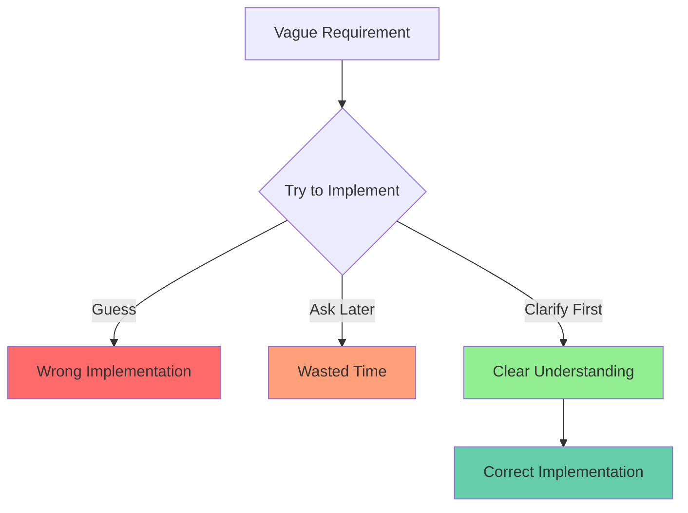
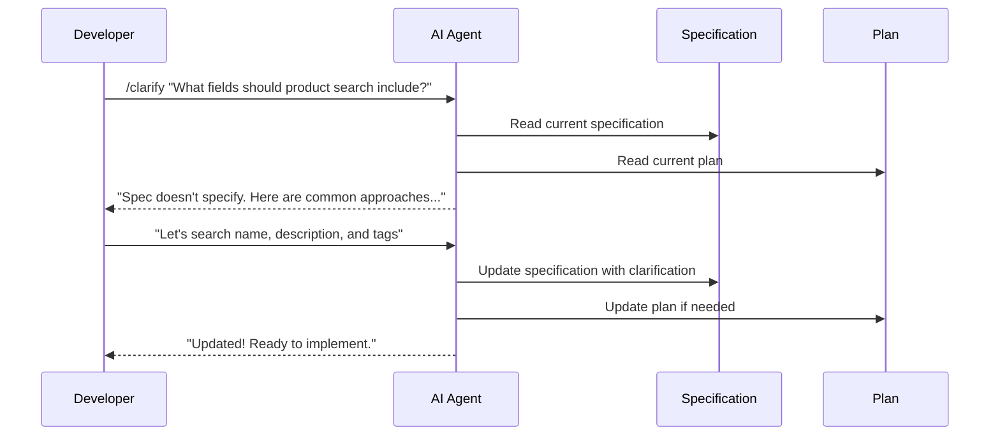

# Lesson 13: Clarify - Refining Underspecified Areas

**Module:** 4 - Advanced Techniques  
**Lesson:** 13 of 25  
**Date:** November 29, 2025

---

## 📖 Concept: The Art of Refinement

You've written specifications, plans, and tasks. But sometimes you encounter **vague requirements**, **ambiguous wording**, or **missing details**. This is where the `/clarify` command becomes essential.

### The Problem: Underspecification



**Example of underspecification:**
> "Users should be able to search for products."

**Questions this raises:**
- Search by what fields? (name, description, category, SKU?)
- What kind of matching? (exact, partial, fuzzy?)
- How should results be sorted? (relevance, price, date?)
- Pagination? How many results per page?
- Should it be case-sensitive?
- Real-time search or submit-based?

---

## 🎯 When to Use `/clarify`

Use `/clarify` when you encounter:

1. **Vague requirements** – "Make it user-friendly"
2. **Ambiguous wording** – "Should work like other systems"
3. **Missing edge cases** – "Handle errors appropriately"
4. **Unclear priorities** – "Include all necessary features"
5. **Conflicting requirements** – Spec says X, plan says Y
6. **Technical ambiguity** – "Use appropriate data structure"

### The Clarify Workflow



---

## 💡 Real-World Analogy

Think of **underspecified requirements** like:
> **A recipe that says "add seasoning to taste."** What seasoning? How much? This works if you're an experienced chef, but for a cooking robot (AI), you need to specify: "Add 1 tsp salt, 1/2 tsp black pepper, and 1/4 tsp paprika."

**Clarification** is like:
> **Asking the chef specific questions** before you start cooking, so you don't ruin the dish halfway through.

---

## 🔍 Types of Clarifications

### 1. Functional Clarification
**Original:** "Allow users to filter products"

**After `/clarify`:**
```markdown
### Product Filtering

**Filter Options:**
- Price range (min/max sliders)
- Categories (multi-select)
- Brand (multi-select)
- Rating (minimum stars)
- Availability (in stock / out of stock)

**Behavior:**
- Filters combine with AND logic
- Results update in real-time (debounced 300ms)
- Filter state persists in URL query params
- Clear all filters button resets to defaults
```

### 2. Technical Clarification
**Original:** "Use caching for better performance"

**After `/clarify`:**
```markdown
### Caching Strategy

**Approach:** Redis in-memory cache with TTL

**What to cache:**
- Product catalog (5 min TTL)
- User sessions (30 min TTL)
- Search results (1 min TTL)

**Cache invalidation:**
- On product updates (invalidate specific product + catalog)
- On user logout (invalidate session)
- Manual flush endpoint for admins

**Fallback:** If Redis unavailable, query database directly
```

### 3. Edge Case Clarification
**Original:** "Handle invalid inputs"

**After `/clarify`:**
```markdown
### Input Validation & Error Handling

**Email validation:**
- Reject if: empty, invalid format, too long (>254 chars)
- Show: "Please enter a valid email address"

**Password validation:**
- Reject if: < 8 chars, no uppercase, no lowercase, no digit
- Show: "Password must be at least 8 characters with uppercase, lowercase, and digit"

**Network errors:**
- Retry: Up to 3 times with exponential backoff
- Timeout: 10 seconds per request
- Show: "Connection issue. Please check your internet and try again."

**Server errors (5xx):**
- Show: "Something went wrong. We've been notified. Please try again later."
- Log: Full error details to monitoring service
```

### 4. UX Clarification
**Original:** "Make it intuitive"

**After `/clarify`:**
```markdown
### UX Specifications

**Search bar:**
- Position: Top-right of header, always visible
- Placeholder: "Search products..."
- Icon: Magnifying glass (left side)
- Width: 300px desktop, full-width mobile
- Auto-focus: On keyboard shortcut (Ctrl/Cmd + K)

**Search results:**
- Show: Product image, name, price, rating
- Layout: Grid on desktop (3 cols), list on mobile
- Empty state: "No results for '{query}'. Try different keywords."
- Loading state: Skeleton screens (3 placeholders)

**Accessibility:**
- ARIA label: "Search products"
- Keyboard navigation: Arrow keys to navigate results
- Screen reader: Announce result count
```

---

## 🛠️ How to Use `/clarify`

### Basic Usage

```
You: /clarify

What aspect of the specification or plan needs clarification?

You: The search functionality. It just says "users can search" but 
     doesn't specify what fields, matching logic, or sorting.

AI: I've analyzed the current spec. Here's what I found...

[Missing Details:]
- Search fields (which attributes to search)
- Matching algorithm (exact, partial, fuzzy)
- Result sorting logic
- Pagination details

[Recommendations based on similar features:]
1. Search Fields: name, description, tags
2. Matching: Partial, case-insensitive
3. Sorting: Relevance score (default), price, date
4. Pagination: 20 results per page

Does this align with your requirements, or would you like 
to adjust any of these?
```

### Advanced Usage: Cross-Artifact Validation

```
You: /clarify

Check if the plan matches the specification for user authentication.

AI: I've found inconsistencies:

❌ Spec says: "Support social login (Google, Facebook)"
   Plan says: "Email/password authentication only"

❌ Spec says: "Remember me for 30 days"
   Plan says: "Session expires after 24 hours"

✅ Both agree: "Password must be hashed with bcrypt"

Shall I update the plan to match the spec?
```

---

## 🎓 Clarification Techniques

### The 5W1H Method

When clarifying, ask:
- **Who:** Who will use this feature? (all users, admins only?)
- **What:** What exactly happens? (specific behavior)
- **When:** When does it occur? (triggers, timing)
- **Where:** Where in the UI/system? (location, context)
- **Why:** Why is this needed? (business justification)
- **How:** How should it work? (mechanism, algorithm)

### Example: Clarifying "Notifications"

```markdown
**Original:** "Send notifications to users"

**Applying 5W1H:**

**Who:** All registered users (can opt-in/opt-out in settings)

**What:** 
- Order status updates
- Promotional offers (max 1/week)
- Security alerts (password change, new login)

**When:**
- Real-time for security alerts
- Batched for promotional (9 AM user's timezone)
- Immediate for order updates

**Where:**
- In-app notification bell (always)
- Email (if enabled in settings)
- Push notifications (if mobile app installed and permitted)

**Why:**
- Keep users informed about their orders
- Improve engagement with personalized offers
- Enhance security awareness

**How:**
- Queue-based system (RabbitMQ)
- Template engine for email/push content
- Rate limiting (max 10 notifications/day per user)
```

---

## 💡 Exercise: Practice Clarification

### Scenario 1: Vague Requirement

**Requirement:** "The dashboard should show important information."

**Your task:** Use the 5W1H method to clarify this.

```markdown
Your clarifications:

Who:


What:


When:


Where:


Why:


How:


```

<details>
<summary>Sample Answer</summary>

```markdown
**Who:** Logged-in users (different dashboards for customers vs admins)

**What:** 
- Customers: Recent orders, account balance, recommendations
- Admins: Revenue metrics, pending orders, low-stock alerts

**When:** 
- Real-time data for orders
- Cached for 5 min for analytics

**Where:** 
- Main landing page after login
- Accessible from top nav "Dashboard" link

**Why:** 
- Users need quick overview of account status
- Admins need operational visibility

**How:** 
- Widget-based layout (4 widgets on desktop, stacked on mobile)
- API endpoint returns personalized data per user role
- Auto-refresh every 30 seconds
```

</details>

---

### Scenario 2: Conflicting Requirements

**Spec says:** "Free shipping on orders over $50"  
**Plan says:** "Shipping cost calculated based on weight and distance"  
**Customer email says:** "We want free shipping on all orders this month for promotion"

**Your task:** Resolve the conflict and document the clarification.

```markdown
Your resolution:


```

<details>
<summary>Sample Answer</summary>

```markdown
### Shipping Cost Calculation - CLARIFIED

**Normal Policy (Default):**
- Free shipping on orders ≥ $50
- Orders < $50: Calculate based on weight & distance using ShipEngine API
- Display cost at checkout before payment

**Promotional Override (Time-based):**
- Configurable free shipping promotions
- Stored in database: { startDate, endDate, minOrderAmount }
- When active promotion: Apply free shipping if order meets criteria
- Default criteria: minOrderAmount = $0 (all orders)

**Current Promotion (November 2025):**
- Start: Nov 1, 2025
- End: Nov 30, 2025
- Min Order: $0 (free for all orders)

**Implementation:**
```typescript
function calculateShipping(order: Order): number {
  const promotion = getActivePromotion();
  
  if (promotion && order.total >= promotion.minOrderAmount) {
    return 0; // Free shipping
  }
  
  if (order.total >= 50) {
    return 0; // Normal free shipping threshold
  }
  
  return calculateShipEngineRate(order);
}
```

**Resolves:**
- ✅ Supports normal $50 threshold
- ✅ Allows temporary promotions
- ✅ Enables current "all orders free" promotion
- ✅ Falls back to weight/distance calculation when needed
```

</details>

---

## 🤔 Socratic Questions

### Question 1
**You're about to implement a feature when you realize the spec doesn't mention error handling. Should you:**
- A) Guess what errors might occur and handle them
- B) Use `/clarify` to document error scenarios before implementing
- C) Implement basic functionality first, add error handling later
- D) Skip error handling since the spec doesn't require it

<details>
<summary>Think about quality and completeness...</summary>

**Answer: B) Use `/clarify` to document error scenarios before implementing**

**Why:**
- Guessing (A) might miss critical errors or handle them incorrectly
- Adding later (C) often means forgotten edge cases and bugs in production
- Skipping (D) results in poor user experience and crashes

**Best practice:** Clarify error scenarios upfront, document them, then implement comprehensively. Error handling is NOT optional!

**Example clarification:**
```markdown
### Error Scenarios

**Network Errors:**
- Timeout (>10s): Show "Taking longer than usual..." message
- No connection: Show "Please check your internet connection"
- Server error (5xx): Show "We're experiencing issues. Please try again."

**Validation Errors:**
- Invalid email: "Please enter a valid email"
- Duplicate email: "This email is already registered"
- Weak password: "Password must be at least 8 characters..."

**All errors:**
- Log to monitoring service (Sentry)
- Include request ID for support debugging
- Show user-friendly message (never expose stack traces)
```
</details>

---

### Question 2
**The spec says "search should be fast." How do you clarify this vague requirement?**

<details>
<summary>Consider measurable criteria...</summary>

**Clarification approach:**

1. **Define "fast" quantitatively:**
   - User input → Results displayed: < 500ms (p95)
   - First result visible: < 200ms (p50)
   - Full results loaded: < 1 second (p99)

2. **Specify conditions:**
   - Database size: Up to 100,000 products
   - Concurrent users: Up to 1,000 simultaneous searches
   - Network: Assume 3G minimum (broadband for optimal)

3. **Technical approach:**
   - Use Elasticsearch for full-text search
   - Index: name (boost 3x), description (boost 1x), tags (boost 2x)
   - Cache: Frequent queries cached for 5 minutes
   - Debounce: 300ms after last keystroke

4. **Monitoring:**
   - Track p50, p95, p99 latency
   - Alert if p95 > 1 second
   - Log slow queries for optimization

**Updated spec:**
```markdown
### Search Performance

**Target Latency (95th percentile):**
- < 500ms from input to results displayed

**Approach:**
- Elasticsearch full-text search
- 300ms debounce on user input
- 5-minute cache for common queries

**Monitoring:**
- Track latency percentiles
- Alert if p95 exceeds 1s
```

**Key lesson:** Convert subjective terms ("fast", "user-friendly", "secure") into **measurable criteria**.
</details>

---

### Question 3
**You've clarified a requirement, updated the spec, but forgot to update the plan. What problems might this cause?**

<details>
<summary>Think about consistency and implementation...</summary>

**Problems caused by inconsistency:**

1. **Developer Confusion:**
   - Plan says one thing, spec says another
   - Developer doesn't know which to follow
   - Wastes time asking for clarification

2. **Incorrect Implementation:**
   - Developer follows outdated plan
   - Builds wrong feature
   - Requires rework later

3. **Code Review Conflicts:**
   - Reviewer expects plan's approach
   - Code implements spec's approach
   - Leads to rejection and confusion

4. **Documentation Drift:**
   - Spec and plan diverge over time
   - Future developers can't trust documentation
   - Institutional knowledge lost

**Solution: Always update all affected artifacts**

When you clarify, update:
- ✅ Specification (the requirement)
- ✅ Plan (the technical approach)
- ✅ Tasks (if affected)
- ✅ Tests (acceptance criteria)

**Example workflow:**
```
1. /clarify → Update spec with clarified requirements
2. /plan → Regenerate or update plan to match new spec
3. /tasks → Update affected tasks
4. /implement → Now implementation aligns with all docs
```

**Principle:** All artifacts should be mutually consistent. Think of them as synchronized representations of the same truth.
</details>

---

## ✅ Clarification Checklist

Before implementing, ensure you've clarified:

**Functional Requirements:**
- [ ] All user actions are explicitly defined
- [ ] Input validation rules are specified
- [ ] Output format is documented
- [ ] Edge cases are covered

**Technical Requirements:**
- [ ] Data structures are defined
- [ ] APIs/interfaces are specified
- [ ] Performance targets are quantified
- [ ] Error handling is documented

**UX Requirements:**
- [ ] UI placement and layout are described
- [ ] User feedback mechanisms are defined
- [ ] Accessibility requirements are listed
- [ ] Loading/error states are specified

**Business Logic:**
- [ ] Calculation formulas are documented
- [ ] Business rules are explicit
- [ ] Priority/ordering logic is defined
- [ ] Validation criteria are measurable

---

## 🎯 Summary

**Clarification is:**
- The process of refining vague or incomplete requirements
- Essential for reducing implementation errors and rework
- Continuous throughout the development process
- About making implicit knowledge explicit

**Use `/clarify` when:**
- Requirements are vague or ambiguous
- Edge cases aren't specified
- Technical details are missing
- Conflicts exist between artifacts
- Subjective terms need quantification

**Best practices:**
- Apply the 5W1H method systematically
- Convert subjective terms into measurable criteria
- Update all affected artifacts (spec, plan, tasks)
- Document decisions and rationale
- Review clarifications with stakeholders

---

## 📚 What's Next?

Now that you can clarify underspecified requirements, you'll learn how to validate consistency across all your artifacts.

**Next:** [Lesson 14: Analyze - Cross-Artifact Validation](./Lesson-14-Analyze-Cross-Artifact-Validation.md)

---

*Previous: [Lesson 12: End-to-End Workflow Practice](../Module-03-Core-Workflow/Lesson-12-End-to-End-Workflow-Practice.md)*  
*Next: [Lesson 14: Analyze - Cross-Artifact Validation](./Lesson-14-Analyze-Cross-Artifact-Validation.md)*
