# Lesson 14: Analyze - Cross-Artifact Validation

**Module:** 4 - Advanced Techniques  
**Lesson:** 14 of 25  
**Date:** November 29, 2025

---

## 📖 Concept: Ensuring Consistency Across Documents

In Spec-Driven Development, you maintain multiple artifacts:
- **Constitution** (project standards)
- **Specification** (feature requirements)
- **Plan** (technical design)
- **Tasks** (implementation steps)
- **Code** (actual implementation)

These must remain **mutually consistent**. The `/analyze` command helps you validate this consistency and catch conflicts before they cause problems.

```mermaid
graph TD
    A[Constitution] --> B{Analyze}
    C[Specification] --> B
    D[Plan] --> B
    E[Tasks] --> B
    F[Code] --> B
    
    B --> G{Consistent?}
    G -->|Yes| H[✓ All aligned]
    G -->|No| I[⚠ Conflicts found]
    I --> J[Clarify & Update]
    J --> B
    
    style H fill:#90ee90
    style I fill:#ff6b6b
```



---

## 🎯 Why Cross-Artifact Validation Matters

### The Problem: Documentation Drift


**Without validation:**
- Spec says feature X, plan implements feature Y
- Constitution requires tests, tasks don't include testing
- Plan uses pattern A, code uses pattern B
- Nobody knows which document is the "truth"

**With validation:**
- Catch conflicts early
- Maintain trust in documentation
- Ensure implementations match intentions
- Enable confident refactoring

---

## 💡 Real-World Analogy

Think of **cross-artifact validation** like:
> **Building inspections** during home construction. The blueprints (spec), building code (constitution), contractor's work plan (plan), and actual construction (code) must all align. An inspector catches problems like: "The blueprint shows 3 electrical outlets, but your plan only has 2" or "Your work doesn't meet building code requirements."

---

## 🔍 Types of Analysis

### 1. Vertical Consistency (Within Feature)

**Checks alignment from requirements → implementation**


**Example checks:**
- Does plan address all spec requirements?
- Do tasks cover all plan components?
- Does code implement all tasks?

### 2. Horizontal Consistency (Across Features)

**Checks consistency within same artifact type**


**Example checks:**
- Do all feature specs use same format?
- Are architectural patterns consistent?
- Do all features follow constitution standards?

### 3. Policy Compliance

**Checks adherence to constitution**


**Example checks:**
- Are required tests present?
- Is code style compliant?
- Are security requirements met?

---

## 🛠️ Using `/analyze`

### Basic Usage: Feature Analysis

```
You: /analyze

What would you like to analyze?

You: Analyze the authentication feature for consistency

AI: Analyzing .features/authentication/*

[Checking vertical consistency...]
✓ Spec → Plan alignment
✓ Plan → Tasks coverage
⚠ Tasks → Code: 2 tasks not implemented

[Checking policy compliance...]
✓ Constitution coding standards
⚠ Constitution requires >80% test coverage (currently 65%)
✓ Security requirements met

[Findings:]
⚠ 2 issues found:

1. Incomplete Implementation
   - Task: "Implement password reset email"
   - Status: Not found in code
   - Impact: Feature incomplete

2. Test Coverage Below Threshold
   - Required: 80%
   - Actual: 65%
   - Missing: AuthService.resetPassword() tests

Would you like me to generate implementation tasks for these?
```

### Advanced: Conflict Detection

```
You: /analyze cross-artifact conflicts

AI: Analyzing all features for conflicts...

[Conflicts found:]

❌ Authentication vs Profile Features
   - Auth spec: "Username is immutable"
   - Profile spec: "Users can change username"
   - Resolution needed: Clarify username change policy

❌ Constitution vs Cart Implementation
   - Constitution: "Use Repository pattern"
   - Cart code: Direct database queries in controllers
   - Resolution: Refactor Cart to use CartRepository

⚠ Shipping vs Payment Plans
   - Shipping plan: "Calculate shipping before payment"
   - Payment plan: "Process payment first, then calculate shipping"
   - Resolution needed: Clarify order of operations

[Recommendations:]
1. Hold design review for username change policy
2. Create refactoring task for Cart repository pattern
3. Update payment flow sequence diagram
```

---

## 📊 Analysis Dimensions

### 1. Completeness Analysis

**Question:** Does each artifact fully address its purpose?

```markdown
### Spec Completeness
✓ User stories present
✓ Acceptance criteria defined
✓ Edge cases documented
⚠ Performance requirements missing
✗ Error scenarios not specified

### Plan Completeness
✓ Architecture decided
✓ Components identified
⚠ Database schema incomplete (missing indexes)
✓ API endpoints defined
⚠ Caching strategy not specified

### Task Completeness
✓ All plan components have tasks
⚠ Testing tasks vague ("test everything")
✗ Deployment tasks missing
✓ Time estimates provided
```

### 2. Traceability Analysis

**Question:** Can each requirement be traced to implementation?


**Traceability matrix:**

| Requirement | Plan Component | Tasks | Code | Status |
|------------|----------------|-------|------|--------|
| Social login (Google) | OAuth2Service | 3 tasks | GoogleAuthService | ✓ Complete |
| Social login (Facebook) | OAuth2Service | 2 tasks | Missing | ⚠ Incomplete |
| Remember me 30 days | JWT with long expiry | 1 task | Missing | ✗ Not started |
| Email verification | EmailService | 4 tasks | EmailService | ✓ Complete |

### 3. Consistency Analysis

**Question:** Do artifacts agree with each other?

```typescript
// Spec says:
"Password must be at least 8 characters with uppercase, lowercase, and digit"

// Plan says:
"Use bcrypt with rounds=10, validate password: min 8 chars, mixed case, digit"

// Code implements:
function validatePassword(pwd: string): boolean {
  return pwd.length >= 6 && /[A-Z]/.test(pwd); // ❌ Inconsistent!
}
```

**Issues:**
- ❌ Code requires 6 chars, spec says 8
- ❌ Code doesn't check lowercase
- ❌ Code doesn't check digit
- ❌ Diverges from both spec and plan

### 4. Quality Analysis

**Question:** Do artifacts meet quality standards?

```markdown
### Constitution Standards:
- Minimum 80% test coverage
- All public APIs documented
- No console.log in production code
- Error handling for all async operations

### Actual Quality:
✓ Test coverage: 87% (meets standard)
⚠ API documentation: 60% complete (below standard)
✗ Found 12 console.log statements (violates standard)
✓ Error handling: All async functions have try-catch
```

---

## 🎓 Analysis Patterns

### Pattern 1: Requirement Gaps

**What to look for:**
- Spec requirements not addressed in plan
- Plan components not broken down into tasks
- Tasks without corresponding code

**Example:**

```markdown
Spec: "Support forgot password flow"

Plan: 
  ✓ POST /auth/forgot-password endpoint
  ✓ Generate reset token
  ❌ Missing: Email service integration
  ❌ Missing: Token expiration logic

Tasks:
  ✓ Create ForgotPasswordController
  ❌ Missing: Send email task
  ❌ Missing: Validate token task
  ❌ Missing: Reset password task
```

**Resolution:**
```
You: /analyze revealed gaps in forgot password feature.
     Update plan and tasks to include email sending and token validation.

AI: I'll update the plan with missing components and generate complete tasks...
```

### Pattern 2: Architecture Drift

**What to look for:**
- Code doesn't follow planned architecture
- Inconsistent patterns across features
- Violations of constitution principles

**Example:**

```typescript
// Constitution says: "Use dependency injection"

// Plan says: "Inject UserRepository into AuthService"

// Code does:
class AuthService {
  private repo = new UserRepository(); // ❌ Not injected!
  
  async register(email: string, password: string) {
    // ...
  }
}
```

**Detection:**
```
You: /analyze check if AuthService follows dependency injection pattern

AI: ⚠ Architecture violation detected

AuthService creates UserRepository directly instead of 
receiving it via dependency injection.

Expected (per constitution + plan):
  constructor(private repo: UserRepository) {}

Actual:
  private repo = new UserRepository();

This makes testing difficult and violates constitution standards.

Should I generate a refactoring task?
```

### Pattern 3: Scope Creep

**What to look for:**
- Code implements features not in spec
- Plan includes components not required by spec
- Tasks go beyond specified requirements

**Example:**

```markdown
Spec: "Basic email/password authentication"

Plan: (aligned with spec)
  - Email/password registration
  - Login with JWT tokens
  - Logout

Code: (exceeds spec!)
  - Email/password registration ✓
  - Login with JWT tokens ✓
  - Logout ✓
  - OAuth2 social login ❌ Not specified
  - Two-factor authentication ❌ Not specified
  - Password strength meter ❌ Not specified
```

**Detection:**
```
You: /analyze authentication feature for scope creep

AI: ⚠ Scope creep detected

The implementation includes features not in the specification:
1. OAuth2 social login (Google, Facebook)
2. Two-factor authentication
3. Password strength meter UI

These are valuable features but were not specified or planned.

Recommendations:
1. Remove unspecified features (keep focused)
2. Or: Create separate specs for each feature (proper documentation)

Which approach do you prefer?
```

---

## 💡 Exercise: Conduct an Analysis

You're reviewing a shopping cart feature. Here are the artifacts:

### Specification
```markdown
# Cart Feature

Users can add products to cart, view cart, and proceed to checkout.

Requirements:
- Add products to cart (with quantity)
- View cart with product details and total price
- Remove items from cart
- Update quantities
- Cart persists across sessions
```

### Plan
```markdown
# Technical Plan

Architecture: REST API + Redux store

Components:
- CartController (endpoints)
- CartService (business logic)
- Cart model (schema)

API Endpoints:
- POST /cart/items (add item)
- GET /cart (view cart)
- DELETE /cart/items/:id (remove item)
- PATCH /cart/items/:id (update quantity)
```

### Tasks
```markdown
- [x] Create Cart model
- [x] Create CartController with all endpoints
- [x] Implement add item logic
- [ ] Implement view cart logic
- [ ] Implement remove item logic
- [ ] Write tests
```

### Code (existing)
```typescript
// CartController.ts
@Controller('/cart')
class CartController {
  @Post('/items')
  async addItem(@Body() body: AddItemDto) {
    const cart = await CartModel.findOne({ userId: body.userId });
    cart.items.push(body.item);
    await cart.save();
    return { success: true };
  }
  
  // Other methods not implemented yet
}
```

### Constitution
```markdown
Standards:
- All endpoints must have error handling
- All database operations must use repositories
- All public APIs must have DTO validation
- Minimum 80% test coverage
```

---

**Your Analysis:**

**1. Completeness Issues:**
```
Specification:


Plan:


Tasks:


Code:


```

**2. Consistency Issues:**
```
Spec vs Plan:


Plan vs Code:


Code vs Constitution:


```

**3. Quality Issues:**
```
Error handling:


Architecture:


Testing:


```

<details>
<summary>View Analysis Report</summary>

### Completeness Issues

**Specification:**
- ⚠ Missing: Error scenarios (out of stock, invalid quantity)
- ⚠ Missing: Performance requirements
- ⚠ Missing: Quantity limits (max items per product?)

**Plan:**
- ❌ Missing: Quantity validation logic
- ❌ Missing: Stock availability check
- ⚠ Missing: Error handling strategy
- ❌ Missing: How persistence works (database, cookies?)

**Tasks:**
- ⚠ Incomplete: "Write tests" is too vague
- ❌ Missing: Update quantity task incomplete
- ❌ Missing: Cart persistence implementation

**Code:**
- ❌ Only 1 of 4 endpoints implemented
- ❌ No error handling
- ❌ No validation
- ❌ No tests

---

### Consistency Issues

**Spec vs Plan:**
- ⚠ Spec says "cart persists across sessions" but plan doesn't specify how
- ✓ Endpoints match requirements

**Plan vs Code:**
- ❌ Plan requires CartService, code directly uses CartModel
- ❌ Plan requires Repository pattern (per constitution), code uses direct database queries

**Code vs Constitution:**
- ❌ No error handling (violates constitution)
- ❌ No repository pattern (violates constitution)
- ❌ No DTO validation (violates constitution)
- ❌ No tests (violates 80% coverage requirement)

---

### Quality Issues

**Error handling:**
```typescript
// Current (bad):
cart.items.push(body.item); // What if cart doesn't exist?
await cart.save(); // What if save fails?

// Should be:
if (!cart) {
  throw new NotFoundException('Cart not found');
}

try {
  cart.items.push(body.item);
  await cart.save();
} catch (error) {
  throw new InternalServerErrorException('Failed to add item');
}
```

**Architecture:**
```typescript
// Current (bad):
await CartModel.findOne({ userId: body.userId }); // Direct DB access

// Should be (per constitution):
class CartController {
  constructor(private cartService: CartService) {}
  
  @Post('/items')
  async addItem(@Body() body: AddItemDto) {
    return await this.cartService.addItem(body);
  }
}

class CartService {
  constructor(private cartRepo: CartRepository) {}
  
  async addItem(dto: AddItemDto): Promise<Cart> {
    const cart = await this.cartRepo.findByUserId(dto.userId);
    // business logic...
  }
}
```

**Testing:**
- Current: 0% coverage
- Required: 80%
- Gap: All code needs tests

---

### Recommendations

**Priority 1 (Critical):**
1. Refactor to use Repository pattern (architecture compliance)
2. Add comprehensive error handling (constitution requirement)
3. Implement remaining endpoints (complete feature)

**Priority 2 (Important):**
4. Add DTO validation (security)
5. Clarify persistence mechanism in spec (ambiguity)
6. Write comprehensive tests (quality)

**Priority 3 (Nice to have):**
7. Add quantity validation (user experience)
8. Document edge cases in spec (completeness)
9. Add performance tests (scalability)

</details>

---

## 🤔 Socratic Questions

### Question 1
**You find that the code implements a feature differently than the plan specifies, but the code approach is actually better. What should you do?**

<details>
<summary>Think about documentation accuracy...</summary>

**Answer: Update the plan to match the better implementation, and document why.**

**Reasoning:**
1. **Documentation is source of truth** – If code diverges, docs become untrustworthy
2. **Future developers need accurate docs** – They'll follow the plan, not discover the better approach
3. **Preserve knowledge** – Document why the better approach was chosen

**Process:**
```
1. Update plan with the actual (better) implementation
2. Add note: "Originally planned X, but implemented Y because [reasons]"
3. If it's a pattern worth repeating, update constitution
4. Communicate change to team
```

**Example:**
```markdown
## Original Plan
Use Redis for session storage

## Actual Implementation
Using JWT tokens stored client-side

## Rationale
- Reduces server memory requirements
- Enables horizontal scaling without session sync
- Simpler deployment (no Redis dependency)
- Acceptable for our security requirements

## Updated: November 29, 2025
```

**Anti-pattern:** Keeping outdated docs because "we don't have time to update them"
</details>

---

### Question 2
**During analysis, you discover that 5 features all implement authentication differently. What's the underlying problem?**

<details>
<summary>Consider project-level vs feature-level concerns...</summary>

**Answer: Authentication is a cross-cutting concern that should be in the constitution, not individual feature specs.**

**The Problem:**
- Each feature reinvents authentication
- Inconsistent security (some secure, some not)
- Duplicate code
- Maintenance nightmare

**The Solution:**
```markdown
## Move to Constitution

### Authentication Standards (Project-Wide)

**Approach:** JWT tokens with refresh token rotation

**Implementation:**
- All endpoints use AuthMiddleware
- Tokens stored in httpOnly cookies
- Refresh every 15 minutes
- Revocation list in Redis

**Usage in features:**
Simply decorate endpoints with @RequireAuth()
```

**Then in feature specs:**
```markdown
# User Profile Feature

## Authentication
Uses project-wide JWT authentication (see Constitution)

## Endpoints
GET /profile (requires auth) ← Just reference, don't re-specify
```

**Lesson:** 
- **Constitution** = Cross-cutting concerns (auth, logging, error handling)
- **Specs** = Feature-specific requirements
- **Plans** = Feature-specific implementation

When multiple features need the same thing → Promote to constitution!

</details>

---

### Question 3
**The `/analyze` command reports 47 issues. You're overwhelmed. How do you prioritize?**

<details>
<summary>Think about impact and risk...</summary>

**Answer: Use the MoSCoW + Risk matrix**

### Priority Framework

**Critical (Fix now):**
- Security vulnerabilities
- Data corruption risks
- Production-breaking issues
- Constitution violations that affect multiple features

**High (Fix this sprint):**
- Missing core functionality
- User-facing bugs
- Architecture violations
- Incomplete implementations

**Medium (Fix next sprint):**
- Missing edge case handling
- Documentation gaps
- Code quality issues
- Minor inconsistencies

**Low (Backlog):**
- Nice-to-have features
- Cosmetic issues
- Over-specification
- Duplicate documentation

### Example Triage

**47 Issues → Prioritized:**

```markdown
🚨 Critical (3 issues) - Fix immediately:
1. Auth tokens not validated (security)
2. SQL injection vulnerability in search (security)
3. No database backups configured (data risk)

⚠️ High (8 issues) - Fix this sprint:
4. Password reset not implemented (core feature missing)
5. No error handling in payment flow (user-facing bug)
6. Cart uses direct DB queries (architecture violation)
...

📋 Medium (15 issues) - Next sprint:
12. Missing validation on email format
13. Incomplete API documentation
...

📝 Low (21 issues) - Backlog:
28. Inconsistent variable naming
29. TODO comments in code
...
```

**Strategy:**
1. Fix critical issues immediately (stop what you're doing)
2. Schedule high-priority fixes for current sprint
3. Medium issues go into next sprint planning
4. Low issues stay in backlog, maybe never fixed

**Don't try to fix everything at once!** Focus on impact.

</details>

---

## ✅ Analysis Checklist

Before declaring a feature "complete," analyze:

**Vertical Consistency:**
- [ ] All spec requirements have plan components
- [ ] All plan components have implementation tasks
- [ ] All tasks have corresponding code
- [ ] Code implements all specified requirements

**Horizontal Consistency:**
- [ ] Feature follows same patterns as other features
- [ ] Naming conventions consistent across codebase
- [ ] Similar features use similar approaches

**Policy Compliance:**
- [ ] Follows constitution coding standards
- [ ] Meets test coverage requirements
- [ ] Includes required documentation
- [ ] Security requirements satisfied

**Quality Standards:**
- [ ] Error handling comprehensive
- [ ] Edge cases covered
- [ ] Performance requirements met
- [ ] Accessibility requirements satisfied

---

## 🎯 Summary

**Cross-artifact validation is:**
- The process of ensuring all documentation and code are mutually consistent
- Essential for maintaining trust in documentation
- Continuous throughout development
- Automated where possible, manual where necessary

**Use `/analyze` to:**
- Detect conflicts between spec, plan, tasks, and code
- Identify gaps in requirements or implementation
- Verify compliance with constitution standards
- Catch scope creep early
- Maintain documentation quality

**Best practices:**
- Run analysis before major milestones
- Prioritize issues by impact and risk
- Update all affected artifacts when making changes
- Document rationale for deviations from plans
- Promote common patterns to constitution

---

## 📚 What's Next?

Now that you can validate consistency across artifacts, you'll learn systematic quality assurance techniques.

**Next:** [Lesson 15: Checklist - Quality Assurance](./Lesson-15-Checklist-Quality-Assurance.md)

---

*Previous: [Lesson 13: Clarify - Refining Underspecified Areas](./Lesson-13-Clarify-Refining-Underspecified-Areas.md)*  
*Next: [Lesson 15: Checklist - Quality Assurance](./Lesson-15-Checklist-Quality-Assurance.md)*
