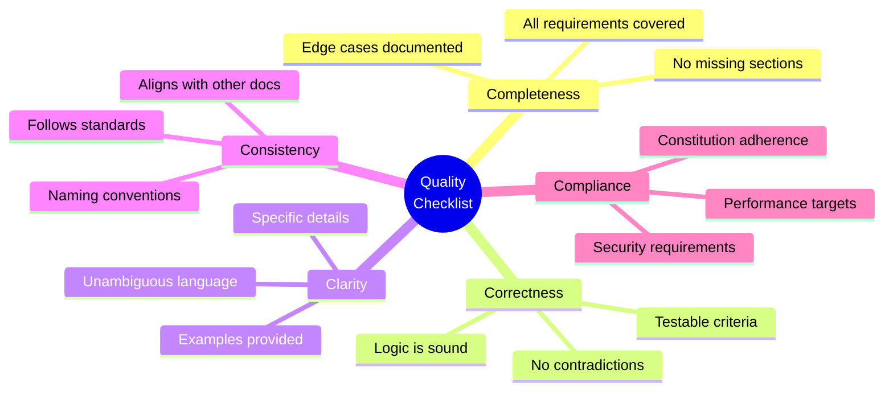
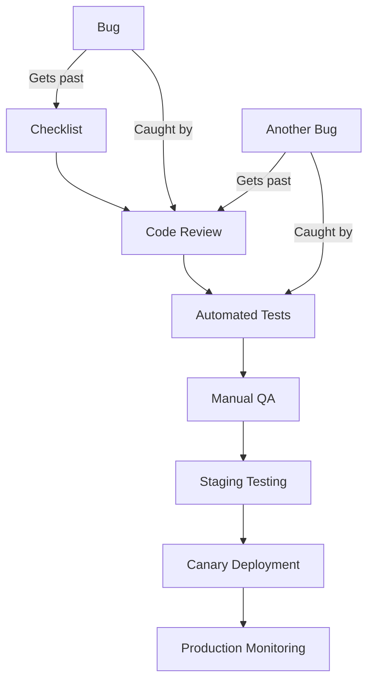

# Lesson 15: Checklist - Quality Assurance

**Module:** 4 - Advanced Techniques  
**Lesson:** 15 of 25  
**Date:** November 29, 2025

---

## 📖 Concept: Systematic Quality Assurance

Quality assurance in Spec-Driven Development goes beyond testing. It's about **systematically verifying** that every artifact meets standards before moving forward. The `/checklist` command provides structured QA processes.

```mermaid
graph LR
    A[Create Artifact] --> B[Run Checklist]
    B --> C{All Pass?}
    C -->|No| D[Fix Issues]
    D --> B
    C -->|Yes| E[✓ Ready]
    E --> F[Next Phase]
    
    style E fill:#90ee90
```



---

## 🎯 Why Checklists Matter

### The Checklist Manifesto

Research shows that **checklists prevent errors** even for experts. Surgeons use checklists. Pilots use checklists. Spec-Driven Development uses checklists.



**Benefits:**
- **Catch issues early** (before implementation)
- **Reduce rework** (get it right the first time)
- **Transfer knowledge** (checklist encodes best practices)
- **Ensure thoroughness** (nothing forgotten)
- **Build confidence** (systematic validation)

---

## 💡 Real-World Analogy

Think of **checklists** like:
> **Pre-flight checks for pilots.** Even experienced pilots go through a checklist before takeoff. Why? Because human memory is fallible, especially under pressure. A checklist ensures critical items are never forgotten, preventing catastrophic failures.

In software:
> **A checklist before deployment** prevents shipping broken features, security vulnerabilities, or incomplete implementations.

---

## 🔍 Types of Checklists

### 1. Specification Checklist

**Purpose:** Verify requirements are complete, clear, and testable

```markdown
## Specification Quality Checklist

### Completeness
- [ ] Problem statement clearly defined
- [ ] User stories for all personas
- [ ] Functional requirements enumerated
- [ ] Non-functional requirements specified
- [ ] Acceptance criteria for all requirements
- [ ] Edge cases documented
- [ ] Error scenarios covered
- [ ] Success metrics defined

### Clarity
- [ ] No ambiguous terms (like "user-friendly", "fast")
- [ ] Examples provided for complex scenarios
- [ ] Diagrams illustrate workflows
- [ ] Terminology defined in glossary

### Testability
- [ ] All acceptance criteria measurable
- [ ] Given/When/Then format used
- [ ] Expected outputs specified
- [ ] Edge case behaviors defined

### Stakeholder Alignment
- [ ] Reviewed by product owner
- [ ] Technical feasibility confirmed
- [ ] Business value articulated
- [ ] Priority/timeline agreed upon
```

### 2. Plan Checklist

**Purpose:** Ensure technical design is sound and implementable

```markdown
## Technical Plan Quality Checklist

### Architecture
- [ ] Design pattern chosen and justified
- [ ] Component responsibilities defined
- [ ] Dependency flow documented
- [ ] Scalability considerations addressed
- [ ] Performance implications analyzed

### Data Design
- [ ] Data models/schema defined
- [ ] Relationships specified
- [ ] Indexes identified
- [ ] Migration strategy outlined

### API Design
- [ ] All endpoints documented (method, path, params)
- [ ] Request/response schemas defined
- [ ] Error codes specified
- [ ] Authentication/authorization clarified

### Implementation Details
- [ ] Key algorithms explained
- [ ] Third-party dependencies listed
- [ ] Configuration requirements noted
- [ ] Deployment considerations mentioned

### Risk Assessment
- [ ] Technical risks identified
- [ ] Mitigation strategies proposed
- [ ] Fallback plans documented
- [ ] Performance bottlenecks anticipated

### Constitution Compliance
- [ ] Follows project architecture patterns
- [ ] Uses standard coding conventions
- [ ] Meets security requirements
- [ ] Adheres to testing standards
```

### 3. Task Checklist

**Purpose:** Verify tasks are atomic, clear, and actionable

```markdown
## Task List Quality Checklist

### Task Properties
- [ ] Each task is atomic (30min - 4hr)
- [ ] Action verb in each task (Create, Implement, Test, etc.)
- [ ] Specific deliverable identified
- [ ] File/location specified
- [ ] Dependencies noted

### Coverage
- [ ] All plan components have tasks
- [ ] Testing tasks included
- [ ] Documentation tasks included
- [ ] Review/validation tasks included

### Organization
- [ ] Tasks grouped into logical phases
- [ ] Dependencies respected (can't do B before A)
- [ ] Parallel work identified
- [ ] Time estimates provided

### Acceptance Criteria
- [ ] Each task has clear "done" definition
- [ ] Testable outcomes specified
- [ ] Quality standards noted
```

### 4. Implementation Checklist

**Purpose:** Ensure code meets quality standards before review

```markdown
## Implementation Quality Checklist

### Functionality
- [ ] All acceptance criteria met
- [ ] Edge cases handled
- [ ] Error scenarios covered
- [ ] User feedback provided (loading states, errors, etc.)

### Code Quality
- [ ] Follows constitution coding standards
- [ ] No console.log or debug code
- [ ] Functions are single-responsibility
- [ ] DRY (Don't Repeat Yourself) principle followed
- [ ] Meaningful variable/function names

### Error Handling
- [ ] All async operations have try-catch
- [ ] User-friendly error messages
- [ ] Errors logged appropriately
- [ ] Graceful degradation implemented

### Testing
- [ ] Unit tests for business logic
- [ ] Integration tests for APIs
- [ ] Edge cases tested
- [ ] Test coverage meets threshold (e.g., 80%)

### Security
- [ ] Input validation present
- [ ] SQL injection prevented
- [ ] XSS attacks mitigated
- [ ] Authentication/authorization enforced
- [ ] Sensitive data not exposed

### Performance
- [ ] No N+1 queries
- [ ] Appropriate caching used
- [ ] Large datasets paginated
- [ ] Indexing applied to database queries

### Documentation
- [ ] Complex logic commented
- [ ] Public APIs documented
- [ ] README updated if needed
- [ ] Changelog entry added

### Accessibility (if UI)
- [ ] Keyboard navigation works
- [ ] ARIA labels provided
- [ ] Color contrast sufficient
- [ ] Screen reader compatible
```

### 5. Review Checklist

**Purpose:** Systematic code review process

```markdown
## Code Review Checklist

### Architecture Alignment
- [ ] Follows planned architecture
- [ ] Uses expected patterns
- [ ] Integrates cleanly with existing code

### Correctness
- [ ] Logic is sound
- [ ] Handles edge cases correctly
- [ ] No off-by-one errors
- [ ] Calculations are accurate

### Readability
- [ ] Code is self-documenting
- [ ] Complex parts commented
- [ ] Consistent formatting
- [ ] Logical structure

### Maintainability
- [ ] Easy to modify in future
- [ ] No tight coupling
- [ ] Dependencies injected
- [ ] Configuration externalized

### Testing
- [ ] Tests are comprehensive
- [ ] Tests are readable
- [ ] Mocks used appropriately
- [ ] Test data is realistic

### Security
- [ ] No hardcoded secrets
- [ ] Input sanitized
- [ ] Output encoded
- [ ] Authentication verified

### Performance
- [ ] No obvious bottlenecks
- [ ] Efficient algorithms used
- [ ] Resources cleaned up
- [ ] Memory leaks prevented
```

---

## 🛠️ Using `/checklist`

### Basic Usage

```
You: /checklist

What type of checklist do you need?

You: Specification checklist for user authentication feature

AI: Running specification quality checklist...

[Completeness: 7/8]
✓ Problem statement defined
✓ User stories present
✓ Functional requirements listed
✓ Acceptance criteria provided
✓ Edge cases documented
✓ Error scenarios covered
✗ Success metrics missing
✓ Non-functional requirements specified

[Clarity: 5/4]
✓ Terminology defined
✓ Examples provided
✓ Diagrams present
⚠ "Secure password" is ambiguous (define criteria)

[Testability: 8/8]
✓ All criteria measurable
✓ Given/When/Then format used
✓ Expected outputs clear

[Overall: 20/24 (83%)]
⚠ Address missing success metrics and clarify "secure password"

Ready to update the specification?
```

### Advanced: Custom Checklists

```
You: /checklist create custom

What's the purpose of this checklist?

You: Pre-deployment checklist for production releases

AI: I'll create a custom pre-deployment checklist...

## Production Deployment Checklist

### Code Quality
- [ ] All tests passing (unit, integration, E2E)
- [ ] Code reviewed and approved
- [ ] No console.log or debug code
- [ ] Linting passes with no warnings
- [ ] TypeScript compilation successful

### Documentation
- [ ] CHANGELOG.md updated
- [ ] API documentation updated
- [ ] Migration guides written (if breaking changes)
- [ ] README reflects new features

### Testing in Staging
- [ ] Deployed to staging environment
- [ ] Manual testing completed
- [ ] Performance testing done
- [ ] Security scan passed

### Database
- [ ] Migrations tested
- [ ] Rollback plan documented
- [ ] Backup created
- [ ] Indexes created for new queries

### Configuration
- [ ] Environment variables set
- [ ] Feature flags configured
- [ ] Third-party API keys verified
- [ ] CDN cache invalidation planned

### Monitoring
- [ ] Error tracking configured
- [ ] Performance monitoring enabled
- [ ] Alerts set up
- [ ] Dashboards updated

### Communication
- [ ] Stakeholders notified of deployment
- [ ] Downtime (if any) communicated
- [ ] Rollback procedure documented
- [ ] On-call engineer assigned

### Rollback Plan
- [ ] Previous version tagged
- [ ] Database rollback tested
- [ ] Feature flag can disable new code
- [ ] Rollback time < 5 minutes

Would you like to save this as a template?
```

---

## 🎓 Checklist Best Practices

### 1. Keep Checklists Focused

**Bad (too broad):**
```markdown
- [ ] Feature works correctly
- [ ] Code is good quality
- [ ] Everything is tested
```

**Good (specific):**
```markdown
- [ ] Registration form validates email format
- [ ] Password hashing uses bcrypt with rounds=10
- [ ] Registration success returns 201 with user ID
- [ ] Duplicate email returns 400 with error message
- [ ] Unit tests cover all validation rules
- [ ] Integration test covers full registration flow
```

### 2. Make Items Binary

Each item should be clearly **pass or fail**, not subjective.

**Bad (subjective):**
```markdown
- [ ] Code is readable
- [ ] Performance is acceptable
- [ ] Design is good
```

**Good (objective):**
```markdown
- [ ] All functions have descriptive names
- [ ] All functions are < 50 lines
- [ ] API response time < 200ms (p95)
- [ ] All endpoints return proper HTTP status codes
```

### 3. Order by Dependency

Check foundational items before dependent items.

**Bad order:**
```markdown
- [ ] Tests pass
- [ ] Code compiles
- [ ] Dependencies installed
```

**Good order:**
```markdown
- [ ] Dependencies installed
- [ ] Code compiles
- [ ] Tests pass
```

### 4. Include Rationale

Explain *why* an item matters (especially for critical items).

```markdown
- [ ] All passwords hashed with bcrypt
      Why: Plaintext passwords = security disaster. 
           bcrypt is slow (prevents brute force) and includes salt.
           
- [ ] Database connection pool max=10
      Why: Prevents connection exhaustion under load.
           PostgreSQL default max_connections=100, 
           we have 5 app servers, so 10 each = 50 total.
```

---

## 💡 Exercise: Create a Custom Checklist

**Scenario:** You're building a payment processing feature. Create a pre-implementation checklist.

```markdown
## Payment Processing Pre-Implementation Checklist

### Requirements Clarity
- [ ] 
- [ ] 
- [ ] 

### Security Considerations
- [ ] 
- [ ] 
- [ ] 

### Error Handling
- [ ] 
- [ ] 

### Testing Strategy
- [ ] 
- [ ] 

### Compliance
- [ ] 
- [ ] 
```

<details>
<summary>Sample Answer</summary>

```markdown
## Payment Processing Pre-Implementation Checklist

### Requirements Clarity
- [ ] Payment gateway identified (Stripe/PayPal/etc.)
- [ ] Supported payment methods specified (card, ACH, crypto?)
- [ ] Currency handling defined (single or multi-currency?)
- [ ] Refund policy documented
- [ ] Webhook handling requirements clear
- [ ] Receipt/invoice generation requirements specified

### Security Considerations
- [ ] PCI compliance requirements understood
- [ ] Never store credit card numbers (use tokens)
- [ ] SSL/TLS enforced for all payment endpoints
- [ ] Webhook signatures verified
- [ ] Rate limiting on payment endpoints
- [ ] Fraud detection strategy defined
- [ ] 3D Secure implementation planned (if required)

### Error Handling
- [ ] Payment declined scenarios documented
- [ ] Network timeout handling defined
- [ ] Idempotency keys used (prevent duplicate charges)
- [ ] Failed payment retry strategy specified
- [ ] User notification plan for errors
- [ ] Logging strategy defined (what to log, what NOT to log)

### Testing Strategy
- [ ] Test mode credentials obtained
- [ ] Test card numbers documented
- [ ] Success scenarios tested
- [ ] Decline scenarios tested
- [ ] Webhook testing planned
- [ ] Load testing considerations noted
- [ ] Never use real payment info in development!

### Compliance
- [ ] Terms of Service updated
- [ ] Privacy Policy updated (payment data handling)
- [ ] GDPR considerations (if EU customers)
- [ ] PCI DSS SAQ completed (if applicable)
- [ ] Accounting/finance team consulted
- [ ] Legal review obtained

### Integration
- [ ] API keys securely stored (environment variables)
- [ ] Webhook URL configured with gateway
- [ ] Error monitoring integrated
- [ ] Payment reconciliation process defined

### User Experience
- [ ] Loading states designed (during payment processing)
- [ ] Success confirmation page designed
- [ ] Error messages user-friendly
- [ ] Receipt delivery method confirmed
- [ ] Payment history view planned
```

</details>

---

## 🤔 Socratic Questions

### Question 1
**You're pressed for time. Can you skip the checklist and just implement the feature?**

<details>
<summary>Think about short-term speed vs long-term quality...</summary>

**Answer: No, skipping checklists is false economy.**

**Why it feels tempting:**
- Checklists take time
- You're confident you'll remember everything
- Pressure to ship fast

**Why it's a mistake:**

1. **Bugs cost more later:**
   - Bug in development: 1x cost
   - Bug in QA: 10x cost
   - Bug in production: 100x cost
   
2. **Rework takes longer than prevention:**
   - Checklist: 10 minutes
   - Fixing missed issues: 2-4 hours

3. **Checklist IS speed:**
   - Prevents back-and-forth
   - Catches issues before code review
   - Reduces debugging time

**The paradox:**
> Going slow (using checklists) makes you go fast (fewer bugs, less rework).

**Analogy:**
> Pilots don't skip pre-flight checks when they're late. The checklist prevents crashes, which would be even more delayed!

**Compromise if truly rushed:**
- Use abbreviated checklist (top 20% of items that catch 80% of issues)
- But don't skip entirely!
</details>

---

### Question 2
**Your checklist has 150 items. Is this a good checklist?**

<details>
<summary>Consider usability and compliance...</summary>

**Answer: No, it's too long. Split it into multiple checklists or prioritize.**

**Problems with overly long checklists:**

1. **Checklist fatigue:**
   - People stop reading carefully
   - Start rubber-stamping without thinking
   - Defeats the purpose

2. **Not all items are equal:**
   - Some are critical (security)
   - Some are nice-to-have (code style)
   - Mixing them dilutes focus

3. **Context-dependent:**
   - Not all items apply to all features
   - Creates confusion

**Solutions:**

**Option 1: Split by phase**
```markdown
## Pre-Implementation Checklist (15 items)
[Critical items before writing code]

## Implementation Checklist (20 items)
[During coding]

## Pre-Review Checklist (18 items)
[Before requesting review]

## Pre-Deployment Checklist (22 items)
[Before shipping to production]
```

**Option 2: Tiered checklist**
```markdown
## Critical (Must Check - 12 items)
- Security items
- Data integrity items
- Core functionality items

## Important (Should Check - 25 items)
- Error handling
- Edge cases
- Testing coverage

## Nice-to-Have (Could Check - 30 items)
- Code style
- Optimization
- Documentation polish
```

**Option 3: Conditional checklist**
```markdown
## All Features (10 core items)

## If Feature Has API (8 additional items)

## If Feature Has UI (12 additional items)

## If Feature Handles Payments (15 additional items)
```

**Rule of thumb:**
- Checklist should fit on one screen
- 15-25 items is optimal
- If longer, split or tier it
</details>

---

### Question 3
**You've checked everything on the list, but the feature still has bugs. Did the checklist fail?**

<details>
<summary>Consider what checklists can and cannot do...</summary>

**Answer: Checklists reduce errors but don't eliminate them. They're one layer of defense.**

**What checklists DO:**
- Prevent **known** errors
- Ensure thoroughness
- Encode best practices
- Provide structure

**What checklists DON'T:**
- Catch **unknown** errors
- Replace thinking
- Guarantee perfection
- Substitute for testing

**Defense in Depth:**



**Each layer catches different types of issues:**
- **Checklist:** Catches forgotten items, basic errors
- **Code Review:** Catches logic errors, design issues
- **Tests:** Catches regressions, edge cases
- **QA:** Catches UX issues, integration problems
- **Staging:** Catches environment-specific issues
- **Monitoring:** Catches production-only issues

**When bugs slip through:**

1. **Update the checklist:**
   ```markdown
   ## What Happened
   Bug: User could register with invalid email format
   
   ## Why Checklist Didn't Catch It
   Checklist said "validate email" but didn't specify format
   
   ## Checklist Update
   Old: - [ ] Email validation present
   New: - [ ] Email validation uses RFC 5322 regex
        - [ ] Email validation rejects common typos (gmail.con)
        - [ ] Email validation test includes 10+ edge cases
   ```

2. **Improve the checklist over time:**
   - Learn from every bug
   - Checklist evolves with your understanding
   - Becomes more effective over time

**Analogy:**
> A car's seatbelt doesn't prevent all injuries, but it significantly reduces harm. You still need airbags, crumple zones, and safe driving. Multiple layers of safety work together.

**Checklists are one crucial layer in a robust quality system.**
</details>

---

## ✅ Meta-Checklist: Are Your Checklists Effective?

Use this to evaluate your checklists:

```markdown
## Checklist Quality Checklist

### Usability
- [ ] Checklist length is reasonable (15-25 items ideally)
- [ ] Items are ordered logically
- [ ] Each item is clearly worded
- [ ] No ambiguous or subjective items

### Effectiveness
- [ ] Items are binary (pass/fail, no gray area)
- [ ] Critical items are included
- [ ] Items catch common mistakes
- [ ] Rationale provided for non-obvious items

### Maintainability
- [ ] Checklist is versioned
- [ ] Update process defined
- [ ] Feedback mechanism exists
- [ ] Reviewed periodically

### Compliance
- [ ] Aligns with constitution standards
- [ ] Covers regulatory requirements (if any)
- [ ] Includes security considerations
- [ ] Reflects lessons learned from past bugs
```

---

## 🎯 Summary

**Quality checklists are:**
- Systematic tools for preventing errors
- Encodings of best practices and lessons learned
- One layer in a defense-in-depth quality strategy
- Living documents that evolve over time

**Use `/checklist` to:**
- Verify specifications are complete and clear
- Ensure plans are sound and implementable
- Confirm implementations meet quality standards
- Conduct thorough code reviews
- Prepare for deployment

**Best practices:**
- Keep checklists focused and manageable (15-25 items)
- Make items objective and binary
- Order items by dependency
- Include rationale for critical items
- Update checklists when bugs slip through
- Use tiered or conditional checklists for complex cases

---

## 📚 What's Next?

Now that you have systematic QA processes, you'll learn how to integrate all advanced techniques into a cohesive workflow.

**Next:** [Lesson 16: Advanced Workflow Integration](./Lesson-16-Advanced-Workflow-Integration.md)

---

*Previous: [Lesson 14: Analyze - Cross-Artifact Validation](./Lesson-14-Analyze-Cross-Artifact-Validation.md)*  
*Next: [Lesson 16: Advanced Workflow Integration](./Lesson-16-Advanced-Workflow-Integration.md)*
