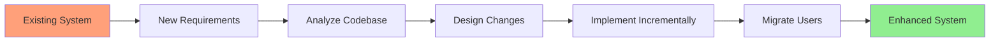
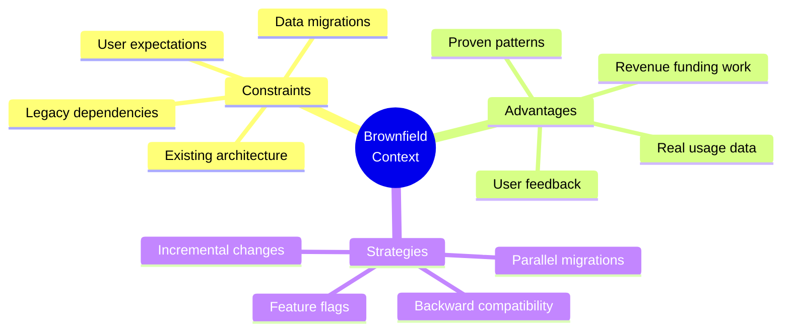
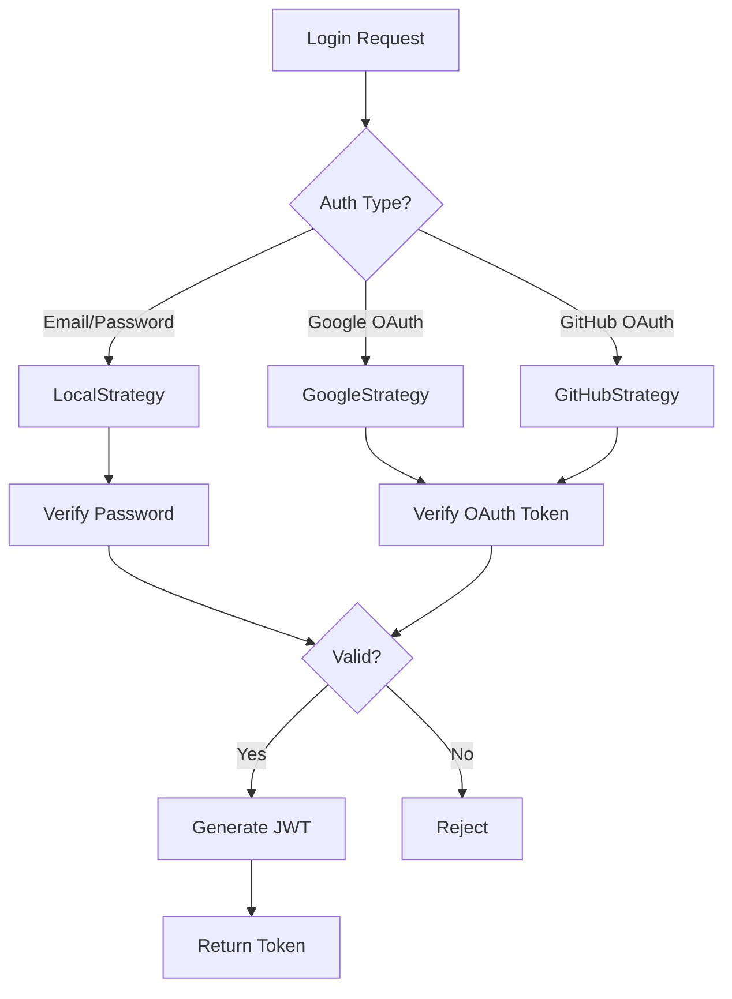

# Lesson 19: Iterative Enhancement (Brownfield)

**Module:** 5 - Development Phases  
**Lesson:** 19 of 25  
**Date:** November 29, 2025

---

## 📖 Concept: Building on Existing Systems

**Brownfield development** means working with existing codebases. You're not building from scratch – you're enhancing, refactoring, and evolving systems that are already in production with real users.



---

## 🎯 Brownfield Characteristics

### The Existing Landscape

**Advantages:**
- ✅ Proven product-market fit
- ✅ Real user feedback
- ✅ Established patterns
- ✅ Working infrastructure
- ✅ Revenue/users already exist

**Challenges:**
- ⚠️ Legacy constraints
- ⚠️ Technical debt
- ⚠️ Can't break existing functionality
- ⚠️ Unknown edge cases in old code
- ⚠️ Migration complexity



---

## 💡 Real-World Analogy

**Brownfield development** is like:
> **Renovating an old house while people live in it.** You must keep it functional, can't break plumbing mid-renovation, and must work around existing structure. But you know what actually needs fixing from years of use.

**Greenfield** would be:
> **Building a new house on empty land.** Total freedom, but no proof anyone wants to live there.

---

## 🔧 Brownfield Workflow with Spec Kit

### Phase 1: Understand the Existing System

**Before changing anything, understand what's there**

```
You: /analyze existing-system

Analyze the authentication system before I add social login.

AI: Analyzing authentication codebase...

[Current Architecture]
- Email/password authentication
- JWT tokens (15 min expiry)
- Refresh tokens (30 day expiry)
- Password reset via email
- User roles: admin, user

[Key Files]
- src/auth/AuthService.ts (300 lines)
- src/auth/AuthController.ts (180 lines)
- src/auth/JwtStrategy.ts (120 lines)
- src/models/User.ts (200 lines)

[Dependencies]
- passport.js for authentication
- bcrypt for password hashing
- nodemailer for emails

[Patterns Used]
- Dependency injection (good!)
- Repository pattern for data access
- Strategy pattern for auth methods

[Potential Issues]
- No rate limiting on login endpoint
- Password reset tokens don't expire
- No audit logging for auth events

[Recommendation]
Social login can be added as new strategy alongside existing auth.
Minimal changes to current code required.
```

### Phase 2: Specify the Enhancement

**Spec must acknowledge existing system**

```markdown
# Feature Specification: Social Login (OAuth2)

## Context
**Existing System:** Email/password authentication with JWT tokens

**Enhancement Goal:** Add Google and GitHub OAuth2 login options

## Requirements

### Functional
1. Users can sign up via Google or GitHub
2. Users can link social accounts to existing email accounts
3. Users can unlink social accounts
4. Existing email/password login continues to work

### Non-Functional
1. **Backward Compatibility:** All existing auth flows must work
2. **Data Migration:** No existing user data affected
3. **Security:** OAuth2 standard with PKCE
4. **Performance:** No degradation of existing login speed

## Integration Points
- Existing AuthService (add OAuth strategies)
- User model (add socialAccounts field)
- JWT generation (use same tokens)
- Frontend login page (add OAuth buttons)

## Out of Scope (for this phase)
- Migrating existing email users to social login
- Social profile sync (avatars, bios, etc.)
- Social friends import
```

### Phase 3: Plan the Integration

**Design changes that minimize disruption**

```markdown
# Technical Plan: Social Login Integration

## Strategy: Extend, Don't Replace

### Architecture Decision
Add OAuth2 as additional authentication strategy, keeping existing 
email/password system intact.



### Data Model Changes

```typescript
// BEFORE (existing)
interface User {
  id: string;
  email: string;
  password: string; // hashed
  createdAt: Date;
}

// AFTER (enhanced)
interface User {
  id: string;
  email: string;
  password?: string; // now optional (OAuth users may not have password)
  socialAccounts?: SocialAccount[]; // NEW
  createdAt: Date;
}

interface SocialAccount { // NEW
  provider: 'google' | 'github';
  providerId: string;
  email: string;
  linkedAt: Date;
}
```

### Implementation Phases

**Phase 1: Backend (1 week)**
- Add OAuth strategies to passport
- Update User model with migration
- Create OAuth endpoints
- Add account linking logic

**Phase 2: Frontend (1 week)**
- Add OAuth buttons to login page
- Create account linking UI in settings
- Handle OAuth callbacks

**Phase 3: Testing & Migration (1 week)**
- Test with existing users (no disruption)
- Beta test OAuth with new users
- Performance testing
- Security audit

**Phase 4: Gradual Rollout (1 week)**
- Feature flag (enable for 10% of users)
- Monitor error rates
- Ramp to 50%, then 100%

### Backward Compatibility Plan

**Existing users:** Zero impact
- Can still log in with email/password
- Can optionally link social accounts

**Existing code:** Minimal changes
- AuthService gains new methods, old ones unchanged
- JWT generation logic identical
- Frontend: OAuth buttons added, existing form unchanged
```

### Phase 4: Incremental Implementation

**Build in small, safe steps**

```markdown
# Implementation Tasks (Phased)

## Week 1: Foundation (No User Impact)

### Phase 1A: Data Model (Days 1-2)
- [ ] Add socialAccounts field to User schema
- [ ] Create database migration (ADD column, don't remove anything)
- [ ] Test migration on staging database
- [ ] Verify existing auth still works

### Phase 1B: OAuth Strategies (Days 3-5)
- [ ] Add passport-google-oauth20 package
- [ ] Add passport-github2 package
- [ ] Implement GoogleStrategy
- [ ] Implement GitHubStrategy
- [ ] Unit tests for strategies
- [ ] Integration tests (separate from existing auth tests)

## Week 2: User-Facing (Controlled Rollout)

### Phase 2A: Backend Endpoints (Days 1-2)
- [ ] POST /auth/google (initiate OAuth)
- [ ] GET /auth/google/callback (handle response)
- [ ] POST /auth/github (initiate OAuth)
- [ ] GET /auth/github/callback (handle response)
- [ ] POST /auth/link/:provider (link to existing account)
- [ ] Feature flag: oauth_enabled (default: false)

### Phase 2B: Frontend UI (Days 3-4)
- [ ] Add "Sign in with Google" button (hidden behind feature flag)
- [ ] Add "Sign in with GitHub" button (hidden behind feature flag)
- [ ] OAuth callback handler page
- [ ] Account linking UI in settings
- [ ] Error handling

### Phase 2C: Testing (Day 5)
- [ ] E2E test: Google signup
- [ ] E2E test: GitHub signup
- [ ] E2E test: Link Google to existing account
- [ ] E2E test: Existing email/password login still works
- [ ] Security audit

## Week 3: Gradual Rollout

- [ ] Day 1: Enable for internal team (5 people)
- [ ] Day 2: Enable for 1% of users (~100 users)
- [ ] Day 3: Monitor metrics, fix any issues
- [ ] Day 4: Ramp to 10% (~1,000 users)
- [ ] Day 5: Ramp to 50% (~5,000 users)
- [ ] Week 4: Ramp to 100% (all users)
```

### Phase 5: Careful Deployment

**Feature Flags for Safety**

```typescript
// Feature flag configuration
const featureFlags = {
  oauth_enabled: {
    production: 0.0,  // Start disabled
    staging: 1.0,     // Fully enabled in staging
    development: 1.0  // Fully enabled in dev
  }
};

// Usage in code
if (isFeatureEnabled('oauth_enabled')) {
  // Show OAuth buttons
}

// Backend
router.post('/auth/google', 
  requireFeatureFlag('oauth_enabled'),
  googleAuthController.authenticate
);
```

**Gradual Rollout Strategy:**

```markdown
## Rollout Plan

### Day 1: Internal (5 users)
- Deploy to production with flag = 0%
- Manually enable for team accounts
- Test all flows in production
- Monitor: errors, performance, user feedback

### Day 2-3: Beta (100 users)
- Enable flag for 1% of users (random)
- Monitor closely:
  - OAuth success rate (target: >95%)
  - Error rates (target: <1%)
  - Existing auth (should be unchanged)
  - Performance (should be same)

### Day 4: Small Rollout (1,000 users)
- Ramp to 10%
- Continue monitoring
- Fix any issues found

### Week 2: Majority (50%)
- If all metrics green, ramp to 50%
- Collect user feedback
- Monitor engagement

### Week 3: Full Rollout (100%)
- Ramp to 100%
- Remove feature flag code (keep the feature)
- Document success metrics
```

---

## 🎓 Brownfield Best Practices

### 1. Never Break Existing Functionality

**The Golden Rule:** Don't break what works

```markdown
## Safety Checklist Before Deployment

### Regression Testing
- [ ] All existing E2E tests pass
- [ ] Manual smoke test of critical paths
- [ ] Performance tests show no degradation
- [ ] Database queries not slower

### User Impact
- [ ] Existing users can still log in
- [ ] Existing API clients still work
- [ ] No forced migrations
- [ ] Graceful fallbacks if new feature fails

### Rollback Plan
- [ ] Can disable feature flag instantly
- [ ] Database migration is reversible
- [ ] Previous version tagged in git
- [ ] Rollback procedure documented and tested
```

### 2. Incremental Changes Over Big Rewrites

**Bad approach:**
```
Week 1-8: Rewrite entire auth system
Week 9: Deploy everything at once
Week 10: Fix production fires 🔥
```

**Good approach:**
```
Week 1: Add OAuth strategies (existing auth unchanged)
Week 2: Add UI (behind feature flag)
Week 3: Test with 1% of users
Week 4: Gradual rollout
```

**Benefits of incremental:**
- Smaller blast radius if something breaks
- Faster time to value (ship features as ready)
- Easier to debug (one change at a time)
- Can pause or rollback at any point

### 3. Data Migrations Are Dangerous

**Migration Safety Rules:**

```markdown
## Database Migration Best Practices

### Rule 1: Additive, Not Destructive
✅ ADD columns (existing data untouched)
✅ ADD tables (existing tables untouched)
❌ REMOVE columns (breaks existing code)
❌ RENAME columns (breaks existing code)
❌ CHANGE column types (risk data loss)

### Rule 2: Backward Compatible
Phase 1: Add new field (optional)
Phase 2: Update code to use new field
Phase 3: Migrate data from old to new
Phase 4: Update code to require new field
Phase 5: (Much later) Remove old field

### Rule 3: Test Extensively
- [ ] Test on copy of production database
- [ ] Measure migration time
- [ ] Verify data integrity
- [ ] Test rollback procedure

### Rule 4: Prepare for Failure
- [ ] Backup before migration
- [ ] Migration can be run multiple times (idempotent)
- [ ] Rollback script ready
- [ ] Downtime communicated (if needed)
```

**Example: Adding socialAccounts**

```sql
-- Phase 1: Add column (non-breaking)
ALTER TABLE users 
ADD COLUMN social_accounts JSONB DEFAULT '[]';

-- Existing code works fine (column is nullable/default)

-- Phase 2: Update application code
-- (Code now populates social_accounts for OAuth logins)

-- Phase 3: No need to migrate data
-- (Old users don't have social accounts, that's fine)

-- Phase 4: Never remove password column
-- (Some users still use email/password)
```

### 4. Feature Flags Are Essential

**Use cases:**

**1. Gradual Rollout**
```typescript
if (featureFlags.oauth && user.inPercentile(50)) {
  showOAuthButtons();
}
```

**2. Kill Switch**
```typescript
// If OAuth breaks in production, flip flag to false instantly
if (featureFlags.oauth) {
  return oauthLogin();
} else {
  // Fall back to old system
  return emailPasswordLogin();
}
```

**3. A/B Testing**
```typescript
if (featureFlags.newCheckoutFlow) {
  return <NewCheckout />;
} else {
  return <OldCheckout />;
}
```

**4. Beta Features**
```typescript
if (featureFlags.advancedAnalytics && user.isBetaTester) {
  showAdvancedAnalytics();
}
```

### 5. Understand Before Changing

**Code Archaeology**

```markdown
## Understanding Legacy Code

### Step 1: Read the Code
- Identify key files
- Understand data flow
- Note patterns used

### Step 2: Trace Through Feature
- Start from user action
- Follow code path
- Document findings

### Step 3: Run the System
- Use the feature as a user
- Observe behavior
- Check database changes

### Step 4: Check Tests
- Read existing tests
- Understand expected behavior
- Find gaps in coverage

### Step 5: Use Git History
```bash
# Who changed this code and why?
git log --follow src/auth/AuthService.ts

# What was the context?
git show abc123

# When was this last touched?
git log -1 --format="%ai" src/auth/AuthService.ts
```

### Step 6: Ask People
- Who built this originally?
- Why was it designed this way?
- What were the constraints?
- What are known issues?
```

---

## 💡 Exercise: Plan a Brownfield Enhancement

**Scenario:** Existing e-commerce site needs "Wishlist" feature

**Current System:**
- Users can browse products
- Shopping cart exists
- User accounts with profiles
- PostgreSQL database
- React frontend, Node.js backend

**Your Enhancement Plan:**

```markdown
## 1. Analyze Existing System

What needs to be understood:


Potential integration points:


Risks:


## 2. Specification

Requirements:


Backward compatibility requirements:


## 3. Data Model Changes

Current schema:


Proposed changes:


Migration strategy:


## 4. Implementation Phases

Phase 1 (Week 1):


Phase 2 (Week 2):


Phase 3 (Week 3):


## 5. Rollout Strategy

Feature flag approach:


Testing strategy:


Gradual rollout plan:

```

<details>
<summary>Sample Answer</summary>

```markdown
## 1. Analyze Existing System

**What needs to be understood:**
- How shopping cart is implemented (for similar patterns)
- User model structure (where to add wishlist)
- Product model (what product data is needed)
- Frontend state management approach (Redux? Context?)

**Potential integration points:**
- Add "Add to Wishlist" button on product pages
- Show wishlist icon in header (like cart icon)
- Use similar API patterns to cart endpoints

**Risks:**
- High traffic (adding DB queries)
- User expectations (must be fast, reliable)
- Multiple devices (sync wishlist across devices)

## 2. Specification

**Requirements:**
- Users can add products to wishlist
- Users can remove products from wishlist
- Users can view their wishlist
- Users can move items from wishlist to cart
- Wishlist persists across sessions
- Wishlist shows product availability/price changes

**Backward compatibility requirements:**
- Existing users get empty wishlist (no migration needed)
- Existing cart functionality unchanged
- Guest users: wishlist in localStorage (like cart), migrates on login

## 3. Data Model Changes

**Current schema:**
```sql
users (id, email, name, created_at)
products (id, name, price, stock)
cart_items (user_id, product_id, quantity)
```

**Proposed changes:**
```sql
-- ADD new table (non-breaking)
CREATE TABLE wishlist_items (
  id SERIAL PRIMARY KEY,
  user_id INT REFERENCES users(id),
  product_id INT REFERENCES products(id),
  added_at TIMESTAMP DEFAULT NOW(),
  UNIQUE(user_id, product_id)
);

-- No changes to existing tables!
```

**Migration strategy:**
- New table only (no existing data touched)
- No downtime required
- Rollback: just drop table

## 4. Implementation Phases

**Phase 1 (Week 1): Backend Foundation**
- Days 1-2: Create wishlist_items table
- Days 3-4: Build WishlistService (similar to CartService)
- Day 5: Create API endpoints (GET, POST, DELETE /wishlist)
- Tests for all endpoints

**Phase 2 (Week 2): Frontend Integration**
- Days 1-2: Wishlist state management
- Days 3-4: UI components (wishlist page, "add to wishlist" button)
- Day 5: Integration testing

**Phase 3 (Week 3): Rollout & Polish**
- Day 1: Deploy with feature flag (0%)
- Day 2: Enable for team (smoke test)
- Day 3: Enable for 5% of users
- Day 4-5: Monitor, fix issues
- Week 4: Ramp to 100%

## 5. Rollout Strategy

**Feature flag approach:**
```typescript
if (featureFlags.wishlist) {
  <WishlistButton product={product} />
}
```

**Testing strategy:**
- Unit tests: WishlistService methods
- Integration tests: API endpoints
- E2E tests: Add to wishlist, view wishlist, move to cart
- Load test: Concurrent wishlist operations
- Regression test: Cart still works

**Gradual rollout plan:**
- Day 1: Internal team (10 people)
- Day 3: 5% of users (~500 users)
- Day 5: 25% of users (~2,500 users)
- Week 2: 100% of users

**Monitoring:**
- Wishlist creation rate
- Conversion rate (wishlist → cart → purchase)
- API error rates
- Database query performance
- User feedback

**Rollback plan:**
- Flip feature flag to false (instant)
- Wishlist data preserved (users don't lose items)
- No cart functionality affected
```

</details>

---

## 🤔 Socratic Questions

### Question 1
**You find old code that's "working but ugly." Should you refactor it while adding new features?**

<details>
<summary>Consider scope and risk...</summary>

**Answer: It depends on whether it affects your new feature.**

### Decision Matrix

**Refactor if:**
- ✓ Old code must change for new feature
- ✓ Bug-prone and causes production issues
- ✓ Blocks new feature implementation
- ✓ You understand it fully
- ✓ Tests exist (or you can add them first)

**Don't refactor if:**
- ✗ It works and isn't touched by new feature
- ✗ You don't fully understand it
- ✗ No tests (risky to change)
- ✗ Under time pressure
- ✗ High-traffic code (risky)

### The Boy Scout Rule

"Leave code better than you found it" BUT:
- Make small, safe improvements
- Don't mix refactoring with feature work
- Keep changes focused
- Test thoroughly

**Good approach:**
```
Commit 1: Refactor old code (if needed)
Commit 2: Add tests for old code
Commit 3: Add new feature
```

**Bad approach:**
```
Commit 1: Rewrite half the system + add feature + fix old bugs
(Too much at once, hard to review, risky!)
```

**When to create separate refactoring task:**

```markdown
## During Feature Work

Found: AuthService has 500 lines, hard to understand

Options:
A) Refactor now (blocks feature, risky)
B) Work around it (duplicate code, but safe)
C) Create ticket: "Refactor AuthService" (do later, safely)

Best: B or C (add feature first, refactor later if priority)
```

**Principle:** 
> **Don't let perfect be the enemy of done.** Refactoring can wait if it doesn't block your feature.
</details>

---

### Question 2
**Your new feature requires changing the database schema in a breaking way. How do you handle it?**

<details>
<summary>Think about zero-downtime deployments...</summary>

**Answer: Use multi-phase deployment with backward compatibility.**

### Example: Renaming a Column

**Bad approach (breaks production):**
```sql
-- DON'T DO THIS
ALTER TABLE users RENAME COLUMN name TO full_name;
```

**Problems:**
- Old code expects 'name', breaks immediately
- Can't deploy code and migration atomically
- Requires downtime

**Good approach (multi-phase):**

### Phase 1: Add New Column (Week 1)
```sql
-- Add new column, keep old one
ALTER TABLE users ADD COLUMN full_name VARCHAR(255);

-- Copy data
UPDATE users SET full_name = name;
```

Deploy: ✓ Old code works (uses 'name')
        ✓ New code can use either

### Phase 2: Dual-Write (Week 2)
```typescript
// Update code to write to both columns
function updateUser(id, name) {
  await db.query(`
    UPDATE users 
    SET name = $1, full_name = $1 
    WHERE id = $2
  `, [name, id]);
}
```

Deploy: ✓ Old and new code both work
        ✓ Data stays in sync

### Phase 3: Switch Reads (Week 3)
```typescript
// Start reading from new column
function getUser(id) {
  const user = await db.query(`
    SELECT id, full_name as name, email 
    FROM users WHERE id = $1
  `, [id]);
  return user;
}
```

Deploy: ✓ Using new column now
        ✓ Old column still there (safety)

### Phase 4: Remove Old Column (Week 4+)
```sql
-- Only after confirming everything works
-- And after old code is fully replaced
ALTER TABLE users DROP COLUMN name;
```

### Multi-Phase Benefits

- ✅ Zero downtime
- ✅ Can rollback at any point
- ✅ Old and new code compatible
- ✅ Safe, gradual transition
- ✅ Time to verify at each step

### When Breaking Changes Are Unavoidable

**Example:** Changing column type in incompatible way

```markdown
Scenario: 'price' column is INT, need DECIMAL for cents

Phase 1: Add new column
  ALTER TABLE products ADD COLUMN price_decimal DECIMAL(10,2);
  
Phase 2: Migrate data
  UPDATE products SET price_decimal = price / 100;
  
Phase 3: Dual-write (both columns)
  Code writes to both, reads from new
  
Phase 4: Remove old column
  ALTER TABLE products DROP COLUMN price;
  
Phase 5: Rename new column (optional)
  ALTER TABLE products RENAME COLUMN price_decimal TO price;
```

**Timeline:** At least 4-6 weeks (don't rush!)

**Principle:**
> **Never break backward compatibility in a single deployment.** Always provide transition period.
</details>

---

### Question 3
**Users report that your new feature is slow. How do you debug performance in a brownfield system?**

<details>
<summary>Consider the interaction with existing code...</summary>

**Answer: Profile the entire request path, not just new code.**

### Performance Debugging Process

**Step 1: Reproduce the Issue**
```markdown
- What action is slow? (specific user flow)
- How slow? (measure: "feels slow" → actual metrics)
- For all users or some? (specific users, regions, times?)
- Always or sometimes? (intermittent issues)
```

**Step 2: Profile the Request**

```typescript
// Add timing middleware
app.use((req, res, next) => {
  const start = Date.now();
  
  res.on('finish', () => {
    const duration = Date.now() - start;
    console.log(`${req.method} ${req.path}: ${duration}ms`);
  });
  
  next();
});

// Add detailed timing in code
async function getWishlist(userId) {
  console.time('query-wishlist');
  const items = await db.query(...);
  console.timeEnd('query-wishlist');
  
  console.time('fetch-products');
  const products = await fetchProducts(items);
  console.timeEnd('fetch-products');
  
  return products;
}
```

**Step 3: Identify Bottleneck**

**Common brownfield performance issues:**

**1. N+1 Queries**
```typescript
// BAD: N+1 queries
async function getWishlist(userId) {
  const items = await db.query('SELECT product_id FROM wishlist WHERE user_id = $1', [userId]);
  
  // Problem: Fetches products one-by-one!
  const products = await Promise.all(
    items.map(item => db.query('SELECT * FROM products WHERE id = $1', [item.product_id]))
  );
  
  return products; // SLOW if user has 50 items!
}

// GOOD: Single query with JOIN
async function getWishlist(userId) {
  const products = await db.query(`
    SELECT p.* 
    FROM wishlist w
    JOIN products p ON p.id = w.product_id
    WHERE w.user_id = $1
  `, [userId]);
  
  return products; // FAST!
}
```

**2. Missing Indexes**
```sql
-- Slow query
SELECT * FROM wishlist WHERE user_id = 123;
-- Takes 500ms on large table

-- Add index
CREATE INDEX idx_wishlist_user ON wishlist(user_id);
-- Now takes 5ms!
```

**3. Synchronous External Calls**
```typescript
// BAD: Synchronous
async function getWishlistWithPrices(userId) {
  const items = await getWishlist(userId);
  
  // Waits for each API call!
  for (const item of items) {
    item.currentPrice = await externalPriceAPI(item.id); // 100ms each
  }
  
  return items; // Total: 50 items × 100ms = 5 seconds!
}

// GOOD: Parallel
async function getWishlistWithPrices(userId) {
  const items = await getWishlist(userId);
  
  // Parallel requests!
  const pricePromises = items.map(item => 
    externalPriceAPI(item.id)
  );
  
  const prices = await Promise.all(pricePromises);
  
  items.forEach((item, i) => {
    item.currentPrice = prices[i];
  });
  
  return items; // Total: ~100ms (all parallel)
}
```

**4. No Caching**
```typescript
// Add caching for expensive operations
const cache = new Map();

async function getProductDetails(productId) {
  const cacheKey = `product:${productId}`;
  
  // Check cache first
  if (cache.has(cacheKey)) {
    return cache.get(cacheKey);
  }
  
  // Fetch if not cached
  const product = await db.query(/* expensive query */);
  
  // Cache for 5 minutes
  cache.set(cacheKey, product);
  setTimeout(() => cache.delete(cacheKey), 5 * 60 * 1000);
  
  return product;
}
```

**Step 4: Fix Without Breaking Existing**

```markdown
## Performance Fix Checklist

- [ ] Profile first (don't guess!)
- [ ] Fix the biggest bottleneck (80/20 rule)
- [ ] Add performance tests
- [ ] Deploy with monitoring
- [ ] Verify fix in production
- [ ] Ensure no regressions (other features still fast)
```

**Step 5: Prevent Future Issues**

```markdown
## Add Monitoring

- Response time percentiles (p50, p95, p99)
- Database query performance
- External API latency
- Cache hit rates

## Set Alerts

- Alert if p95 > 1 second
- Alert if database queries > 100ms
- Alert if external API > 500ms

## Performance Budget

- Wishlist page load: < 500ms
- Add to wishlist: < 200ms
- Product search: < 1 second
```

**Principle:**
> **In brownfield, your new feature might be fast, but interactions with old code can slow everything down.** Profile the entire path, not just your code.
</details>

---

## ✅ Brownfield Success Checklist

**Before Starting:**
- [ ] Existing system thoroughly understood
- [ ] Integration points identified
- [ ] Risks documented
- [ ] Tests for existing functionality present

**During Development:**
- [ ] Changes are incremental
- [ ] Backward compatibility maintained
- [ ] Feature flags used
- [ ] Regression tests passing
- [ ] Performance not degraded

**During Deployment:**
- [ ] Gradual rollout plan executed
- [ ] Monitoring in place
- [ ] Rollback plan ready
- [ ] Existing functionality verified
- [ ] Users not disrupted

---

## 🎯 Summary

**Brownfield development means:**
- Enhancing existing, production systems
- Working within constraints of legacy code
- Maintaining backward compatibility
- Managing risk carefully

**Success keys:**
- Understand before changing
- Incremental over big rewrites
- Feature flags for safety
- Careful data migrations
- Gradual rollouts
- Never break existing functionality

**Remember:**
> Brownfield work is like surgery – slow, careful, precise. The system is keeping people alive (serving real users). Your job is to improve it without killing the patient.

---

## 📚 What's Next?

You've completed Module 5! You now understand development approaches for different phases: greenfield, creative exploration, and brownfield.

**Next:** [Module 5 Review Quiz](./Module-05-Review-Quiz.md)

Then: **Module 6: Real-World Application** (enterprise, technology independence, troubleshooting)

---

*Previous: [Lesson 18: Creative Exploration](./Lesson-18-Creative-Exploration.md)*  
*Next: [Module 5 Review Quiz](./Module-05-Review-Quiz.md)*
