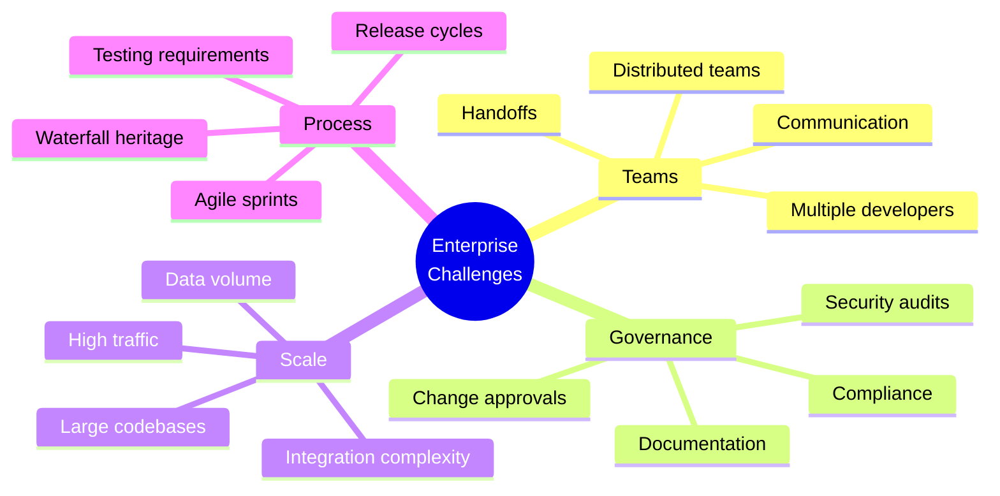
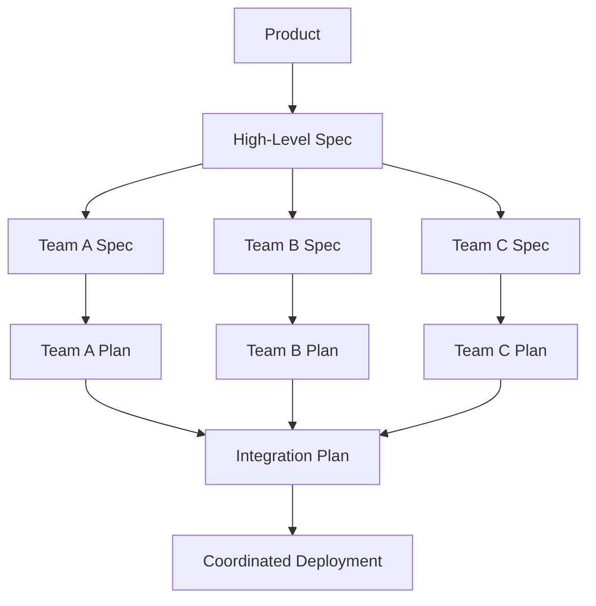
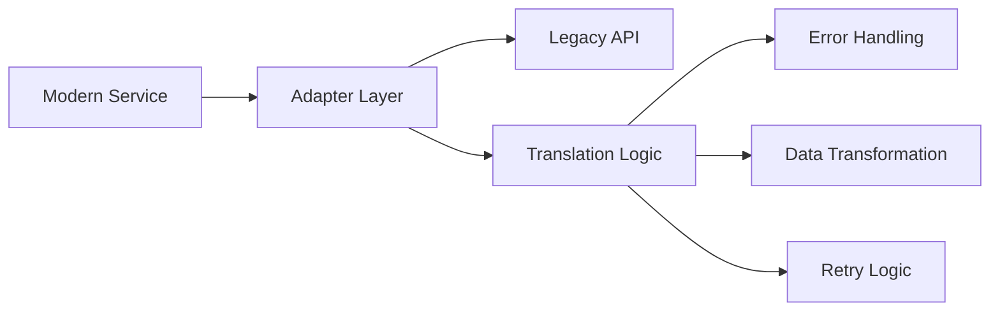
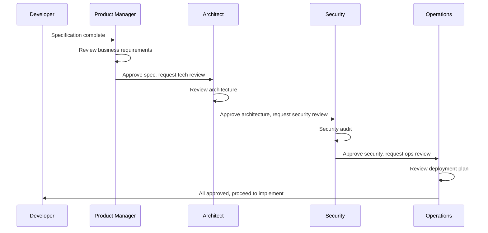

# Lesson 20: Enterprise Considerations

**Module:** 6 - Real-World Application  
**Lesson:** 20 of 25  
**Date:** November 29, 2025

---

## 📖 Concept: Spec-Driven Development at Scale

Enterprise environments have unique challenges: multiple teams, compliance requirements, legacy systems, stakeholder management. Spec-Driven Development adapts to these realities.



---

## 🎯 Enterprise Adaptations

### 1. Multi-Team Coordination

**Challenge:** Multiple teams working on same system

**Solution: Shared Constitution + Team-Specific Practices**

```markdown
## Project-Wide Constitution (.specrc/constitution.md)

### Common Standards (All Teams)
- TypeScript strict mode
- REST API conventions
- Database naming conventions
- Security requirements (OAuth2, encryption)
- Testing minimums (80% coverage)

### Team Autonomy
- Teams choose their own frameworks within approved list
- Teams set internal code review processes
- Teams manage their own feature branches
```

**Communication Pattern:**



### 2. Compliance & Audit Trail

**Challenge:** Regulatory requirements, audit trails

**Solution: Document Everything with Traceability**

```markdown
## Compliance Checklist per Feature

### Traceability
- [ ] Feature linked to business requirement ID
- [ ] Security review completed (ticket #)
- [ ] Privacy impact assessment (if PII involved)
- [ ] Accessibility audit (WCAG 2.1 AA)

### Documentation
- [ ] Specification approved by product owner
- [ ] Technical plan reviewed by architects
- [ ] Security sign-off documented
- [ ] Test results archived

### Change Control
- [ ] Change request number assigned
- [ ] Stakeholder approvals recorded
- [ ] Deployment plan approved
- [ ] Rollback procedure documented
```

**Audit Log Example:**

```markdown
# Feature: Payment Processing Enhancement

**Business Requirement:** BR-2025-045
**Change Request:** CR-2025-189
**Security Review:** SEC-2025-023 (Approved)
**Compliance:** PCI-DSS compliant (audit: AUD-2025-012)

**Approvals:**
- Product Owner: Jane Smith (2025-11-15)
- Security Team: Bob Johnson (2025-11-18)
- Compliance: Alice Chen (2025-11-20)
- Architecture: Dave Kumar (2025-11-22)

**Deployment:** 2025-11-29
**Verification:** Post-deploy security scan passed
```

### 3. Legacy System Integration

**Challenge:** New features must integrate with 10+ year old systems

**Solution: Adapter Pattern + Anti-Corruption Layer**



**Implementation:**

```typescript
// Modern service uses clean interface
interface CustomerService {
  getCustomer(id: string): Promise<Customer>;
  updateCustomer(id: string, data: CustomerUpdate): Promise<void>;
}

// Adapter handles legacy system complexity
class LegacyCustomerAdapter implements CustomerService {
  async getCustomer(id: string): Promise<Customer> {
    // Translate to legacy format
    const legacyId = this.modernToLegacyId(id);
    
    // Call legacy SOAP API (yikes!)
    const soapResponse = await this.legacySoapClient.call(
      'GetCustomerDetails',
      { customerId: legacyId }
    );
    
    // Transform legacy XML to modern JSON
    return this.transformLegacyToModern(soapResponse);
  }
  
  // Hide complexity from modern code
  private modernToLegacyId(id: string): number { /* ... */ }
  private transformLegacyToModern(xml: any): Customer { /* ... */ }
}

// Modern code stays clean
const customerService = new LegacyCustomerAdapter();
const customer = await customerService.getCustomer('123'); // Simple!
```

### 4. Stakeholder Management

**Challenge:** Many stakeholders with different priorities

**Solution: Layered Specifications**

```markdown
## Executive Summary (1 page)
**For:** C-level, VPs
**Content:** Business value, ROI, timeline

## Product Specification (5 pages)
**For:** Product managers, designers
**Content:** Features, user stories, UX flows

## Technical Specification (20 pages)
**For:** Engineers, architects
**Content:** Architecture, APIs, data models

## Operations Specification (3 pages)
**For:** DevOps, SRE
**Content:** Deployment, monitoring, scaling

Each audience gets relevant detail level!
```

### 5. Release Cycles & Change Windows

**Challenge:** Can only deploy during maintenance windows

**Solution: Feature-Complete, Flag-Disabled Deployments**

```markdown
## Deployment Strategy

### Week 1: Deploy Code (Flag OFF)
- Deploy all code to production
- Feature flag = disabled
- Zero user impact
- No maintenance window needed

### Week 2: Testing Window
- Enable flag in staging
- Internal testing
- Security scan
- Performance validation

### Week 3: Scheduled Maintenance Window
- 2 AM Saturday (approved)
- Flip feature flag ON
- Monitor for 2 hours
- Rollback plan ready

Benefits:
- Separate code deployment from feature activation
- Reduce pressure on maintenance windows
- Can test in production (flag off)
- Instant rollback (flip flag)
```

---

## 🎓 Enterprise Patterns

### Pattern 1: The Approval Chain



**Spec Kit Integration:**

```markdown
## Approval Workflow

1. Developer: /specify → Create spec
2. PM: Review & approve spec
3. Developer: /plan → Create technical plan
4. Architect: Review & approve plan
5. Security: Audit plan for security
6. Operations: Review deployment approach
7. Developer: /implement (after all approvals)

Track approvals in spec metadata:
```yaml
approvals:
  product: jane.smith@company.com (2025-11-15)
  architecture: bob.jones@company.com (2025-11-18)
  security: alice.chen@company.com (2025-11-20)
  operations: dave.kumar@company.com (2025-11-22)
status: approved
```

### Pattern 2: The Integration Contract

**Challenge:** Teams must integrate their features

**Solution: API Contract First**

```markdown
## Integration Process

### Step 1: Define Contract (Both Teams)
```yaml
# API Contract: User Service → Order Service

POST /api/orders/create
Request:
  userId: string (UUID)
  items: OrderItem[]
  paymentMethod: string

Response 201:
  orderId: string
  status: "pending"
  estimatedDelivery: Date

Response 400:
  error: { code, message }
```

### Step 2: Teams Work in Parallel
- User Service team: Implement client
- Order Service team: Implement endpoint
- Both use contract as source of truth

### Step 3: Integration Testing
- Mock servers use contract
- Real integration when both ready
- Contract tests validate compliance
```

### Pattern 3: The Documentation Hub

**Enterprise needs centralized documentation**

```
project-root/
├── .specrc/
│   ├── constitution.md (project standards)
│   └── architecture-decision-records/
│       ├── ADR-001-database-choice.md
│       ├── ADR-002-authentication-strategy.md
│       └── ADR-003-microservices-approach.md
├── .features/
│   ├── authentication/
│   │   ├── spec.md
│   │   ├── plan.md
│   │   ├── tasks.md
│   │   └── README.md
│   └── orders/
│       ├── spec.md
│       ├── plan.md
│       └── tasks.md
└── docs/
    ├── onboarding/ (for new team members)
    ├── runbooks/ (operational procedures)
    └── api/ (API documentation)
```

---

## 💡 Exercise: Enterprise Adaptation

**Scenario:** You work at FinanceBank. They want to add "instant transfers" feature.

**Constraints:**
- Must comply with banking regulations
- Security audit required
- 4 teams involved (Frontend, Backend, Payments, Compliance)
- Can only deploy during 2 AM Sunday maintenance windows
- All changes require VP approval

**Your Adaptation Plan:**

```markdown
## 1. Governance & Approvals

Required approvals:


Approval timeline:


## 2. Team Coordination

Teams involved:


Integration points:


Communication plan:


## 3. Compliance Requirements

Regulations to meet:


Documentation needed:


Audit trail:


## 4. Deployment Strategy

With maintenance window constraint:


Feature flag approach:


Rollback plan:
```

<details>
<summary>Sample Answer</summary>

```markdown
## 1. Governance & Approvals

**Required approvals:**
- Product Owner (business requirements)
- VP of Engineering (technical approach)
- Chief Security Officer (security review)
- Compliance Officer (regulatory requirements)
- VP of Operations (deployment plan)

**Approval timeline:**
- Week 1: Spec complete → Product Owner approval
- Week 2: Plan complete → Engineering & Security approval
- Week 3: Compliance review → Compliance Officer approval
- Week 4: Deployment plan → Operations approval
- Week 5+: Implementation begins

## 2. Team Coordination

**Teams involved:**
- Frontend Team: Transfer UI
- Backend Team: Transfer API
- Payments Team: Processing logic
- Compliance Team: Audit logging

**Integration points:**
- Frontend → Backend API
- Backend → Payments Service
- All teams → Compliance Logging Service

**Communication plan:**
- Weekly sync meetings (all teams)
- Shared Slack channel: #instant-transfers
- API contracts defined upfront
- Integration testing environment

## 3. Compliance Requirements

**Regulations to meet:**
- BSA/AML (Bank Secrecy Act / Anti-Money Laundering)
- SOC 2 compliance
- PCI DSS (if card-based)
- GDPR (if EU customers)

**Documentation needed:**
- Privacy Impact Assessment (PIA)
- Security Control Documentation
- Audit logging specification
- Data retention policy
- Incident response plan

**Audit trail:**
- Every transfer logged with:
  - User ID, amount, timestamp
  - Source/destination accounts
  - Geolocation, device info
  - Approval/rejection reason
- Logs retained for 7 years
- Immutable logging (append-only)

## 4. Deployment Strategy

**With maintenance window constraint:**

**Week 10: Pre-deploy (No Maintenance Window Needed)**
- Deploy all code with feature flag OFF
- Code in production but not active
- No user impact

**Week 11: Staging Testing**
- Enable flag in staging
- Full integration testing
- Security penetration testing
- Performance testing
- Compliance verification

**Week 12: Production Activation (Maintenance Window)**
- Sunday 2 AM maintenance window
- Enable feature flag
- Monitor closely for 4 hours
- Phased rollout: 1% → 10% → 100%

**Feature flag approach:**
```typescript
if (featureFlags.instantTransfers && user.inBetaGroup) {
  <InstantTransferButton />
}
```

**Rollback plan:**
- Primary: Flip feature flag OFF (instant)
- Secondary: Revert code deployment (30 min)
- Database: No schema changes (only additions)
- Communication: Pre-written customer notice
```

</details>

---

## 🤔 Socratic Questions

### Question 1
**Enterprise approval processes can take weeks. Does this kill the benefit of Spec-Driven Development?**

<details>
<summary>Think about what Spec-Driven optimizes...</summary>

**Answer: No. Spec-Driven Development optimizes implementation, not approval processes.**

**Without Spec-Driven:**
- Weeks of approvals
- THEN weeks of unclear implementation
- THEN rework from misunderstandings
- THEN more approvals for changes

**With Spec-Driven:**
- Weeks of approvals (same)
- THEN clear, fast implementation (AI-assisted)
- Minimal rework (requirements were clear)
- Rare re-approvals (got it right first time)

**Value:** Reduces the implementation phase significantly, even if governance phase is unchanged.

**Additional Benefit:** Comprehensive specs = better approval meetings (stakeholders understand what they're approving).
</details>

---

### Question 2
**Should each team have their own constitution, or one shared constitution?**

<details>
<summary>Consider autonomy vs consistency...</summary>

**Answer: Layered approach – shared principles + team-specific practices.**

```markdown
## Enterprise Constitution (.specrc/constitution.md)

### Level 1: Company-Wide (Mandatory)
- Security standards (OAuth2, encryption)
- Data protection (GDPR, retention)
- Accessibility (WCAG 2.1)
- Compliance (SOC 2, audit logging)

All teams must follow these.

### Level 2: Technology Group (Strongly Recommended)
- Backend teams: Node.js + TypeScript preferred
- Frontend teams: React preferred
- Mobile teams: React Native preferred

Teams can diverge with justification.

### Level 3: Team-Specific (Team Choice)
- Code formatting (Prettier configs)
- Testing approaches (TDD vs integration-first)
- Git workflows (GitFlow vs trunk-based)

Teams have full autonomy.
```

**Benefits:**
- Consistency where it matters (security, compliance)
- Autonomy where it helps (team velocity)
- Clear escalation (which decisions need approval?)
</details>

---

### Question 3
**Legacy systems don't have specs. How do you integrate Spec-Driven Development?**

<details>
<summary>Think about documentation archaeology...</summary>

**Answer: Document legacy systems incrementally as you touch them.**

### Strategy: Just-in-Time Documentation

**Don't:** Try to document entire legacy system upfront (impossible!)

**Do:** Document what you touch when you touch it

```markdown
## Process

When integrating with legacy system:

1. **Understand the piece you need**
   - Read code
   - Test behavior
   - Ask tribal knowledge holders

2. **Document as interface spec**
```markdown
# Legacy System: Customer Database

## Endpoints We Use

### GET /api/v1/customer/{id}
Response:
```xml
<customer>
  <id>12345</id>
  <name>John Doe</name>
  <!-- Other fields exist but we don't use them -->
</customer>
```

**Known Issues:**
- Returns 500 if customer has no orders (bug since 2010)
- Slow (2-3 seconds) – no caching
- SOAP/XML (no JSON available)

**Our Adapter:** `src/adapters/LegacyCustomerAdapter.ts`
```

3. **Create adapter layer**
   - Hide legacy complexity
   - Provide clean interface to modern code
   - Document quirks and workarounds

4. **Over time, build up documentation**
   - Each integration adds to knowledge base
   - Eventually have good coverage
   - Helps next developer

### The Documentation Backlog

```markdown
## Legacy System Documentation Status

Documented (we interact with these):
✓ Customer API (90% of endpoints)
✓ Order API (60% of endpoints)
✓ Payment API (interface only)

Undocumented (we don't touch these... yet):
? Inventory System
? Reporting System
? Billing System

Strategy: Document when needed, not before.
```
</details>

---

## ✅ Enterprise Readiness Checklist

**Governance:**
- [ ] Approval workflows defined
- [ ] Compliance requirements documented
- [ ] Audit trail mechanism in place
- [ ] Change control process integrated

**Scale:**
- [ ] Multi-team coordination approach
- [ ] Shared constitution + team autonomy
- [ ] API contracts for integrations
- [ ] Documentation hub established

**Legacy:**
- [ ] Adapter pattern for legacy systems
- [ ] Just-in-time documentation strategy
- [ ] Anti-corruption layers designed
- [ ] Migration plan (if applicable)

**Operations:**
- [ ] Deployment strategy fits windows
- [ ] Feature flags for controlled rollout
- [ ] Monitoring and alerting ready
- [ ] Rollback procedures documented

---

## 🎯 Summary

**Enterprise Spec-Driven Development means:**
- Adapting process to governance requirements
- Coordinating multiple teams effectively
- Integrating with legacy systems carefully
- Managing stakeholders with layered docs
- Working within operational constraints

**Key adaptations:**
- Shared constitution for consistency
- Comprehensive approval tracking
- API-first for team coordination
- Feature flags for deployment control
- Just-in-time legacy documentation

**Remember:**
> Enterprise constraints don't kill Spec-Driven Development – they make it more valuable by bringing clarity and structure to complexity.

---

## 📚 What's Next?

Enterprise environments often use diverse technologies. Next, learn how Spec-Driven Development works across any stack.

**Next:** [Lesson 21: Technology Independence](./Lesson-21-Technology-Independence.md)

---

*Previous: [Module 5 Review Quiz](../Module-05-Development-Phases/Module-05-Review-Quiz.md)*  
*Next: [Lesson 21: Technology Independence](./Lesson-21-Technology-Independence.md)*
