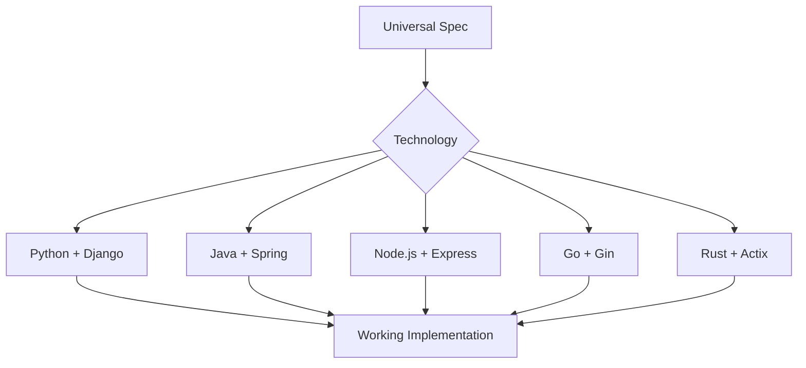
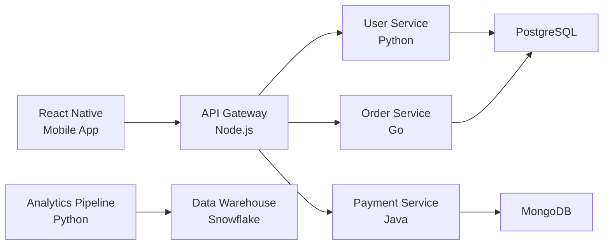
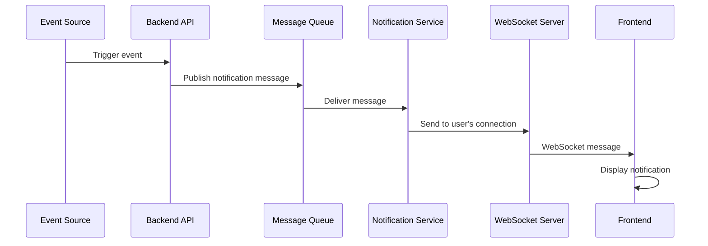

# Lesson 21: Technology Independence

**Module:** 6 - Real-World Application  
**Lesson:** 21 of 25  
**Date:** November 29, 2025

---

## 📖 Concept: Spec-Driven Works Everywhere

Spec-Driven Development is **technology agnostic**. Whether you're building with Python, Java, Go, Rust, JavaScript, or COBOL, the principles remain the same. The specifications describe **what** to build, not **how** in any specific language.



---

## 🎯 Why Technology Independence Matters

### The Polyglot Reality

**Modern systems use multiple technologies:**



**Same Spec-Driven approach works for all!**

---

## 💡 Real-World Analogy

**Technology independence** is like:
> **Architectural blueprints.** The blueprint specifies rooms, doors, measurements. Whether you build with wood, brick, concrete, or steel – the blueprint works. The materials are an implementation detail.

**Specifications** are like blueprints:
> They describe what to build (features, requirements, behavior). The programming language is the building material.

---

## 🔧 Technology-Agnostic Specifications

### Good Specification (Tech-Independent)

```markdown
# Feature: User Registration

## Requirements

### Functional
1. User provides email and password
2. System validates:
   - Email format (RFC 5322)
   - Email uniqueness
   - Password strength (min 8 chars, mixed case, digit)
3. System hashes password (bcrypt, cost factor ≥10)
4. System stores user record
5. System sends verification email
6. System returns success response

### API Contract
POST /api/auth/register
Request: { email: string, password: string }
Response 201: { userId: string, email: string }
Response 400: { error: { code: string, message: string } }

### Security
- Password never stored in plaintext
- Email sent over TLS
- Rate limit: 5 attempts per IP per minute
```

**This spec works for ANY technology!**

---

## 🎓 Constitution Adaptation by Technology

### Example: Web API Service

#### Python + Django

```markdown
# Constitution: Python/Django Project

## Tech Stack
- Python 3.11+
- Django 5.0+
- Django REST Framework
- PostgreSQL 15+
- Redis for caching

## Architecture
- Django apps for bounded contexts
- Class-based views for APIs
- Django ORM for data access
- Celery for background tasks

## Code Standards
- PEP 8 style guide
- Type hints (mypy strict)
- 80% test coverage (pytest)
- Black for formatting

## Testing
- Unit: pytest
- Integration: Django TestCase
- E2E: Playwright

## Patterns
- Repository pattern via Django managers
- Dependency injection via Django's DI
- Serializers for API validation
```

#### Node.js + Express

```markdown
# Constitution: Node.js/Express Project

## Tech Stack
- Node.js 20+ LTS
- Express 4.x
- TypeScript (strict mode)
- PostgreSQL 15+ with Prisma ORM
- Redis for caching

## Architecture
- Clean architecture (controllers, services, repositories)
- Express middleware for cross-cutting concerns
- Prisma for type-safe data access
- Bull for background jobs

## Code Standards
- Airbnb TypeScript style guide
- ESLint + Prettier
- 80% test coverage (Jest)

## Testing
- Unit: Jest
- Integration: Supertest
- E2E: Playwright

## Patterns
- Dependency injection (tsyringe)
- Repository pattern
- DTO validation (class-validator)
```

**Same concepts, different syntax!**

---

## 🛠️ Cross-Technology Translation

### Specification → Multiple Implementations

**Feature Spec (Tech-Independent):**

```markdown
# Task Service: Create Task

Create a new task with title, description, and assignee.

Validation:
- Title: required, 1-200 chars
- Description: optional, max 5000 chars
- Assignee: must be valid user ID

Returns created task with generated ID and timestamp.
```

**Python Implementation:**

```python
# services/task_service.py
from datetime import datetime
from repositories.task_repository import TaskRepository
from repositories.user_repository import UserRepository

class TaskService:
    def __init__(self, task_repo: TaskRepository, user_repo: UserRepository):
        self.task_repo = task_repo
        self.user_repo = user_repo
    
    async def create_task(self, title: str, description: str, assignee_id: str) -> Task:
        # Validation
        if not title or len(title) > 200:
            raise ValidationError("Title must be 1-200 characters")
        
        if description and len(description) > 5000:
            raise ValidationError("Description max 5000 characters")
        
        if not await self.user_repo.exists(assignee_id):
            raise ValidationError("Invalid assignee")
        
        # Create task
        task = Task(
            title=title,
            description=description,
            assignee_id=assignee_id,
            created_at=datetime.utcnow()
        )
        
        return await self.task_repo.create(task)
```

**TypeScript Implementation:**

```typescript
// services/TaskService.ts
import { TaskRepository } from '../repositories/TaskRepository';
import { UserRepository } from '../repositories/UserRepository';

export class TaskService {
  constructor(
    private taskRepo: TaskRepository,
    private userRepo: UserRepository
  ) {}
  
  async createTask(
    title: string,
    description: string,
    assigneeId: string
  ): Promise<Task> {
    // Validation
    if (!title || title.length > 200) {
      throw new ValidationError('Title must be 1-200 characters');
    }
    
    if (description && description.length > 5000) {
      throw new ValidationError('Description max 5000 characters');
    }
    
    if (!(await this.userRepo.exists(assigneeId))) {
      throw new ValidationError('Invalid assignee');
    }
    
    // Create task
    const task: Task = {
      title,
      description,
      assigneeId,
      createdAt: new Date()
    };
    
    return await this.taskRepo.create(task);
  }
}
```

**Java Implementation:**

```java
// services/TaskService.java
public class TaskService {
    private final TaskRepository taskRepo;
    private final UserRepository userRepo;
    
    @Inject
    public TaskService(TaskRepository taskRepo, UserRepository userRepo) {
        this.taskRepo = taskRepo;
        this.userRepo = userRepo;
    }
    
    public Task createTask(String title, String description, String assigneeId) {
        // Validation
        if (title == null || title.isEmpty() || title.length() > 200) {
            throw new ValidationException("Title must be 1-200 characters");
        }
        
        if (description != null && description.length() > 5000) {
            throw new ValidationException("Description max 5000 characters");
        }
        
        if (!userRepo.exists(assigneeId)) {
            throw new ValidationException("Invalid assignee");
        }
        
        // Create task
        Task task = Task.builder()
            .title(title)
            .description(description)
            .assigneeId(assigneeId)
            .createdAt(Instant.now())
            .build();
        
        return taskRepo.create(task);
    }
}
```

**Same logic, same patterns, different languages!**

---

## 🌍 Spec Kit Across Technologies

### Using Spec Kit with Different Stacks

**The spec, plan, and tasks are markdown files – technology neutral!**

**.features/task-management/**
```
spec.md (plain English, tech-agnostic)
plan.md (mentions "TaskService" pattern, not language)
tasks.md (broken down work, not code-specific)
```

**Implementation varies by project constitution:**

```
You: /implement Create TaskService.createTask()

In Python project:
AI: Creates Python class with async/await, type hints

In TypeScript project:
AI: Creates TypeScript class with types, promises

In Java project:
AI: Creates Java class with annotations, CompletableFuture

Same feature, appropriate for each language!
```

---

## 🎓 Best Practices for Multi-Technology Projects

### 1. Language-Neutral Specifications

**Bad (language-specific):**
```markdown
Use a HashMap to store user sessions in memory
```

**Good (pattern-based):**
```markdown
Store user sessions in in-memory cache (Redis)
Key format: session:{userId}
TTL: 30 minutes
```

### 2. Standard Patterns with Local Idioms

**Pattern:** Repository for data access

**Python (Django):**
```python
class UserRepository:
    def find_by_email(self, email: str) -> Optional[User]:
        return User.objects.filter(email=email).first()
```

**Node.js (Prisma):**
```typescript
class UserRepository {
  async findByEmail(email: string): Promise<User | null> {
    return this.prisma.user.findUnique({ where: { email } });
  }
}
```

**Java (JPA):**
```java
@Repository
public class UserRepository {
    public Optional<User> findByEmail(String email) {
        return userDao.findByEmail(email);
    }
}
```

**Same pattern, idiomatic to each language!**

### 3. Constitution Per Technology

If project uses multiple languages:

```
project/
├── frontend/ (TypeScript/React)
│   └── .specrc/constitution.md (TS-specific)
├── backend-api/ (Node.js)
│   └── .specrc/constitution.md (Node-specific)
├── data-pipeline/ (Python)
│   └── .specrc/constitution.md (Python-specific)
└── .specrc/
    └── constitution.md (cross-cutting concerns)
```

**Root constitution (shared):**
```markdown
# Project-Wide Standards

## API Design
- RESTful conventions
- JSON responses
- ISO 8601 dates
- OAuth2 authentication

## Security
- TLS everywhere
- Secrets in environment variables
- Rate limiting on all endpoints

## Testing
- 80% code coverage minimum
- Integration tests for all APIs
- E2E tests for critical flows
```

**Service-specific constitutions:**
```markdown
# Backend API (Node.js) Constitution

Extends: ../constitution.md

## Tech Stack
- Node.js 20+
- TypeScript strict
- Express + Prisma

## Patterns
- Repository pattern
- Dependency injection
- DTO validation
```

---

## 💡 Exercise: Multi-Technology Feature

**Scenario:** Implement "Real-time Notifications" across stack:
- Frontend: React (TypeScript)
- Backend API: Go
- Notification Service: Python
- Message Queue: RabbitMQ

**Create tech-independent spec:**

```markdown
# Feature: Real-time Notifications

## Requirements


## Architecture


## API Contracts


## Technology-Specific Considerations

Frontend (React):


Backend (Go):


Notification Service (Python):


Message Queue (RabbitMQ):

```

<details>
<summary>Sample Answer</summary>

```markdown
# Feature: Real-time Notifications

## Requirements (Tech-Independent)

### Functional
1. Users receive real-time notifications in browser
2. Notifications show: message, timestamp, type (info/warning/error)
3. Users can mark notifications as read
4. Unread notification count shown in header
5. Notifications persist (survive page refresh)

### Non-Functional
- Latency: < 500ms from event to user notification
- Scalability: Support 100,000 concurrent connections
- Reliability: Guaranteed delivery (event not lost if user offline)

## Architecture (Pattern-Based)



## API Contracts (Language-Neutral)

### WebSocket Connection
```
Client: ws://api.example.com/notifications?token={jwt}
Server: Connected
```

### Message Format
```json
{
  "id": "uuid",
  "type": "info|warning|error",
  "message": "Your order has been shipped",
  "timestamp": "2025-11-29T10:00:00Z",
  "read": false
}
```

### HTTP API
```
GET /api/notifications (list notifications)
PATCH /api/notifications/{id}/read (mark as read)
```

## Technology-Specific Considerations

### Frontend (React)
- Use WebSocket API or library (socket.io-client)
- Store notifications in React state/context
- Reconnection logic if connection drops
- Toast notifications for real-time display

### Backend (Go)
- Gorilla WebSocket for WebSocket handling
- JWT middleware for authentication
- Publish to RabbitMQ using amqp library
- Concurrent connection management

### Notification Service (Python)
- Consume from RabbitMQ (pika library)
- Store notifications in PostgreSQL
- Send to WebSocket server (HTTP or internal queue)
- Retry logic for failed deliveries

### Message Queue (RabbitMQ)
- Exchange: "notifications" (topic)
- Routing keys: user.{userId}
- Message persistence (survive restarts)
- Dead letter queue for failed messages

## Implementation Notes

Each service implements its part according to its constitution:
- Go API: Follows Go backend constitution
- Python Service: Follows Python service constitution
- React Frontend: Follows frontend constitution

But all adhere to shared contracts and patterns!
```

</details>

---

## 🤔 Socratic Questions

### Question 1
**Should specifications mention specific libraries (e.g., "Use Express" vs "Use Flask")?**

<details>
<summary>Think about specification vs constitution...</summary>

**Answer: No in spec, yes in constitution/plan.**

**Specification (tech-independent):**
```markdown
Expose RESTful API with authentication
```

**Constitution (tech-specific):**
```markdown
Tech Stack:
- Framework: Express (Node.js)
- Authentication: Passport.js
- Database: Prisma ORM
```

**Plan (references constitution):**
```markdown
Implementation will use Express framework (per constitution)
Passport.js for OAuth2 (per constitution)
```

**Why this separation:**
- **Spec** = Business requirements (eternal)
- **Constitution** = Technology choices (changeable)
- **Plan** = Technical design (references constitution)

**Benefit:** Can change technology without rewriting specifications!

**Example:**
```markdown
Situation: Migrate Node.js → Go

Spec: No changes (requirements unchanged)
Constitution: Update tech stack
Plan: Rewrite (new technology)
Code: Rewrite

Spec reusability = huge time saver!
```
</details>

---

### Question 2
**You're joining a team that uses a language/framework you've never used. How does Spec-Driven Development help?**

<details>
<summary>Consider learning curve and patterns...</summary>

**Answer: Spec-Driven reduces "what to build" learning, lets you focus on "how in this language."**

### Scenario: New to Python/Django

**Without specs:**
- Learn Python syntax
- Learn Django framework
- Understand what feature does
- Figure out business rules
- Discover edge cases
- Learn by exploring undocumented code

**Result:** Overwhelmed, slow, many questions

**With specs:**
- Learn Python syntax
- Learn Django framework
- READ SPEC (what feature does) ✓
- READ SPEC (business rules) ✓
- READ SPEC (edge cases) ✓
- READ PLAN (technical approach)

**Result:** Focus on language/framework, not requirements!

### Onboarding Timeline

**Day 1-2: Read Documentation**
- Constitution (project standards)
- Existing feature specs (learn domain)
- Sample plan (understand patterns)

**Day 3-5: Shadow Existing Feature**
- Pick simple feature
- Read spec → plan → code
- See how requirements → implementation
- Learn team's patterns

**Day 6+: Build New Feature**
- /specify (with help)
- /plan (review with senior dev)
- /implement (with AI assistance!)
- AI knows the language better than you do!

**Benefit:** AI agent handles language specifics, you focus on business logic.

**Key Insight:**
> **Specs are universal, syntax is learnable.** With specs + AI, you can be productive in a new language much faster!
</details>

---

### Question 3
**Your team wants to rewrite the system in a different language. How does Spec-Driven Development help?**

<details>
<summary>Think about rewrite challenges and knowledge preservation...</summary>

**Answer: Specifications become your rewrite blueprint – requirements don't change, only implementation.**

### Traditional Rewrite (No Specs)

**The Nightmare:**
```
Week 1: Start rewriting
Week 4: "Wait, what does this function do?"
Week 8: "Why is this validation here?"
Week 12: "We forgot about this edge case!"
Week 20: "This behaves differently than old system!"
Week 30: "Let's just give up..."
```

**Problem:** Requirements knowledge is embedded in old code. Rewriting = archaeology + reverse engineering.

### Spec-Driven Rewrite

**The Plan:**

```markdown
## Phase 1: Document Existing System (4 weeks)
For each feature:
- Extract requirements → create spec
- Document architecture → create plan
- Map edge cases → update spec

Result: Full specification of existing system!

## Phase 2: New Constitution (1 week)
Define standards for new technology:
- New tech stack
- New patterns
- New testing approach

## Phase 3: Rewrite Feature-by-Feature (12 weeks)
For each feature:
- Spec already exists! ✓
- Create new plan (new technology)
- Create new tasks
- Implement in new stack
- Verify behavior matches spec

## Phase 4: Parallel Run (4 weeks)
- Old and new systems run together
- Compare outputs (should match)
- Gradual traffic migration

## Phase 5: Deprecate Old System (2 weeks)
- Full traffic to new system
- Shut down old system
- Victory! 🎉
```

**Timeline:** 23 weeks vs 30+ weeks (and actually finish!)

**Benefits:**

1. **Requirements Preserved:**
   - Specs document existing behavior
   - Edge cases captured
   - Business rules explicit

2. **Verify Equivalence:**
   - Spec = acceptance criteria
   - New implementation must satisfy same spec
   - Can test behavior matches

3. **Incremental Migration:**
   - Rewrite feature-by-feature
   - Run old + new in parallel
   - Low-risk migration

4. **Knowledge Transfer:**
   - Specs teach new team about system
   - Don't need original developers
   - Future-proof documentation

**Real Example:**

```markdown
# Existing System (Node.js/Express)
Spec: User Authentication (written by analyzing old code)

# New System (Go)
Use same spec!
- Requirements unchanged
- Behavior must match
- But: faster, more scalable, better typed

Result: Drop-in replacement that's functionally identical
```

**Key Insight:**
> **Rewrites fail when requirements are lost. Spec-Driven preserves requirements, making rewrites tractable.**
</details>

---

## ✅ Technology Independence Checklist

**Specifications:**
- [ ] Written in plain language, not code
- [ ] No mention of specific libraries/frameworks
- [ ] Describe behavior, not implementation
- [ ] Work for multiple technology choices

**Constitution:**
- [ ] Technology stack explicitly defined
- [ ] Patterns adapted to language idioms
- [ ] Standards appropriate for technology
- [ ] References language-specific best practices

**Plans:**
- [ ] Reference constitution for tech choices
- [ ] Use patterns appropriate for language
- [ ] Leverage language strengths
- [ ] Account for language constraints

**Implementation:**
- [ ] Follows constitution standards
- [ ] Idiomatic for the language
- [ ] Satisfies tech-independent spec
- [ ] Tested according to language norms

---

## 🎯 Summary

**Technology independence means:**
- Specifications describe requirements, not implementations
- Same specs work for Python, Java, Go, TypeScript, etc.
- Constitution defines tech stack and patterns
- Plans adapt architecture to language
- Code is idiomatic to technology

**Benefits:**
- Specs reusable across rewrites
- Easier onboarding (focus on language, not requirements)
- Multi-language projects coordinated via specs
- AI can implement in any language

**Remember:**
> **Good specs are timeless. Languages come and go, but user requirements endure.** Write specs that outlive your technology choices.

---

## 📚 What's Next?

Technology independence helps with diverse stacks. Next, learn how to troubleshoot when things go wrong.

**Next:** [Lesson 22: Troubleshooting & Debugging](./Lesson-22-Troubleshooting-Debugging.md)

---

*Previous: [Lesson 20: Enterprise Considerations](./Lesson-20-Enterprise-Considerations.md)*  
*Next: [Lesson 22: Troubleshooting & Debugging](./Lesson-22-Troubleshooting-Debugging.md)*
