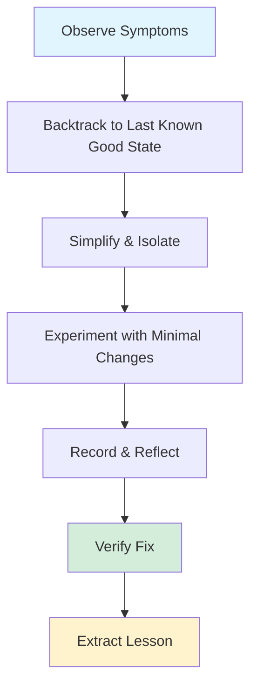
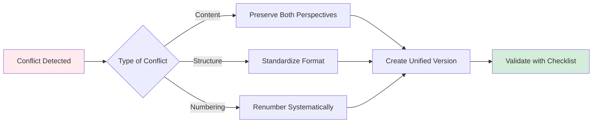
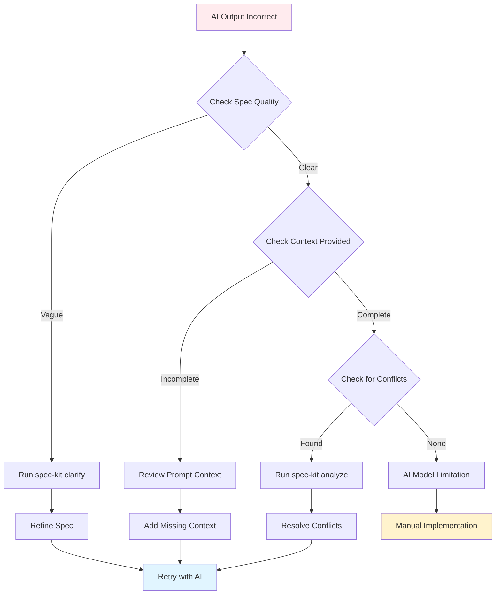
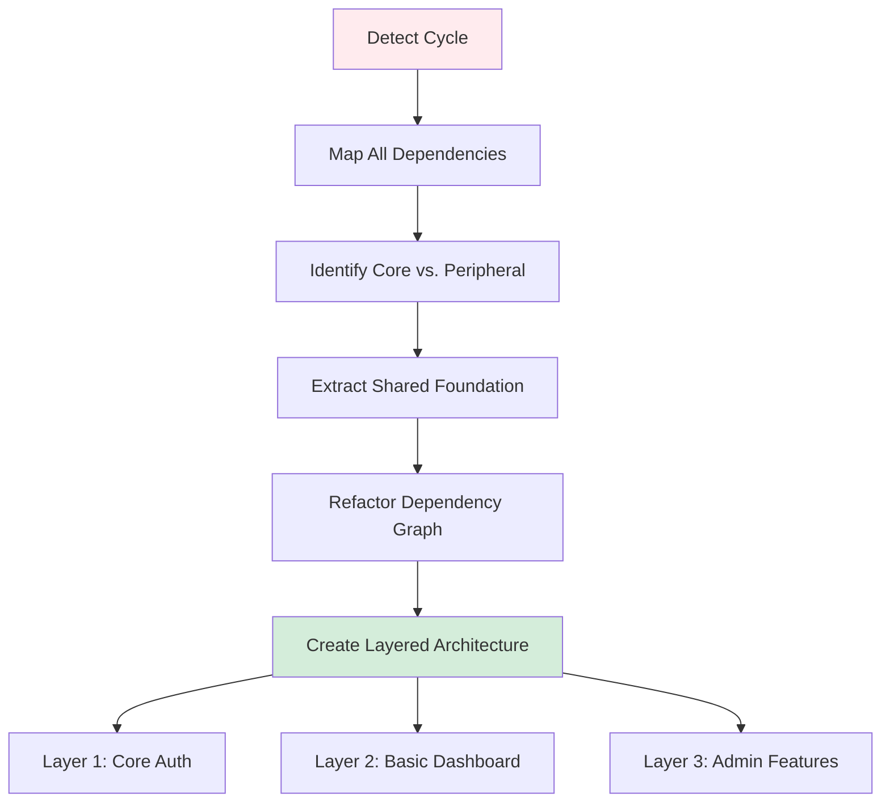
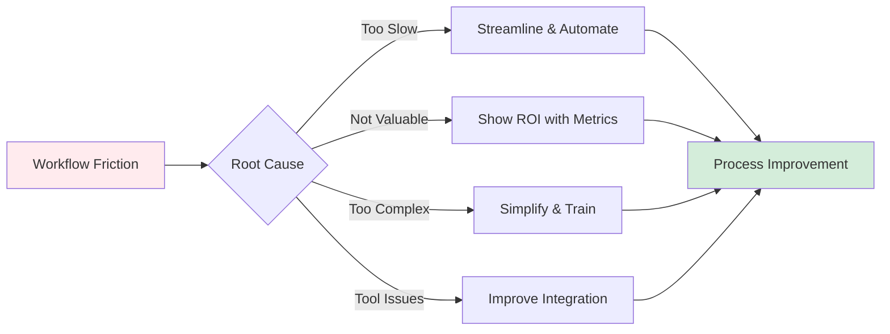
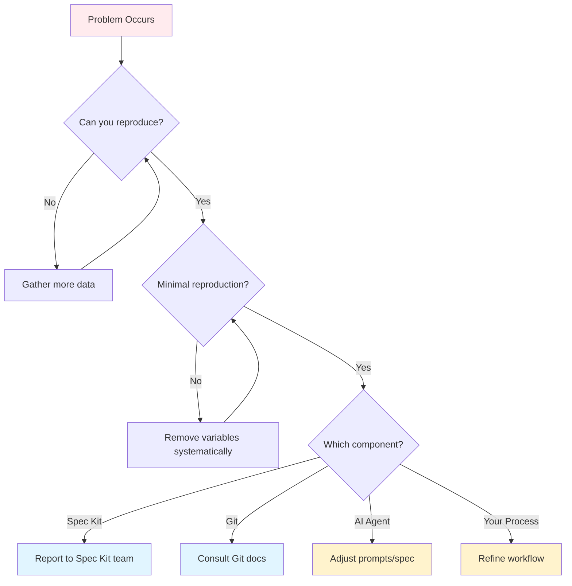
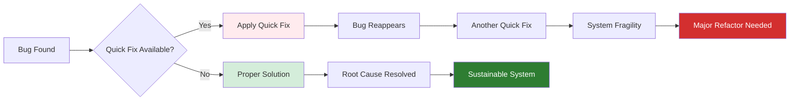
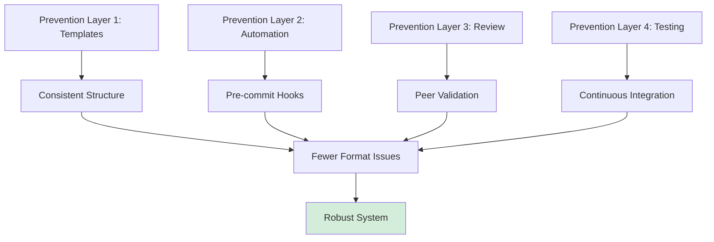

# Lesson 22: Troubleshooting & Debugging

**Module 6: Real-World Application**  
**Date:** November 29, 2025  
**Lesson 22 of 25**

---

## Overview

Even with the best processes, issues arise. This lesson equips you with systematic debugging strategies for Spec Kit workflows, from Git conflicts to AI agent confusion to specification misalignment.

**Learning Objectives:**
- Diagnose common Spec Kit workflow issues
- Apply systematic debugging strategies
- Resolve Git, AI, and specification problems
- Build resilience into your development process

---

## The Debugging Mindset

Think of debugging like being a detective. You don't start by blaming suspects—you gather evidence, form hypotheses, test them systematically, and follow the clues wherever they lead.

### The OBSERVE Framework



---

## Common Issue Categories

### 1. Git & Version Control Issues

#### **Symptom: Merge Conflicts in Spec Files**

**Problem:** Multiple team members edited the same specification simultaneously.

**Diagnosis:**
```bash
# Check conflict markers
git diff --check

# See which branches conflict
git log --merge --oneline
```

**Solution Strategy:**


**Detailed Resolution:**

1. **Understand the context:**
   ```bash
   # View full history of the file
   git log -p -- SPECS/001-feature-name.md
   ```

2. **Preserve semantic meaning:**
   - Don't just pick "ours" or "theirs"
   - Merge the intentions behind both changes
   - Consult specification authors if needed

3. **Re-validate:**
   ```bash
   # After resolving
   spec-kit checklist SPECS/001-feature-name.md
   ```

#### **Symptom: Spec Files Out of Sync with Code**

**Problem:** Implementation diverged from specification without updating docs.

**Solution:**
```bash
# Audit alignment
spec-kit analyze

# Common outputs to investigate:
# - "Spec X references unimplemented feature Y"
# - "Function Z has no corresponding spec"
# - "Checklist items marked done but tests failing"
```

**Recovery Process:**
1. Freeze new development
2. Run `spec-kit analyze` to generate gap report
3. Prioritize: critical misalignments first
4. Update specs or code to align
5. Add prevention measures (pre-commit hooks, CI checks)

---

### 2. AI Agent Confusion

#### **Symptom: AI Generates Incorrect Implementation**

**Root Causes:**
- Ambiguous specification language
- Missing context in prompts
- Conflicting requirements across artifacts
- AI hallucinating connections

**Debugging Process:**



**Practical Example:**

**Bad Spec (AI gets confused):**
```markdown
## User Authentication
The system should handle user login securely.
```

**AI might generate:** Basic username/password with no encryption, no session management, no MFA.

**Good Spec (AI generates correctly):**
```markdown
## User Authentication (REQ-AUTH-001)

**Requirement:** Implement secure user authentication with the following:

1. **Input Validation:**
   - Email: RFC 5322 compliant
   - Password: Min 12 chars, complexity rules per NIST SP 800-63B

2. **Security Measures:**
   - bcrypt hashing (cost factor 12)
   - Rate limiting: 5 attempts per 15 minutes per IP
   - CSRF tokens on all forms

3. **Session Management:**
   - HTTP-only, secure cookies
   - 24-hour expiration with sliding window
   - Server-side session store (Redis)

4. **Multi-Factor Authentication:**
   - TOTP support via authenticator apps
   - Backup codes (10 single-use codes)

**Success Criteria:**
- Passes OWASP ZAP security scan
- All unit tests pass (>95% coverage)
- Performance: <200ms authentication time
```

#### **Symptom: AI Ignores Part of Specification**

**Causes:**
- Spec too long (exceeds context window)
- Information buried in middle of document
- No clear hierarchy or structure

**Solutions:**

1. **Break down large specs:**
   ```bash
   # Split into focused artifacts
   spec-kit specify "User Authentication - Core Flow"
   spec-kit specify "User Authentication - MFA"
   spec-kit specify "User Authentication - Password Reset"
   ```

2. **Use executive summaries:**
   ```markdown
   ## Executive Summary (AI: READ THIS FIRST)
   
   This spec implements secure authentication with:
   - Email/password login (bcrypt)
   - TOTP-based MFA
   - Redis session management
   - Rate limiting (5/15min)
   
   Critical constraints:
   - MUST use bcrypt cost factor 12
   - MUST NOT store passwords in plain text
   - MUST implement rate limiting before any other feature
   ```

3. **Reference architecture diagrams:**
   - Visual representations help AI understand structure
   - Use Mermaid diagrams extensively

---

### 3. Specification Issues

#### **Symptom: Circular Dependencies in Requirements**

**Example:**
- REQ-001: User dashboard requires authentication (REQ-003)
- REQ-002: Admin panel requires dashboard (REQ-001)
- REQ-003: Authentication requires admin panel for user management (REQ-002)

**Detection:**
```bash
spec-kit analyze --check-dependencies
```

**Resolution Strategy:**



**Refactored Approach:**
```markdown
# Layer 1: Foundation
REQ-001: Core Authentication (no dependencies)
REQ-002: User Model (depends: REQ-001)

# Layer 2: Basic Features
REQ-003: User Dashboard (depends: REQ-001, REQ-002)
REQ-004: Basic User Profile (depends: REQ-002)

# Layer 3: Advanced Features
REQ-005: Admin Panel (depends: REQ-001, REQ-003, REQ-004)
REQ-006: User Management (depends: REQ-005)
```

#### **Symptom: Spec Drift Over Time**

**Problem:** Specifications become outdated as project evolves.

**Prevention & Recovery:**

1. **Living Documentation Culture:**
   - Specs are code artifacts, not separate docs
   - Update specs in same commit as implementation changes
   - Pre-commit hook: `spec-kit analyze --strict`

2. **Regular Audits:**
   ```bash
   # Weekly team ritual
   spec-kit analyze --full-report
   
   # Review:
   # - Unimplemented specs older than 2 sprints
   # - Code without corresponding specs
   # - Specs with broken links
   ```

3. **Deprecation Process:**
   ```markdown
   ## REQ-OLD-FEATURE (DEPRECATED)
   
   **Status:** DEPRECATED as of 2025-11-15
   **Replaced by:** REQ-NEW-FEATURE
   **Reason:** Performance improvements, API v2 migration
   **Migration Guide:** See MIGRATION-GUIDE.md
   
   [Original spec content preserved for history]
   ```

---

### 4. Workflow Integration Issues

#### **Symptom: Team Not Following Workflow**

**Common Reasons:**
- Workflow too cumbersome
- Unclear value proposition
- Lack of training
- Poor tool integration

**Diagnosis Questions:**
1. Are people skipping specific steps? (Which ones?)
2. Are they working around the process?
3. What pain points do they cite?

**Solutions:**



**Example: Automating Tedious Steps**

Before (manual, error-prone):
```bash
# Developer has to remember:
spec-kit specify "Feature X"
# ... edit file ...
spec-kit plan SPECS/045-feature-x.md
# ... edit file ...
spec-kit task PLANS/045-feature-x-plan.md
# ... edit file ...
git add SPECS/ PLANS/ TASKS/
git commit -m "Add Feature X artifacts"
```

After (automated helper):
```bash
# One command does it all
./scripts/new-feature.sh "Feature X"

# Script handles:
# 1. Runs specify
# 2. Opens editor
# 3. Validates spec
# 4. Runs plan
# 5. Opens editor
# 6. Runs task
# 7. Opens editor
# 8. Commits all artifacts
# 9. Creates feature branch
```

---

## Systematic Debugging Workflow

### Step 1: Reproduce Consistently

```markdown
## Bug Report Template

**Issue:** [Brief description]

**Expected Behavior:**
- What should happen?

**Actual Behavior:**
- What actually happens?

**Reproduction Steps:**
1. Step one
2. Step two
3. ...

**Environment:**
- Spec Kit version: [version]
- Git version: [version]
- OS: [OS]
- AI agent: [which one]

**Relevant Artifacts:**
- Specs: [list]
- Plans: [list]
- Tasks: [list]
```

### Step 2: Isolate the Problem



### Step 3: Research & Hypothesize

**Resources to Check:**
1. Spec Kit documentation
2. GitHub issues (similar problems?)
3. Community discussions
4. Git documentation
5. AI agent best practices

**Form Hypotheses:**
- "I think this happens because..."
- "This might be related to..."
- "If I'm right, then changing X should fix Y..."

### Step 4: Test Systematically

```bash
# Save current state
git stash --include-untracked

# Test hypothesis 1
[make change]
[test]
[record result]

# Revert
git stash pop

# Test hypothesis 2
[repeat]
```

### Step 5: Implement & Verify

Once you've identified the fix:

1. **Implement properly:**
   - Not just a quick hack
   - Fix root cause, not symptom
   
2. **Test thoroughly:**
   - Does it fix the original issue?
   - Does it break anything else?
   - Does it work in edge cases?

3. **Document:**
   - Update specs if needed
   - Add comments explaining the fix
   - Update team documentation

4. **Share learning:**
   - Add to team knowledge base
   - Consider contributing to Spec Kit docs
   - Prevent others from hitting same issue

---

## Common Pitfall: Quick Fixes

### The Technical Debt Trap



**Resist the Temptation:**
- "I'll just hardcode this for now..."
- "I'll update the spec later..."
- "This works, ship it..."

**Do This Instead:**
- Fix it properly the first time
- Update specs in the same commit
- Add tests to prevent regression
- Document why the bug occurred

---

## Advanced Debugging Tools

### 1. Spec Kit Analysis Features

```bash
# Full system health check
spec-kit analyze --comprehensive

# Check specific areas
spec-kit analyze --check-dependencies
spec-kit analyze --check-coverage
spec-kit analyze --check-consistency

# Generate reports
spec-kit analyze --output-format json > analysis.json
spec-kit analyze --output-format html > report.html
```

### 2. Git Forensics

```bash
# Who changed this spec and when?
git log -p --follow SPECS/042-auth.md

# What was this spec like 2 weeks ago?
git show HEAD~10:SPECS/042-auth.md

# When did this requirement first appear?
git log -S "REQ-AUTH-MFA" --all

# Show all changes to SPECS directory
git log --oneline --graph -- SPECS/
```

### 3. Diff & Validation Tools

```bash
# Compare spec versions
diff -u SPECS/042-auth.md <(git show HEAD~5:SPECS/042-auth.md)

# Validate spec format
spec-kit checklist --strict SPECS/042-auth.md

# Check for broken links
spec-kit analyze --check-links
```

---

## Prevention Strategies

### Build Robustness into Your Process



### 1. Pre-commit Hooks

```bash
# .git/hooks/pre-commit
#!/bin/bash

echo "Running Spec Kit validation..."

# Check all specs are valid
spec-kit checklist --all --strict
if [ $? -ne 0 ]; then
    echo "❌ Spec validation failed"
    exit 1
fi

# Check for spec-code alignment
spec-kit analyze --quick
if [ $? -ne 0 ]; then
    echo "⚠️  Spec-code misalignment detected"
    echo "   Run: spec-kit analyze --full"
    exit 1
fi

echo "✅ All checks passed"
```

### 2. CI/CD Integration

```yaml
# .github/workflows/spec-validation.yml
name: Spec Validation

on: [push, pull_request]

jobs:
  validate:
    runs-on: ubuntu-latest
    steps:
      - uses: actions/checkout@v2
      
      - name: Install Spec Kit
        run: npm install -g spec-kit
      
      - name: Validate Specs
        run: spec-kit checklist --all --strict
      
      - name: Check Coverage
        run: spec-kit analyze --check-coverage
      
      - name: Generate Report
        run: spec-kit analyze --output-format html > spec-report.html
      
      - name: Upload Report
        uses: actions/upload-artifact@v2
        with:
          name: spec-report
          path: spec-report.html
```

### 3. Regular Health Checks

**Weekly Ritual:**
```bash
# Team runs together every Monday
./scripts/weekly-spec-audit.sh

# Script checks:
# - Specs older than 2 sprints without implementation
# - Code without specs
# - Broken cross-references
# - Deprecated specs not marked
# - Checklist items marked done but tests failing
```

---

## Socratic Questions

### Question 1: The Mysterious Bug

**Scenario:** Your AI agent consistently generates authentication code that fails security tests, but only when processing `SPECS/042-authentication.md`. The same prompt with other specs works fine. What's your debugging strategy?

<details>
<summary><strong>Answer</strong></summary>

**Approach:**

1. **Compare the specs:**
   ```bash
   diff SPECS/042-authentication.md SPECS/[working-spec].md
   ```
   Look for formatting differences, special characters, or structural issues.

2. **Check for hidden issues:**
   - Character encoding problems (UTF-8 vs. others)
   - Invisible characters (zero-width spaces)
   - Markdown rendering issues
   - Extremely long lines

3. **Isolate the problematic content:**
   - Copy small sections to new file
   - Test each section individually
   - Find the exact trigger

4. **Run validation:**
   ```bash
   spec-kit checklist SPECS/042-authentication.md --verbose
   ```

5. **Check AI context limits:**
   - Is the spec too long?
   - Does it reference too many other artifacts?
   - Try splitting into smaller specs

**Likely culprits:**
- Malformed code blocks confusing the AI
- Ambiguous language in critical sections
- Conflicting requirements buried in the spec
- References to deprecated or non-existent artifacts
</details>

---

### Question 2: The Spec Drift Dilemma

**Scenario:** Your team has 127 specification files. During a `spec-kit analyze` run, you discover 43 specs are outdated, 17 have no corresponding implementation, and 22 implemented features have no specs. The project is due in 4 weeks. How do you prioritize recovery?

<details>
<summary><strong>Answer</strong></summary>

**Strategic Triage:**

1. **Assess Criticality (Week 1):**
   ```markdown
   Priority 1 (Must Fix): 
   - Core user flows with spec-code misalignment
   - Security/compliance features out of sync
   - Public APIs with inaccurate specs
   
   Priority 2 (Should Fix):
   - Important features used frequently
   - Recent implementations without specs
   
   Priority 3 (Nice to Have):
   - Deprecated features
   - Experimental code
   - Internal tools
   ```

2. **Parallel Workstreams (Weeks 2-3):**
   - **Team A:** Fix P1 spec-code misalignments (43 → focus on top 10)
   - **Team B:** Create specs for P1 missing documentation (22 → focus on top 8)
   - **Team C:** Archive or implement P1 unimplemented specs (17 → decide on top 5)

3. **Automation (Week 4):**
   - Generate draft specs for simple features using AI
   - Create templates for common patterns
   - Implement pre-commit hooks to prevent future drift

4. **Acceptance Criteria:**
   - All P1 items resolved
   - Process in place to prevent recurrence
   - P2/P3 items documented in backlog

**Key Insight:** Don't try to fix everything. Fix what matters most, establish prevention, iterate on the rest.
</details>

---

### Question 3: The Conflict Resolution Challenge

**Scenario:** You're merging a feature branch with 12 spec file changes. Git shows conflicts in 8 specs. Developer A added new requirements, Developer B restructured the same specs for clarity, and Developer C marked several checklist items as completed. How do you resolve this cleanly?

<details>
<summary><strong>Answer</strong></summary>

**Systematic Resolution Process:**

1. **Assess each conflict type:**
   ```bash
   # Review each conflict
   git diff --ours --theirs SPECS/[file].md
   ```

2. **Categorize conflicts:**
   - **Content conflicts:** Different requirements/features
   - **Structural conflicts:** Reorganization vs. addition
   - **Status conflicts:** Different checklist completion states

3. **Resolution Strategy by Type:**

   **Content Conflicts (Dev A's additions):**
   - Preserve all new requirements
   - Assign new requirement IDs if needed
   - Ensure no semantic duplication

   **Structural Conflicts (Dev B's reorganization):**
   - Accept new structure (better organization)
   - Merge Dev A's content into new structure
   - Update all cross-references

   **Status Conflicts (Dev C's checklist):**
   - Keep most recent completion status
   - Verify with actual implementation state
   - Re-run tests if uncertain

4. **Validation After Merge:**
   ```bash
   # Ensure specs are valid
   spec-kit checklist --all --strict
   
   # Check for broken references
   spec-kit analyze --check-links
   
   # Verify consistency
   spec-kit analyze --check-consistency
   ```

5. **Team Communication:**
   - Post-merge meeting with all three developers
   - Walk through resolved conflicts
   - Update team on new structure
   - Document resolution decisions

**Best Practice:** For complex merges involving spec files, consider pair-merging with all affected developers present.
</details>

---

## Practical Exercises

### Exercise 1: Debugging Simulation

**Setup:**
Create a deliberately broken spec with multiple issues:
- Circular dependencies
- Ambiguous requirements
- Conflicting success criteria
- Broken cross-references

**Task:**
1. Use `spec-kit analyze` to detect issues
2. Document each problem
3. Create a fix plan
4. Implement fixes
5. Validate with checklist

**Time:** 45 minutes

**Success Criteria:**
- All issues identified
- Systematic resolution plan
- Clean validation after fixes

---

### Exercise 2: AI Agent Confusion Case Study

**Scenario:**
You provide a spec to an AI agent. It generates code that compiles but fails all tests. The AI insists its implementation matches the spec.

**Task:**
1. Review the spec for ambiguity
2. Run `spec-kit clarify` to identify underspecified areas
3. Rewrite problematic sections
4. Test with AI again
5. Document what made the difference

**Deliverable:** Before/after comparison showing improvement in AI output quality.

---

### Exercise 3: Conflict Resolution Practice

**Setup:**
1. Create a feature branch
2. Modify a spec file
3. Switch to main, modify same spec differently
4. Attempt merge to create conflict

**Task:**
Practice resolving the conflict using:
- Visual diff tools
- `spec-kit` validation
- Semantic understanding of both changes

**Outcome:** Clean merge with all changes preserved appropriately.

---

## Troubleshooting Checklist

### When Something Goes Wrong

- [ ] Can I reproduce the issue consistently?
- [ ] Have I isolated the minimal reproduction case?
- [ ] Have I checked the Spec Kit documentation?
- [ ] Have I run `spec-kit analyze` to check system health?
- [ ] Have I reviewed recent changes (git log)?
- [ ] Have I checked for conflicting requirements?
- [ ] Have I validated all spec files?
- [ ] Have I tested with a simplified version?
- [ ] Have I consulted with team members?
- [ ] Have I documented the issue properly?

### Before Declaring Victory

- [ ] Does the fix address the root cause?
- [ ] Have I tested edge cases?
- [ ] Have I updated relevant specs?
- [ ] Have I added tests to prevent regression?
- [ ] Have I documented the solution?
- [ ] Have I shared learnings with the team?
- [ ] Have I verified no new issues were introduced?

---

## Key Takeaways

1. **Systematic beats heroic:** Debugging is a process, not inspiration
2. **Fix root causes:** Quick fixes create technical debt
3. **Document learnings:** Your bug is someone else's future lesson
4. **Build prevention:** The best bug fix is the one you never need
5. **Stay calm:** Bugs are learning opportunities, not failures

---

## Further Resources

- **Git Debugging Guide:** [Git Tools - Debugging](https://git-scm.com/book/en/v2/Git-Tools-Debugging-with-Git)
- **Spec Kit Issue Tracker:** [GitHub Issues](https://github.com/spec-kit/spec-kit/issues)
- **AI Prompt Engineering:** Best practices for clear AI instructions
- **Systematic Debugging:** "Debugging" by David Agans

---

## Navigation

← [Previous: Lesson 21 - Technology Independence](Lesson-21-Technology-Independence.md)  
→ [Next: Module 6 Review Quiz](Module-06-Review-Quiz.md)  
↑ [Back to Module 6](../Module-06-Real-World-Application/)  
🏠 [Course Home](../00-Course-Overview.md)
