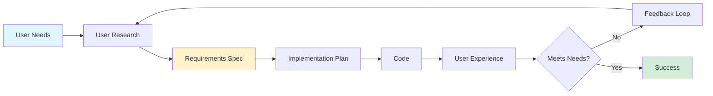
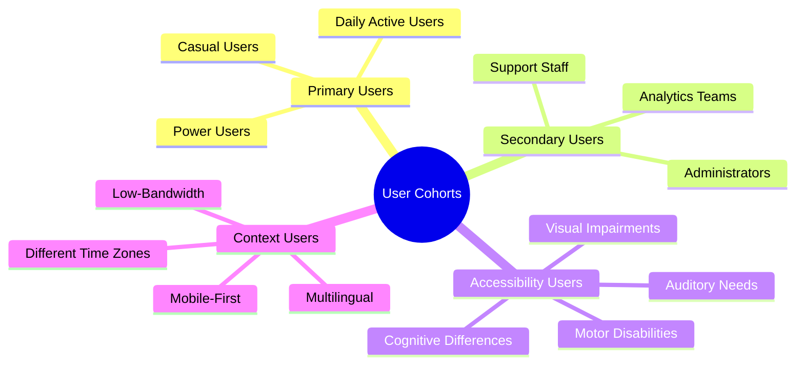
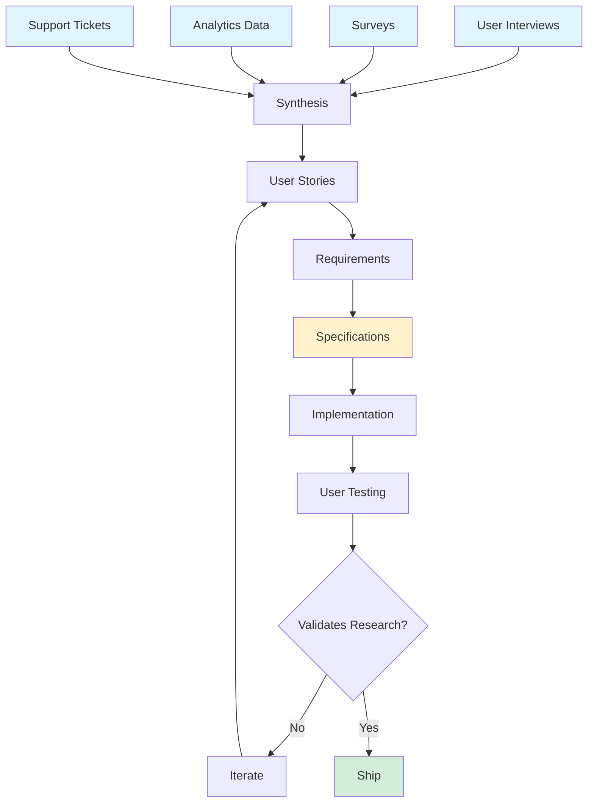
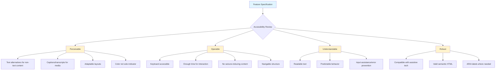
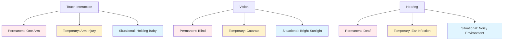
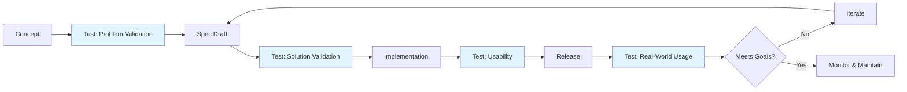
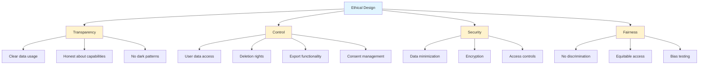

# Lesson 23: User-Centric Development

**Module 7: Mastery**  
**Date:** November 29, 2025  
**Lesson 23 of 25**

---

## Overview

Specifications exist to serve users, not documents. This lesson teaches you to center your Spec Kit workflow around user needs, accessibility, and diverse cohorts—ensuring your technical excellence translates to real-world value.

**Learning Objectives:**
- Build specifications that prioritize user outcomes
- Integrate accessibility and inclusivity from the start
- Adapt workflows for different user cohorts
- Connect user research to technical specifications

---

## The User-First Philosophy

Think of specifications as a bridge. On one side: user needs and pain points. On the other: technical implementation. Your specs are the architecture of that bridge—they must be grounded on both shores.



**The Central Question:** *"For whom are we building this, and what problem does it solve for them?"*

---

## Understanding User Cohorts

### Who Are Your Users?

Different users have different needs, contexts, and constraints. Your specifications must account for this diversity.



### User Cohort Analysis Template

```markdown
## User Cohort: [Name]

**Demographics:**
- Age range: [range]
- Technical proficiency: [low/medium/high]
- Primary devices: [list]
- Typical use context: [description]

**Goals:**
1. [Primary goal]
2. [Secondary goal]
3. [Tertiary goal]

**Pain Points:**
1. [Pain point 1]
2. [Pain point 2]
3. [Pain point 3]

**Constraints:**
- Technical: [e.g., older devices, slow internet]
- Accessibility: [e.g., screen reader users]
- Contextual: [e.g., high-stress environment, multitasking]

**Success Metrics:**
- [How do we know this cohort is well-served?]

**Specification Implications:**
- [What requirements does this cohort drive?]
```

---

## Integrating User Research into Specs

### The Research-to-Spec Pipeline



### From User Story to Spec

**User Story:**
> "As a mobile user with limited data, I want to see critical information first without loading heavy images, so I can quickly check my account balance while on the go."

**Translated to Requirements:**

```markdown
## Mobile-First Dashboard (REQ-DASH-MOBILE-001)

**User Cohort:** Mobile users, limited data plans, on-the-go access

**User Need:** Quick access to critical account information without excessive data usage

**Functional Requirements:**

1. **Progressive Content Loading:**
   - Load critical data first (balance, recent transactions)
   - Defer non-critical elements (charts, images)
   - Total initial payload <50KB

2. **Data Efficiency:**
   - Compress API responses (gzip)
   - Cache static assets (24-hour TTL)
   - Lazy-load images below the fold

3. **Performance Targets:**
   - Time to Interactive: <2s on 3G
   - First Contentful Paint: <1s
   - Balance visible: <1.5s

**Success Criteria:**
- 95th percentile mobile load time <3s
- <100KB data transfer for critical path
- User testing shows 90%+ can check balance in <5s

**Accessibility Considerations:**
- Balance announcement for screen readers within 2s
- High contrast mode for sunlight readability
- Large touch targets (min 44x44px)

**Acceptance Tests:**
1. Load dashboard on throttled 3G connection
   - Expected: Balance visible in <1.5s
2. Measure data transfer for critical path
   - Expected: <100KB
3. User testing with 10 mobile users
   - Expected: 90%+ successful quick balance check
```

---

## Accessibility as a Core Requirement

Accessibility isn't a nice-to-have—it's a fundamental requirement. Your specs should embed accessibility from the start, not bolt it on later.

### WCAG Compliance in Specifications

**Levels of Compliance:**
- **Level A:** Basic accessibility (minimum)
- **Level AA:** Standard for most applications (target)
- **Level AAA:** Enhanced accessibility (where applicable)



### Accessibility Specification Template

```markdown
## Accessibility Requirements: [Feature Name]

**WCAG Target Level:** AA (specify AAA for critical features)

### Perceivable

**Visual:**
- [ ] Color contrast ratio ≥ 4.5:1 for text
- [ ] Color contrast ratio ≥ 3:1 for UI components
- [ ] Information not conveyed by color alone
- [ ] Text resizable to 200% without loss of functionality

**Auditory:**
- [ ] Captions for video content
- [ ] Transcripts for audio content
- [ ] Visual alternatives for audio alerts

**Adaptable:**
- [ ] Semantic HTML structure (headings, landmarks)
- [ ] Logical reading order preserved
- [ ] Responsive design (mobile, tablet, desktop)

### Operable

**Keyboard:**
- [ ] All functionality available via keyboard
- [ ] No keyboard traps
- [ ] Visible focus indicators
- [ ] Logical tab order

**Time:**
- [ ] No time limits, or adjustable/extendable
- [ ] Ability to pause/stop animations
- [ ] Auto-refresh can be disabled

**Navigation:**
- [ ] Skip links for repetitive content
- [ ] Clear page titles
- [ ] Focus management for dynamic content
- [ ] Breadcrumbs for complex navigation

### Understandable

**Readable:**
- [ ] Language of page declared (HTML lang attribute)
- [ ] Clear, simple language (appropriate reading level)
- [ ] Definitions for jargon/abbreviations

**Predictable:**
- [ ] Consistent navigation across pages
- [ ] Consistent component behavior
- [ ] No context changes on focus
- [ ] Change of context only on user action

**Input Assistance:**
- [ ] Form labels clearly associated
- [ ] Error messages descriptive and specific
- [ ] Suggestions for error correction
- [ ] Confirmation for significant actions

### Robust

**Compatibility:**
- [ ] Valid HTML
- [ ] ARIA labels for custom components
- [ ] Name, role, value for all UI components
- [ ] Status messages announced to screen readers

### Testing Requirements

**Automated Testing:**
- [ ] axe-core or similar tool (0 violations)
- [ ] WAVE browser extension
- [ ] Lighthouse accessibility audit (score ≥ 90)

**Manual Testing:**
- [ ] Screen reader testing (NVDA/JAWS on Windows, VoiceOver on Mac/iOS)
- [ ] Keyboard-only navigation
- [ ] High contrast mode
- [ ] Browser zoom to 200%

**User Testing:**
- [ ] Test with users who use assistive technology
- [ ] Minimum 3-5 users per major assistive tech category
- [ ] Document and address feedback

### Success Criteria

- All automated tests pass
- Manual testing reveals no critical issues
- User testing shows 85%+ task completion rate
- Zero high-severity accessibility issues in production
```

---

## Inclusive Design Principles

Accessibility is one aspect of inclusion. True inclusive design considers diverse:
- Abilities (physical, sensory, cognitive)
- Contexts (devices, network speeds, environments)
- Cultures (languages, norms, values)
- Technical proficiency (novice to expert)

### The Persona Spectrum

Microsoft's Inclusive Design approach uses a "Persona Spectrum" to understand permanent, temporary, and situational limitations.



**Specification Impact:**

When you design for permanent limitations, you improve the experience for everyone:
- **Keyboard navigation** helps power users, not just screen reader users
- **Captions** help non-native speakers and people in quiet environments, not just deaf users
- **Simple language** helps people with cognitive differences and non-experts
- **High contrast** helps everyone in bright sunlight, not just low-vision users

---

## User Testing in the Spec Workflow

### When to Test



### Embedding Testing in Specifications

```markdown
## Testing Requirements: [Feature Name]

### Problem Validation (Before Speccing)

**Hypothesis:** [What problem are we solving?]

**Test Method:**
- User interviews: 5-8 users from target cohort
- Observation of current workflow
- Pain point identification

**Success Criteria:**
- 70%+ of users report the identified problem
- Problem severity rated 7+ (out of 10)

**Status:** [Completed / In Progress / Not Started]

### Solution Validation (After Spec, Before Implementation)

**Hypothesis:** [This solution addresses the problem]

**Test Method:**
- Clickable prototype or wireframes
- Task-based testing with 8-12 users
- Comprehension testing of key concepts

**Key Tasks:**
1. [Task 1: Expected completion rate 80%+]
2. [Task 2: Expected completion rate 75%+]
3. [Task 3: Expected completion rate 70%+]

**Success Criteria:**
- Tasks completed within expected rates
- Users express confidence in solution (8+ out of 10)
- No critical misunderstandings of functionality

**Status:** [Completed / In Progress / Not Started]

### Usability Testing (After Implementation, Before Release)

**Test Method:**
- Full implementation testing
- 10-15 users from diverse cohorts
- Both moderated and unmoderated sessions

**Scenarios:**
1. [Scenario 1]
2. [Scenario 2]
3. [Scenario 3]

**Metrics:**
- Task success rate: 85%+ target
- Time on task: [baseline vs. target]
- Error rate: <5%
- Satisfaction score: 4+ out of 5

**Accessibility Testing:**
- Screen reader users: 3 users
- Keyboard-only users: 2 users
- Low-vision users: 2 users

**Status:** [Completed / In Progress / Not Started]

### Real-World Usage Monitoring (Post-Release)

**Instrumentation:**
- Analytics events: [list key events]
- Performance monitoring: [metrics]
- Error tracking: [tools]
- User feedback: [channels]

**Success Metrics:**
- Adoption rate: [target]
- Engagement: [target]
- Task completion: [target]
- Support ticket volume: [baseline vs. target]

**Review Cadence:** [Weekly / Bi-weekly / Monthly]

**Status:** [Ongoing]
```

---

## Cohort-Specific Specifications

Different user cohorts may require different approaches to the same feature.

### Example: Payment Flow for Different Cohorts

```markdown
## Payment Processing (REQ-PAY-001)

### Base Requirements (All Users)

- PCI DSS compliant card processing
- Support major credit/debit cards
- Transaction confirmation
- Receipt generation

### Cohort-Specific Requirements

#### Power Users / B2B
- Saved payment methods (up to 10)
- Bulk payment processing
- Invoice reconciliation
- Payment method preferences by vendor

#### Casual Users / B2C
- Guest checkout (no account required)
- Minimal form fields
- Popular payment methods (PayPal, Apple Pay, Google Pay)
- Clear trust indicators (security badges)

#### International Users
- Multi-currency support (detect by IP, allow override)
- Localized payment methods (Alipay, SEPA, etc.)
- Currency conversion with rates displayed
- International address formats

#### Accessibility-First Users
- Screen reader announcements at each step
- Error handling with specific instructions
- Keyboard-navigable form with logical order
- No time limits on checkout process

#### Mobile Users
- Autofill support (Apple/Google Pay)
- Large, thumb-friendly buttons
- Single-page checkout
- Save progress (return later)

#### Low-Trust Users (First-Time)
- Progressive disclosure (collect info as needed)
- Clear data usage policy
- Security indicators throughout
- Easy cancellation before final submission

### Implementation Strategy

Each cohort's needs informs:
1. **Spec:** What features are required
2. **Plan:** How to implement (may differ per cohort)
3. **Tasks:** Development work, prioritized by cohort impact
4. **Testing:** Cohort-specific test scenarios
```

---

## Localization and Internationalization

Building for a global audience requires planning from the specification stage.

### i18n/l10n Specification Checklist

```markdown
## Internationalization Requirements

### Text & Content

- [ ] All user-facing strings externalized (no hardcoded text)
- [ ] String keys descriptive and contextual
- [ ] Support for text expansion (some languages are 30% longer)
- [ ] Handle RTL (right-to-left) languages (Arabic, Hebrew)
- [ ] Unicode support (UTF-8 throughout)
- [ ] Pluralization rules per language
- [ ] Date/time formatting per locale
- [ ] Number formatting (decimals, thousands separators)
- [ ] Currency formatting per locale

### Layout & Design

- [ ] Flexible layouts (accommodate text expansion)
- [ ] No text in images (use CSS/SVG)
- [ ] Icons culturally appropriate
- [ ] Colors culturally appropriate (red = danger in West, prosperity in China)
- [ ] Support for different reading orders (LTR, RTL)

### Input & Validation

- [ ] Accept international characters in forms
- [ ] Phone number validation per country
- [ ] Address formats per country
- [ ] Postal code formats per country
- [ ] Name fields support various formats (no "first/last name" assumption)

### Data & Storage

- [ ] Store user's locale preference
- [ ] Store timezone
- [ ] Display dates/times in user's timezone
- [ ] Store data in neutral format (UTC for times, ISO codes for currencies)

### Legal & Compliance

- [ ] Privacy policy per region (GDPR, CCPA, etc.)
- [ ] Terms of service localized
- [ ] Cookie consent per regulation
- [ ] Age verification per country

### Content Strategy

- [ ] Translation workflow defined
- [ ] Professional translation vs. machine translation policy
- [ ] Cultural adaptation beyond translation
- [ ] Local content moderators/reviewers

### Testing

- [ ] Test with native speakers
- [ ] Pseudo-localization testing (detect hardcoded strings)
- [ ] RTL layout testing
- [ ] Character encoding testing
- [ ] Timezone edge cases
```

---

## Privacy and Ethics in User-Centric Specs

User-centricity includes respecting user privacy and agency.

### Ethical Specification Principles



### Privacy-First Specification Template

```markdown
## Privacy & Ethics: [Feature Name]

### Data Collection

**What data do we collect?**
- [Data point 1]: [justification]
- [Data point 2]: [justification]

**Why do we need it?**
- [Clear business/user need]

**What data do we NOT collect?**
- [Data we explicitly avoid]: [reason]

### User Consent

**Consent Type:**
- [ ] Opt-in (user actively consents)
- [ ] Opt-out (default on, user can disable)
- [ ] Not applicable (no consent needed)

**Consent Flow:**
1. [Step 1: When consent is requested]
2. [Step 2: How consent is obtained]
3. [Step 3: How consent is stored]

**Granular Control:**
- Can users consent to some but not all data collection? [Yes/No]
- If yes, describe granular options

### Data Usage

**How is data used?**
- [Use 1]: [description]
- [Use 2]: [description]

**Who has access?**
- [Role 1]: [access level]
- [Role 2]: [access level]

**Is data shared with third parties?**
- [Yes/No]
- If yes: [which parties, for what purpose, with what legal protections]

### User Rights

**Access:**
- [ ] User can view their data
- [ ] User can download their data (format: [format])

**Correction:**
- [ ] User can edit their data
- [ ] Process: [description]

**Deletion:**
- [ ] User can delete their data
- [ ] Full deletion or anonymization? [specify]
- [ ] Retention period: [time]
- [ ] Legal retention requirements: [if any]

**Portability:**
- [ ] Data export in standard format (JSON, CSV, etc.)
- [ ] Compatible with competitors' import

### Security Measures

- [ ] Data encrypted in transit (TLS 1.3+)
- [ ] Data encrypted at rest (AES-256)
- [ ] Access logs maintained
- [ ] Regular security audits
- [ ] Breach notification plan

### Ethical Considerations

**Potential Harms:**
- [Harm 1]: [mitigation strategy]
- [Harm 2]: [mitigation strategy]

**Bias Concerns:**
- [Potential bias 1]: [detection/prevention]
- [Potential bias 2]: [detection/prevention]

**Accessibility Impact:**
- How does this feature affect users with disabilities?
- [Analysis and mitigations]

### Compliance

- [ ] GDPR compliant (if applicable)
- [ ] CCPA compliant (if applicable)
- [ ] COPPA compliant (if applicable)
- [ ] HIPAA compliant (if applicable)
- [ ] Other regulations: [list]

### Review & Approval

- [ ] Privacy officer review
- [ ] Legal review
- [ ] Ethics board review (if applicable)
- [ ] Security team review
```

---

## Socratic Questions

### Question 1: The Accessibility Trade-off Myth

**Scenario:** Your product manager says, "We need to ship fast. Let's add accessibility in version 2.0." You know from user research that 15% of your target users have some form of disability. How do you respond, and what does this mean for your specifications?

<details>
<summary><strong>Answer</strong></summary>

**Response to PM:**

"Accessibility isn't a feature we can add later—it's a fundamental requirement, like security. Here's why:

1. **Legal Risk:** We're exposed to ADA lawsuits if we ship inaccessible products
2. **Market Size:** 15% of users = 15% of potential revenue. We're not building 'fast' if we exclude them
3. **Retrofitting Cost:** Adding accessibility after the fact costs 3-5x more than building it in
4. **Better Product:** Accessibility improvements help everyone (keyboard shortcuts, clear language, etc.)
5. **Technical Debt:** Inaccessible v1 means we're maintaining two codebases (old + new)

**Specification Impact:**

Every spec must include:
```markdown
## Accessibility Requirements (WCAG 2.1 Level AA)

### Non-Negotiable
- [Critical accessibility requirements that MUST ship]

### Preferred
- [Enhanced accessibility that improves experience]

### Testing
- [ ] Automated testing (axe-core)
- [ ] Screen reader testing
- [ ] Keyboard navigation testing
- [ ] User testing with assistive tech users
```

**Alternative Approach:**
If time is truly constrained, propose MVP with core accessibility baked in:
- Semantic HTML from day 1
- Keyboard navigation
- Screen reader support
- Color contrast

Then enhance in v1.1, v1.2, etc. But the foundation must be accessible.

**Key Insight:** Accessibility is not a trade-off—it's table stakes. The question isn't "Do we build it accessible?" but "How do we build accessible features quickly?"
</details>

---

### Question 2: Conflicting Cohort Needs

**Scenario:** You're specifying a data dashboard. Power users want dense information displays with dozens of metrics. Casual users want simple, guided experiences with minimal cognitive load. Both cohorts are critical to business success. How do you specify this feature to serve both?

<details>
<summary><strong>Answer</strong></summary>

**The Solution: Adaptive Interfaces**

Don't choose between cohorts—design for progressive disclosure with user control.

**Specification Approach:**

```markdown
## Dashboard Requirements (REQ-DASH-001)

### Default Experience (Casual Users)

**Philosophy:** Guided, minimal, actionable

- Display 3-5 key metrics
- Clear explanations of each metric
- Recommended actions based on data
- "Learn more" links for additional context

**Success Criteria:**
- New users understand dashboard in <2 minutes
- 80%+ can identify their most important metric

### Advanced Mode (Power Users)

**Philosophy:** Dense, customizable, comprehensive

- Grid layout with 12-20 widgets
- Drag-and-drop customization
- Custom metric creation
- Export to CSV/JSON
- Keyboard shortcuts

**Success Criteria:**
- Power users can customize dashboard in <5 minutes
- 90%+ report getting insights faster than previous tool

### Mode Selection

**Default:** Casual mode for new users
**Triggers for Advanced Mode:**
- User explicitly enables (Settings > View > Advanced Dashboard)
- System suggests after 10+ sessions ("Unlock advanced features?")
- Detected behavior (many clicks, time spent, export usage)

**Progressive Disclosure:**
- Casual mode includes "Customize" hints
- Tooltips guide toward advanced features
- In-app tutorial for mode switching

### Shared Requirements

Both modes must:
- Load in <2s
- Be accessible (WCAG AA)
- Support mobile (responsive)
- Real-time data updates
- Dark mode support

### Implementation Strategy

1. **Build core data layer** (cohort-independent)
2. **Implement casual mode** (default, most users)
3. **Add advanced mode** (progressive enhancement)
4. **A/B test mode-switching triggers**

### Testing

- Casual users: Can they complete basic tasks? (80%+ success)
- Power users: Do they discover advanced mode? (70%+ within 5 sessions)
- Switchers: Can users move between modes easily? (90%+ success)
```

**Key Insight:** Don't force users into a single experience. Give them simple defaults with clear paths to complexity. Think progressive enhancement, not one-size-fits-all.

**Examples in the Wild:**
- Gmail: Basic vs. Advanced search
- Excel: Simple tables vs. Power Query
- iOS Settings: Basic vs. Advanced mode (hidden by default)
</details>

---

### Question 3: Research-to-Spec Gap

**Scenario:** Your UX researcher delivers a 50-page report with user insights. It includes quotes, journey maps, pain points, and recommendations. You need to translate this into actionable specifications. Where do you start, and what framework do you use?

<details>
<summary><strong>Answer</strong></summary>

**Translation Framework: Jobs-to-Be-Done (JTBD)**

User research tells stories. Specifications need structure. Bridge the gap with JTBD.

**Step 1: Extract Jobs from Research**

For each user pain point or need, identify the underlying job:

*"When [situation], I want to [motivation], so I can [expected outcome]."*

**Example from Research Report:**
- Quote: "I hate having to log in every time I open the app on my phone. It's so annoying when I'm rushing."
- Pain Point: Frequent re-authentication on mobile
- Journey Map: High drop-off at login screen

**JTBD Translation:**
*"When I open the app throughout the day, I want to stay authenticated securely, so I can quickly access my information without delays."*

**Step 2: Prioritize Jobs**

```markdown
## Job Prioritization Matrix

| Job | User Cohorts | Frequency | Impact | Effort | Priority Score |
|-----|-------------|-----------|--------|--------|----------------|
| Persistent auth | Mobile users | Daily | High | Medium | 9 |
| Quick balance check | All users | Multiple/day | High | Low | 10 |
| Budget insights | Casual users | Weekly | Medium | High | 5 |
```

Priority Score = (Frequency × Impact) / Effort

**Step 3: Job to Requirement**

For each prioritized job, create a requirement:

```markdown
## Persistent Authentication (REQ-AUTH-PERSIST-001)

**Job to Be Done:**
When users open the mobile app throughout the day, they want to stay authenticated securely, so they can quickly access information without delays.

**User Research Insights:**
- 73% of users open app 3+ times per day
- 45% cite login friction as top frustration
- Average session length: 2.3 minutes
- Drop-off rate at login: 22%

**Requirement:**
Implement persistent authentication on mobile with configurable security levels.

**Functional Specifications:**

1. **Session Persistence:**
   - Default: 7-day session duration
   - Configurable: 1 day, 7 days, 30 days, or "always re-auth"
   - Location-based: Re-auth required if geolocation changes significantly

2. **Security Levels:**
   - Low: Biometric or PIN (for non-sensitive actions)
   - Medium: Biometric + device ID (for transactions <$100)
   - High: Full re-authentication (for large transactions, settings changes)

3. **User Control:**
   - Settings page: Session duration preference
   - One-tap "Sign out of all devices"
   - View active sessions (device, location, last access)

**Success Criteria:**
- Login friction drops by 50% (from 22% drop-off to <11%)
- Security incidents: No increase
- User satisfaction: +20 points on login experience question

**Testing Plan:**
- Beta test with 100 users (various security preferences)
- Security audit of session management
- A/B test: 7-day default vs. 30-day default

**Acceptance Criteria:**
- [ ] Users can set session duration
- [ ] Biometric auth works on iOS and Android
- [ ] Sessions invalidated after duration
- [ ] Remote sign-out works
- [ ] Pass security audit
```

**Step 4: Validate with Research Team**

Before implementation:
- Share specs with UX researcher
- Confirm: "Does this address the user needs we identified?"
- Iterate based on feedback

**Key Insight:** Research tells you what users need. Specs tell you what to build. Use JTBD as the translation layer.

**Framework Summary:**
```
Research → JTBD → Prioritization → Requirement → Spec → Validation
```
</details>

---

## Practical Exercises

### Exercise 1: Cohort Analysis

**Task:** Choose a feature you're currently building (or plan to build). Identify 3 distinct user cohorts and create specifications that serve all three.

**Deliverables:**
1. Cohort profiles (demographics, goals, constraints)
2. Cohort-specific requirements
3. Shared requirements
4. Testing plan per cohort

**Time:** 60 minutes

---

### Exercise 2: Accessibility Audit

**Task:** Take an existing specification and add comprehensive accessibility requirements.

**Steps:**
1. Review the spec through accessibility lens
2. Add WCAG requirements (Perceivable, Operable, Understandable, Robust)
3. Define testing procedures
4. Identify potential accessibility barriers
5. Specify mitigations

**Deliverable:** Augmented specification with full accessibility section.

**Time:** 45 minutes

---

### Exercise 3: Research Translation

**Task:** You're given user interview transcripts (simulate with AI or use real data). Extract Jobs-to-Be-Done and create specifications.

**Process:**
1. Read transcripts
2. Identify pain points and needs
3. Translate to JTBD statements
4. Prioritize
5. Write requirements
6. Create specifications

**Deliverable:** Complete spec from raw user research.

**Time:** 90 minutes

---

## User-Centric Specification Checklist

Before finalizing any specification, ask:

### User Understanding
- [ ] Do I know who this feature is for?
- [ ] Have I identified distinct user cohorts?
- [ ] Do I understand their goals and pain points?
- [ ] Have I validated assumptions with real users?

### Research Integration
- [ ] Is this spec grounded in user research?
- [ ] Have I translated user needs into requirements?
- [ ] Are success criteria tied to user outcomes?
- [ ] Have I prioritized based on user impact?

### Accessibility & Inclusion
- [ ] Does this meet WCAG 2.1 Level AA?
- [ ] Have I considered diverse abilities?
- [ ] Is this usable in different contexts (mobile, low-bandwidth, etc.)?
- [ ] Have I avoided assumptions about users?

### Testing & Validation
- [ ] Do I have a plan for user testing?
- [ ] Have I defined clear success metrics?
- [ ] Will I test with diverse users (including assistive tech users)?
- [ ] Is there a feedback loop to iterate?

### Ethics & Privacy
- [ ] Am I collecting only necessary data?
- [ ] Do users have control over their data?
- [ ] Have I considered potential harms?
- [ ] Is this feature equitable and fair?

---

## Key Takeaways

1. **Users First, Always:** Specifications exist to serve user needs, not document for its own sake
2. **Diverse Cohorts:** One-size-fits-all rarely fits anyone well
3. **Accessibility = Requirement:** Not a nice-to-have, not version 2.0
4. **Research-Driven:** Ground specs in real user needs, not assumptions
5. **Ethics Matter:** Respect user privacy, agency, and dignity

---

## Further Resources

- **Inclusive Design:** Microsoft Inclusive Design Toolkit
- **Accessibility:** WebAIM, A11y Project, WCAG Guidelines
- **User Research:** "The Mom Test" by Rob Fitzpatrick
- **Jobs-to-Be-Done:** "Competing Against Luck" by Clayton Christensen
- **Ethics:** "Design Justice" by Sasha Costanza-Chock

---

## Navigation

← [Previous: Module 6 Review Quiz](../Module-06-Real-World-Application/Module-06-Review-Quiz.md)  
→ [Next: Lesson 24 - Iterative & Creative Processes](Lesson-24-Iterative-and-Creative-Processes.md)  
↑ [Back to Module 7](../Module-07-Mastery/)  
🏠 [Course Home](../00-Course-Overview.md)
