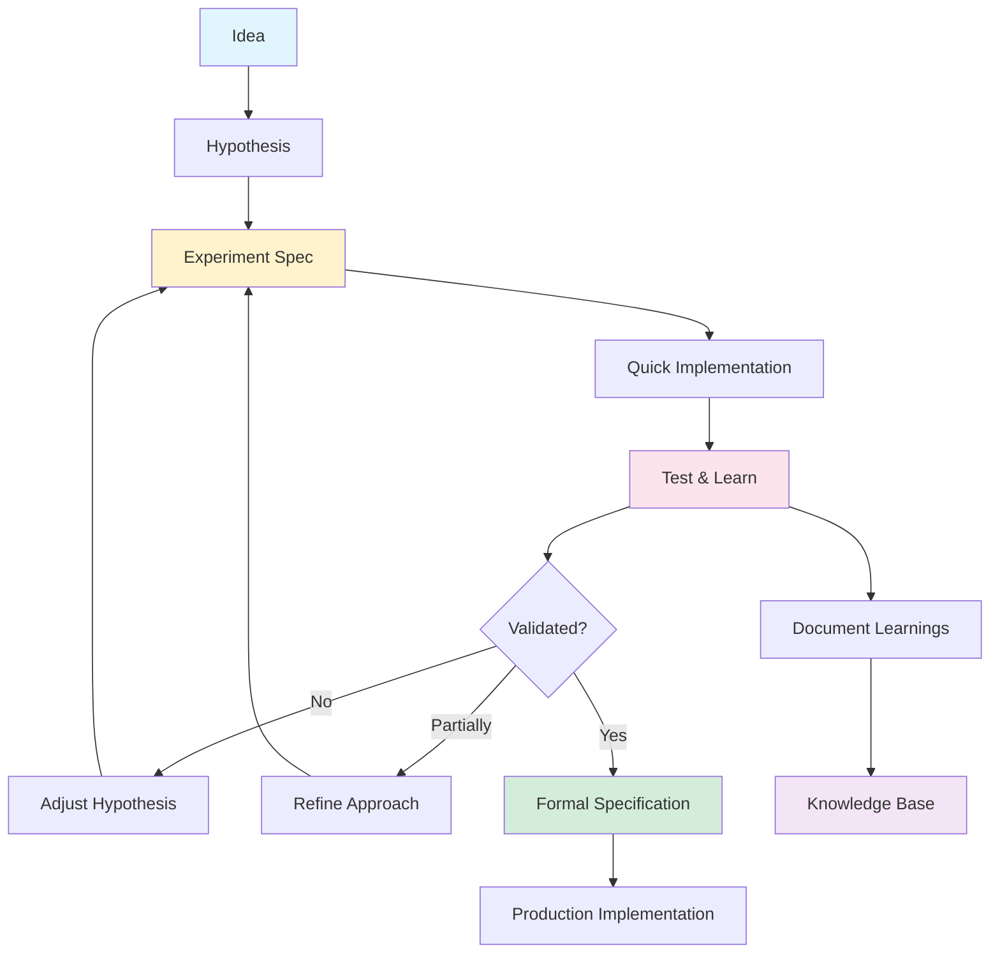
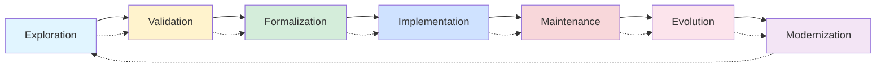
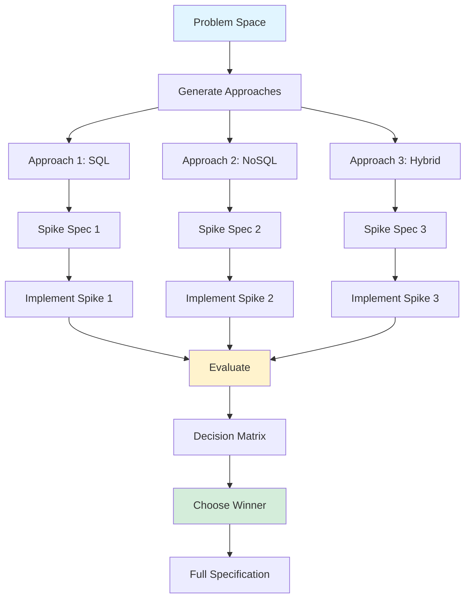
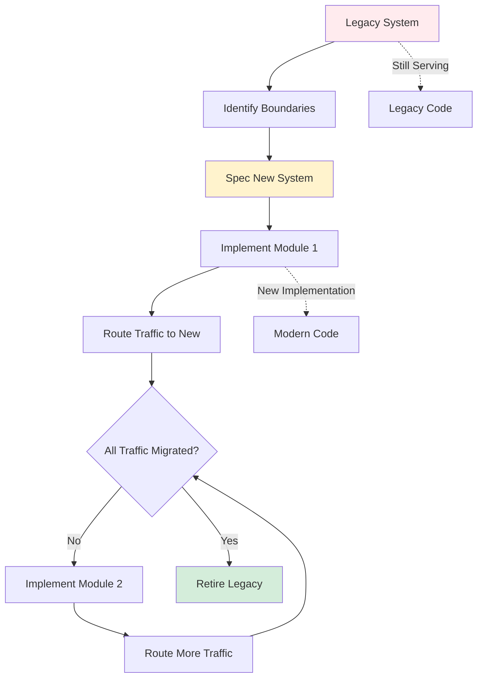
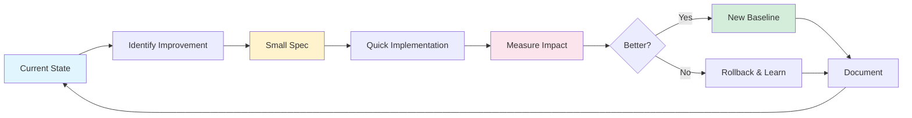
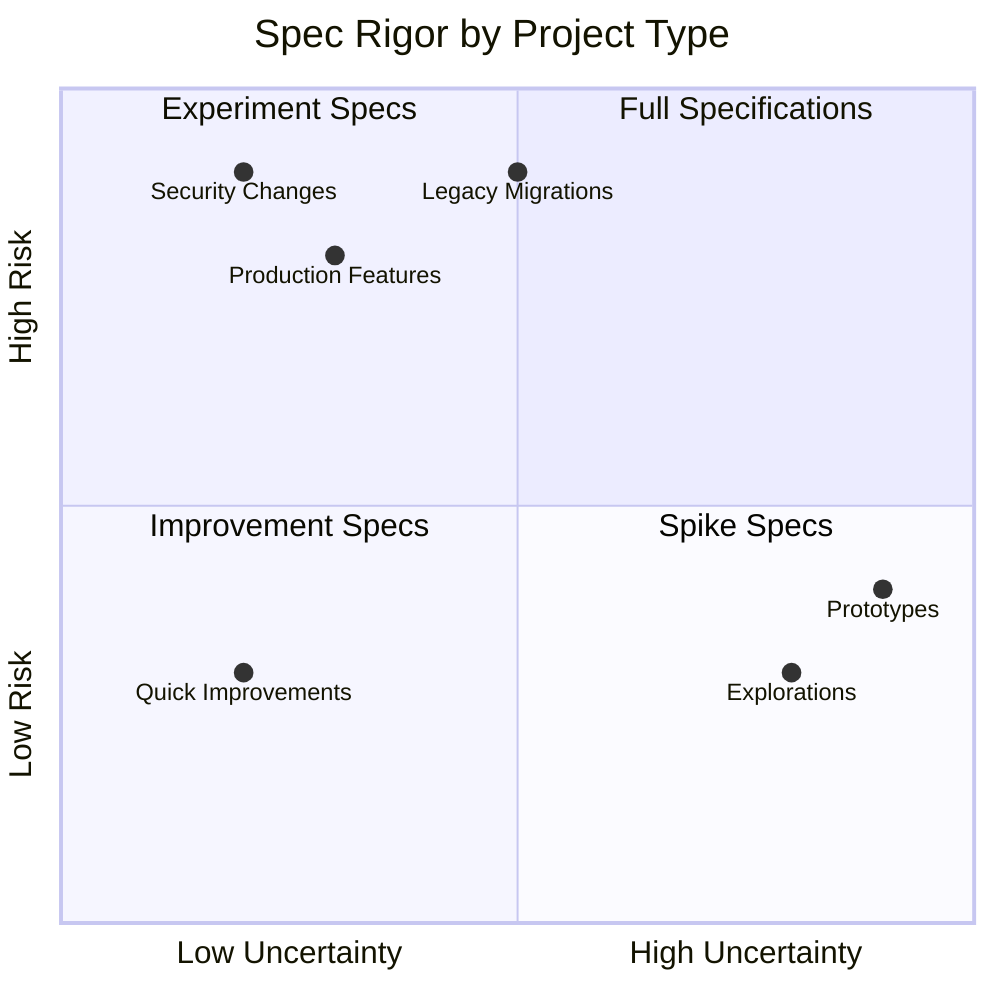

# Lesson 24: Iterative & Creative Processes

**Module 7: Mastery**  
**Date:** November 29, 2025  
**Lesson 24 of 25**

---

## Overview

Spec-driven development isn't just for greenfield projects or linear workflows. This lesson explores how to use Spec Kit for creative exploration, parallel implementation testing, modernization projects, and continuous improvement—embracing the reality that software development is iterative, non-linear, and often experimental.

**Learning Objectives:**
- Apply Spec Kit to creative and exploratory work
- Manage parallel implementation approaches
- Drive modernization and upgrade projects
- Build continuous improvement into your workflow
- Balance structure with flexibility

---

## The Iterative Reality

Software development isn't a straight line from specification to implementation. It's a cycle of learning, experimentation, and refinement.



**Key Insight:** Spec Kit supports both rigorous specification AND creative exploration. The tool adapts to your development phase.

---

## Development Phase Spectrum

Different phases require different approaches:



**Spec Kit's Role:**
- **Exploration:** Lightweight experiment specs, quick iteration
- **Validation:** Prototype specs with hypothesis testing
- **Formalization:** Full specifications with comprehensive requirements
- **Implementation:** Plan and task artifacts
- **Maintenance:** Living documentation, defect specs
- **Evolution:** Enhancement specs, iteration planning
- **Modernization:** Migration specs, parallel implementation tracking

---

## Creative Exploration with Specs

### The Experiment Specification

When exploring new territory, you don't need full specifications—you need experiment definitions.

```markdown
# Experiment: [Experiment Name]

**Date:** 2025-11-29  
**Status:** 🧪 In Progress | ✅ Validated | ❌ Invalidated | 🔄 Iteration Needed

---

## Hypothesis

**We believe that:**
[What you think is true]

**Will result in:**
[Expected outcome]

**We will know we're right when:**
[Measurable success criteria]

---

## Context

**Problem We're Exploring:**
[What problem or opportunity are we investigating?]

**Why This Matters:**
[Business or user impact]

**Current Approach (if any):**
[What we do today]

**Proposed Alternative:**
[What we want to try]

---

## Experiment Design

### Scope

**What We'll Build:**
- [Minimal implementation requirement 1]
- [Minimal implementation requirement 2]
- [Minimal implementation requirement 3]

**What We Won't Build:**
- [Explicitly out of scope to keep experiment focused]

**Time Box:** [e.g., 3 days, 1 week]

### Success Metrics

**Primary Metric:**
- [The most important measure]
- Target: [specific, measurable goal]

**Secondary Metrics:**
- [Metric 2]: Target [X]
- [Metric 3]: Target [Y]

**Qualitative Indicators:**
- [What we're watching for beyond numbers]

---

## Implementation Notes

### Technical Approach

**Framework/Tools:**
[What we're using for this experiment]

**Key Decisions:**
- [Decision 1]: [Rationale]
- [Decision 2]: [Rationale]

**Shortcuts Taken:**
(These are acceptable in experiments but not production)
- [Shortcut 1]: [Why it's okay for now]
- [Shortcut 2]: [Why it's okay for now]

### Test Plan

**How We'll Validate:**
1. [Test approach 1]
2. [Test approach 2]
3. [Test approach 3]

**Participants:**
- [Who we'll test with]
- [How many]

---

## Results

### Findings

**Data Collected:**
[Actual metrics observed]

**Qualitative Observations:**
[What we noticed, user feedback, surprises]

**Conclusion:**
- [ ] ✅ Hypothesis validated - proceed to full specification
- [ ] 🔄 Hypothesis partially validated - iterate
- [ ] ❌ Hypothesis invalidated - pivot or abandon
- [ ] 🤔 Inconclusive - need more data

### Learnings

**What Worked:**
- [Learning 1]
- [Learning 2]

**What Didn't Work:**
- [Challenge 1]
- [Challenge 2]

**Surprises:**
- [Unexpected finding 1]
- [Unexpected finding 2]

**Implications for Production:**
- [What we'd need to change for production implementation]

---

## Next Steps

**If Validated:**
1. [Create formal specification]
2. [Plan production implementation]
3. [Identify resource needs]

**If Iteration Needed:**
1. [What to change]
2. [New hypothesis to test]
3. [Timeline for next iteration]

**If Invalidated:**
1. [Alternative approaches to explore]
2. [What we learned that informs other work]
3. [Decision: pivot or stop]

---

## References

- Related experiments: [links]
- User research: [links]
- Technical exploration: [links]
```

### Example: Experiment Spec in Action

```markdown
# Experiment: AI-Powered Search Suggestions

**Date:** 2025-11-29  
**Status:** 🧪 In Progress

---

## Hypothesis

**We believe that:**
Adding AI-powered search suggestions with semantic understanding (beyond simple prefix matching) 

**Will result in:**
Users finding results 30% faster and with 50% fewer query refinements

**We will know we're right when:**
- Time to first relevant result: <10s (vs. 15s baseline)
- Query refinement rate: <25% (vs. 50% baseline)
- User satisfaction: 4+ stars (vs. 3.2 baseline)

---

## Context

**Problem We're Exploring:**
Users struggle with our current keyword-only search. 60% of searches require 2+ query refinements. Common complaint: "I couldn't find what I was looking for."

**Why This Matters:**
- 80% of user sessions start with search
- Poor search = primary reason for support tickets
- Competitors have better search experiences

**Current Approach:**
- Prefix matching on product names
- No synonym handling
- No spell correction
- No context awareness

**Proposed Alternative:**
- OpenAI embeddings for semantic search
- Understand "cheap laptop" = "budget laptop" = "affordable laptop"
- Context from user's previous searches and clicks

---

## Experiment Design

### Scope

**What We'll Build:**
- Semantic search for top 1,000 products only (not full catalog)
- Simple UI: search box with 5 suggestions
- Basic click tracking
- Synonym expansion using OpenAI API

**What We Won't Build:**
- Full catalog coverage (too expensive for experiment)
- Advanced filters
- Search result page redesign
- Personalization (beyond basic context)

**Time Box:** 5 days

### Success Metrics

**Primary Metric:**
- Time to first click on a relevant result
- Target: <10 seconds (current: 15s)

**Secondary Metrics:**
- Query refinement rate: <25% (current: 50%)
- Click-through rate: >60% (current: 40%)
- User satisfaction: 4+ stars (current: 3.2)

---

## Implementation Notes

### Technical Approach

**Framework/Tools:**
- OpenAI Embeddings API (text-embedding-3-small)
- Vector database: Pinecone (free tier for experiment)
- Frontend: React component (isolated from main search)
- Analytics: Mixpanel events

**Key Decisions:**
- Using OpenAI instead of self-hosted: Faster to experiment, acceptable cost for 1k products
- Pinecone instead of pgvector: Easier setup, migration path if experiment succeeds

**Shortcuts Taken:**
- Batch embed products once (not real-time updates): Acceptable for 5-day test
- No caching: Will add if experiment validates
- Basic error handling: Log failures, fall back to keyword search

### Test Plan

**How We'll Validate:**
1. **A/B Test:** 50% users see new search, 50% see old search (for 3 days)
2. **Qualitative:** User interviews with 8 participants using think-aloud protocol
3. **Analytics:** Track time-to-click, refinement rate, CTR

**Participants:**
- All users on desktop (mobile excluded for experiment simplicity)
- Minimum 500 users per variant for statistical significance

---

## Results

*(To be filled after experiment)*

### Findings

**Data Collected:**
- Primary metric: [actual]
- Secondary metrics: [actual]

**Qualitative Observations:**
[Notes from user interviews]

**Conclusion:**
- [ ] ✅ Hypothesis validated
- [ ] 🔄 Hypothesis partially validated
- [ ] ❌ Hypothesis invalidated
- [ ] 🤔 Inconclusive

---
```

---

## Parallel Implementation Exploration

Sometimes you need to try multiple approaches simultaneously to find the best solution.

### The Spike-and-Compare Framework



### Spike Specification Template

```markdown
# Spike: [Approach Name]

**Date:** 2025-11-29  
**Time Box:** [e.g., 2 days]  
**Developer:** [Name]

---

## Context

**Problem Statement:**
[What problem are we solving?]

**This Spike Explores:**
[Specific approach being tested]

**Alternative Approaches:**
- [Spike 2]: [Brief description]
- [Spike 3]: [Brief description]

---

## Technical Approach

### Architecture

[Simple diagram or description]

### Technology Choices

**Language/Framework:**
[What and why]

**Key Libraries:**
- [Library 1]: [Purpose]
- [Library 2]: [Purpose]

**Infrastructure:**
[What's needed]

---

## Success Criteria

**Must Prove:**
- [ ] [Critical requirement 1]
- [ ] [Critical requirement 2]
- [ ] [Critical requirement 3]

**Should Explore:**
- [ ] [Nice-to-understand aspect 1]
- [ ] [Nice-to-understand aspect 2]

**Out of Scope:**
- [What we're deliberately not addressing]

---

## Evaluation Criteria

*(These will be used to compare all spikes)*

### Performance
- Latency: [target]
- Throughput: [target]
- Resource usage: [constraints]

### Maintainability
- Code complexity: [subjective assessment]
- Team familiarity: [how well team knows this tech]
- Debugging ease: [how easy to troubleshoot]

### Scalability
- Horizontal scaling: [yes/no/how]
- Vertical scaling: [limits]
- Cost scaling: [predict costs at 10x, 100x load]

### Risk
- Maturity of technology: [assessment]
- Community support: [assessment]
- Lock-in risk: [vendor/tech lock-in concerns]

---

## Implementation Log

**Day 1:**
- [What was accomplished]
- [Challenges encountered]
- [Decisions made]

**Day 2:**
- [Continued work]
- [Blockers]
- [Results]

---

## Results

### What Was Learned

**Findings:**
- [Key insight 1]
- [Key insight 2]
- [Key insight 3]

**Performance Data:**
- Latency: [actual measurement]
- Throughput: [actual measurement]
- Resource usage: [actual measurement]

**Code Sample:**
[Link to repo or key code snippet showing approach]

---

## Evaluation

### Strengths
- ✅ [Strength 1]
- ✅ [Strength 2]
- ✅ [Strength 3]

### Weaknesses
- ❌ [Weakness 1]
- ❌ [Weakness 2]
- ❌ [Weakness 3]

### Trade-offs
- [Trade-off 1]: [Description]
- [Trade-off 2]: [Description]

---

## Recommendation

**My Assessment:**
[Would you recommend this approach? Why or why not?]

**Best For:**
[What scenarios is this approach ideal for?]

**Not Suitable For:**
[What scenarios should avoid this approach?]

---

## Comparison Matrix

*(To be filled after all spikes complete)*

| Criterion | Spike 1 (This) | Spike 2 | Spike 3 | Winner |
|-----------|---------------|---------|---------|--------|
| Performance | | | | |
| Maintainability | | | | |
| Scalability | | | | |
| Risk | | | | |
| Cost | | | | |
| **Total Score** | | | | |
```

---

## Modernization & Upgrade Projects

### The Strangler Fig Pattern with Specs

When modernizing legacy systems, the strangler fig pattern gradually replaces old with new. Spec Kit helps you track this complex process.



### Migration Specification Template

```markdown
# Migration Spec: [System/Module Name]

**Date:** 2025-11-29  
**Status:** 🔄 In Progress | ✅ Complete | ⏸️ Paused

---

## Migration Overview

**From:** [Legacy system description]  
**To:** [New system description]  
**Strategy:** [Strangler fig / Big bang / Parallel run / Other]  
**Timeline:** [Expected duration]  
**Deadline:** [Hard deadline, if any]

---

## Business Context

**Why Migrate:**
- [Reason 1: e.g., Legacy system end-of-life]
- [Reason 2: e.g., Performance issues]
- [Reason 3: e.g., Cannot support new features]

**Risks of NOT Migrating:**
- [Risk 1]
- [Risk 2]

**Migration Risks:**
- [Risk 1]: [Mitigation strategy]
- [Risk 2]: [Mitigation strategy]

---

## Legacy System Analysis

### What It Does

**Core Functionality:**
1. [Function 1]
2. [Function 2]
3. [Function 3]

**Dependencies:**
- [System A]: [Nature of dependency]
- [System B]: [Nature of dependency]

**Data Stores:**
- [Database 1]: [Schema, volume, access patterns]
- [Database 2]: [Schema, volume, access patterns]

**Known Issues:**
- [Issue 1]: [Impact]
- [Issue 2]: [Impact]

### What We Must Preserve

**Critical Behaviors:**
- [Behavior 1]: [Why it's critical]
- [Behavior 2]: [Why it's critical]

**Data Integrity:**
- [Requirement 1]
- [Requirement 2]

**APIs/Integrations:**
- [Integration 1]: [Who depends on it]
- [Integration 2]: [Who depends on it]

---

## New System Design

### Architecture

[Diagram of new system]

### Technology Stack

**Language/Framework:** [Choice and rationale]  
**Database:** [Choice and rationale]  
**Infrastructure:** [Cloud provider, containers, etc.]

### Key Improvements

**Performance:**
- [Improvement 1]
- [Improvement 2]

**Maintainability:**
- [Improvement 1]
- [Improvement 2]

**Features:**
- [New capability 1]
- [New capability 2]

---

## Migration Phases

### Phase 1: Foundation (Weeks 1-4)

**Objective:** Set up new system infrastructure

**Deliverables:**
- [ ] New system deployed to staging
- [ ] Data pipeline established
- [ ] Monitoring & alerting configured
- [ ] Rollback procedure documented

**Success Criteria:**
- New system handles synthetic load
- Data replication lag <5 minutes

### Phase 2: Read-Only Migration (Weeks 5-8)

**Objective:** Route read traffic to new system

**Scope:**
- [Module A]: Read operations only
- [Module B]: Read operations only

**Traffic Split:**
- Week 5: 10% reads to new system
- Week 6: 25% reads to new system
- Week 7: 50% reads to new system
- Week 8: 100% reads to new system

**Rollback Trigger:**
- Error rate >1%
- Latency p95 >200ms
- Data consistency issues

**Success Criteria:**
- [ ] 100% read traffic on new system
- [ ] Error rate <0.1%
- [ ] Performance better than legacy

### Phase 3: Write Migration (Weeks 9-12)

**Objective:** Dual-write to both systems, verify consistency

**Approach:**
- Write to legacy (source of truth)
- Async write to new system
- Compare results
- Alert on discrepancies

**Success Criteria:**
- [ ] Data consistency >99.99%
- [ ] Write latency acceptable
- [ ] No data loss

### Phase 4: Cutover (Weeks 13-14)

**Objective:** New system becomes source of truth

**Approach:**
- Write to new system (source of truth)
- Async write to legacy (for safety)
- Monitor closely

**Success Criteria:**
- [ ] New system stable for 1 week
- [ ] No critical incidents
- [ ] Team confident in new system

### Phase 5: Legacy Retirement (Weeks 15-16)

**Objective:** Decomission legacy system

**Steps:**
1. Stop writes to legacy system
2. Archive legacy data
3. Notify all stakeholders
4. Remove legacy code
5. Celebrate! 🎉

---

## Data Migration

### Schema Mapping

| Legacy Table | Legacy Column | New Table | New Column | Transformation |
|-------------|---------------|-----------|------------|----------------|
| users | user_id | accounts | account_id | Direct copy |
| users | name | accounts | full_name | Direct copy |
| users | create_date | accounts | created_at | Convert to ISO8601 |

### Data Volume

**Total Records:** [Number]  
**Total Size:** [GB/TB]  
**Growth Rate:** [Per day/month]

### Migration Approach

**Strategy:** [Batch / Streaming / Hybrid]  
**Tools:** [ETL tools, scripts, etc.]  
**Validation:** [How we ensure data correctness]

---

## Testing Strategy

### Test Environments

- **Staging:** Full migration rehearsal
- **Shadow:** Parallel run with production traffic (no impact to users)
- **Canary:** Small % of production traffic

### Test Scenarios

**Functional Tests:**
- [ ] [Critical user flow 1]
- [ ] [Critical user flow 2]
- [ ] [Edge case 1]

**Performance Tests:**
- [ ] Load test: [X] concurrent users
- [ ] Stress test: [Y] concurrent users
- [ ] Endurance test: [Z] hours

**Data Integrity Tests:**
- [ ] Record count matches
- [ ] Foreign key relationships preserved
- [ ] Checksums match

---

## Rollback Plan

**Triggers:**
- [Trigger 1]: [Action]
- [Trigger 2]: [Action]

**Procedure:**
1. [Step 1]
2. [Step 2]
3. [Step 3]

**Recovery Time Objective (RTO):** [Time]  
**Recovery Point Objective (RPO):** [Data loss tolerance]

---

## Monitoring & Validation

### Key Metrics

**System Health:**
- Error rate: <0.1%
- Latency p95: <200ms
- CPU usage: <70%

**Data Integrity:**
- Replication lag: <5 minutes
- Consistency checks: 100% pass

**Business Metrics:**
- Transaction success rate: >99.9%
- User-reported issues: <baseline

### Alerts

- [ ] Error rate spike
- [ ] Latency degradation
- [ ] Data inconsistency
- [ ] Replication lag

---

## Communication Plan

**Stakeholders:**
- [Stakeholder group 1]: [Update frequency]
- [Stakeholder group 2]: [Update frequency]

**Status Updates:**
- Weekly: [To whom]
- Daily: [During critical phases, to whom]
- Incident: [Immediate notification to whom]

**Documentation:**
- [ ] Migration runbook
- [ ] API change guide
- [ ] User-facing changes
- [ ] Training materials (if needed)

---

## Success Criteria

**Technical:**
- [ ] All traffic on new system
- [ ] Performance meets/exceeds legacy
- [ ] Zero data loss
- [ ] Legacy system decommissioned

**Business:**
- [ ] No user-impacting incidents
- [ ] Support ticket volume unchanged or decreased
- [ ] Team trained on new system
- [ ] Documentation complete

---

## Lessons Learned

*(To be filled after completion)*

**What Went Well:**
- [Success 1]
- [Success 2]

**What Could Be Improved:**
- [Challenge 1]: [How to do better next time]
- [Challenge 2]: [How to do better next time]

**Surprises:**
- [Unexpected finding 1]
- [Unexpected finding 2]

---
```

---

## Continuous Improvement Process

### The Kaizen Specification

Continuous improvement isn't a project—it's a mindset. Spec Kit can support ongoing refinement.



### Improvement Spec Template

```markdown
# Improvement: [Brief Title]

**Date:** 2025-11-29  
**Type:** Performance | UX | Code Quality | Process | Other  
**Size:** 🏃 Quick (<1 day) | 🚶 Medium (1-3 days) | 🐢 Large (>3 days)

---

## Current State

**What We Do Today:**
[Description of current approach]

**Metrics:**
- [Metric 1]: [Current value]
- [Metric 2]: [Current value]

**Problems:**
- [Problem 1]
- [Problem 2]

---

## Proposed Improvement

**What We'll Change:**
[Description of improvement]

**Why This Matters:**
[Impact on users, team, or business]

**Expected Outcome:**
- [Metric 1]: [Target value]
- [Metric 2]: [Target value]

---

## Implementation

**Changes Required:**
- [Change 1]
- [Change 2]
- [Change 3]

**Effort:** [Time estimate]

**Risk:** Low | Medium | High  
**Risk Mitigation:** [If medium/high]

---

## Validation

**How We'll Measure:**
- [Measurement approach]

**Success Criteria:**
- [Criterion 1]
- [Criterion 2]

**Timeframe:** [How long to measure before declaring success]

---

## Result

*(To be filled after implementation)*

**Actual Impact:**
- [Metric 1]: [Actual value] (vs. [target])
- [Metric 2]: [Actual value] (vs. [target])

**Outcome:**
- [ ] ✅ Success - Keep change
- [ ] 🔄 Partial - Iterate
- [ ] ❌ Unsuccessful - Rollback

**Learnings:**
[What we learned from this improvement attempt]

---
```

### Example: Quick Improvement Spec

```markdown
# Improvement: Cache Product Images

**Date:** 2025-11-29  
**Type:** Performance  
**Size:** 🏃 Quick (<1 day)

---

## Current State

**What We Do Today:**
Fetch product images from S3 on every page load. No caching.

**Metrics:**
- Page load time: 2.3s (p95)
- Image load time: 800ms average
- S3 requests: ~50k/day

**Problems:**
- Slow page loads, especially on mobile
- High S3 costs ($200/month for this alone)
- Poor user experience

---

## Proposed Improvement

**What We'll Change:**
Add CloudFront CDN in front of S3 bucket for product images.

**Why This Matters:**
- Faster loads = better UX = higher conversion
- CDN reduces S3 costs significantly
- Global users get better performance

**Expected Outcome:**
- Page load time: <1.5s (p95)
- Image load time: <200ms average
- S3 requests: ~5k/day (90% reduction)
- Cost: ~$50/month (75% reduction)

---

## Implementation

**Changes Required:**
- Create CloudFront distribution
- Point to S3 bucket
- Update image URLs to use CloudFront domain
- Set cache headers (7-day TTL)
- Test on staging

**Effort:** 4 hours

**Risk:** Low  
**Risk Mitigation:** Easy rollback (change URLs back to S3)

---

## Validation

**How We'll Measure:**
- Real User Monitoring (RUM) in production
- CloudWatch metrics for S3 and CloudFront

**Success Criteria:**
- Image load time <300ms average
- S3 request count drops by 80%+
- No increase in error rate

**Timeframe:** 7 days (to fill CDN cache)

---

## Result

**Actual Impact:**
- Page load time: 1.2s (p95) ✅ (vs. 1.5s target)
- Image load time: 180ms average ✅ (vs. 200ms target)
- S3 requests: 3k/day ✅ (vs. 5k target)
- Cost: $35/month ✅ (vs. $50 target)

**Outcome:**
- ✅ Success - Keep change

**Learnings:**
- Impact was even better than expected
- Should have done this sooner!
- User feedback: "Site feels much faster"
- Next: Apply same approach to other static assets

---
```

---

## Balancing Structure and Flexibility

### When to Be Rigorous vs. Lightweight



**Decision Matrix:**

| Project Type | Uncertainty | Risk | Recommended Spec Type |
|-------------|-------------|------|----------------------|
| New feature (well-understood) | Low | Medium | Full specification |
| Security implementation | Low | High | Full specification + review |
| Creative exploration | High | Low | Experiment spec |
| Tech spike | High | Medium | Spike spec |
| Quick improvement | Low | Low | Improvement spec |
| Legacy migration | Medium | High | Migration spec |
| Prototype | High | Low | Experiment spec |

**Key Principle:** Match the rigor of your specification to the risk and uncertainty of the work.

---

## Socratic Questions

### Question 1: The Creative Constraint Paradox

**Scenario:** A designer on your team says, "Specs kill creativity. I need freedom to explore, not a document that locks me in." You're building a feature where user experience is critical and requires creative problem-solving. How do you use Spec Kit without stifling creativity?

<details>
<summary><strong>Answer</strong></summary>

**The Paradox Resolution:**

Specs don't kill creativity—*bad specs* kill creativity. Well-crafted specs channel creativity productively.

**Framework:**

1. **Separate WHAT from HOW:**
   ```markdown
   ## User Authentication Experience
   
   **What (Spec):**
   - Users must be able to authenticate securely
   - First-time users should feel welcomed and confident
   - Returning users should authenticate in <10 seconds
   - Accessibility: WCAG AA compliance
   
   **How (Creative Freedom):**
   - [Open for designer exploration]
   - Could be: Biometric, passwordless, magic link, traditional, etc.
   - Designer explores multiple approaches in experiment phase
   ```

2. **Use Constraint-Based Creativity:**
   Research shows constraints *enhance* creativity (think haiku, sonnet structure, Dogme 95).
   
   **Spec provides:**
   - User needs (ground the work)
   - Success metrics (define good)
   - Technical constraints (reality check)
   - Accessibility requirements (inclusive design)
   
   **Designer provides:**
   - Multiple solution approaches
   - Innovative interactions
   - Emotional design
   - Delightful details

3. **Employ Experiment Specs:**
   ```markdown
   # Experiment: Authentication Experience Exploration
   
   **Hypothesis:** We can make authentication feel friendly while maintaining security
   
   **Scope:** Design and prototype 3 different approaches:
   1. Approach A: [Description]
   2. Approach B: [Description]
   3. Approach C: [Description]
   
   **Constraints:**
   - Must be WCAG AA compliant
   - Must complete in <10 seconds
   - Must work on mobile
   
   **Creative Freedom:**
   - Visual design
   - Interaction patterns
   - Micro-interactions
   - Copy/tone
   
   **Evaluation:** User testing with 10 participants (mix of tech levels)
   ```

4. **Iterative Refinement:**
   - **Phase 1:** Experiment specs (high creativity, low constraint)
   - **Phase 2:** Validation (test with users)
   - **Phase 3:** Formal spec (document what worked)
   - **Phase 4:** Implementation (execute the validated creative solution)

**Key Insight:** Specs are scaffolding, not cages. They support creative work by providing:
- Problem clarity (creativity needs a problem to solve)
- Feedback mechanism (metrics show if creative solution works)
- Documentation (preserve creative decisions for future)

**Example in the Wild:**
- Pixar uses detailed "story specs" but allows animators creative freedom in execution
- Architecture has blueprints (specs) but architects are creative
- Music has constraints (time signature, key) but musicians are creative

**Response to Designer:**
"Let's use specs to define the problem and success criteria, while giving you complete creative freedom on the solution. We'll experiment with multiple approaches, test them, and document what works. The spec captures the 'why' and 'what,' but the 'how' is all you."
</details>

---

### Question 2: The Sunk Cost Fallacy

**Scenario:** You've invested 3 weeks in a migration project with detailed specs. Midway through Phase 2, you discover a fundamental technical limitation that makes the chosen approach impractical. The team is attached to the specs and wants to push through. What do you do?

<details>
<summary><strong>Answer</strong></summary>

**The Decision Framework:**

Specs are tools, not contracts. When reality conflicts with specs, reality wins.

**Step 1: Acknowledge the Situation**

Call a team meeting. Be direct:
> "We've hit a significant blocker that invalidates part of our migration spec. We need to decide: adapt the spec or continue with a approach we now know is flawed."

**Step 2: Assess the Damage**

```markdown
## Assessment: Migration Technical Limitation

**What We Discovered:**
[Specific technical limitation]

**Impact:**
- Current approach: [Why it won't work]
- Timeline: [Delay estimate]
- Risk: [What could go wrong]

**Options:**

### Option A: Continue as Specified
**Pros:**
- No need to redo specs
- Team already aligned
**Cons:**
- Will likely fail or be severely limited
- Wastes 3 more weeks
- Demoralizes team when it doesn't work

### Option B: Pivot to Alternative Approach
**Pros:**
- Addresses root technical issue
- More likely to succeed
**Cons:**
- Need to update specs (1 day work)
- Discard some Phase 1 work (sunk cost)
- Team needs to re-align

### Option C: Hybrid Approach
[If applicable]

**Recommendation:** [Your analysis]
```

**Step 3: Reframe Sunk Costs**

**Cognitive Trap:**
"We've invested 3 weeks in these specs. We can't abandon them now."

**Reframe:**
"We've invested 3 weeks and learned something valuable: the original approach won't work. Better to learn now than after 6 more weeks. The specs served their purpose—they helped us discover this limitation."

**Key Question:**
"If we were starting today with what we now know, would we choose the current approach?"

If the answer is no, pivot.

**Step 4: Update Specs, Don't Abandon Them**

```markdown
# Migration Spec: [System Name]

**Status:** 🔄 Updated (2025-11-29)

## Change Log

### 2025-11-29: Critical Pivot

**Original Approach:**
[Description]

**Why It Won't Work:**
[Technical limitation discovered in Phase 2]

**New Approach:**
[Updated strategy]

**What We Preserved:**
- Phase 1 infrastructure (reusable)
- Data mapping (still valid)
- Testing strategy (adapted)

**What Changed:**
- Technology stack: [old] → [new]
- Architecture: [old] → [new]
- Timeline: [extended by 2 weeks]

**Lessons Learned:**
- [Insight 1: What we'd do differently next time]
- [Insight 2: How to detect this earlier in future projects]

---

[Updated specification follows...]
```

**Step 5: Prevent Future Occurrences**

Add to your migration spec template:

```markdown
## Technical Validation Phase (Before Full Commitment)

**Objective:** Prove critical technical assumptions BEFORE extensive planning

**Proof-of-Concept Requirements:**
- [ ] [Critical assumption 1] validated
- [ ] [Critical assumption 2] validated
- [ ] [Critical assumption 3] validated

**Go/No-Go Decision:**
Only proceed to full migration spec after PoC validates approach.
```

**Key Insight:** 
- Specs document your *current best understanding*
- When understanding changes, specs must change
- The cost of updating a spec (1 day) is infinitely less than the cost of implementing a flawed spec (weeks/months)
- A spec's value isn't in being "right forever"—it's in being "right now"

**Response to Team:**
"Our specs were based on the best information we had. Now we have better information. Updating the spec isn't failure—it's learning. The 3 weeks weren't wasted; they taught us what won't work. Let's update the spec and build something that will actually succeed."

</details>

---

### Question 3: The Continuous Improvement Backlog

**Scenario:** Your team has identified 47 small improvements to your codebase (performance tweaks, refactorings, UX enhancements, etc.). Each is small (1-3 days), but collectively they'd take months. Leadership wants new features. How do you balance improvement with new development, and how do Spec Kit help?

<details>
<summary><strong>Answer</strong></summary>

**The Improvement Portfolio Strategy:**

Don't choose between improvement and new features—integrate them.

**Step 1: Categorize Improvements**

```markdown
## Improvement Backlog Taxonomy

### Category 1: Foundation Improvements
**Impact:** Enable future features or prevent critical issues  
**Examples:**
- Database optimization (enables scaling)
- Security updates (prevents breaches)
- Refactor core module (makes new features easier)

**Strategy:** Treat as prerequisites for new features

### Category 2: Compound Improvements
**Impact:** Improve multiple areas or have growing returns  
**Examples:**
- Add caching layer (improves many features)
- Improve logging (helps all debugging)
- Standardize error handling (affects all code)

**Strategy:** High priority, dedicated time

### Category 3: Standalone Improvements
**Impact:** Improve one specific area  
**Examples:**
- Optimize image loading on dashboard
- Improve copy on signup page
- Refactor helper function

**Strategy:** Pair with related new features or use "improvement time"

### Category 4: Nice-to-Have
**Impact:** Minor improvements, low urgency  
**Examples:**
- Code formatting consistency
- Update outdated comments
- Rename poorly-named variables

**Strategy:** Background work, code hygiene
```

**Step 2: Prioritization Framework**

```markdown
## Improvement Prioritization Matrix

| ID | Improvement | Category | Impact | Effort | ROI | Priority |
|----|------------|----------|--------|--------|-----|----------|
| IMP-001 | DB query optimization | Foundation | High | 2d | 10 | P0 |
| IMP-002 | Add Redis caching | Compound | High | 3d | 9 | P0 |
| IMP-003 | Improve mobile perf | Standalone | Med | 1d | 8 | P1 |
| IMP-047 | Rename UserHelper | Nice-to-Have | Low | 0.5d | 2 | P3 |

**ROI Calculation:** (Impact Score × Frequency) / Effort

**Impact Score:**
- High: 10 (affects core flows, many users)
- Medium: 5 (affects some flows, some users)
- Low: 2 (affects edge cases, few users)

**Frequency:**
- Daily: 3
- Weekly: 2
- Monthly: 1
```

**Step 3: Integration Strategy**

**Approach A: The 20% Rule**
```markdown
## Sprint Planning: Improvement Budget

**Capacity:** 100 story points

**Allocation:**
- New features: 70 points (70%)
- Improvements: 20 points (20%)
- Bugs/Support: 10 points (10%)

**This Sprint's Improvements:**
- IMP-001: DB query optimization (8 points)
- IMP-003: Mobile performance (5 points)
- IMP-012: Error handling (7 points)

**Total:** 20 points
```

**Approach B: Paired Improvements**
```markdown
## Feature: New Analytics Dashboard

**New Work:**
- Design analytics views
- Implement data fetching
- Create visualizations

**Paired Improvements:**
- IMP-015: Optimize data queries (foundation for this feature)
- IMP-022: Refactor charting component (needed for new visualizations)
- IMP-031: Improve error messages (better UX for this feature)

**Rationale:** These improvements are prerequisites or natural extensions of the feature work
```

**Approach C: Improvement Sprints**
```markdown
## Quarterly Cadence

**Sprints 1-3:** New features + 20% improvements
**Sprint 4:** 100% improvement sprint ("Hardening Sprint")

**Improvement Sprint Goals:**
- Address top 10 priority improvements
- Reduce technical debt
- Improve developer experience
- Polish user experience

**Outcome:** Better foundation for next quarter's features
```

**Step 4: Spec Kit for Improvements**

Use lightweight improvement specs:

```markdown
# Improvement Backlog: [Component Name]

## IMP-001: Database Query Optimization

**Impact:** High (affects all dashboard loads)  
**Effort:** 2 days  
**ROI:** 10  
**Priority:** P0  

**Current:** Queries take 1.2s (p95), N+1 query problem  
**Target:** <200ms (p95), single query with joins  

**Implementation:** [Brief technical approach]  

**Success Metrics:**
- Query time <200ms
- No increase in error rate

---

## IMP-002: Add Redis Caching

**Impact:** High (reduces DB load, improves all read operations)  
**Effort:** 3 days  
**ROI:** 9  
**Priority:** P0  

[Continue for all 47 improvements...]

---

## Tracking

**Status Dashboard:**
- P0 improvements: 3 total, 0 complete, 3 in backlog
- P1 improvements: 8 total, 1 complete, 7 in backlog
- P2 improvements: 12 total, 2 complete, 10 in backlog
- P3 improvements: 24 total, 5 complete, 19 in backlog

**Velocity:**
- This month: 3 improvements completed
- Last month: 2 improvements completed
- Trend: +50% ✅
```

**Step 5: Communicate Value to Leadership**

**Don't Say:**
"We need to do refactoring and improvements instead of features."

**Do Say:**
"To deliver [new feature X] successfully, we need to first optimize our database (IMP-001, 2 days). This also improves [existing feature Y] by 5x, affecting 80% of users. Then we can build [feature X] on a solid foundation."

**Dashboard for Leadership:**
```markdown
## Improvement Impact Report (Monthly)

**Improvements Completed This Month:** 3

**Business Impact:**
- Page load time: 2.3s → 1.2s (48% improvement)
- User satisfaction: +15 points
- Support tickets: -30% (fewer performance complaints)
- Developer velocity: +20% (cleaner codebase)

**Cost Savings:**
- Infrastructure: $500/month (better caching reduces server load)
- Support time: 10 hours/month (fewer issues)

**Foundation for Future:**
- IMP-002 (caching) enables real-time features planned for Q2
- IMP-015 (query optimization) enables dashboard expansion

**Investment:**
- 20% of sprint capacity
- ROI: 3x (benefits exceed costs within 3 months)
```

**Key Insight:**
- Improvements aren't "instead of" features—they're "in service of" features
- Small, continuous improvement beats big refactor projects
- Spec Kit helps you track, prioritize, and communicate value of improvements
- Make improvements visible, measurable, and connected to business goals

</details>

---

## Practical Exercises

### Exercise 1: Experiment Design

**Task:** Design an experiment spec for a risky or uncertain feature idea.

**Requirements:**
- Clear hypothesis
- Minimal scope
- Measurable success criteria
- Time-boxed
- Learning goals

**Deliverable:** Complete experiment specification

**Time:** 30 minutes

---

### Exercise 2: Spike Comparison

**Task:** Create 3 spike specs for alternative approaches to the same problem. Implement lightweight versions and compare.

**Problem:** Choose a technical challenge (e.g., state management, data storage, API design)

**Deliverables:**
- 3 spike specs
- Implementation of each (simplified)
- Comparison matrix
- Recommendation

**Time:** 4 hours

---

### Exercise 3: Improvement Backlog

**Task:** Audit your current project and identify 10-15 improvements. Categorize, prioritize, and create implementation plan.

**Deliverables:**
- Improvement backlog with priorities
- ROI calculations
- Integration strategy (how to fit into current work)
- Improvement specs for top 3 items

**Time:** 90 minutes

---

## Iterative Development Checklist

### Starting an Exploration
- [ ] Have I defined a clear hypothesis?
- [ ] Is the scope minimal (smallest thing to learn)?
- [ ] Do I have measurable success criteria?
- [ ] Is this time-boxed?
- [ ] Will I document learnings regardless of outcome?

### Comparing Approaches
- [ ] Have I identified clear evaluation criteria?
- [ ] Am I comparing fairly (similar effort invested)?
- [ ] Have I documented trade-offs, not just "winner"?
- [ ] Can I explain why to the team?

### Managing Migrations
- [ ] Do I understand what must be preserved?
- [ ] Is there a rollback plan?
- [ ] Am I monitoring key metrics?
- [ ] Have I communicated risks to stakeholders?
- [ ] Is the migration phased (not big bang)?

### Continuous Improvement
- [ ] Have I prioritized by ROI, not just "nice-to-have"?
- [ ] Are improvements tied to business/user value?
- [ ] Do I have dedicated time for improvements?
- [ ] Am I tracking improvement velocity?
- [ ] Am I celebrating improvement wins?

---

## Key Takeaways

1. **Spec Kit is flexible:** Adapt rigor to risk and uncertainty
2. **Embrace experimentation:** Use experiment specs for exploration
3. **Compare systematically:** Spike specs help evaluate alternatives
4. **Migrations need structure:** Migration specs manage complexity
5. **Improve continuously:** Small, frequent improvements beat big refactors
6. **Learn and iterate:** Every experiment, win or lose, generates knowledge

---

## Further Resources

- **Lean Startup:** "The Lean Startup" by Eric Ries (hypothesis-driven development)
- **Experimentation:** "Trustworthy Online Controlled Experiments" by Kohavi et al.
- **Migrations:** "Strangler Fig Pattern" - Martin Fowler
- **Continuous Improvement:** "The Toyota Way" by Jeffrey Liker
- **Technical Spikes:** "Extreme Programming Explained" by Kent Beck

---

## Navigation

← [Previous: Lesson 23 - User-Centric Development](Lesson-23-User-Centric-Development.md)  
→ [Next: Lesson 25 - Future of Spec-Driven Development](Lesson-25-Future-of-Spec-Driven-Development.md)  
↑ [Back to Module 7](../Module-07-Mastery/)  
🏠 [Course Home](../00-Course-Overview.md)
