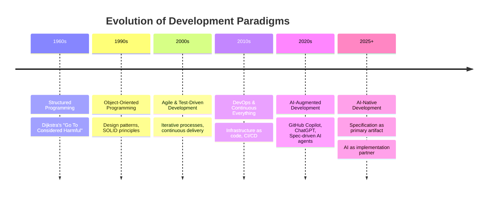
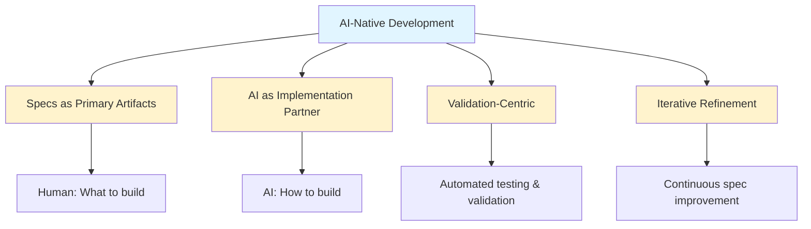
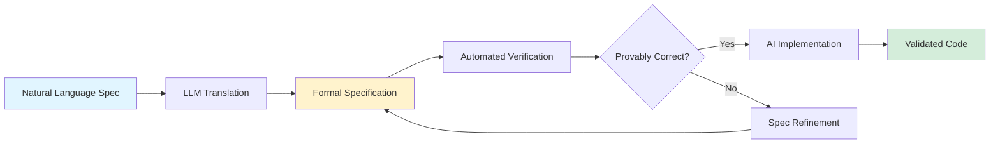
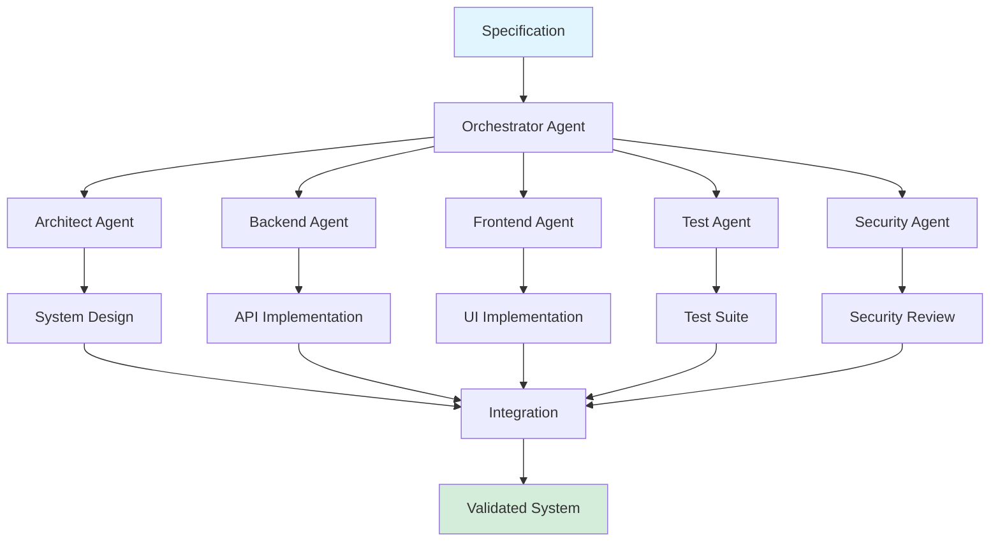
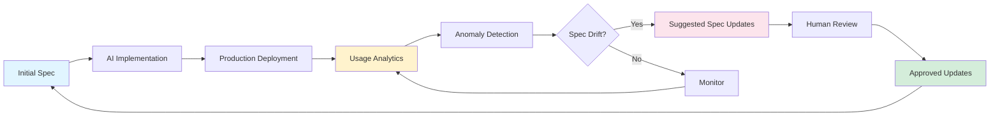
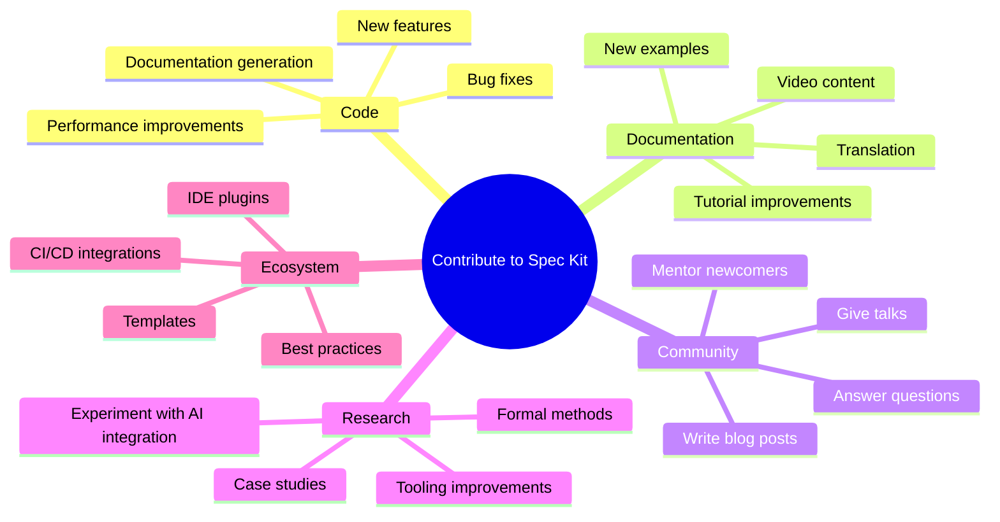
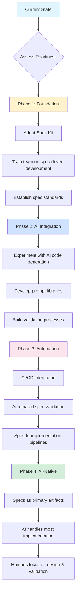
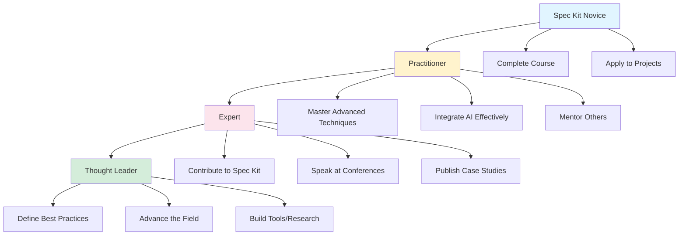

# Lesson 25: Future of Spec-Driven Development

**Module 7: Mastery**  
**Date:** November 29, 2025  
**Lesson 25 of 25**

---

## Overview

You've reached the final lesson. This isn't an ending—it's a beginning. We'll explore the emerging trends in specification-driven development, how AI is reshaping the field, opportunities to contribute to Spec Kit, and most importantly, your journey forward as a practitioner.

**Learning Objectives:**
- Understand current research and emerging trends
- Explore AI-native development processes
- Learn how to contribute to Spec Kit
- Create your personal development roadmap
- Connect with the Spec Kit community

---

## The Evolution of Software Development



**We Are Here:** At the inflection point where AI transforms from coding assistant to implementation partner. Specifications become the primary interface between human intent and machine execution.

---

## AI-Native Development

### The Paradigm Shift

**Traditional Development:**
```
Developer → Code → Computer Execution
```

**AI-Augmented Development:**
```
Developer → Code (with AI suggestions) → Computer Execution
```

**AI-Native Development:**
```
Developer → Specification → AI Implementation → Computer Execution
                ↑                                    ↓
                └────────── Validation ──────────────┘
```

### What Makes Development "AI-Native"?



**Characteristics:**

1. **Specification-First:** Specs aren't documentation—they're the source of truth
2. **AI-Generated Code:** Most implementation done by AI from specs
3. **Human Validation:** Developers validate, not write, code
4. **Rapid Iteration:** Spec changes → regenerate code in minutes
5. **Quality Through Validation:** Comprehensive testing ensures AI output meets specs

---

## Current Research & Trends

### 1. Large Language Models for Code Generation

**State of the Art (2025):**
- GPT-4, Claude 3.5, GitHub Copilot Workspace
- Code generation from natural language specs
- Multi-file, multi-module implementations
- Context-aware generation (understands existing codebase)

**Emerging Capabilities:**
- **Architectural reasoning:** AI can suggest system designs from requirements
- **Cross-language translation:** Implement same spec in multiple languages
- **Optimization:** AI generates multiple implementations, picks most efficient
- **Self-correction:** AI validates its own output against specs, iterates

**Limitations:**
- Hallucination: AI invents APIs or features that don't exist
- Context windows: Large codebases exceed AI's memory
- Consistency: Generated code style varies across runs
- Complex logic: Multi-step business rules still challenging

### 2. Formal Verification & Spec Validation

**Trend:** Combining LLMs with formal methods



**Research Areas:**
- TLA+ integration with LLM-generated specs
- Automated invariant detection
- Specification mining from existing code
- Proof generation for critical systems

**Example Projects:**
- **Amazon's Zelkova:** Automated reasoning for AWS policies
- **Microsoft's Dafny:** Verified programming
- **Ada/SPARK:** High-assurance code with proofs

### 3. Multi-Agent Development Systems

**Vision:** Specialized AI agents collaborating on implementation



**Current Implementations:**
- **GPT Engineer:** Multi-agent system for full-stack apps
- **MetaGPT:** Role-based agents (PM, architect, engineer)
- **AutoGen:** Microsoft's framework for agent orchestration

### 4. Specification Languages for AI

**Trend:** Domain-specific languages optimized for AI consumption

**Existing DSLs:**
- Gherkin (BDD): Human-readable, AI-parseable
- OpenAPI: API specifications
- GraphQL Schema: Type-safe API contracts

**Emerging:**
- **AI-Optimized Markdown:** Structured specs with semantic annotations
- **Executable Specifications:** Specs that run as tests
- **Visual Specifications:** Diagrams as primary spec format

**Example: AI-Optimized Spec Format**
```markdown
## Feature: User Authentication

@critical @security @ai-priority-high

**User Story:**
As a user, I want to log in securely so I can access my account.

**Preconditions:**
@ai-context: User account exists in database
@ai-context: User has valid email and password

**Flow:**
1. User navigates to /login [@ai-route: /login, method: GET]
2. User enters email [@ai-input: email, type: string, validation: RFC5322]
3. User enters password [@ai-input: password, type: string, min: 12]
4. User clicks "Login" [@ai-action: submit, endpoint: POST /api/auth/login]
5. System validates credentials [@ai-logic: bcrypt compare, cost: 12]
6. System creates session [@ai-logic: JWT, expiry: 24h]
7. User redirected to dashboard [@ai-route: /dashboard, method: GET]

**Acceptance Criteria:**
@ai-test: User can log in with valid credentials
@ai-test: User cannot log in with invalid credentials
@ai-test: Session expires after 24 hours
@ai-test: OWASP ZAP scan passes

**AI Implementation Hints:**
@ai-stack: Node.js, Express, bcrypt, jsonwebtoken
@ai-database: PostgreSQL, users table
@ai-security: Rate limiting (5 attempts per 15 min), HTTPS only
```

### 5. Continuous Specification Refinement

**Trend:** Specs that evolve based on real-world usage



**Research:**
- **Specification mining:** Extract specs from execution traces
- **Behavioral learning:** AI learns patterns from user behavior
- **Automated regression detection:** Detect when code violates original spec

---

## Contributing to Spec Kit

### Why Contribute?

1. **Shape the future:** Influence how spec-driven development evolves
2. **Learn deeply:** Contributing teaches you more than using
3. **Build reputation:** Open source contributions demonstrate expertise
4. **Give back:** Spec Kit is open source; contributions help everyone
5. **Network:** Connect with practitioners and researchers

### Ways to Contribute



### Contribution Pathways

#### 1. Bug Fixes & Minor Improvements

**Good First Contributions:**
- Fix typos in documentation
- Improve error messages
- Add missing examples
- Update dependencies

**Process:**
1. Find an issue tagged `good-first-issue` on GitHub
2. Comment: "I'd like to work on this"
3. Fork, implement, test
4. Submit pull request with clear description
5. Respond to code review

**Example:**
```markdown
## Pull Request: Improve Error Message for Missing Spec File

**Problem:**
When users run `spec-kit plan` without a spec file, they get:
`Error: File not found`

**Solution:**
Improved error message:
`Error: Specification file not found. Did you run 'spec-kit specify' first?`

**Testing:**
- Verified error message appears when spec file missing
- Confirmed no regression in existing tests
- Added new test case for error message

**Closes:** #234
```

#### 2. New Features

**Medium Contributions:**
- Add new commands
- Improve AI agent integration
- Create new templates
- Build tooling integrations

**Example Feature: Spec Diff**
```markdown
## Feature Proposal: `spec-kit diff`

**Motivation:**
When specs change, developers need to see what changed and how it impacts their work.

**Proposed Command:**
```bash
spec-kit diff SPECS/042-auth.md --base main

# Output:
## Changes in SPECS/042-auth.md

### Requirements Added:
+ REQ-AUTH-MFA-001: Multi-factor authentication

### Requirements Modified:
~ REQ-AUTH-SESSION-001: Session timeout
  - Old: 24 hours
  + New: 7 days (configurable)

### Requirements Removed:
- REQ-AUTH-PASSWORD-RESET-EMAIL: Email-only password reset
  (Replaced by REQ-AUTH-PASSWORD-RESET-MFA)

### Impact Analysis:
- Files affected: 3 (auth.js, session.js, tests/auth.test.js)
- Estimated effort: 2 days
- Breaking changes: Yes (session timeout API)
```

**Implementation Plan:**
1. Parse spec file structure
2. Implement Git diff integration
3. Build semantic diff (not just text diff)
4. Add impact analysis (which code files are affected)
5. Create human-readable output
6. Write tests
7. Document command

**Time Estimate:** 1-2 weeks
```

#### 3. Research & Experimentation

**Advanced Contributions:**
- AI agent integration experiments
- Formal verification tools
- Specification analysis algorithms
- Performance optimizations

**Example Research Project:**

```markdown
## Research: Automatic Spec Validation with LLMs

**Hypothesis:**
LLMs can automatically detect inconsistencies and ambiguities in specifications before implementation.

**Approach:**
1. Fine-tune an LLM on corpus of good vs. bad specs
2. Build validator that checks for:
   - Ambiguous language ("should", "might", "approximately")
   - Contradictory requirements
   - Missing acceptance criteria
   - Incomplete user stories
3. Integrate into `spec-kit checklist --ai-validate`

**Success Criteria:**
- Detect 80%+ of ambiguities humans find in review
- False positive rate <20%
- Validation time <5 seconds

**Expected Outcome:**
- Prevent bugs before implementation
- Reduce spec review time
- Improve overall spec quality

**Timeline:** 3 months (research project)

**Deliverables:**
- Research paper/blog post
- Prototype implementation
- Dataset of validated specs
```

#### 4. Documentation & Education

**High-Impact Contributions:**
- Comprehensive guides
- Video tutorials
- Translations
- Case studies

**Example Documentation Project:**

```markdown
## Proposal: Spec Kit Video Course

**Objective:**
Create a structured video course (10-15 videos, 15-20 min each) teaching Spec Kit fundamentals.

**Outline:**
1. Introduction & Philosophy
2. Installation & Setup
3. Your First Specification
4. Planning & Task Breakdown
5. AI Agent Integration
6. Team Workflows
7. Enterprise Adoption
8. Advanced Techniques
9. Troubleshooting
10. Real-World Case Study

**Format:**
- Screen recordings with voiceover
- Follow-along examples
- Exercises after each video
- GitHub repo with code samples

**Distribution:**
- YouTube (Spec Kit channel)
- Course website
- Linked from docs

**Time Estimate:** 2-3 months (part-time)
```

---

## Building AI-Native Processes

### Your Organization's AI-Native Roadmap



### Phase-by-Phase Guide

#### Phase 1: Foundation (Months 1-3)

**Goal:** Establish spec-driven development practice

**Actions:**
1. **Pilot team selection:**
   - Choose 3-5 developers
   - Mix of experience levels
   - Greenfield project ideal (lower risk)

2. **Training:**
   - Complete Spec Kit course (this one!)
   - Workshop: Writing effective specs
   - Practice: Convert existing feature to specs

3. **Establish standards:**
   - Spec template for your organization
   - Review process
   - Quality checklist

4. **Measure baseline:**
   - Development velocity
   - Bug rate
   - Time from idea to production

**Success Criteria:**
- [ ] Pilot team uses Spec Kit for all new features
- [ ] 80%+ of team reports specs are helpful
- [ ] Specs stay in sync with code (no drift)

#### Phase 2: AI Integration (Months 4-6)

**Goal:** Augment development with AI

**Actions:**
1. **Experimentation:**
   - Try GitHub Copilot, ChatGPT, Claude with specs
   - Document what works, what doesn't
   - Build prompt library

2. **Process development:**
   - Workflow: Spec → AI implementation → human review
   - Review guidelines: What to check in AI-generated code
   - Iteration: Refine specs based on AI output quality

3. **Validation:**
   - Comprehensive test suites (AI can generate code, but tests verify correctness)
   - Code review focused on spec compliance
   - Performance benchmarks

**Success Criteria:**
- [ ] 50%+ of implementation done by AI (with human review)
- [ ] AI-generated code passes all tests
- [ ] Development velocity increases 30%+

#### Phase 3: Automation (Months 7-9)

**Goal:** Automate spec-to-implementation pipeline

**Actions:**
1. **CI/CD integration:**
   ```yaml
   # .github/workflows/spec-validation.yml
   on: [push, pull_request]
   
   jobs:
     validate-specs:
       - Validate spec format
       - Check spec-code alignment
       - Generate implementation from spec
       - Run tests
       - Report discrepancies
   ```

2. **Tooling:**
   - Pre-commit hooks: Validate specs before commit
   - IDE integration: Real-time spec linting
   - Spec coverage reports: Which code has specs?

3. **Governance:**
   - Spec review board
   - Quality metrics dashboard
   - Process documentation

**Success Criteria:**
- [ ] All specs automatically validated
- [ ] Spec-code drift detected immediately
- [ ] New features start from specs (enforced by process)

#### Phase 4: AI-Native (Months 10-12+)

**Goal:** Specs as primary development artifact

**Actions:**
1. **Role evolution:**
   - Developers → Spec authors & validators
   - AI → Primary implementer
   - Humans → Design, architecture, validation

2. **Advanced AI usage:**
   - Multi-agent systems (architect + backend + frontend + test agents)
   - Automated optimization (AI generates multiple implementations, picks best)
   - Self-healing code (AI detects and fixes bugs based on specs)

3. **Continuous improvement:**
   - Measure: Velocity, quality, team satisfaction
   - Iterate: Refine process based on feedback
   - Scale: Expand beyond pilot team

**Success Criteria:**
- [ ] 80%+ of implementation by AI
- [ ] Development velocity 2-3x baseline
- [ ] Bug rate decreased
- [ ] Team satisfaction high

---

## The Future: Predictions & Possibilities

### Next 2-3 Years (2026-2028)

**Likely:**
- **Mainstream AI code generation:** Most developers use AI daily for implementation
- **Spec-first becoming standard:** Specifications become primary artifact for AI-augmented teams
- **IDE integration:** Native spec support in VS Code, IntelliJ, etc.
- **Multi-language consistency:** Write spec once, implement in any language via AI

**Possible:**
- **Verified AI code:** Formal methods + AI = provably correct code from specs
- **Real-time implementation:** Type spec, see implementation instantly
- **Spec marketplaces:** Buy/sell reusable specifications for common patterns

### Next 5-10 Years (2029-2035)

**Speculative:**
- **Natural language as primary interface:** "Build a Twitter clone" → fully functional app
- **AI architects:** AI suggests system designs, not just implementations
- **Self-evolving systems:** AI updates specs and code based on user behavior
- **Code as compilation artifact:** Specs are source, code is generated binary

**Wild Ideas:**
- **Specification verification marketplaces:** Crowdsourced formal verification
- **AI development partners:** Persistent AI agents that learn your codebase and style
- **Specification programming languages:** New languages designed for human→AI communication

---

## Your Journey Forward

### Building Your Expertise



### Personal Development Roadmap

**Month 1-2: Foundation**
- [ ] Complete Spec Kit course
- [ ] Write 5 specifications (simple features)
- [ ] Practice with AI agents (ChatGPT, Copilot)
- [ ] Get feedback from experienced developers

**Month 3-4: Application**
- [ ] Apply Spec Kit to real work projects
- [ ] Refine personal spec templates
- [ ] Build prompt library for AI agents
- [ ] Track metrics (velocity, quality)

**Month 5-6: Expansion**
- [ ] Teach Spec Kit to teammates
- [ ] Contribute to Spec Kit (bug fix, documentation)
- [ ] Write blog post about experience
- [ ] Experiment with advanced techniques

**Month 7-12: Mastery**
- [ ] Lead spec-driven adoption in team/org
- [ ] Major Spec Kit contribution (feature, research)
- [ ] Speak at local meetup/conference
- [ ] Develop specialization (e.g., AI integration, formal verification, enterprise adoption)

**Year 2+: Thought Leadership**
- [ ] Publish comprehensive case studies
- [ ] Contribute to Spec Kit governance
- [ ] Mentor 3-5 practitioners
- [ ] Research novel applications

### Continuous Learning Resources

**Official:**
- **Spec Kit Documentation:** [spec-kit.dev/docs](https://spec-kit.dev/docs)
- **GitHub Repo:** [github.com/spec-kit/spec-kit](https://github.com/spec-kit/spec-kit)
- **Community Forum:** [discuss.spec-kit.dev](https://discuss.spec-kit.dev)

**Related Fields:**
- **Software Architecture:** "Software Architecture: The Hard Parts" by Ford et al.
- **Formal Methods:** "The TLA+ Video Course" by Leslie Lamport
- **AI & Code:** "AI-Assisted Programming" by GitHub (blog series)
- **Agile/Lean:** "Accelerate" by Forsgren, Humble, Kim

**Communities:**
- **Spec Kit Slack:** [slack.spec-kit.dev](https://slack.spec-kit.dev)
- **Spec Kit Discord:** [discord.gg/spec-kit](https://discord.gg/spec-kit)
- **Monthly office hours:** First Tuesday, 2pm EST
- **Annual conference:** SpecCon (virtual + in-person)

---

## Socratic Questions

### Question 1: The Human Role in AI-Native Development

**Scenario:** In an AI-native future where AI handles most implementation, what is the unique value that human developers provide? If specs fully define behavior and AI implements perfectly, are we making ourselves obsolete?

<details>
<summary><strong>Answer</strong></summary>

**The Evolving Human Role:**

We're not becoming obsolete—we're evolving from *implementers* to *designers*.

**Human Superpowers in AI-Native Development:**

1. **Problem Identification:**
   - Humans identify what problems are worth solving
   - Understand user context, pain points, desires
   - Recognize business opportunities
   - AI can't create value—only deliver on human-defined value

2. **Requirements Discovery:**
   - Translating fuzzy user needs into clear specifications
   - Balancing conflicting stakeholder desires
   - Understanding implicit requirements
   - Edge case identification (humans are better at "what if...?")

3. **Architectural Judgment:**
   - System design trade-offs (performance vs. maintainability)
   - Technology selection (ecosystem fit)
   - Long-term maintainability decisions
   - Non-functional requirements (scalability, security, reliability)

4. **Validation & Quality:**
   - Does this solve the actual problem?
   - Is this design good for users?
   - Will this scale to our needs?
   - AI can verify correctness, but humans verify *value*

5. **Ethical & Social Judgment:**
   - Privacy implications
   - Bias detection and mitigation
   - Accessibility and inclusion
   - Societal impact

6. **Creativity & Innovation:**
   - Novel solutions to problems
   - Connecting disparate ideas
   - Designing delightful experiences
   - AI interpolates; humans extrapolate

**Analogy:**

Think of civil engineering:
- **1800s:** Engineers calculated structural loads by hand
- **1950s:** Slide rules and tables
- **1990s:** CAD software and simulations
- **2020s:** AI-assisted design optimization

**Did engineers become obsolete?** No. They stopped doing calculations and started doing *design*. The human value shifted from "can you calculate this beam's load?" to "should we build this bridge here, and what design serves users best?"

**Software is following the same path:**
- **Past:** Humans write every line of code
- **Present:** AI suggests code, humans write and review
- **Future:** Humans specify systems, AI implements, humans validate

**The Core Insight:**
Humans define *what* and *why*. AI handles *how*. As AI gets better at "how," humans can spend more time on "what" and "why"—which is where the real value is created.

**We're not becoming obsolete. We're becoming more valuable.**

The developers who struggle are those who see their value as "I can write a for-loop." The developers who thrive see their value as "I can understand user needs and design elegant solutions."

Spec-driven development is perfect preparation for this future: It teaches you to think about *what* to build, not just *how* to build it.
</details>

---

### Question 2: The Specification Quality Problem

**Scenario:** If AI can implement anything we specify, the bottleneck becomes specification quality. Bad specs → bad implementations, even with perfect AI. How do we ensure specifications themselves are high-quality, especially as they become more critical?

<details>
<summary><strong>Answer</strong></summary>

**The Specification Quality Challenge:**

You're right: **Garbage in, garbage out.** AI amplifies spec quality—good specs become great implementations, bad specs become bad implementations *at scale*.

**Multi-Layered Solution:**

**Layer 1: Automated Validation**

```markdown
## AI-Powered Spec Linting

**Checks:**
- Ambiguity detection: "should", "might", "approximately" → flag for clarification
- Completeness: Missing acceptance criteria, test scenarios
- Consistency: Contradictory requirements across specs
- Clarity: Jargon without definitions, overly complex sentences
- Testability: Can this be validated?

**Tool:**
spec-kit lint --ai-assist SPECS/042-auth.md

**Output:**
⚠️  Ambiguity detected (line 23): "The system should respond quickly"
   Suggestion: Define "quickly" with specific latency target (e.g., <200ms)

⚠️  Missing acceptance criteria (section: User Login)
   Suggestion: Add "Given/When/Then" scenarios for login flow

❌ Contradiction detected:
   REQ-001 states "session timeout: 24 hours"
   REQ-015 states "session timeout: 7 days"
   Resolution needed.
```

**Layer 2: Spec Review Process**

Similar to code review, but for specifications:

```markdown
## Spec Review Checklist

**Clarity:**
- [ ] Can a developer unfamiliar with the domain understand this?
- [ ] Are all terms defined?
- [ ] Is the success criteria measurable?

**Completeness:**
- [ ] Are edge cases covered?
- [ ] Are error conditions specified?
- [ ] Are non-functional requirements included?

**Consistency:**
- [ ] Does this conflict with other specs?
- [ ] Do all references point to existing artifacts?
- [ ] Is the terminology consistent?

**Testability:**
- [ ] Can we write tests from this spec?
- [ ] Are success criteria specific enough?
- [ ] Are acceptance criteria clear?

**Reviewers:** Minimum 2, including 1 who didn't write the spec
```

**Layer 3: Specification Testing**

Specs themselves should be tested—with users, before implementation:

```markdown
## Spec Testing Process

### 1. Comprehension Testing
**Method:** Give spec to 3-5 developers who weren't involved
**Ask:** "What would you build from this?"
**Success:** 80%+ convergence on solution

### 2. Prototype Testing
**Method:** Build lightweight prototype from spec
**Test:** With 5-10 users
**Success:** Users achieve goals, no confusion

### 3. AI Implementation Testing
**Method:** Generate code from spec with AI
**Validate:** Does AI output match intent?
**Success:** <2 iterations to get correct output
```

**Layer 4: Specification Evolution**

Specs improve through iteration:

```markdown
## Spec Refinement Loop

1. **Initial Spec:** Human writes based on requirements
2. **AI Generation:** AI attempts to implement
3. **Gap Analysis:** Where did AI get confused?
4. **Spec Improvement:** Clarify ambiguities
5. **Re-generation:** AI implements again
6. **Validation:** Does output match intent?
7. **Repeat** until success

**Learning:** Each iteration improves spec quality
**Outcome:** Final spec is clear enough for AI (therefore clear for humans too)
```

**Layer 5: Spec Quality Metrics**

Measure and improve:

```markdown
## Spec Quality Metrics

**Leading Indicators (Predict Quality):**
- Ambiguity score: <5 ambiguous terms per spec
- Completeness score: All sections filled
- Review approval: 2+ reviewers approved

**Lagging Indicators (Actual Quality):**
- AI implementation accuracy: >90% correct on first try
- Bug rate post-implementation: <baseline
- Developer questions during implementation: <3 per spec
- Time from spec to implementation: Track and minimize

**Dashboard:**
Team Spec Quality Score: 87/100
- Ambiguity: 92/100 ✅
- Completeness: 88/100 ✅
- Consistency: 85/100 ⚠️  (Improve cross-spec validation)
- Implementation Success: 82/100 ⚠️  (AI struggles with complex business logic)

**Action Items:**
- Improve business logic specifications (add examples, decision trees)
- Enhance cross-spec validation tooling
```

**Layer 6: Training & Culture**

The human factor:

```markdown
## Spec Quality Culture

**Training:**
- Workshop: Writing Clear Specifications (quarterly)
- Pairing: Junior spec writers pair with seniors
- Examples: Library of excellent specs as models

**Incentives:**
- Recognition: "Spec of the Month" award
- Metrics: Spec quality score visible to leadership
- Career growth: Spec mastery as promotion criteria

**Continuous Improvement:**
- Retrospectives: What specs worked well? What didn't?
- Knowledge sharing: Brown bag lunches on spec techniques
- Experimentation: Try new spec formats, measure impact
```

**The Key Insight:**

Specification quality is like code quality was 20 years ago:
- Initially ad-hoc
- Tools emerged (linters, formatters, test frameworks)
- Practices evolved (code review, pair programming, TDD)
- Culture shifted (quality became everyone's responsibility)

We're at the beginning of this journey for specifications. The tools, practices, and culture are still forming.

**Your role:** Help build that future.

</details>

---

### Question 3: Your Legacy

**Scenario:** It's 2035. A junior developer asks you: "What was it like to write code by hand?" How do you describe your career, and what advice do you give them about the AI-native world they're entering?

<details>
<summary><strong>Answer</strong></summary>

**The Conversation:**

**Junior Dev:** "What was it like to write code by hand? Seems so tedious!"

**You:** "It was beautiful and frustrating in equal measure. Let me tell you..."

---

**What Writing Code By Hand Taught Me:**

"Writing code by hand taught me to *think* deeply about systems. When every line costs mental effort, you learn to:

- **Simplify:** Simple code is easier to write and maintain
- **Abstract:** Recognize patterns, build reusable components
- **Debug:** Understand execution, trace issues, fix root causes
- **Optimize:** Every algorithm choice matters when you implement it yourself

These skills didn't become obsolete—they became more valuable. Now I use them for *design*, not *implementation*."

---

**The Shift:**

"The transition from hand-coding to AI-implementation wasn't a loss—it was liberation.

**Before:**
- 80% of time: Writing boilerplate, fighting syntax, debugging typos
- 20% of time: Solving actual problems, designing solutions

**After:**
- 20% of time: Validating AI output, refining specs
- 80% of time: Understanding users, designing systems, solving problems

We didn't lose our jobs—we got promoted. From *implementers* to *designers*."

---

**My Advice for Your AI-Native World:**

**1. Master Specifications**

"In your world, specifications are code. The quality of your specs determines the quality of your systems. Study:
- How to translate user needs into clear requirements
- How to write unambiguous, testable specifications
- How to validate that specs solve the right problem

This is your core skill."

**2. Understand the Fundamentals**

"Even though AI writes the code, you need to understand *what* it's doing:
- Data structures and algorithms: To evaluate AI's choices
- System design: To architect solutions AI can implement
- Performance: To recognize when AI's implementation is suboptimal
- Security: To catch vulnerabilities AI might introduce

You don't need to implement a red-black tree by hand, but you should know when to use one."

**3. Develop Validation Skills**

"AI can generate code, but *you* validate it. Learn:
- Testing: Write comprehensive tests that verify behavior
- Code review: Spot issues AI might miss
- Performance analysis: Measure and optimize
- Security auditing: Think like an attacker

Your superpower is *judgment*."

**4. Embrace Human-Centric Skills**

"As implementation becomes automated, human skills become differentiators:
- **Empathy:** Understand user needs deeply
- **Communication:** Collaborate with stakeholders, other developers
- **Creativity:** Solve problems in novel ways
- **Ethics:** Consider societal impact of systems

These are skills AI can't replicate."

**5. Stay Curious**

"Technology evolves. Today it's LLMs generating code. Tomorrow it might be quantum computers, or something we haven't imagined. The developers who thrive are those who:
- Continuously learn
- Experiment with new tools
- Question assumptions
- Adapt to change

Never stop learning."

**6. Remember Why We Build**

"At the end of the day, we don't build software for its own sake. We build it to:
- Solve human problems
- Create value
- Make life better

Technology changes, but that purpose doesn't. Keep your focus on the *why*, not just the *what* and *how*."

---

**My Legacy:**

"I hope my legacy is that I helped shape a world where:
- Software is built faster, with fewer bugs
- Developers focus on design and problem-solving, not syntax
- Technology is accessible to more people (less coding skill required)
- Systems are better documented (specs as primary artifacts)

I didn't fight the AI revolution—I helped guide it in a direction that empowers humans.

That's what I hope you do too: Use the tools you have, push the boundaries, and build a future that's even better than the world I helped create.

**Now go build something amazing.** And when you do, write me a spec so I can understand it." 😊

---

**The Deeper Lesson:**

Every generation of developers faces transformation:
- Assembly → High-level languages
- Procedural → Object-oriented
- Waterfall → Agile
- Manual testing → Automated testing
- Human-written code → AI-assisted code

Each time, some resist: "Real programmers use assembly! / Real programmers write their own tests! / Real programmers write code by hand!"

And each time, the field evolves. The developers who thrive are those who embrace change while preserving core principles.

**Your career advice to yourself:**
- Learn the fundamentals
- Master the tools of your era
- Focus on solving problems, not writing code
- Stay adaptable
- Never lose sight of *why* you build

**And most importantly:** **Teach the next generation.**

</details>

---

## Practical Exercises

### Exercise 1: Future Scenario Planning

**Task:** Write a specification for a feature you'd build in 2030, assuming full AI-native development.

**Constraints:**
- AI can implement anything you specify perfectly
- Focus on *what* to build, not *how*
- Include user needs, success criteria, validation

**Deliverable:** A specification that could be given to an AI agent in 2030.

**Time:** 60 minutes

---

### Exercise 2: Contribute to Spec Kit

**Task:** Make your first contribution to Spec Kit.

**Options:**
- Find and fix a documentation typo
- Improve an example
- Answer a question in the community forum
- Open an issue for a feature you'd like to see

**Deliverable:** Link to your contribution (PR, forum post, or issue).

**Time:** 30 minutes

---

### Exercise 3: Personal Roadmap

**Task:** Create your 12-month personal development plan for mastering spec-driven development.

**Include:**
- Learning goals (skills to acquire)
- Project goals (what you'll build)
- Community goals (how you'll engage)
- Contribution goals (how you'll give back)

**Deliverable:** Personal roadmap document.

**Time:** 45 minutes

---

## Your Next Steps

### Immediate (This Week)
- [ ] Review all course materials
- [ ] Take final exam (test your knowledge)
- [ ] Start capstone project
- [ ] Join Spec Kit community (Slack/Discord)

### Short-Term (This Month)
- [ ] Apply Spec Kit to a real project
- [ ] Write blog post about your experience
- [ ] Mentor a colleague on Spec Kit
- [ ] Experiment with AI agent integration

### Medium-Term (Next 3 Months)
- [ ] Complete capstone project
- [ ] Contribute to Spec Kit (code or documentation)
- [ ] Speak at a local meetup
- [ ] Develop a specialty (AI integration, enterprise adoption, etc.)

### Long-Term (Next Year)
- [ ] Lead spec-driven adoption in your organization
- [ ] Publish case study or research
- [ ] Mentor 3-5 practitioners
- [ ] Speak at a conference

---

## Final Thoughts

You've completed 25 lessons covering:
- Spec-driven development foundations
- Spec Kit workflow and tools
- AI agent integration
- Enterprise adoption
- User-centric design
- Iterative processes
- The future of the field

**But this isn't the end—it's the beginning.**

**The field of spec-driven development is young.** The best practices are still forming. The tools are evolving. The community is growing. **You have a chance to shape what comes next.**

**What you do now matters:**
- The specs you write become examples for others
- The tools you build make everyone more productive
- The knowledge you share accelerates the field
- The practitioners you mentor carry this forward

**Software development is transforming.** You're not just learning a tool—you're participating in a paradigm shift.

**The future is spec-driven. The future is AI-native. The future is collaborative.**

**And the future needs you.**

---

## Thank You

Thank you for investing your time in this course. I hope it serves you well in your career.

**Stay curious. Keep building. Share your knowledge.**

**And when you create something amazing with Spec Kit, come back and tell us about it.**

**Welcome to the community. Welcome to the future.**

**Now go build it.** 🚀

---

## Resources

**Official Links:**
- Website: [spec-kit.dev](https://spec-kit.dev)
- Documentation: [docs.spec-kit.dev](https://docs.spec-kit.dev)
- GitHub: [github.com/spec-kit/spec-kit](https://github.com/spec-kit/spec-kit)

**Community:**
- Slack: [slack.spec-kit.dev](https://slack.spec-kit.dev)
- Discord: [discord.gg/spec-kit](https://discord.gg/spec-kit)
- Forum: [discuss.spec-kit.dev](https://discuss.spec-kit.dev)
- Twitter/X: [@speckit](https://twitter.com/speckit)

**Learning:**
- Course Materials: [course.spec-kit.dev](https://course.spec-kit.dev)
- Video Tutorials: [youtube.com/@speckit](https://youtube.com/@speckit)
- Blog: [blog.spec-kit.dev](https://blog.spec-kit.dev)

**Events:**
- Monthly Office Hours: First Tuesday, 2pm EST
- Annual Conference: SpecCon (virtual + in-person)
- Local Meetups: [meetup.com/spec-kit](https://meetup.com/spec-kit)

---

## Navigation

← [Previous: Lesson 24 - Iterative & Creative Processes](Lesson-24-Iterative-and-Creative-Processes.md)  
→ [Next: Module 7 Review Quiz](Module-07-Review-Quiz.md)  
↑ [Back to Module 7](../Module-07-Mastery/)  
🏠 [Course Home](../00-Course-Overview.md)
