# 📚 Course Progress Tracker

**Student:** Mate H.  
**Course:** Spec Kit & Spec-Driven Development  
**Start Date:** November 29, 2025  
**Status:** All lessons created ✅

---

## 🎯 Your Learning Path

```mermaid
graph TD
    Start([Begin Course]) --> M1[Module 1: Foundations]
    M1 --> M2[Module 2: Getting Started]
    M2 --> M3[Module 3: Core Workflow]
    M3 --> M4[Module 4: Advanced Techniques]
    M4 --> M5[Module 5: Development Phases]
    M5 --> M6[Module 6: Real-World Application]
    M6 --> M7[Module 7: Mastery]
    M7 --> Capstone[Capstone Project]
    Capstone --> Complete([Course Complete 🎓])
    
    style Start fill:#e8f5e9
    style M1 fill:#fff9c4
    style M2 fill:#fff9c4
    style M3 fill:#fff3e0
    style M4 fill:#fff3e0
    style M5 fill:#e1f5fe
    style M6 fill:#e1f5fe
    style M7 fill:#f3e5f5
    style Capstone fill:#ce93d8
    style Complete fill:#c8e6c9
```



---

## ✅ Module 1: Foundations (3 lessons)

**Status:** Ready to study  
**Estimated Time:** 4-6 hours

- [ ] **Lesson 1:** What is Spec-Driven Development?
- [ ] **Lesson 2:** Introduction to Spec Kit
- [ ] **Lesson 3:** Core Philosophy & Mental Models
- [ ] **Module 1 Review:** Complete quiz and reflection

**Key Outcomes:**
- Understand the paradigm shift from code-first to spec-first
- Know what Spec Kit is and what problems it solves
- Adopt the four core mental models

---

## ✅ Module 2: Getting Started (3 lessons)

**Status:** Ready to study  
**Estimated Time:** 4-6 hours

- [ ] **Lesson 4:** Prerequisites & Installation
- [ ] **Lesson 5:** Project Initialization
- [ ] **Lesson 6:** Understanding the Workflow
- [ ] **Module 2 Practice:** Initialize your first project

**Key Outcomes:**
- Set up your development environment
- Create a Spec Kit project
- Understand the complete workflow overview

---

## ✅ Module 3: Core Workflow (6 lessons + quiz)

**Status:** Ready to study  
**Estimated Time:** 12-15 hours

- [ ] **Lesson 7:** Constitution - Setting Project Principles
- [ ] **Lesson 8:** Specify - Defining Requirements
- [ ] **Lesson 9:** Plan - Technical Implementation
- [ ] **Lesson 10:** Tasks - Breaking Down Work
- [ ] **Lesson 11:** Implement - Building the Feature
- [ ] **Lesson 12:** End-to-End Workflow Practice
- [ ] **Module 3 Review Quiz:** 30 comprehensive questions

**Key Outcomes:**
- Master all 5 core workflow steps
- Create effective specifications
- Execute a complete feature from start to finish

---

## ✅ Module 4: Advanced Techniques (4 lessons + quiz)

**Status:** Ready to study  
**Estimated Time:** 8-10 hours

- [ ] **Lesson 13:** Clarify - Refining Underspecified Areas
- [ ] **Lesson 14:** Analyze - Cross-Artifact Validation
- [ ] **Lesson 15:** Checklist - Quality Assurance
- [ ] **Lesson 16:** Advanced Workflow Integration
- [ ] **Module 4 Review Quiz:** 15-20 questions

**Key Outcomes:**
- Use optional quality commands effectively
- Validate specifications before implementation
- Integrate advanced techniques into workflow

---

## ✅ Module 5: Development Phases (3 lessons + quiz)

**Status:** Ready to study  
**Estimated Time:** 6-8 hours

- [ ] **Lesson 17:** 0-to-1 Development (Greenfield)
- [ ] **Lesson 18:** Creative Exploration
- [ ] **Lesson 19:** Iterative Enhancement (Brownfield)
- [ ] **Module 5 Review Quiz:** 15-20 questions

**Key Outcomes:**
- Apply Spec-Driven Development to greenfield projects
- Explore multiple implementation approaches
- Add features to existing codebases

---

## ✅ Module 6: Real-World Application (3 lessons + quiz)

**Status:** Ready to study  
**Estimated Time:** 6-8 hours

- [ ] **Lesson 20:** Enterprise Considerations
- [ ] **Lesson 21:** Technology Independence
- [ ] **Lesson 22:** Troubleshooting & Debugging
- [ ] **Module 6 Review Quiz:** 20 questions

**Key Outcomes:**
- Handle enterprise constraints
- Work across different tech stacks
- Debug and troubleshoot effectively

---

## ✅ Module 7: Mastery (3 lessons + quiz)

**Status:** Ready to study  
**Estimated Time:** 8-10 hours

- [ ] **Lesson 23:** User-Centric Development
- [ ] **Lesson 24:** Iterative & Creative Processes
- [ ] **Lesson 25:** Future of Spec-Driven Development
- [ ] **Module 7 Review Quiz:** 20 questions

**Key Outcomes:**
- Build user-centric specifications
- Master iterative improvement
- Understand the future of the field

---

## 🎓 Final Assessment: Capstone Project

**Status:** Ready when you are  
**Estimated Time:** 20-30 hours

- [ ] **Choose Project:** Select from 4 options or propose your own
- [ ] **Complete All Phases:** Constitution → Specify → Plan → Tasks → Implement
- [ ] **Documentation:** Create comprehensive spec documentation
- [ ] **Reflection:** Write learning reflection
- [ ] **Submission:** Prepare portfolio piece

**Deliverables:**
- Working implementation
- Complete specification documents
- Code repository
- Learning reflection (2-3 pages)

---

## 📊 Course Statistics

**Total Content:**
- **25 Lessons** across 7 modules
- **7 Module Review Quizzes**
- **1 Capstone Project**
- **~400,000 words** of educational content
- **100+ diagrams** and visualizations
- **75+ practical exercises**

**Estimated Total Time:** 75-90 hours
- Reading & studying: 40-50 hours
- Exercises & practice: 20-25 hours
- Capstone project: 20-30 hours

---

## 🎯 How to Use This Tracker

### Option 1: Sequential Learning (Recommended)
Complete lessons in order from 1-25, checking off each as you finish. This builds knowledge progressively.

### Option 2: Topic-Focused Learning
Jump to specific modules based on your immediate needs:
- Need to start quickly? → Module 2 & 3
- Working on quality? → Module 4
- Enterprise context? → Module 6
- Advanced mastery? → Module 7

### Option 3: Practice-Heavy Learning
Alternate between lessons and hands-on practice:
1. Read 2-3 lessons
2. Create a real mini-project applying concepts
3. Return for more lessons
4. Repeat

---

## 📝 Progress Notes

**Date:** ___________  
**Current Lesson:** ___________  
**Notes:**
```


```

**Challenges Encountered:**
```


```

**Key Insights:**
```


```

---

## 🎉 Completion Milestones

Mark these as you achieve them:

- [ ] **Module 1 Complete** - Understand foundations (Date: ______)
- [ ] **First Project Initialized** - Have working Spec Kit setup (Date: ______)
- [ ] **First Feature Spec Written** - Used /speckit.specify (Date: ______)
- [ ] **First Feature Implemented** - Complete workflow executed (Date: ______)
- [ ] **First Quality Check Done** - Used clarify/analyze/checklist (Date: ______)
- [ ] **Mid-Course (Module 4)** - Halfway there! (Date: ______)
- [ ] **All Lessons Complete** - Ready for capstone (Date: ______)
- [ ] **Capstone Started** - Project in progress (Date: ______)
- [ ] **🎓 Course Complete** - Capstone submitted! (Date: ______)

---

## 📚 Quick Reference

**Essential Files:**
- [Course Overview](./00-Course-Overview.md)
- [Quick Reference Guide](./Quick-Reference.md)
- [Visual Guide (Diagrams)](./Visual-Guide.md)

**Current Lesson:**
- Start with [Lesson 1](./Module-01-Foundations/Lesson-01-What-is-Spec-Driven-Development.md)

**Need Help?**
- Review the [Quick Reference](./Quick-Reference.md)
- Check [Visual Guide](./Visual-Guide.md) for diagrams
- Revisit completed lessons
- Practice with exercises

---

## 🎯 Your Next Steps

**Right now:**
1. ✅ Read [Lesson 1: What is Spec-Driven Development?](./Module-01-Foundations/Lesson-01-What-is-Spec-Driven-Development.md)
2. Complete the exercises and Socratic questions
3. Let me know when ready for Lesson 2

**This week:**
- Complete Module 1 (Foundations)
- Start Module 2 (Getting Started)
- Set up your development environment

**This month:**
- Complete Modules 1-4
- Practice with real mini-projects
- Build confidence with core workflow

---

## 💪 Tips for Success

1. **Don't rush** - Understanding is more important than speed
2. **Do the exercises** - Hands-on practice cements learning
3. **Take notes** - Document your insights and questions
4. **Build real things** - Apply concepts to actual projects
5. **Review regularly** - Revisit earlier lessons as needed
6. **Ask questions** - Clarify anything confusing
7. **Complete the capstone** - It ties everything together

---

**Ready to begin your journey? Open Lesson 1 and let's go!** 🚀

*Last Updated: November 29, 2025*
