# 📊 Visual Guide to Spec-Driven Development

This document contains all the key diagrams and visual explanations for Spec-Driven Development concepts.

---

## 🔄 The Complete Workflow

```mermaid
graph TB
    Start([Start New Feature]) --> Init[Initialize Project<br/>specify init]
    
    Init --> Constitution[Step 1: Constitution<br/>/speckit.constitution<br/>Define Principles]
    
    Constitution --> Specify[Step 2: Specify<br/>/speckit.specify<br/>What & Why]
    
    Specify --> Optional1{Optional:<br/>Clarify?}
    Optional1 -->|Yes| Clarify[/speckit.clarify<br/>Refine Specs]
    Optional1 -->|No| Plan
    Clarify --> Plan[Step 3: Plan<br/>/speckit.plan<br/>Tech Stack & Architecture]
    
    Plan --> Tasks[Step 4: Tasks<br/>/speckit.tasks<br/>Break Down Work]
    
    Tasks --> Optional2{Optional:<br/>Analyze?}
    Optional2 -->|Yes| Analyze[/speckit.analyze<br/>Consistency Check]
    Optional2 -->|No| Implement
    Analyze --> Implement[Step 5: Implement<br/>/speckit.implement<br/>Execute Tasks]
    
    Implement --> Optional3{Optional:<br/>Checklist?}
    Optional3 -->|Yes| Checklist[/speckit.checklist<br/>Quality Validation]
    Optional3 -->|No| Test
    Checklist --> Test[Step 6: Validate<br/>Test & Review]
    
    Test --> Decision{Satisfactory?}
    Decision -->|No, needs changes| Specify
    Decision -->|Yes| Done([Feature Complete])
    
    style Constitution fill:#e8f5e9
    style Specify fill:#fff9c4
    style Plan fill:#fff3e0
    style Tasks fill:#fce4ec
    style Implement fill:#e1f5fe
    style Test fill:#f3e5f5
    style Clarify fill:#ffe082
    style Analyze fill:#81c784
    style Checklist fill:#64b5f6
```

---

## 🆚 Traditional vs Spec-Driven: Side-by-Side

```mermaid
graph TB
    subgraph Traditional["❌ Traditional Development"]
        T1[Business Requirements] --> T2[Design Document]
        T2 --> T3[Spec Document<br/>Often incomplete]
        T3 --> T4[Developer Reads Spec]
        T4 --> T5[Developer Writes Code]
        T5 --> T6[Spec Becomes Outdated]
        T6 --> T7[Code is Truth]
        
        T7 -.Need Change?.-> T8[Modify Code Directly]
        T8 --> T9[Hope Docs Updated<br/>Usually aren't]
        
        style T6 fill:#ffcdd2
        style T9 fill:#ffcdd2
    end
    
    subgraph SpecDriven["✅ Spec-Driven Development"]
        S1[Business Requirements] --> S2[Rich Specifications<br/>Detailed & Precise]
        S2 --> S3[AI Interprets Spec]
        S3 --> S4[AI Generates Code]
        S4 --> S5[Spec Stays Current]
        S5 --> S6[Spec is Truth]
        
        S6 -.Need Change?.-> S7[Update Specification]
        S7 --> S8[Regenerate Code<br/>Always in Sync]
        S8 --> S5
        
        style S5 fill:#c8e6c9
        style S8 fill:#c8e6c9
    end
```

---

## 🎭 Roles & Responsibilities

```mermaid
graph LR
    subgraph Human["👤 Human Developer"]
        direction TB
        H1[Creative Thinking]
        H2[Business Logic]
        H3[User Experience]
        H4[Architecture Decisions]
        H5[Quality Standards]
        H6[Specification Writing]
    end
    
    subgraph Specs["📄 Specifications"]
        direction TB
        SP1[Requirements]
        SP2[User Stories]
        SP3[Acceptance Criteria]
        SP4[Edge Cases]
    end
    
    subgraph AI["🤖 AI Assistant"]
        direction TB
        A1[Code Generation]
        A2[Consistency Checking]
        A3[Boilerplate Creation]
        A4[Test Generation]
        A5[Documentation]
        A6[Refactoring]
    end
    
    subgraph Code["💻 Implementation"]
        direction TB
        C1[Working Code]
        C2[Tests]
        C3[Documentation]
        C4[Best Practices]
    end
    
    Human -->|Writes| Specs
    Specs -->|Feeds| AI
    AI -->|Generates| Code
    Code -->|Validates| Human
    
    style Human fill:#e3f2fd
    style Specs fill:#fff9c4
    style AI fill:#fff3e0
    style Code fill:#f3e5f5
```

---

## 📈 Information Flow Through the Workflow

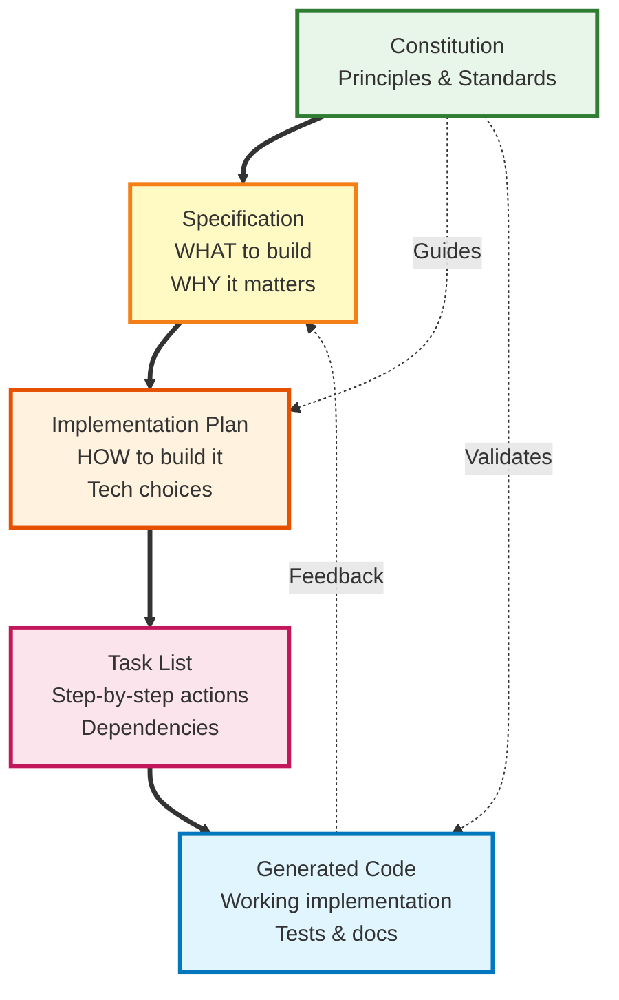

---

## 🔍 Specification Lifecycle

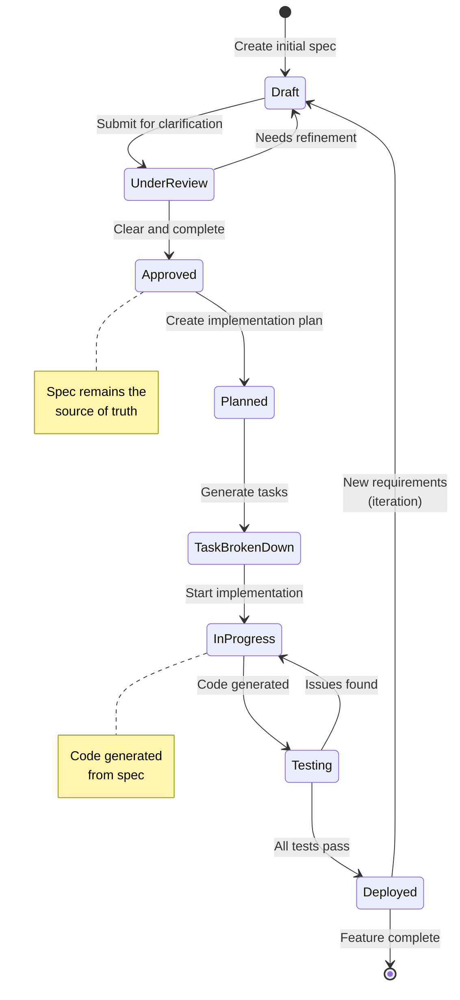

---

## 🌳 Project Structure (Feature Branches)

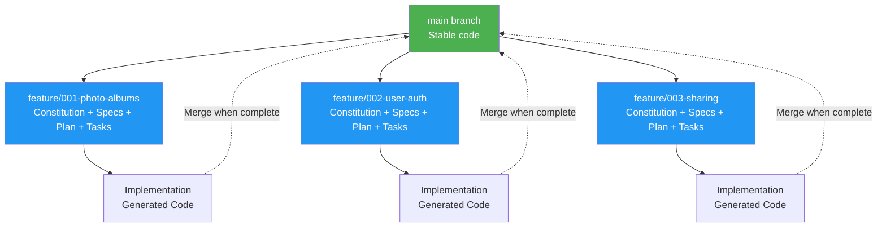

---

## 🎯 Quality Assurance Flow

```mermaid
graph LR
    Input[Requirements] --> Clarify{Clarify<br/>underspecified<br/>areas?}
    
    Clarify -->|Yes| ClarifyProcess[/speckit.clarify<br/>Socratic questioning]
    Clarify -->|No| Spec[Create Spec]
    ClarifyProcess --> Spec
    
    Spec --> Checklist1[/speckit.checklist<br/>Validate requirements]
    Checklist1 --> Plan[Create Plan]
    
    Plan --> Tasks[Generate Tasks]
    Tasks --> Analyze[/speckit.analyze<br/>Consistency check]
    
    Analyze --> Implement[Implement]
    Implement --> Checklist2[/speckit.checklist<br/>Quality validation]
    
    Checklist2 --> Output[Quality Output]
    
    style ClarifyProcess fill:#ffe082
    style Checklist1 fill:#64b5f6
    style Analyze fill:#81c784
    style Checklist2 fill:#64b5f6
    style Output fill:#aed581
```

---

## 💡 The AI Partnership Model

```mermaid
graph TB
    subgraph Partnership["Human-AI Partnership"]
        direction LR
        
        subgraph HumanZone["Human Expertise Zone"]
            H1[Problem Definition]
            H2[Creative Solutions]
            H3[User Empathy]
            H4[Business Context]
            H5[Ethical Decisions]
        end
        
        subgraph SharedZone["Collaborative Zone"]
            SH1[Architecture Design]
            SH2[API Design]
            SH3[Testing Strategy]
            SH4[Code Review]
        end
        
        subgraph AIZone["AI Expertise Zone"]
            A1[Code Generation]
            A2[Boilerplate Creation]
            A3[Syntax & Patterns]
            A4[Documentation]
            A5[Consistency Checking]
        end
        
        HumanZone <--> SharedZone
        SharedZone <--> AIZone
    end
    
    style HumanZone fill:#e3f2fd
    style SharedZone fill:#fff9c4
    style AIZone fill:#fff3e0
```

---

## 🔄 Iteration & Feedback Loop

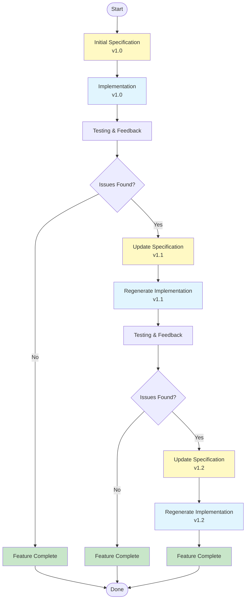

---

## 🎨 Three Development Phases in Detail

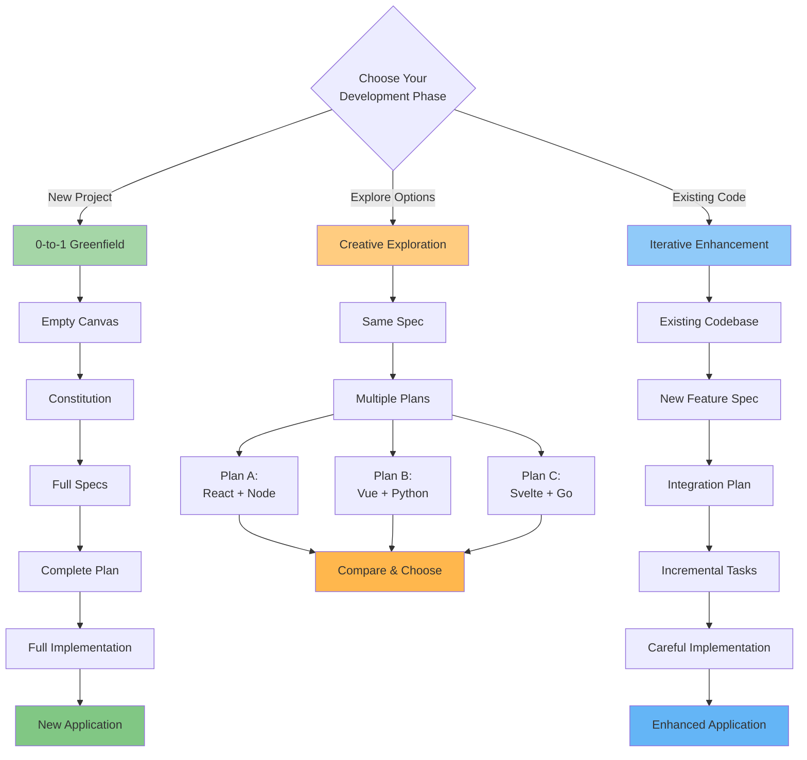

---

## 🧩 How Specifications Become Code

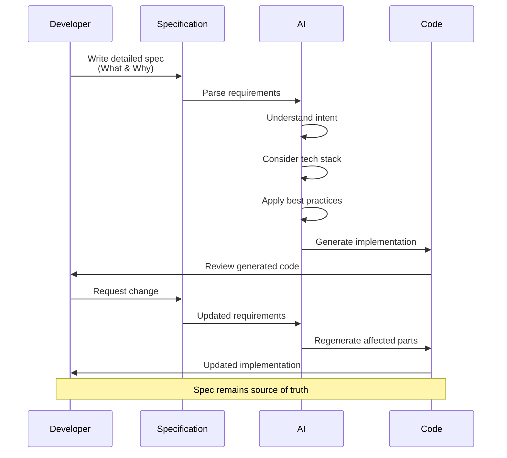

---

## 📊 Comparison: One-Shot vs Multi-Step

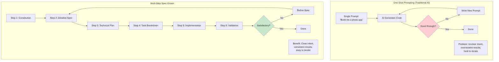

---

## 🎓 Learning Path Visualization

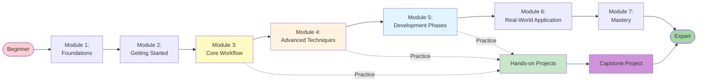

---

## 🔧 CLI Commands Flow

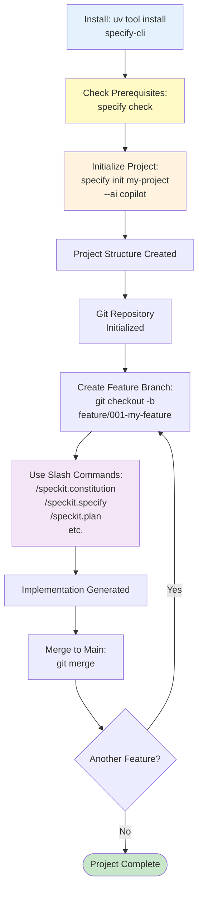

---

*Use these diagrams as visual references throughout your learning journey!*
